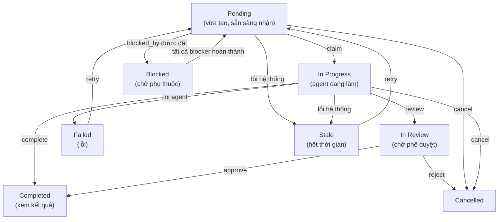
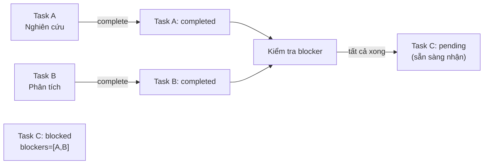

> Bản dịch từ [English version](/teams-task-board)

# Task Board

Task board là công cụ theo dõi công việc chung mà tất cả thành viên team đều có thể truy cập. Task có thể được tạo với mức độ ưu tiên, phụ thuộc, và ràng buộc blocking. Member nhận task đang chờ, làm việc độc lập, và đánh dấu hoàn thành kèm kết quả.

Dashboard hiển thị board theo **bố cục Kanban** với cột riêng cho từng trạng thái. Thanh công cụ board có nút workspace và hiển thị emoji agent để nhận biết nhanh ai đang sở hữu mỗi task.

## Vòng đời Task



## Tool Cốt lõi: `team_tasks`

Tất cả thành viên team truy cập task board qua tool `team_tasks`. Các hành động có sẵn:

| Hành động | Tham số bắt buộc | Mô tả |
|--------|-----------------|-------------|
| `list` | `action` | Hiển thị task (mặc định: tất cả trạng thái; 30 task mỗi trang) |
| `get` | `action`, `task_id` | Lấy chi tiết đầy đủ của task kèm comment, sự kiện, tệp đính kèm (giới hạn 8.000 ký tự) |
| `create` | `action`, `subject`, `assignee` | Tạo task mới (chỉ lead); `assignee` là **bắt buộc**; tùy chọn: `description`, `priority`, `blocked_by`, `require_approval` |
| `claim` | `action`, `task_id` | Nhận task đang chờ theo kiểu atomic |
| `complete` | `action`, `task_id`, `result` | Đánh dấu task hoàn thành kèm tóm tắt kết quả |
| `cancel` | `action`, `task_id` | Hủy task (chỉ lead); tùy chọn: `text` (lý do) |
| `assign` | `action`, `task_id`, `assignee` | Admin gán task đang chờ cho một agent |
| `search` | `action`, `query` | Tìm kiếm full-text trên subject + description (kiểm tra trước khi tạo để tránh trùng lặp) |
| `review` | `action`, `task_id` | Gửi task đang xử lý để review; chuyển sang `in_review` (chỉ owner) |
| `approve` | `action`, `task_id` | Phê duyệt task đang review → `completed` (chỉ lead/admin) |
| `reject` | `action`, `task_id` | Từ chối task đang review → `cancelled` kèm lý do gửi cho lead (chỉ lead/admin); tùy chọn: `text` |
| `comment` | `action`, `task_id`, `text` | Thêm bình luận; dùng `type="blocker"` để báo blocker (kích hoạt auto-fail + escalation cho lead) |
| `progress` | `action`, `task_id`, `percent` | Cập nhật tiến độ 0-100 (chỉ owner); tùy chọn: `text` (mô tả bước) |
| `update` | `action`, `task_id` | Cập nhật subject hoặc description của task (chỉ lead) |
| `attach` | `action`, `task_id`, `file_id` | Đính kèm file workspace vào task |
| `ask_user` | `action`, `task_id`, `text` | Đặt nhắc nhở follow-up định kỳ gửi cho user (chỉ owner) |
| `clear_followup` | `action`, `task_id` | Xóa nhắc nhở ask_user (owner hoặc lead) |
| `retry` | `action`, `task_id` | Tái phân công task `stale` hoặc `failed` về `pending` (admin/lead) |
| `delete` | `action`, `task_id` | Xóa cứng task ở trạng thái terminal (completed/cancelled/failed) khỏi board |

## Tạo Task

**Lead tạo task** cho member thực hiện:

> **Lưu ý**: Trường `assignee` là **bắt buộc** khi tạo task. Bỏ qua sẽ trả lỗi: `"assignee is required — specify which team member should handle this task"`.

> **Lưu ý**: Agent phải gọi `search` trước `create` để tránh tạo task trùng lặp. Tạo mà không kiểm tra trước sẽ trả lỗi yêu cầu tìm kiếm trước.

> **Lưu ý**: Lead V2 không thể tạo task thủ công trước khi spawn được phát ra trong turn hiện tại — điều này ngăn việc tạo task sớm làm hỏng luồng điều phối có cấu trúc.

```json
{
  "action": "create",
  "subject": "Trích xuất điểm chính từ bài nghiên cứu",
  "description": "Đọc PDF và tóm tắt các phát hiện chính dưới dạng bullet point",
  "priority": 10,
  "assignee": "researcher",
  "blocked_by": []
}
```

**Phản hồi**:
```
Task created: Trích xuất điểm chính từ bài nghiên cứu (id=<uuid>, identifier=TSK-1, status=pending)
```

Trường `identifier` (ví dụ: `TSK-1`) là tham chiếu ngắn dễ đọc được tạo từ tiền tố tên team và số thứ tự task.

**Với phụ thuộc** (blocked_by):

```json
{
  "action": "create",
  "subject": "Viết tóm tắt",
  "priority": 5,
  "assignee": "writer_agent",
  "blocked_by": ["<first-task-uuid>"]
}
```

Task này giữ trạng thái `blocked` cho đến khi task đầu tiên `completed`. Khi bạn hoàn thành blocker, task này tự động chuyển sang `pending` và có thể nhận.

**Với yêu cầu phê duyệt** (require_approval):

```json
{
  "action": "create",
  "subject": "Deploy lên production",
  "assignee": "devops_agent",
  "require_approval": true
}
```

Task bắt đầu ở trạng thái `pending` với flag `require_approval`. Sau khi member gọi `review`, task chuyển sang `in_review` và phải được phê duyệt trước khi hoàn thành.

## Nhận & Hoàn thành Task

**Member nhận task đang chờ**:

```json
{
  "action": "claim",
  "task_id": "550e8400-e29b-41d4-a716-446655440000"
}
```

**Nhận theo kiểu atomic**: Database đảm bảo chỉ một agent thành công. Nếu hai agent cùng nhận một task, một nhận được `claimed successfully`; agent kia nhận `failed to claim task` (người khác đã nhanh hơn).

**Member hoàn thành task**:

```json
{
  "action": "complete",
  "task_id": "550e8400-e29b-41d4-a716-446655440000",
  "result": "Đã trích xuất 12 phát hiện chính:\n1. Giả thuyết chính được xác nhận\n2. Dữ liệu cho thấy..."
}
```

**Tự động nhận**: Bạn có thể bỏ qua bước claim. Gọi `complete` trên task đang chờ sẽ tự động nhận nó (một API call thay vì hai).

> **Lưu ý**: Delegate agent không thể gọi `complete` trực tiếp — kết quả của chúng được tự động hoàn thành khi delegation kết thúc.

## Xóa Task

Task ở trạng thái terminal (completed, cancelled, failed) có thể bị xóa cứng khỏi board:

```json
{
  "action": "delete",
  "task_id": "550e8400-e29b-41d4-a716-446655440000"
}
```

Xóa chỉ được phép khi task ở trạng thái terminal. Cố xóa task đang hoạt động sẽ trả lỗi. Dashboard cũng hiển thị nút xóa trong trang chi tiết task. Sự kiện WebSocket `team.task.deleted` được phát khi thành công.

## Phụ thuộc Task & Tự động Mở khóa

Khi bạn tạo task với `blocked_by: [task_A, task_B]`:
- Trạng thái task được đặt là `blocked`
- Task không thể nhận được
- Khi **tất cả** blocker đều `completed`, task tự động chuyển sang `pending`
- Member được thông báo task đã sẵn sàng



**Kiểm tra blocked_by**: Hệ thống kiểm tra rằng các tham chiếu `blocked_by` không tạo vòng phụ thuộc hoặc tham chiếu đến task ở trạng thái terminal khiến việc unblock không thể xảy ra.

## Blocker Escalation

Khi member bị chặn, họ đăng comment blocker:

```json
{
  "action": "comment",
  "task_id": "550e8400-...",
  "text": "Không tìm thấy tài liệu API",
  "type": "blocker"
}
```

Những gì xảy ra tự động:
1. Comment được lưu với `comment_type='blocker'`
2. Task **tự động thất bại** (`in_progress` → `failed`)
3. Session của member bị hủy; UI dashboard cập nhật real-time
4. **Lead nhận tin nhắn escalation** từ `system:escalation` kèm tên member bị chặn, số task, lý do blocker, và hướng dẫn `retry`

Lead có thể xử lý vấn đề rồi tái phân công:

```json
{
  "action": "retry",
  "task_id": "550e8400-..."
}
```

Blocker escalation được bật theo mặc định. Tắt per-team qua settings: `{"blocker_escalation": {"enabled": false}}`.

## Review Workflow

Với task yêu cầu phê duyệt của người dùng, đặt `require_approval: true` khi tạo:

1. **Member gửi review**: `action="review"` → task chuyển sang `in_review`
2. **Người dùng phê duyệt** (dashboard): `action="approve"` → task chuyển sang `completed`
3. **Người dùng từ chối** (dashboard): `action="reject"` → task chuyển sang `cancelled`; lead nhận thông báo kèm lý do

Không có `require_approval`, task chuyển thẳng sang `completed` sau khi gọi `complete` (không qua giai đoạn in_review).

**Lọc**: Dashboard hỗ trợ lọc theo tất cả trạng thái task bao gồm `in_review`, `cancelled`, và `failed`. Bộ lọc trạng thái mặc định hiển thị **tất cả** task (30 task mỗi trang).

## Task Snapshot

Task đã hoàn thành tự động lưu snapshot vào trường `metadata` để hiển thị trên board:

```json
{
  "snapshot": {
    "completed_at": "2026-03-16T12:34:56Z",
    "result_preview": "100 ký tự đầu của kết quả...",
    "final_status": "completed",
    "ai_summary": "Tóm tắt ngắn do AI tạo về những gì đã hoàn thành"
  }
}
```

Board Kanban hiển thị các snapshot này dưới dạng thẻ, cho phép người dùng xem lại công việc đã hoàn thành mà không cần mở chi tiết task.

## Liệt kê & Tìm kiếm

**Liệt kê task** (mặc định hiển thị tất cả trạng thái, 30 task mỗi trang):

```json
{
  "action": "list"
}
```

**Lọc theo trạng thái**:

```json
{
  "action": "list",
  "status": "in_review"
}
```

Các giá trị `status` hợp lệ:

| Giá trị | Trả về |
|---------|--------|
| `""` hoặc `"all"` (mặc định) | Tất cả task bất kể trạng thái |
| `"active"` | Task đang hoạt động: pending, in_progress, blocked |
| `"completed"` | Task đã hoàn thành và đã hủy |
| `"in_review"` | Task đang chờ phê duyệt |

**Tìm kiếm** task cụ thể:

```json
{
  "action": "search",
  "query": "bài nghiên cứu"
}
```

Kết quả hiển thị snippet (tối đa 500 ký tự) của kết quả đầy đủ. Dùng `action=get` để xem kết quả hoàn chỉnh.

## Ưu tiên & Sắp xếp

Task được sắp xếp theo priority (cao nhất trước), sau đó theo thời gian tạo. Priority cao hơn = được đẩy lên đầu danh sách:

```json
{
  "action": "create",
  "subject": "Cần sửa gấp",
  "assignee": "fixer_agent",
  "priority": 100
}
```

## Phạm vi Người dùng

Quyền truy cập khác nhau theo channel:

- **Delegate/system channel**: Xem tất cả task của team
- **End user**: Chỉ xem task mà họ kích hoạt (lọc theo user ID)

Kết quả bị cắt ngắn:
- `action=list`: Kết quả không hiển thị (dùng `get` để xem đầy đủ)
- `action=get`: Tối đa 8.000 ký tự
- `action=search`: Snippet 500 ký tự

## Xem Chi tiết Đầy đủ của Task

```json
{
  "action": "get",
  "task_id": "550e8400-e29b-41d4-a716-446655440000"
}
```

**Phản hồi** bao gồm:
- Toàn bộ metadata của task (bao gồm `identifier`, `task_number`, `progress_percent`, snapshot)
- Văn bản kết quả đầy đủ (cắt ngắn ở 8.000 ký tự nếu cần)
- Key và display name kèm emoji của agent sở hữu
- Timestamps
- Comment, sự kiện kiểm toán và tệp đính kèm (nếu có)

## Hủy Task

**Lead hủy task**:

```json
{
  "action": "cancel",
  "task_id": "550e8400-e29b-41d4-a716-446655440000",
  "text": "Yêu cầu người dùng đã thay đổi, không còn cần thiết"
}
```

Lưu ý: lý do hủy được truyền qua tham số `text` (không phải `reason`).

**Điều gì xảy ra**:
- Trạng thái task → `cancelled`
- Nếu có delegation đang chạy cho task này, nó bị dừng ngay lập tức
- Các task phụ thuộc (có `blocked_by` trỏ đến đây) được mở khóa

## Cải tiến Đồng thời Dispatch Task

Dispatch task dùng hàng đợi post-turn để tránh race condition: task được lead tạo trong một turn được đưa vào hàng đợi và dispatch cùng nhau sau khi turn kết thúc. Điều này có nghĩa là:

- Phụ thuộc đặt qua `blocked_by` được giải quyết hoàn toàn trước khi bất kỳ dispatch nào kích hoạt
- Chỉ một task mỗi assignee được dispatch mỗi vòng (theo thứ tự priority) để tránh xung đột hủy
- Kết quả blocker đã hoàn thành được tự động thêm vào nội dung dispatch cho task được unblock

## Thực hành Tốt nhất

1. **Tạo task trước**: Luôn tạo task trước khi delegate công việc (chỉ lead)
2. **Luôn đặt assignee**: Trường `assignee` là bắt buộc — chỉ định thành viên khi tạo task
3. **Tìm kiếm trước khi tạo**: Dùng `action=search` để kiểm tra task tương tự trước khi tạo, tránh trùng lặp
4. **Dùng priority**: Đặt priority theo mức độ khẩn cấp (100 = khẩn cấp, 10 = cao, 0 = bình thường)
5. **Thêm phụ thuộc**: Liên kết các task liên quan với `blocked_by` để đảm bảo thứ tự
6. **Thêm context**: Viết mô tả rõ ràng để member biết cần làm gì
7. **Dùng blocker comment**: Nếu bị chặn, đăng comment `type="blocker"` — lead sẽ được thông báo tự động
8. **Xóa task đã xong**: Dùng `action=delete` trên task terminal để giữ board gọn gàng

<!-- goclaw-source: 050aafc9 | updated: 2026-04-09 -->
