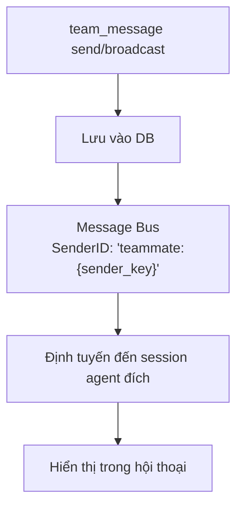

> Bản dịch từ [English version](../../agent-teams/team-messaging.md)

# Team Messaging

Các thành viên team giao tiếp qua hệ thống mailbox tích hợp sẵn. Gửi tin nhắn trực tiếp, broadcast đến tất cả member, và đọc tin nhắn chưa đọc. Tin nhắn chạy qua message bus với phân phối theo thời gian thực.

## Tool Mailbox: `team_message`

Tất cả thành viên team truy cập mailbox qua tool `team_message`. Các hành động:

| Hành động | Tham số | Mô tả |
|--------|--------|-------------|
| `send` | `to`, `text` | Gửi tin nhắn trực tiếp đến một teammate cụ thể |
| `broadcast` | `text` | Gửi tin nhắn đến tất cả teammate (trừ bản thân) |
| `read` | không có | Lấy tin nhắn chưa đọc; tự động đánh dấu đã đọc |

## Gửi Tin nhắn Trực tiếp

**Member gửi tin nhắn đến member khác**:

```json
{
  "action": "send",
  "to": "analyst_agent",
  "text": "Vui lòng xem lại phát hiện của tôi từ task 123. Tôi cần ý kiến của bạn về phương pháp luận."
}
```

**Điều gì xảy ra**:
1. Tin nhắn được lưu vào database
2. Người nhận được thông báo theo thời gian thực qua message bus
3. Tin nhắn định tuyến qua channel `team_message` với tiền tố `teammate:sender_key`
4. Phản hồi được publish trở lại channel gốc
5. Sự kiện broadcast đến UI để cập nhật thời gian thực

**Phản hồi**:
```
Message sent to analyst_agent.
```

**Bảo vệ xuyên team**: Bạn chỉ có thể nhắn tin cho thành viên trong team của mình. Cố nhắn tin cho người ngoài team sẽ thất bại với lỗi `"agent is not a member of your team"`.

## Broadcast Đến Tất cả Member

**Gửi tin nhắn đến toàn team** (trừ bản thân):

```json
{
  "action": "broadcast",
  "text": "Cập nhật quan trọng: Chúng ta đã quyết định tập trung vào 5 phát hiện hàng đầu. Vui lòng điều chỉnh công việc cho phù hợp."
}
```

**Điều gì xảy ra**:
1. Tin nhắn được lưu dưới dạng broadcast (to_agent_id = NULL)
2. Loại tin nhắn: `broadcast`
3. Mỗi thành viên team (trừ người gửi) nhận tin nhắn
4. Sự kiện broadcast đến UI để tất cả cùng thấy

**Phản hồi**:
```
Broadcast sent to all teammates.
```

## Đọc Tin nhắn Chưa đọc

**Kiểm tra mailbox**:

```json
{
  "action": "read"
}
```

**Phản hồi**:
```json
{
  "messages": [
    {
      "id": "550e8400-e29b-41d4-a716-446655440000",
      "from_agent_key": "researcher_agent",
      "from_display_name": "Research Expert",
      "to_agent_key": "analyst_agent",
      "message_type": "chat",
      "content": "Vui lòng xem lại phát hiện của tôi...",
      "created_at": "2025-03-08T10:30:00Z",
      "read_at": null
    }
  ],
  "count": 1
}
```

**Tự động đánh dấu**: Đọc tin nhắn tự động đánh dấu chúng là đã đọc. Lần gọi `read` tiếp theo chỉ hiển thị tin nhắn chưa đọc mới.

## Định tuyến Tin nhắn

Tin nhắn chạy qua hệ thống với routing đặc biệt:



**Định dạng tin nhắn khi phân phối**:
```
[Team message from researcher_agent]: Vui lòng xem lại phát hiện của tôi...
```

Tiền tố `teammate:` cho consumer biết cần định tuyến tin nhắn đến session của thành viên team đúng, không phải session người dùng chung.

## Broadcast Sự kiện

Khi tin nhắn được gửi, sự kiện thời gian thực được broadcast đến UI:

```json
{
  "event": "team_message.sent",
  "payload": {
    "team_id": "550e8400-e29b-41d4-a716-446655440000",
    "from_agent_key": "researcher_agent",
    "from_display_name": "Research Expert",
    "to_agent_key": "analyst_agent",
    "message_type": "chat",
    "preview": "Vui lòng xem lại phát hiện của tôi...",
    "timestamp": "2025-03-08T10:30:00Z"
  }
}
```

## Trường hợp Sử dụng

**Lead → Member**: "Vui lòng nhận task tiếp theo từ board"

**Member → Member**: "Task 123 đã sẵn sàng cho bạn review. Dữ liệu cho thấy..."

**Member → Lead**: "Task 456 đã xong 80%. Tôi cần làm rõ về tiêu chí chấp nhận."

**Broadcast**: "Thay đổi ưu tiên. Tập trung vào task 1, 2, 5 thay vì 3, 4."

## Thực hành Tốt nhất

1. **Ngắn gọn**: Giữ tin nhắn tập trung và có thể hành động được
2. **Dùng broadcast cho thông tin toàn team**: Đừng gửi tin nhắn giống hệt nhau cho nhiều member
3. **Tin nhắn trực tiếp cho thảo luận**: Phối hợp qua lại dùng direct message
4. **Tham chiếu task**: Nhắc đến task ID để tạo context ("Task 123 đang bị blocked bởi...")
5. **Kiểm tra thường xuyên**: Member nên kiểm tra mailbox nếu đang chờ cập nhật

## Lưu trữ Tin nhắn

Tất cả tin nhắn được lưu vào database:
- Tin nhắn trực tiếp liên kết người gửi → người nhận cụ thể
- Broadcast liên kết người gửi → NULL (nghĩa là tất cả member)
- Timestamps và trạng thái đọc được theo dõi
- Toàn bộ lịch sử tin nhắn có sẵn để kiểm tra/xem xét
