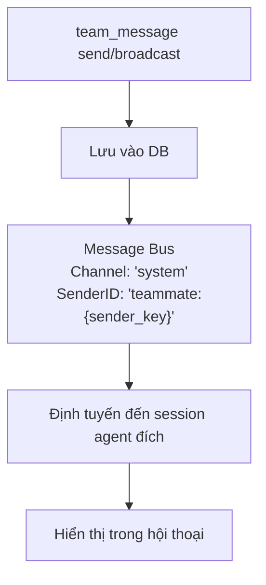

> Bản dịch từ [English version](/teams-messaging)

# Team Messaging

Các thành viên team giao tiếp qua hệ thống mailbox tích hợp sẵn. Member có thể gửi tin nhắn trực tiếp và đọc tin nhắn chưa đọc. Lead agent không có tool `team_message` — nó bị xóa khỏi danh sách tool của lead theo policy. Tin nhắn chạy qua message bus với phân phối theo thời gian thực.

## Tool Mailbox: `team_message`

Tất cả thành viên team truy cập mailbox qua tool `team_message`. Các hành động:

| Hành động | Tham số | Mô tả |
|--------|--------|-------------|
| `send` | `to`, `text`, `media` (tùy chọn) | Gửi tin nhắn trực tiếp đến một teammate cụ thể |
| `broadcast` | `text` | Gửi tin nhắn đến tất cả teammate (trừ bản thân); chỉ system/teammate channel |
| `read` | không có | Lấy tin nhắn chưa đọc; tự động đánh dấu đã đọc |

## Gửi Tin nhắn Trực tiếp

**Member gửi tin nhắn đến member khác**:

```json
{
  "action": "send",
  "to": "analyst_agent",
  "text": "Vui lòng xem lại phát hiện của tôi từ task 123. Tôi cần ý kiến của bạn về phương pháp luận."
}
```

**Điều gì xảy ra**:
1. Tin nhắn được lưu vào database
2. Một task loại "message" được tự động tạo trên bảng task của team (hiển thị trong tab Tasks)
3. Người nhận được thông báo theo thời gian thực qua message bus (channel: `system`, sender: `teammate:{sender_key}`)
4. Sự kiện broadcast đến UI để cập nhật thời gian thực

**Phản hồi**:
```
Message sent to analyst_agent.
```

**Bảo vệ xuyên team**: Bạn chỉ có thể nhắn tin cho thành viên trong team của mình. Cố nhắn tin cho người ngoài team sẽ thất bại với lỗi `"agent is not a member of your team"`.

## Broadcast Đến Tất cả Member

Broadcast gửi tin nhắn đến tất cả thành viên team đồng thời. Hành động này chỉ dành cho system/teammate channel (các operation nội bộ) — agent member thông thường không thể gọi `broadcast` trực tiếp.

```json
{
  "action": "broadcast",
  "text": "Cập nhật quan trọng: Chúng ta đã quyết định tập trung vào 5 phát hiện hàng đầu. Vui lòng điều chỉnh công việc cho phù hợp."
}
```

**Điều gì xảy ra**:
1. Tin nhắn được lưu dưới dạng broadcast (to_agent_id = NULL)
2. Loại tin nhắn: `broadcast`
3. Mỗi thành viên team (trừ người gửi) nhận tin nhắn
4. Sự kiện broadcast đến UI để tất cả cùng thấy

**Phản hồi**:
```
Broadcast sent to all teammates.
```

## Đọc Tin nhắn Chưa đọc

**Kiểm tra mailbox**:

```json
{
  "action": "read"
}
```

**Phản hồi**:
```json
{
  "messages": [
    {
      "id": "550e8400-e29b-41d4-a716-446655440000",
      "team_id": "...",
      "from_agent_id": "...",
      "from_agent_key": "researcher_agent",
      "to_agent_key": "analyst_agent",
      "message_type": "chat",
      "content": "Vui lòng xem lại phát hiện của tôi...",
      "read": false,
      "created_at": "2025-03-08T10:30:00Z"
    }
  ],
  "count": 1
}
```

**Tự động đánh dấu**: Đọc tin nhắn tự động đánh dấu chúng là đã đọc. Lần gọi `read` tiếp theo chỉ hiển thị tin nhắn chưa đọc mới.

**Phân trang**: Trả về tối đa 50 tin nhắn chưa đọc mỗi lần gọi. Nếu còn nhiều hơn, response sẽ có `"has_more": true` và ghi chú để gọi `read` lại sau khi xử lý xong.

## Định tuyến Tin nhắn

Tin nhắn chạy qua hệ thống với routing đặc biệt:



**Định dạng tin nhắn khi phân phối**:
```
[Team message from researcher_agent]: Vui lòng xem lại phát hiện của tôi...
```

Tiền tố `teammate:` trong sender ID cho consumer biết cần định tuyến tin nhắn đến session của thành viên team đúng, không phải session người dùng chung.

## Domain Event Bus

Ngoài tin nhắn mailbox, GoClaw còn sử dụng **Domain Event Bus** có kiểu (`eventbus.DomainEventBus`) để lan truyền sự kiện nội bộ qua pipeline v3. Bus này tách biệt với message bus channel dùng cho routing.

Domain event bus được định nghĩa trong `internal/eventbus/domain_event_bus.go`:

```go
type DomainEventBus interface {
    Publish(event DomainEvent)                                    // enqueue không chặn
    Subscribe(eventType EventType, handler DomainEventHandler) func() // trả về fn hủy đăng ký
    Start(ctx context.Context)
    Drain(timeout time.Duration) error
}
```

**Đặc điểm chính**:
- Worker pool bất đồng bộ (mặc định 2 worker, độ sâu hàng đợi 1000)
- Cửa sổ dedup theo `SourceID` (mặc định 5 phút) — ngăn xử lý trùng lặp
- Retry có thể cấu hình (mặc định 3 lần với backoff theo cấp số nhân)
- Drain nhẹ nhàng khi tắt

**Danh mục loại sự kiện** (định nghĩa trong `eventbus/event_types.go`):

| Loại sự kiện | Kích hoạt khi |
|-------------|--------------|
| `session.completed` | Session kết thúc hoặc context được compaction |
| `episodic.created` | Tóm tắt bộ nhớ episodic được lưu |
| `entity.upserted` | Entity trong knowledge graph được cập nhật |
| `run.completed` | Agent pipeline run kết thúc |
| `tool.executed` | Tool call hoàn thành (để thu thập metrics) |
| `vault.doc_upserted` | Tài liệu vault được đăng ký hoặc cập nhật |
| `delegate.sent` | Delegation được dispatch đến member |
| `delegate.completed` | Delegatee hoàn thành thành công |
| `delegate.failed` | Delegation thất bại |

Các sự kiện này cung cấp năng lượng cho pipeline enrichment v3 (bộ nhớ episodic, knowledge graph, lập chỉ mục vault) độc lập với các WebSocket team event dùng cho UI.

## Sự kiện Team WebSocket

Để cập nhật UI theo thời gian thực, hoạt động team phát sự kiện WebSocket qua `msgBus.Broadcast`. Các sự kiện này tách biệt với domain event bus và nhắm đến các client dashboard đang kết nối.

Khi tin nhắn được gửi, sự kiện thời gian thực được broadcast đến UI:

```json
{
  "event": "team.message.sent",
  "payload": {
    "team_id": "550e8400-e29b-41d4-a716-446655440000",
    "from_agent_key": "researcher_agent",
    "from_display_name": "Research Expert",
    "to_agent_key": "analyst_agent",
    "to_display_name": "Data Analyst",
    "message_type": "chat",
    "preview": "Vui lòng xem lại phát hiện của tôi...",
    "user_id": "...",
    "channel": "telegram",
    "chat_id": "..."
  }
}
```

### API Sự kiện Vòng đời Task

Sự kiện vòng đời task (tạo, giao, hoàn thành, phê duyệt, từ chối, comment, thất bại, v.v.) cũng có sẵn qua REST endpoint:

```
GET /v1/teams/{id}/events
```

Endpoint này trả về nhật ký kiểm toán phân trang của tất cả thay đổi trạng thái task cho team, hữu ích để xem xét tuân thủ hoặc xây dựng dashboard tùy chỉnh.

## Trường hợp Sử dụng

**Member → Member**: "Task 123 đã sẵn sàng cho bạn review. Dữ liệu cho thấy..."

**Member → Member**: "Tôi bị blocked ở bước 2 — bạn có dataset thô tôi cần không?"

**Broadcast** (chỉ system-level): "Thay đổi ưu tiên. Tập trung vào task 1, 2, 5 thay vì 3, 4."

> **Lưu ý**: Lead điều phối qua `team_tasks`, không qua `team_message`. Dùng `team_tasks(action="progress")` để báo cáo trạng thái thay vì tin nhắn trực tiếp.

## Tự động Fail khi Loop Kill

Nếu run của agent thành viên bị loop detector terminate (loop vô hạn hoặc bị kẹt), task tự động chuyển sang `failed`:

- Loop detector nhận diện pattern bị kẹt — cùng tool call với cùng args và result lặp lại, hoặc chuỗi read-only không có tiến triển
- Khi trigger mức critical, run bị kill và team task manager đánh dấu task là `failed`
- Agent lead được thông báo và có thể giao lại hoặc retry với hướng dẫn mới

Điều này ngăn vòng lặp vô hạn chặn tiến trình team — agent có thể an toàn thử các task thăm dò mà không lo bị kẹt vĩnh viễn.

## Cấu hình Thông báo Team

Các sự kiện task trong team có thể được chuyển tiếp đến kênh chat. Mặc định, chỉ các sự kiện quan trọng được bật để tránh ồn ào.

| Sự kiện | Mặc định | Mô tả |
|---------|---------|-------|
| `dispatched` | BẬT | Task được giao cho thành viên |
| `new_task` | BẬT | Task mới được tạo (do người dùng khởi tạo) |
| `completed` | BẬT | Task hoàn thành |
| `progress` | TẮT | Thành viên cập nhật tiến độ |
| `failed` | TẮT | Task thất bại |
| `commented` | TẮT | Bình luận được thêm vào task |
| `slow_tool` | TẮT | Cảnh báo khi tool call vượt quá ngưỡng thích ứng |

Chế độ giao hàng mặc định là `direct` (kênh outbound). Đặt `mode: "leader"` để chuyển tất cả thông báo qua lead agent.

Cấu hình thông báo trong team settings:

```json
{
  "notifications": {
    "dispatched": true,
    "new_task": true,
    "completed": true,
    "progress": false,
    "failed": false,
    "commented": false,
    "slow_tool": false,
    "mode": "direct"
  }
}
```

## Thực hành Tốt nhất

1. **Ngắn gọn**: Giữ tin nhắn tập trung và có thể hành động được
2. **Dùng broadcast cho thông tin toàn team**: Đừng gửi tin nhắn giống hệt nhau cho nhiều member
3. **Tin nhắn trực tiếp cho thảo luận**: Phối hợp qua lại dùng direct message
4. **Tham chiếu task**: Nhắc đến task ID để tạo context ("Task 123 đang bị blocked bởi...")
5. **Kiểm tra thường xuyên**: Member nên kiểm tra mailbox nếu đang chờ cập nhật

## Lưu trữ Tin nhắn

Tất cả tin nhắn được lưu vào database:
- Tin nhắn trực tiếp liên kết người gửi → người nhận cụ thể
- Broadcast liên kết người gửi → NULL (nghĩa là tất cả member)
- Timestamps và trạng thái đọc được theo dõi
- Toàn bộ lịch sử tin nhắn có sẵn để kiểm tra/xem xét

<!-- goclaw-source: 050aafc9 | updated: 2026-04-09 -->
