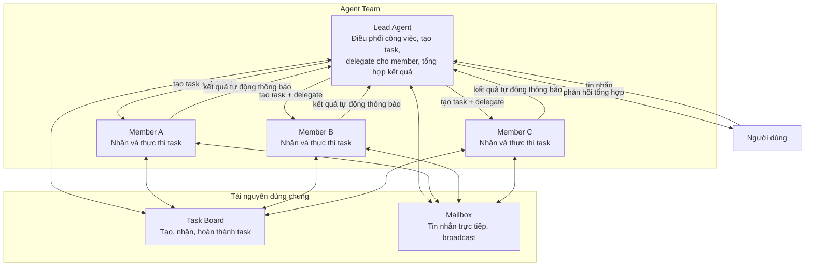

> Bản dịch từ [English version](/teams-what-are-teams)

# Agent Team là gì?

Agent team cho phép nhiều agent cùng cộng tác trên các task chung. Một agent **lead** điều phối công việc, trong khi các **member** thực thi task độc lập và báo cáo kết quả lại.

## Mô hình Team

Một team bao gồm:
- **Lead Agent**: Điều phối công việc, tạo và giao task qua `team_tasks`, delegate cho member, tổng hợp kết quả
- **Member Agents**: Nhận task được dispatch, thực thi độc lập, hoàn thành với kết quả, có thể gửi cập nhật tiến độ qua mailbox
- **Shared Task Board**: Theo dõi công việc, phụ thuộc, mức độ ưu tiên, trạng thái
- **Team Mailbox**: Tin nhắn trực tiếp giữa tất cả thành viên qua `team_message`



## Nguyên tắc Thiết kế Cốt lõi

**TEAM.md chỉ cho lead**: Chỉ lead nhận `TEAM.md` với hướng dẫn điều phối đầy đủ — quy trình bắt buộc, các mẫu delegation, nhắc nhở follow-up. Member khám phá context theo nhu cầu qua các tool; không lãng phí token cho các agent đang rảnh.

**Theo dõi task bắt buộc**: Mọi delegation từ lead phải được liên kết với một task trên board. Hệ thống thực thi điều này — delegation không có `team_task_id` sẽ bị từ chối, kèm theo danh sách task đang chờ để giúp lead tự sửa lỗi.

**Tự động hoàn thành**: Khi delegation kết thúc, task được liên kết sẽ tự động được đánh dấu là hoàn thành. Các file được tạo trong quá trình thực thi tự động được liên kết với task. Không cần ghi chép thủ công.

**Blocker escalation**: Member có thể báo hiệu bị blocked bằng cách đăng blocker comment trên task. Điều này tự động fail task và gửi thông báo escalation đến lead kèm tên member bị blocked, tiêu đề task, lý do blocker, và hướng dẫn retry.

**Xử lý song song**: Khi nhiều member làm việc đồng thời, kết quả được thu thập và gửi đến lead trong một thông báo kết hợp duy nhất.

**Phạm vi của member**: Member không có quyền spawn hay delegate. Họ làm việc trong cấu trúc team — thực thi task, báo cáo tiến độ, và giao tiếp qua mailbox.

## Team Workspace

Mỗi team có một workspace chung để lưu trữ file được tạo trong quá trình thực thi task. Phạm vi workspace có thể cấu hình:

| Chế độ | Thư mục | Trường hợp dùng |
|--------|---------|-----------------|
| **Isolated** (mặc định) | `{dataDir}/teams/{teamID}/{chatID}/` | Cô lập theo cuộc hội thoại |
| **Shared** | `{dataDir}/teams/{teamID}/` | Tất cả member dùng chung một thư mục |

Cấu hình qua `workspace_scope: "shared"` trong team settings. File được ghi trong quá trình thực thi task tự động lưu vào workspace và liên kết với task đang hoạt động.

## Thay đổi Orchestration trong V3

Trong v3, team sử dụng mô hình **dispatch dựa trên task board** thay cho luồng `spawn(agent=...)` cũ.

### Post-Turn Dispatch (BatchQueue)

Task được tạo trong lượt của lead sẽ được xếp hàng (`PendingTeamDispatchFromCtx`) và dispatch **sau khi lượt kết thúc** — không phải inline. Điều này đảm bảo các phụ thuộc `blocked_by` được cài đặt đầy đủ trước khi member nhận việc.

```
Lead kết thúc lượt
  → BatchQueue flush các dispatch đang chờ
  → Mỗi assignee nhận tin nhắn qua bus
  → Member agent thực thi trong session riêng biệt
```

### Domain Event Bus

Mọi thay đổi trạng thái task đều emit typed event (`team_task.created`, `team_task.assigned`, `team_task.completed`, ...) trên domain event bus. Dashboard cập nhật thời gian thực qua WebSocket mà không cần polling.

### Circuit Breaker

Task tự động fail sau **3 lần dispatch** (`maxTaskDispatches`). Điều này ngăn vòng lặp vô hạn khi member agent liên tục thất bại hoặc từ chối task. Số lần dispatch được theo dõi trong `metadata.dispatch_count`.

### Pattern WaitAll

Lead có thể tạo nhiều task song song và chúng dispatch đồng thời. Khi tất cả task của member hoàn thành, `DispatchUnblockedTasks` tự động dispatch các task phụ thuộc đang chờ (theo thứ tự ưu tiên). Lead tổng hợp kết quả chỉ sau khi tất cả nhánh giải quyết xong.

> **Thay đổi spawn tool**: `spawn(agent="member")` không còn hợp lệ trong v3. Lead phải dùng `team_tasks(action="create", assignee="member")` thay thế. Hệ thống sẽ từ chối lệnh spawn trực tiếp tới agent kèm thông báo hướng dẫn.

## Ví dụ Thực tế

**Tình huống**: Người dùng yêu cầu lead phân tích một bài nghiên cứu và viết tóm tắt.

1. Lead nhận yêu cầu
2. Lead gọi `team_tasks(action="create", subject="Trích xuất điểm chính từ bài nghiên cứu", assignee="researcher")` — hệ thống dispatch đến researcher với `team_task_id` được liên kết
3. Researcher nhận task, làm việc độc lập, gọi `team_tasks(action="complete", result="<phát hiện>")` — task liên kết tự động hoàn thành, lead được thông báo
4. Lead gọi `team_tasks(action="create", subject="Viết tóm tắt", assignee="writer", description="Dùng phát hiện của researcher: <phát hiện>", blocked_by=["<task-id-researcher>"])`
5. Task của writer tự động unblock khi researcher xong, writer hoàn thành với kết quả
6. Lead tổng hợp và gửi phản hồi cuối cùng cho người dùng

## Team so với các Mô hình Delegation Khác

| Khía cạnh | Agent Team | Delegation Đơn giản | Agent Link |
|--------|-----------|-------------------|-----------|
| **Điều phối** | Lead điều phối qua task board | Parent chờ kết quả | Ngang hàng trực tiếp |
| **Theo dõi Task** | Task board chung, phụ thuộc, ưu tiên | Không theo dõi | Không theo dõi |
| **Nhắn tin** | Tất cả member dùng mailbox | Chỉ với parent | Chỉ với parent |
| **Khả năng mở rộng** | Thiết kế cho 3–10 member | Parent-child đơn giản | Liên kết 1-1 |
| **Context TEAM.md** | Lead nhận hướng dẫn đầy đủ; member nhận hướng dẫn thực thi | Không áp dụng | Không áp dụng |
| **Trường hợp dùng** | Nghiên cứu song song, review nội dung, phân tích | Delegate nhanh & chờ | Chuyển giao hội thoại |

**Dùng Team khi**:
- 3+ agent cần làm việc cùng nhau
- Task có phụ thuộc hoặc ưu tiên
- Member cần giao tiếp với nhau
- Kết quả cần xử lý song song

**Dùng Delegation Đơn giản khi**:
- Một parent delegate cho một child
- Cần kết quả đồng bộ nhanh
- Không cần giao tiếp giữa các agent

**Dùng Agent Link khi**:
- Hội thoại cần chuyển giao giữa các agent
- Không cần task board hay điều phối

<!-- goclaw-source: 050aafc9 | cập nhật: 2026-04-09 -->
