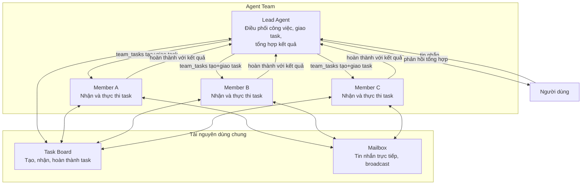

> Bản dịch từ [English version](#teams-what-are-teams)

# Agent Team là gì?

Agent team cho phép nhiều agent cùng cộng tác trên các task chung. Một agent **lead** điều phối công việc, trong khi các **member** thực thi task độc lập và báo cáo kết quả lại.

## Mô hình Team

Một team bao gồm:
- **Lead Agent**: Điều phối công việc, tạo và giao task qua `team_tasks`, tổng hợp kết quả
- **Member Agents**: Nhận task được dispatch, thực thi độc lập, hoàn thành với kết quả
- **Reviewer Agents** (tùy chọn): Đánh giá kết quả task; phản hồi bằng `APPROVED` hoặc `REJECTED: <phản hồi>`
- **Shared Task Board**: Theo dõi công việc, phụ thuộc, mức độ ưu tiên, trạng thái
- **Team Mailbox**: Tin nhắn trực tiếp giữa các member qua `team_message`; lead không có tool mailbox

## Nguyên tắc Thiết kế Cốt lõi

**TEAM.md cho tất cả**: Mọi agent trong team — lead và member — đều nhận `TEAM.md` được inject vào system prompt. Nội dung có nhận thức về vai trò: lead nhận hướng dẫn điều phối đầy đủ (các mẫu `team_tasks`, chuỗi phụ thuộc, nhắc nhở follow-up); member nhận hướng dẫn thực thi (báo cáo tiến độ qua `team_tasks`).

**Tự động hoàn thành**: Khi member hoàn thành một task, các task phụ thuộc bị blocked tự động chuyển sang pending và được dispatch. Không cần ghi chép thủ công.

**Xử lý song song**: Nhiều member làm việc đồng thời trên các task được giao độc lập; mỗi task hoàn thành riêng lẻ và lead được thông báo theo từng task.

**Lead không thể dùng mailbox**: Tool `team_message` bị xóa khỏi danh sách tool của lead theo policy. Lead điều phối qua `team_tasks`; member dùng `team_message` để gửi tin nhắn trực tiếp cho nhau.

## Ví dụ Thực tế

**Tình huống**: Người dùng yêu cầu lead phân tích một bài nghiên cứu và viết tóm tắt.

1. Lead nhận yêu cầu
2. Lead gọi `team_tasks(action="create", subject="Trích xuất điểm chính từ bài nghiên cứu", assignee="researcher")` — hệ thống dispatch đến researcher
3. Researcher nhận task, làm việc độc lập, gọi `team_tasks(action="complete", result="<phát hiện>")` — lead được thông báo
4. Lead gọi `team_tasks(action="create", subject="Viết tóm tắt", assignee="writer", description="Dùng phát hiện của researcher: <phát hiện>", blocked_by=["<task-id-researcher>"])`
5. Task của writer tự động unblock khi researcher xong, writer hoàn thành với kết quả
6. Lead tổng hợp và gửi phản hồi cuối cùng cho người dùng

## Team so với các Mô hình Delegation Khác

| Khía cạnh | Agent Team | Delegation Đơn giản | Agent Link |
|--------|-----------|-------------------|-----------|
| **Điều phối** | Lead điều phối qua task board | Parent chờ kết quả | Ngang hàng trực tiếp |
| **Theo dõi Task** | Task board chung, phụ thuộc, ưu tiên | Không theo dõi | Không theo dõi |
| **Nhắn tin** | Member dùng mailbox; lead dùng team_tasks | Chỉ với parent | Chỉ với parent |
| **Khả năng mở rộng** | Thiết kế cho 3–10 member | Parent-child đơn giản | Liên kết 1-1 |
| **Context TEAM.md** | Tất cả member nhận TEAM.md theo vai trò | Không áp dụng | Không áp dụng |
| **Trường hợp dùng** | Nghiên cứu song song, review nội dung, phân tích | Delegate nhanh & chờ | Chuyển giao hội thoại |

**Dùng Team khi**:
- 3+ agent cần làm việc cùng nhau
- Task có phụ thuộc hoặc ưu tiên
- Member cần giao tiếp với nhau
- Kết quả cần xử lý song song

**Dùng Delegation Đơn giản khi**:
- Một parent delegate cho một child
- Cần kết quả đồng bộ nhanh
- Không cần giao tiếp giữa các agent

**Dùng Agent Link khi**:
- Hội thoại cần chuyển giao giữa các agent
- Không cần task board hay điều phối

<!-- goclaw-source: 57754a5 | cập nhật: 2026-03-18 -->
