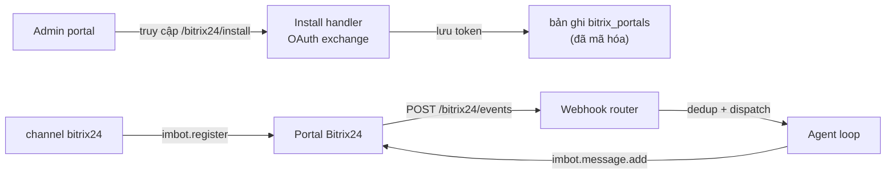

> Bản dịch từ [English version](/channel-bitrix24)

# Channel Bitrix24

Tích hợp Bitrix24 qua API **imbot** (chatbot). GoClaw đăng ký một bot trên portal Bitrix24, nhận sự kiện chat qua webhook, và trả lời với tư cách là bot đó. Một gateway GoClaw có thể phục vụ nhiều bot trên nhiều portal, và nhiều bot có thể dùng chung một portal (chúng chia sẻ OAuth token và vòng lặp refresh).

Khác với các channel dùng token (Telegram, Slack), Bitrix24 dùng **luồng cài đặt portal qua OAuth**: admin cấp quyền cho app GoClaw trên portal của họ một lần, GoClaw lưu và tự động refresh token, rồi đăng ký bot khi cần.

## Cách hoạt động



1. **Tạo bản ghi portal** với `client_id` / `client_secret` của app (qua CLI hoặc dashboard).
2. **Admin cấp quyền** bằng cách truy cập install URL — GoClaw đổi code lấy token và lưu lại dạng mã hóa.
3. **Cấu hình channel instance** trỏ tới portal và đặt tên bot.
4. Khi khởi động, channel gọi `imbot.register` (idempotent) và gắn bot ID trả về vào webhook router.
5. Sự kiện chat đến `/bitrix24/events`; GoClaw khử trùng lặp, dispatch tới agent loop, và trả lời với tư cách bot.

## Thiết lập

### 1. Tạo application Bitrix24

Trong portal Bitrix24 của bạn, tạo một **Local application** hoặc một **Marketplace (OAuth2) application**. Bạn cần:

- `client_id` (application ID)
- `client_secret` (application key)
- OAuth scope bao gồm `imbot` (chatbot) và `user` (để GoClaw lấy được tên hiển thị của người gửi)

Đặt URL handler / installer của application thành public URL của GoClaw:

- **Install / installer URL:** `https://<public-url-của-bạn>/bitrix24/install`
- **Events:** GoClaw tự động đăng ký (`https://<public-url-của-bạn>/bitrix24/events`)

> **Bắt buộc có public URL.** Bitrix24 cần URL tuyệt đối, truy cập được từ internet cho các event handler mà nó gọi. GoClaw tự động ghi lại public URL từ install callback. Nếu gateway của bạn nằm sau tunnel hoặc ingress hay đổi, xem [Xử lý public URL](#xu-ly-public-url).

### 2. Tạo bản ghi portal

Một bản ghi `bitrix_portals` phải tồn tại trước khi admin cấp quyền cho app. Tạo qua CLI:

```bash
goclaw bitrix-portal create \
  --tenant-id <tenant-uuid> \
  --name acme \
  --domain acme.bitrix24.com \
  --client-id <client-id-của-bạn> \
  --client-secret <client-secret-của-bạn>
```

`--name` (ví dụ `acme`) là khóa portal mà config channel sẽ tham chiếu. `--domain` là host trần — không có scheme, không có dấu `/` cuối.

> **Hỗ trợ portal self-hosted.** Ngoài các domain cloud của Bitrix24 (`*.bitrix24.{com,eu,vn,...}` và `*.bitrix.info`), `--domain` còn chấp nhận một **FQDN Bitrix24 self-hosted** như `bx.mycompany.com` (cho phép `:port` tuỳ chọn). Domain self-hosted phải qua một bước kiểm tra an toàn chống SSRF: hostname được phân giải và **mọi** IP trả về đều được kiểm tra, các dải IP loopback/private/metadata bị từ chối, các tên `localhost` / `.local` / `.localhost` bị chặn, và mọi port phải nằm trong khoảng 1–65535. Domain cloud bỏ qua bước kiểm tra này (chúng do Bitrix vận hành và được tin cậy).

> Đặt `GOCLAW_ENCRYPTION_KEY` trước khi chạy lệnh này. Credential và token được lưu mã hóa AES-256-GCM; nếu thiếu key chúng sẽ lưu dạng plaintext (kèm cảnh báo).

Bạn cũng có thể tạo portal từ dashboard, nó sẽ trả về install URL trực tiếp.

### 3. Cấp quyền cho portal

Hướng dẫn admin portal truy cập install URL do lệnh create in ra:

```
https://<public-url-của-bạn>/bitrix24/install?state=<tenant-uuid>:acme
```

Admin cấp quyền cho app bên trong Bitrix24. GoClaw đổi code lấy token, ghi lại public URL, và hiển thị một trang thành công nhỏ tự đóng. Portal giờ đã ở trạng thái **installed**.

Cả hai luồng cài đặt đều được hỗ trợ tự động:

- **Marketplace (OAuth2):** `code` được đổi lấy token.
- **Local application:** Bitrix24 POST token trực tiếp (`AUTH_ID` / `REFRESH_ID`); không có bước exchange.

### 4. Cấu hình channel instance

Tạo một channel instance `bitrix24` với config trỏ tới portal và đặt tên bot:

```json
{
  "portal": "acme",
  "bot_code": "support-bot",
  "bot_name": "GoClaw Assistant",
  "bot_type": "B",
  "dm_policy": "pairing",
  "group_policy": "open"
}
```

Khi khởi động, channel đăng ký bot (idempotent — khởi động lại không bao giờ tạo bot trùng) và bắt đầu nhận sự kiện. Nếu portal chưa được cài đặt, channel báo trạng thái sức khỏe `failed` với thông báo "Portal not installed — visit /bitrix24/install".

## Cấu hình

Các trường config của channel instance:

| Khóa | Kiểu | Mặc định | Mô tả |
|-----|------|---------|-------------|
| `portal` | string | bắt buộc | Tên portal (khớp với `bitrix-portal create --name`) |
| `bot_code` | string | bắt buộc | Khóa bot ổn định truyền cho `imbot.register`. Khởi động lại dùng lại cùng code. |
| `bot_name` | string | bắt buộc | Tên hiển thị của bot trên portal |
| `bot_avatar` | string | -- | URL ảnh; được tải và mã hóa base64 khi khởi động (chỉ http/https, ≤256 KB) |
| `bot_type` | string | `"B"` | `"B"` = chatbot nội bộ chuẩn; `"O"` = bot Open Channel (hướng khách hàng) |
| `dm_policy` | string | `"pairing"` | `pairing`, `allowlist`, `open`, `disabled` |
| `group_policy` | string | `"open"` | `open`, `allowlist`, `disabled` |
| `allow_from` | list | -- | Allowlist người gửi DM |
| `group_allow_from` | list | -- | Allowlist người gửi trong nhóm |
| `require_mention` | bool | true | Yêu cầu @mention trong chat nhóm |
| `text_chunk_limit` | int | 4000 | Số ký tự tối đa mỗi đoạn gửi ra |
| `media_max_mb` | int | 20 | Kích thước media tối đa (MB) |
| `streaming` | bool | true | Phản hồi dạng streaming |
| `reaction_level` | string | `"minimal"` | `off`, `minimal`, `full` |
| `history_limit` | int | -- | Số tin nhắn nhóm đang chờ giữ làm ngữ cảnh |
| `block_reply` | bool | -- | Ghi đè `block_reply` của gateway (nil = kế thừa) |
| `chat_behavior` | object | -- | Ghi đè [human-like delivery](/channels-overview#human-like-delivery) của gateway cho channel này (nil = kế thừa) |
| `public_url` | string | -- | Ghi đè public URL theo instance (legacy; nên dùng URL portal tự ghi lại) |
| `mcp_server_name` | string | -- | Tên MCP server cho việc cấp credential theo từng người dùng (xem [Tích hợp MCP](#tich-hop-mcp)) |
| `mcp_base_url` | string | -- | Base URL của MCP server; phải đặt cùng với `mcp_server_name` |

### Loại bot

| Loại | Đối tượng | Ghi chú |
|------|----------|-------|
| `B` | Nhân viên nội bộ | Luôn thấy DM; chỉ thấy tin nhắn nhóm khi được @mention. Pair được với người dùng và nhận được credential MCP theo từng người. Khuyến nghị: `dm_policy: pairing`, `group_policy: open`. |
| `O` | Khách hàng bên ngoài (widget Open Channel) | Sau khi đăng ký, admin phải gắn bot vào Open Channel queue trong giao diện Bitrix24. Khuyến nghị: `dm_policy: open`. Việc cấp MCP theo từng người bị bỏ qua (khách hàng là tạm thời). |

> GoClaw chỉ chấp nhận `B` hoặc `O`. Loại không xác định bị từ chối khi khởi động để tránh tạo bot âm thầm không nhận được sự kiện nào.

## Xử lý public URL

`imbot.register` yêu cầu URL tuyệt đối cho các event handler. GoClaw xác định public URL theo thứ tự:

1. **URL portal tự ghi lại** — lấy từ chính request `/bitrix24/install` mà Bitrix24 gửi tới. Đây là nguồn được ưu tiên vì đã chứng minh là truy cập được.
2. **`public_url` trong config channel** — phương án dự phòng legacy, chỉ dùng khi (1) trống (ví dụ portal được cài trên phiên bản GoClaw cũ).

Nếu public URL thay đổi (tunnel đổi, deploy sang host mới), chạy lại luồng install để ghi lại, hoặc backfill:

```bash
goclaw bitrix-portal set-public-url \
  --tenant-id <tenant-uuid> \
  --name acme \
  --url https://goclaw.example.com
```

Để đẩy URL đã thay đổi vào event handler của Bitrix24 mà không phải tạo lại bot, khởi động lại channel với:

```bash
BITRIX24_FORCE_REREGISTER=1 goclaw gateway
```

Lệnh này bỏ qua state bot đã cache và chạy lại `imbot.register` với URL và config hiện tại.

## Tính năng

### Làm giàu thông tin liên hệ

Sự kiện webhook Bitrix24 không mang theo tên hiển thị của người gửi. Khi gặp người dùng lần đầu, GoClaw gọi `user.get` để lấy tên thân thiện (ví dụ `Name Last_Name`, dự phòng về login hoặc email) và cache theo từng channel (1 giờ với trường hợp thành công, 5 phút với trường hợp thất bại). Việc này cần OAuth scope `user` — nếu thiếu, tên sẽ để trống và một log debug giải thích lý do. Làm giàu là best-effort: thất bại không bao giờ chặn việc xử lý tin nhắn.

### Khử trùng lặp tin nhắn đến

Bitrix24 gửi lại sự kiện khi nhận bất kỳ phản hồi nào không phải 2xx (và có thể bắn 3–5 lần liên tiếp). GoClaw khử trùng lặp sự kiện đến theo `domain:event_type:message_id` bằng một cache LRU có giới hạn, nên lần gửi lại trả về `{"duplicate":true}` (HTTP 200) và không bao giờ kích hoạt lần chạy agent thứ hai — điều này quan trọng vì Bitrix24 tính phí theo từng bot và lần chạy trùng sẽ tốn gấp đôi token.

### Refresh token

OAuth access token (TTL 1 giờ) được tự động refresh trong nền, ngay trước khi hết hạn, với backoff lũy thừa khi thất bại. Các request đồng thời gộp lại để chỉ có một lần refresh chạy tại một thời điểm. Nếu refresh token không còn hợp lệ, portal cần được cài đặt lại.

### Inbound debounce

Giống các channel khác, Bitrix24 tuân theo cửa sổ inbound debounce toàn gateway, gộp các tin nhắn dồn dập từ cùng một người gửi thành một lần chạy agent. Xem [Inbound Debounce](/channels-overview#inbound-debounce) ở trang tổng quan.

## Tích hợp MCP

Channel Bitrix24 có thể cấp **credential MCP theo từng người dùng** một cách lười (lazy) để công cụ agent của mỗi người thao tác trên Bitrix24 với tư cách người đó. Tính năng này là tùy chọn và theo từng bước — cài channel trước, thêm MCP sau.

Đặt cả hai trường để bật:

```json
{
  "portal": "acme",
  "bot_code": "support-bot",
  "bot_name": "GoClaw Assistant",
  "mcp_server_name": "bitrix-mcp",
  "mcp_base_url": "https://mcp.example.com"
}
```

Cách hoạt động:

1. Khi người dùng gửi tin nhắn đầu tiên, channel kiểm tra credential MCP đã có hay chưa.
2. Nếu chưa có (hoặc sắp hết hạn), nó POST tới `{mcp_base_url}/api/auto-onboard`, chuyển tiếp OAuth token của người dùng đó.
3. MCP server xác thực lệnh gọi bằng cách kiểm tra access token với Bitrix24 `profile` (không cần admin secret dùng chung), rồi trả về một API key riêng cho người dùng đó.
4. GoClaw lưu key; các lệnh gọi công cụ agent phía sau dùng nó một cách trong suốt.

Lưu ý:

- `mcp_server_name` và `mcp_base_url` phải đặt cùng nhau, hoặc không đặt cả hai (cấu hình nửa vời sẽ lỗi khi khởi động). Bản ghi MCP server có tên đó cũng phải tồn tại.
- Việc cấp credential là **best-effort**: nếu bước nào thất bại, người dùng vẫn nhận được phản hồi (không có công cụ MCP), và một thông báo một lần được gửi để họ biết cần liên hệ admin.
- Bỏ qua hoàn toàn với bot Open Channel (`bot_type: "O"`) — khách hàng tạm thời không có ánh xạ người dùng.

## Khắc phục sự cố

| Vấn đề | Giải pháp |
|-------|----------|
| Channel `failed`: "Portal not installed" | Admin phải truy cập `/bitrix24/install` để cấp quyền cho app trước. |
| `imbot.register` lỗi: public_url chưa đặt | Portal chưa có public URL được ghi lại. Chạy lại install, hoặc `goclaw bitrix-portal set-public-url`. |
| Bot đã đăng ký nhưng không nhận được sự kiện chat | Quá trình install chưa hoàn tất — Bitrix24 chặn sự kiện cho tới khi `BX24.installFinish()` chạy. Cài lại qua `/bitrix24/install` để trang thành công báo hoàn tất. |
| Tên liên hệ để trống | Thiếu OAuth scope `user`. Thêm scope và cài lại; tên sẽ xuất hiện trong vòng 5 phút. |
| Bot Open Channel im lặng với khách hàng | `bot_type: "O"` cần `dm_policy: "open"`, và admin phải gắn bot vào một Open Channel queue trong giao diện Bitrix24. |
| URL event handler cũ sau khi redeploy | Đặt `BITRIX24_FORCE_REREGISTER=1` và khởi động lại để đẩy URL mới vào Bitrix24. |
| Muốn xem sự kiện thô | Đặt `BITRIX24_LOG_RAW_EVENT=1` khi khởi động tiến trình (credential được che). Tắt trong production — nó ghi log nội dung tin nhắn. |
| Domain self-hosted bị từ chối | FQDN phải phân giải về một IP public. Kiểm tra SSRF chặn các dải IP loopback/private/metadata và các tên `localhost` / `.local` / `.localhost`; port phải là 1–65535. |

## Tiếp theo

- [Tổng quan](/channels-overview) — Khái niệm channel, chính sách, và inbound debounce
- [Telegram](/channel-telegram) — Thiết lập Telegram bot
- [Slack](/channel-slack) — Tích hợp Slack Socket Mode
- [Browser Pairing](/channel-browser-pairing) — Luồng pairing

<!-- goclaw-source: fabe86b3 | cập nhật: 2026-06-28 -->
