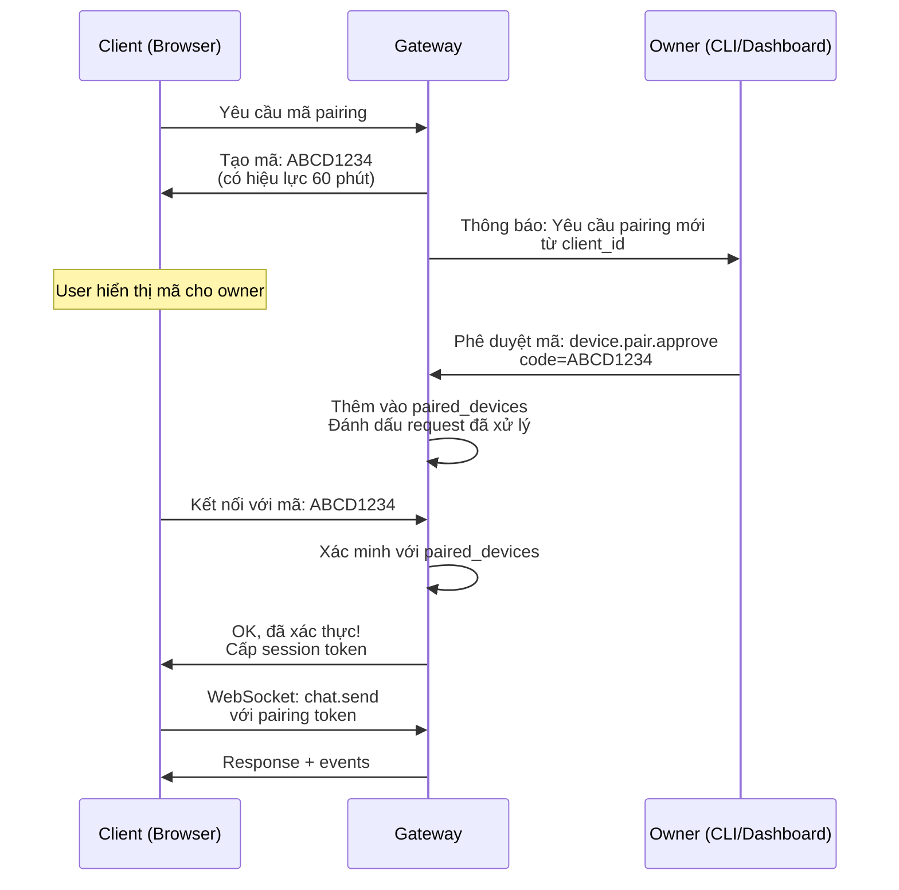

> Bản dịch từ [English version](../../channels/browser-pairing.md)

# Browser Pairing

Luồng xác thực bảo mật cho client WebSocket tuỳ chỉnh sử dụng mã pairing 8 ký tự. Lý tưởng cho web app riêng tư và desktop client cần xác minh danh tính thiết bị.

## Luồng Pairing



## Định dạng Mã

**Tạo mã:**

- Độ dài: 8 ký tự
- Bảng chữ cái: `ABCDEFGHJKLMNPQRSTUVWXYZ23456789` (loại bỏ ký tự mơ hồ: 0, O, 1, I, L)
- TTL: 60 phút
- Tối đa chờ mỗi tài khoản: 3

**Mã ví dụ:**
- `ABCD1234`
- `XY8PQRST`
- `2M5H9JKL`

## Triển khai

### Bước 1: Yêu cầu Mã (Client)

```bash
curl -X POST http://localhost:8080/v1/device/pair/request \
  -H "Content-Type: application/json" \
  -d '{
    "client_id": "browser_myclient_1",
    "device_name": "My Web App"
  }'
```

**Response:**

```json
{
  "code": "ABCD1234",
  "expires_at": 1709865000,
  "url": "http://localhost:8080/pair?code=ABCD1234"
}
```

Hiển thị mã cho user:

```
Please share this code with your gateway owner:

  ABCD1234

It expires in 60 minutes.
```

### Bước 2: Phê duyệt Mã (Owner)

Owner chạy lệnh CLI hoặc dùng dashboard để phê duyệt:

```bash
goclaw device.pair.approve --code ABCD1234
```

Hoặc qua WebSocket (chỉ admin):

```json
{
  "type": "req",
  "id": "100",
  "method": "device.pair.approve",
  "params": {
    "code": "ABCD1234"
  }
}
```

**Response:**

```json
{
  "type": "res",
  "id": "100",
  "ok": true,
  "payload": {
    "client_id": "browser_myclient_1",
    "device_name": "My Web App",
    "paired_at": 1709864400
  }
}
```

### Bước 3: Kết nối (Client)

Client dùng mã để xác thực:

```json
{
  "type": "req",
  "id": "1",
  "method": "connect",
  "params": {
    "pairing_code": "ABCD1234",
    "user_id": "web_user_1"
  }
}
```

**Response:**

```json
{
  "type": "res",
  "id": "1",
  "ok": true,
  "payload": {
    "protocol": 3,
    "role": "operator",
    "user_id": "web_user_1",
    "session_token": "session_xyz..."
  }
}
```

Client lưu `session_token` cho các kết nối sau.

### Bước 4: Dùng Session (Client)

Khi kết nối lại, dùng token đã lưu:

```json
{
  "type": "req",
  "id": "1",
  "method": "connect",
  "params": {
    "session_token": "session_xyz...",
    "user_id": "web_user_1"
  }
}
```

## Thuộc tính Bảo mật

- **Dùng một lần**: Mỗi mã pairing chỉ dùng một lần rồi bị vô hiệu hoá
- **Có hạn**: Mã hết hạn sau 60 phút
- **Giới hạn chờ**: Tối đa 3 request chờ mỗi tài khoản (ngăn spam)
- **Phê duyệt từ owner**: Chỉ owner gateway mới có thể phê duyệt mã (yêu cầu quyền admin)
- **Session token**: Được cấp sau khi phê duyệt; gắn với thiết bị và user
- **Debouncing**: Thông báo phê duyệt pairing được debounce theo người gửi (60 giây)

## Ví dụ JavaScript

```javascript
class PairingClient {
  constructor(gatewayUrl) {
    this.url = gatewayUrl;
    this.ws = null;
    this.sessionToken = localStorage.getItem('goclaw_token');
  }

  async requestPairingCode() {
    const res = await fetch(`${this.url}/v1/device/pair/request`, {
      method: 'POST',
      headers: { 'Content-Type': 'application/json' },
      body: JSON.stringify({
        client_id: 'browser_' + Date.now(),
        device_name: navigator.userAgent
      })
    });
    const data = await res.json();
    return data.code;
  }

  connect() {
    this.ws = new WebSocket(this.url.replace('http', 'ws') + '/ws');
    this.ws.onopen = () => {
      if (this.sessionToken) {
        // Tiếp tục với token
        this.send('connect', {
          session_token: this.sessionToken,
          user_id: 'user_' + Date.now()
        });
      } else {
        console.log('No session token. Request pairing code first.');
      }
    };
    this.ws.onmessage = (e) => this.handleMessage(JSON.parse(e.data));
  }

  send(method, params) {
    this.ws.send(JSON.stringify({
      type: 'req',
      id: Date.now().toString(),
      method,
      params
    }));
  }

  handleMessage(frame) {
    if (frame.type === 'res' && frame.payload?.session_token) {
      localStorage.setItem('goclaw_token', frame.payload.session_token);
    }
    // Xử lý response...
  }
}
```

## Xử lý sự cố

| Vấn đề | Giải pháp |
|-------|----------|
| "Code expired" | Mã chỉ có hiệu lực 60 phút. Yêu cầu mã mới. |
| "Code not found" | Mã chưa bao giờ tồn tại hoặc đã được dùng. Yêu cầu mã mới. |
| "Max pending exceeded" | Quá nhiều request chờ. Chờ hoặc nhờ owner thu hồi mã cũ. |
| "Unauthorized" | Owner chưa phê duyệt mã. Kiểm tra với owner. |
| Session token không hợp lệ | Token có thể đã hết hạn hoặc bị thu hồi. Yêu cầu mã pairing mới. |

## Tiếp theo

- [Tổng quan](./overview.md) — Khái niệm và chính sách channel
- [WebSocket](./websocket.md) — Giao tiếp RPC trực tiếp
- [Telegram](./telegram.md) — Thiết lập Telegram
- [Gateway Protocol](../gateway-protocol.md) — Tài liệu giao thức đầy đủ
