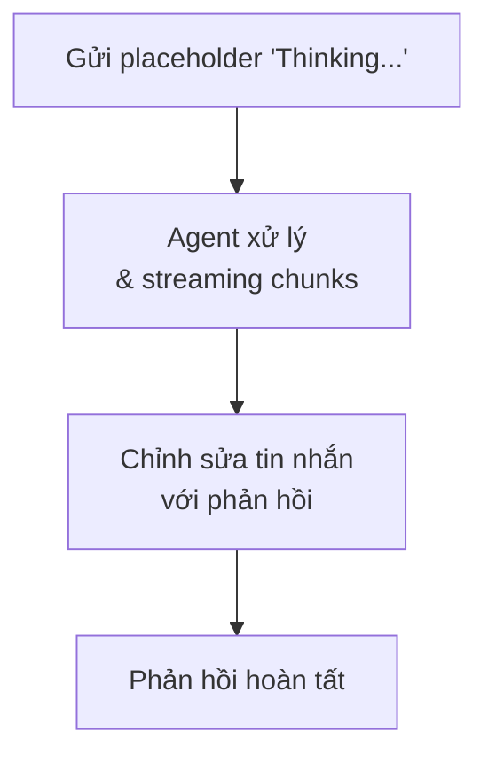

> Bản dịch từ [English version](/channel-discord)

# Channel Discord

Tích hợp Discord bot qua Discord Gateway API. Hỗ trợ DM, server, thread, và phản hồi streaming qua chỉnh sửa tin nhắn.

## Thiết lập

**Tạo Discord Application:**
1. Vào https://discord.com/developers/applications
2. Click "New Application"
3. Vào tab "Bot" → "Add Bot"
4. Sao chép token
5. Đảm bảo `Message Content Intent` được bật trong "Privileged Gateway Intents"

**Thêm Bot vào Server:**
1. OAuth2 → URL Generator
2. Chọn scopes: `bot`
3. Chọn permissions: `Send Messages`, `Read Message History`, `Read Messages/View Channels`
4. Sao chép URL được tạo và mở trong trình duyệt

**Bật Discord:**

```json
{
  "channels": {
    "discord": {
      "enabled": true,
      "token": "YOUR_BOT_TOKEN",
      "dm_policy": "open",
      "group_policy": "open",
      "allow_from": ["alice_id", "bob_id"]
    }
  }
}
```

## Cấu hình

Tất cả config key nằm trong `channels.discord`:

| Key | Kiểu | Mặc định | Mô tả |
|-----|------|---------|-------------|
| `enabled` | bool | false | Bật/tắt channel |
| `token` | string | bắt buộc | Bot token từ Discord Developer Portal |
| `allow_from` | list | -- | Danh sách trắng user ID |
| `dm_policy` | string | `"open"` | `open`, `allowlist`, `pairing`, `disabled` |
| `group_policy` | string | `"open"` | `open`, `allowlist`, `disabled` |
| `require_mention` | bool | true | Yêu cầu mention @bot trong server (channel) |
| `history_limit` | int | 50 | Tin nhắn chờ tối đa mỗi channel (0=tắt) |
| `block_reply` | bool | -- | Ghi đè block_reply của gateway (nil=kế thừa) |

## Tính năng

### Gateway Intents

Tự động yêu cầu intent `GuildMessages`, `DirectMessages`, và `MessageContent` khi khởi động.

### Giới hạn tin nhắn

Discord giới hạn 2,000 ký tự mỗi tin nhắn. Phản hồi dài hơn sẽ được tách tại ranh giới xuống dòng.

### Chỉnh sửa Placeholder

Bot gửi placeholder "Thinking..." ngay lập tức, sau đó chỉnh sửa với phản hồi thực tế. Điều này cung cấp phản hồi trực quan trong khi agent xử lý.



### Mention Gating

Trong server (channel), bot mặc định yêu cầu được mention (`require_mention: true`). Tin nhắn chờ được lưu vào buffer lịch sử. Khi bot được mention, lịch sử được đưa vào làm context.

### Typing Indicator

Trong khi agent xử lý, typing indicator được hiển thị (keepalive 9 giây). Typing indicator dừng tự động sau khi tin nhắn được gửi thành công.

### Hỗ trợ Thread

Bot tự động phát hiện và phản hồi trong Discord thread. Phản hồi ở lại trong cùng thread.

### Media từ tin nhắn được reply

Khi user reply vào một tin nhắn chứa file đính kèm media, GoClaw trích xuất các file đó và đưa vào context của tin nhắn đến. Agent có thể thấy và xử lý media ngay cả khi nó được chia sẻ ở lượt trước. URL nguồn của attachment được giữ nguyên trong media tag, cho phép agent tham chiếu đến URL gốc trên Discord CDN.

### Lịch sử Media Nhóm

Các file media (hình ảnh, video, âm thanh) được gửi trong cuộc trò chuyện nhóm được theo dõi trong lịch sử tin nhắn, cho phép agent tham chiếu đến media đã chia sẻ trước đó.

### Định danh Bot

Khi khởi động, bot lấy user ID của chính mình qua endpoint `@me` để tránh phản hồi tin nhắn của chính mình.

### Allowlist và chính sách Pairing

`dm_policy` và `group_policy` hoạt động đúng như tài liệu mô tả — các chế độ `pairing`, `allowlist`, và `open` được xử lý hoàn toàn bởi lớp đánh giá policy. Không có allowlist gate bổ sung nào sau bước kiểm tra policy, do đó người dùng đã pairing sẽ không bị từ chối nhầm khi danh sách `allow_from` cũng được cấu hình. Nếu người dùng vừa được pairing vừa có trong `allow_from`, cả hai điều kiện đều được thỏa mãn và tin nhắn được xử lý bình thường.

### Quản lý Group File Writer

Discord hỗ trợ quản lý group file writer qua slash command (tương tự giới hạn writer của Telegram). Trong server channel, các thao tác nhạy cảm với file có thể được giới hạn cho các writer được chỉ định:

| Lệnh | Mô tả |
|---------|-------------|
| `/addwriter` | Thêm group file writer (reply vào user mục tiêu) |
| `/removewriter` | Xoá group file writer |
| `/writers` | Liệt kê các group file writer hiện tại |

Writer được quản lý theo từng nhóm. Định dạng group ID nội bộ là `group:discord:{channelID}`.

## Pattern phổ biến

### Gửi đến Channel

```go
manager.SendToChannel(ctx, "discord", "channel_id", "Hello!")
```

### Cấu hình nhóm

Ghi đè theo từng guild/channel chưa được hỗ trợ trong implementation channel Discord. Dùng `allow_from` và chính sách toàn cục.

## Xử lý sự cố

| Vấn đề | Giải pháp |
|-------|----------|
| Bot không phản hồi | Kiểm tra bot có đủ permissions cần thiết. Xác minh cài đặt `require_mention`. Đảm bảo bot có thể đọc tin nhắn (`Message Content Intent` đã bật). |
| Lỗi "Unknown Application" | Token không hợp lệ hoặc đã hết hạn. Tạo lại bot token. |
| Chỉnh sửa placeholder thất bại | Đảm bảo bot có permission `Manage Messages`. Discord có thể thu hồi permission này trong quá trình setup. |
| Tin nhắn bị tách sai | Phản hồi dài được tách tại xuống dòng. Kiểm soát độ dài tin nhắn qua `max_tokens` của model. |
| Bot tự mention mình | Kiểm tra permissions Discord. Bot không nên có `@everyone` hoặc `@here` trong phản hồi. |

## Tiếp theo

- [Tổng quan](/channels-overview) — Khái niệm và chính sách channel
- [Telegram](/channel-telegram) — Thiết lập Telegram bot
- [Larksuite](/channel-feishu) — Tích hợp Larksuite với streaming card
- [Browser Pairing](/channel-browser-pairing) — Luồng pairing

<!-- goclaw-source: 29457bb3 | cập nhật: 2026-04-25 -->
