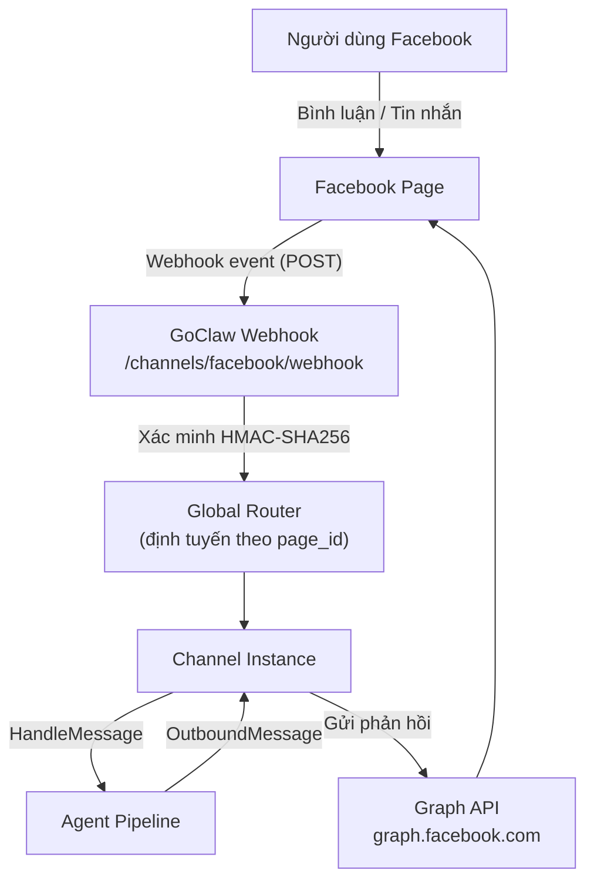

> Bản dịch từ [English version](/channel-facebook)

# Kênh Facebook

Tích hợp Facebook Fanpage hỗ trợ tự động trả lời Messenger, tự động trả lời bình luận, và gửi DM đầu tiên qua Facebook Graph API.

## Cài đặt

### 1. Tạo Facebook App

1. Vào [developers.facebook.com](https://developers.facebook.com) và tạo app mới
2. Chọn loại **Business**
3. Thêm sản phẩm **Messenger** và **Webhooks**
4. Trong **Messenger Settings** → **Access Tokens** → tạo Page Access Token cho trang của bạn
5. Sao chép **App ID**, **App Secret** và **Page Access Token**
6. Ghi lại **Facebook Page ID** (hiển thị trong phần Giới thiệu của trang hoặc URL)

### 2. Cấu hình Webhook

Trong Facebook App Dashboard → **Webhooks** → **Page**:

1. Đặt callback URL: `https://your-goclaw-host/channels/facebook/webhook`
2. Đặt verify token (bất kỳ chuỗi nào — dùng chuỗi này làm `verify_token` trong cấu hình GoClaw)
3. Đăng ký các sự kiện: `messages`, `messaging_postbacks`, `feed`

### 3. Bật kênh Facebook

```json
{
  "channels": {
    "facebook": {
      "enabled": true,
      "instances": [
        {
          "name": "my-fanpage",
          "credentials": {
            "page_access_token": "YOUR_PAGE_ACCESS_TOKEN",
            "app_secret": "YOUR_APP_SECRET",
            "verify_token": "YOUR_VERIFY_TOKEN"
          },
          "config": {
            "page_id": "YOUR_PAGE_ID",
            "features": {
              "messenger_auto_reply": true,
              "comment_reply": false,
              "first_inbox": false
            }
          }
        }
      ]
    }
  }
}
```

## Cấu hình

### Thông tin xác thực (mã hóa)

| Key | Kiểu | Mô tả |
|-----|------|-------|
| `page_access_token` | string | Token cấp trang từ Facebook App Dashboard (bắt buộc) |
| `app_secret` | string | App Secret để xác minh chữ ký webhook (bắt buộc) |
| `verify_token` | string | Token dùng để xác minh quyền sở hữu webhook endpoint (bắt buộc) |

### Cấu hình instance

| Key | Kiểu | Mặc định | Mô tả |
|-----|------|----------|-------|
| `page_id` | string | bắt buộc | Facebook Page ID |
| `features.messenger_auto_reply` | bool | false | Bật tự động trả lời Messenger inbox |
| `features.comment_reply` | bool | false | Bật tự động trả lời bình luận |
| `features.first_inbox` | bool | false | Gửi DM một lần sau lần trả lời bình luận đầu tiên |
| `comment_reply_options.include_post_context` | bool | false | Tải nội dung bài đăng để làm phong phú context bình luận |
| `comment_reply_options.max_thread_depth` | int | 10 | Độ sâu tối đa khi tải chuỗi bình luận cha |
| `messenger_options.session_timeout` | string | -- | Ghi đè session timeout cho hội thoại Messenger (ví dụ `"30m"`) |
| `post_context_cache_ttl` | string | -- | TTL cache cho việc tải nội dung bài đăng (ví dụ `"10m"`) |
| `first_inbox_message` | string | -- | Nội dung DM tùy chỉnh gửi sau lần trả lời bình luận đầu tiên (mặc định tiếng Việt nếu để trống) |
| `allow_from` | list | -- | Danh sách trắng Sender ID |

## Kiến trúc



- **Một webhook endpoint dùng chung** — tất cả instance kênh Facebook dùng chung `/channels/facebook/webhook`, định tuyến theo `page_id`
- **Xác minh HMAC-SHA256** — mỗi webhook delivery được xác minh qua header `X-Hub-Signature-256` với `app_secret`
- **Graph API v25.0** — tất cả cuộc gọi đi dùng endpoint Graph API có version

## Tính năng

### fb_mode: Chế độ Page vs Bình luận

Trường metadata `fb_mode` kiểm soát cách phản hồi của agent được gửi đi:

| `fb_mode` | Trigger | Phương thức trả lời |
|-----------|---------|---------------------|
| `messenger` | Tin nhắn Messenger inbox | `POST /me/messages` đến người gửi |
| `comment` | Bình luận trên bài đăng của trang | `POST /{comment_id}/comments` reply |

Kênh tự động đặt `fb_mode` dựa trên loại sự kiện. Agent có thể đọc metadata này để điều chỉnh phong cách phản hồi.

### Tự động trả lời Messenger

Khi `features.messenger_auto_reply` được bật:

- Trả lời tin nhắn văn bản và postback từ người dùng trong Messenger
- Session key là `senderID` (hội thoại 1:1 theo phạm vi kênh)
- Bỏ qua read receipt, delivery receipt và tin nhắn chỉ có attachment
- Phản hồi dài tự động được chia nhỏ ở mức 2.000 ký tự

### Tự động trả lời bình luận

Khi `features.comment_reply` được bật:

- Trả lời bình luận mới trên bài đăng của trang (`verb: "add"`)
- Bỏ qua chỉnh sửa và xóa bình luận
- Session key: `{post_id}:{sender_id}` — nhóm tất cả bình luận của cùng người dùng trên cùng bài đăng
- Tùy chọn: tải nội dung bài đăng và chuỗi bình luận cha để làm giàu context (xem `comment_reply_options`)

### Phát hiện admin trả lời

GoClaw tự động phát hiện khi admin trang trả lời hội thoại và dừng tự động trả lời trong **5 phút**. Điều này ngăn bot gửi tin nhắn trùng lặp sau khi admin đã phản hồi.

Logic phát hiện:
1. Khi nhận tin nhắn từ `sender_id == page_id`, GoClaw ghi nhận người nhận là admin đã trả lời
2. Phát hiện echo của bot: nếu bot vừa gửi tin nhắn trong vòng 15 giây, "admin reply" bị bỏ qua (đó là echo của chính bot)
3. Cooldown hết hạn sau 5 phút — tự động trả lời tiếp tục

### First Inbox DM

Khi `features.first_inbox` được bật, GoClaw gửi một DM Messenger riêng tư một lần đến người dùng sau khi bot lần đầu trả lời bình luận của họ:

- Chỉ gửi tối đa một lần mỗi người dùng trong suốt thời gian chạy (dedup trong bộ nhớ)
- Tùy chỉnh nội dung bằng `first_inbox_message`; mặc định tiếng Việt nếu để trống
- Best-effort: lỗi gửi được ghi log và thử lại ở bình luận tiếp theo

### Cài đặt Webhook

Webhook handler:

1. **GET** — Xác minh quyền sở hữu bằng cách phản chiếu `hub.challenge` khi `hub.verify_token` khớp
2. **POST** — Xử lý webhook delivery:
   - Xác minh chữ ký HMAC-SHA256 qua `X-Hub-Signature-256`
   - Phân tích thay đổi `feed` cho sự kiện bình luận
   - Phân tích sự kiện `messaging` cho Messenger
   - Luôn trả về HTTP 200 (không phải 2xx khiến Facebook retry trong 24 giờ)

Kích thước body giới hạn 4 MB. Payload quá lớn bị bỏ và ghi cảnh báo.

### Loại trùng lặp tin nhắn

Facebook có thể gửi cùng một webhook event nhiều lần. GoClaw loại trùng theo event key:

- Messenger: `msg:{message_mid}`
- Postback: `postback:{sender_id}:{timestamp}:{payload}`
- Bình luận: `comment:{comment_id}`

Các mục dedup hết hạn sau 24 giờ (khớp với cửa sổ retry tối đa của Facebook). Một background cleaner xóa các mục hết hạn mỗi 5 phút.

### Graph API

Tất cả cuộc gọi đi đến `graph.facebook.com/v25.0` với tự động retry:

- **3 lần retry** với exponential backoff (1s, 2s, 4s)
- **Xử lý rate limit**: phân tích header `X-Business-Use-Case-Usage` và tuân theo `Retry-After`
- **Token truyền qua header `Authorization: Bearer`** (không bao giờ trong URL)
- **24h messaging window**: mã 551 / subcode 2018109 không retry được (người dùng chưa nhắn tin trong 24 giờ)

### Hỗ trợ media

**Nhận vào** (Messenger): URL attachment được đưa vào metadata tin nhắn. Các loại: `image`, `video`, `audio`, `file`.

**Gửi ra**: Chỉ hỗ trợ trả lời văn bản. Kênh Facebook gốc hiện chưa hỗ trợ gửi media từ agent. Dùng [Pancake](/channel-pancake) để hỗ trợ media đầy đủ trên Facebook và các nền tảng khác.

## Xử lý sự cố

| Sự cố | Giải pháp |
|-------|-----------|
| Xác minh webhook thất bại | Kiểm tra `verify_token` trong GoClaw khớp với token trong Facebook App Dashboard. |
| `page_access_token is required` | Thêm `page_access_token` vào credentials. |
| `page_id is required` | Thêm `page_id` vào instance config. |
| Xác minh token thất bại khi khởi động | `page_access_token` có thể đã hết hạn. Tạo lại từ Facebook App Dashboard. |
| Không nhận được sự kiện | Đảm bảo webhook callback URL có thể truy cập công khai. Kiểm tra Facebook App → Webhooks subscriptions (`messages`, `feed`). |
| Cảnh báo signature không hợp lệ | Đảm bảo `app_secret` trong GoClaw khớp với App Secret trong Facebook App Dashboard. |
| Bot vẫn trả lời sau khi admin đã phản hồi | Đây là hành vi bình thường — bot dừng 5 phút sau khi admin trả lời. Đặt `features.messenger_auto_reply: false` để tắt hoàn toàn. |
| Lỗi 24h messaging window | Người dùng chưa gửi tin nhắn trong 24 giờ qua. Facebook hạn chế tin nhắn do bot khởi tạo ngoài cửa sổ này. |
| Tin nhắn trùng lặp | Dedup tự động xử lý. Nếu vẫn tiếp diễn, kiểm tra xem có nhiều instance GoClaw dùng cùng `page_id` không. |

## Tiếp theo

- [Tổng quan](/channels-overview) — Khái niệm và chính sách kênh
- [Pancake](/channel-pancake) — Proxy đa nền tảng (Facebook + Zalo + Instagram + nhiều hơn)
- [Zalo OA](/channel-zalo-oa) — Zalo Official Account
- [Telegram](/channel-telegram) — Cài đặt Telegram bot

<!-- goclaw-source: 050aafc9 | cập nhật: 2026-04-15 -->
