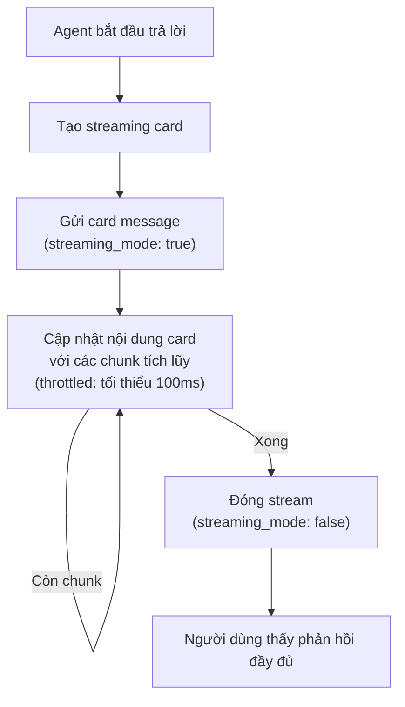

# Kênh Feishu

Tích hợp nhắn tin [Feishu](https://www.feishu.cn/) (飞书) dành cho người dùng tại Trung Quốc — hỗ trợ DM, nhóm, streaming card và cập nhật thời gian thực qua WebSocket hoặc webhook.

## Cài đặt

**Tạo ứng dụng Feishu:**

1. Truy cập https://open.feishu.cn
2. Tạo custom app → điền Basic Information
3. Tại mục "Bots" → bật tính năng "Bot"
4. Đặt tên và avatar cho bot
5. Sao chép `App ID` và `App Secret`
6. Cấp quyền: `im:message`, `im:message.p2p_msg:send`, `im:message.group_msg:send`, `contact:user.id:readonly`

**Bật Feishu:**

```json
{
  "channels": {
    "feishu": {
      "enabled": true,
      "app_id": "YOUR_APP_ID",
      "app_secret": "YOUR_APP_SECRET",
      "connection_mode": "websocket",
      "domain": "feishu",
      "dm_policy": "pairing",
      "group_policy": "open"
    }
  }
}
```

## Cấu hình

Tất cả các key cấu hình nằm trong `channels.feishu`:

| Key | Kiểu | Mặc định | Mô tả |
|-----|------|----------|-------|
| `enabled` | bool | false | Bật/tắt kênh |
| `app_id` | string | bắt buộc | App ID từ Feishu Developer Console |
| `app_secret` | string | bắt buộc | App Secret từ Feishu Developer Console |
| `encrypt_key` | string | -- | Khóa mã hóa tin nhắn (tùy chọn) |
| `verification_token` | string | -- | Token xác minh webhook (tùy chọn) |
| `domain` | string | `"feishu"` | `"feishu"` cho Trung Quốc, `"lark"` cho Larksuite quốc tế |
| `connection_mode` | string | `"websocket"` | `"websocket"` hoặc `"webhook"` |
| `webhook_port` | int | 3000 | Cổng cho webhook server (0=gắn vào gateway mux) |
| `webhook_path` | string | `"/feishu/events"` | Đường dẫn webhook endpoint |
| `allow_from` | list | -- | Danh sách User ID được phép (DM) |
| `dm_policy` | string | `"pairing"` | `pairing`, `allowlist`, `open`, `disabled` |
| `group_policy` | string | `"open"` | `open`, `allowlist`, `disabled` |
| `group_allow_from` | list | -- | Danh sách Group ID được phép |
| `require_mention` | bool | true | Yêu cầu đề cập bot trong nhóm |
| `topic_session_mode` | string | `"disabled"` | `"disabled"` hoặc `"enabled"` để tách phiên theo thread |
| `text_chunk_limit` | int | 4000 | Số ký tự tối đa mỗi tin nhắn |
| `media_max_mb` | int | 30 | Kích thước file media tối đa (MB) |
| `render_mode` | string | `"auto"` | `"auto"` (tự phát hiện), `"card"`, `"raw"` |
| `streaming` | bool | true | Bật cập nhật streaming card |
| `reaction_level` | string | `"off"` | `off`, `minimal` (chỉ ⏳), `full` |
| `history_limit` | int | -- | Số tin nhắn tối đa tải từ lịch sử |
| `block_reply` | bool | -- | Chặn ngữ cảnh reply-to-message |
| `stt_proxy_url` | string | -- | URL proxy speech-to-text |
| `stt_api_key` | string | -- | API key speech-to-text |
| `stt_tenant_id` | string | -- | Tenant ID speech-to-text |
| `stt_timeout_seconds` | int | -- | Timeout yêu cầu speech-to-text |
| `voice_agent_id` | string | -- | Agent ID xử lý tin nhắn thoại |

## Chế độ kết nối

### WebSocket (Mặc định)

Kết nối liên tục với tự động kết nối lại. Khuyến nghị cho độ trễ thấp.

```json
{
  "connection_mode": "websocket"
}
```

### Webhook

Feishu gửi sự kiện qua HTTP POST. Chọn một trong hai:

1. **Gắn vào gateway mux** (`webhook_port: 0`): Handler dùng chung cổng gateway
2. **Server riêng** (`webhook_port: 3000`): Listener webhook độc lập

```json
{
  "connection_mode": "webhook",
  "webhook_port": 0,
  "webhook_path": "/feishu/events"
}
```

Sau đó cấu hình webhook URL trong Feishu Developer Console:
- Gateway mux: `https://your-gateway.com/feishu/events`
- Server riêng: `https://your-webhook-host:3000/feishu/events`

## Tính năng

### Streaming Card

Cập nhật thời gian thực qua card tương tác có hiệu ứng động:



Cập nhật được throttle để tránh rate limiting. Hiển thị dùng tần số animation 50ms (2 ký tự mỗi bước).

### Xử lý media

**Nhận vào**: Ảnh, file, audio, video, sticker được tự động tải và lưu:

| Loại | Phần mở rộng |
|------|-------------|
| Ảnh | `.png` |
| File | Phần mở rộng gốc |
| Audio | `.opus` |
| Video | `.mp4` |
| Sticker | `.png` |

Tối đa 30 MB theo mặc định (`media_max_mb`).

**Gửi ra**: File được tự động phát hiện và upload đúng loại (opus, mp4, pdf, doc, xls, ppt, hoặc stream).

### Phân giải mention

Feishu gửi token placeholder (ví dụ `@_user_1`). Bot phân tích danh sách mention và chuyển thành `@DisplayName`.

### Tách phiên theo thread

Khi `topic_session_mode: "enabled"`, mỗi thread có lịch sử hội thoại riêng biệt:

```
Session key: "{chatID}:topic:{rootMessageID}"
```

Các thread khác nhau trong cùng nhóm duy trì lịch sử riêng.

### Speech-to-Text

Tin nhắn thoại có thể được chuyển văn bản bằng cách cấu hình dịch vụ STT:

```json
{
  "stt_proxy_url": "https://your-stt-service.com",
  "stt_api_key": "YOUR_STT_KEY",
  "stt_timeout_seconds": 30
}
```

Đặt `voice_agent_id` để chuyển tin nhắn thoại đã chuyển văn bản đến một agent cụ thể.

## Xử lý sự cố

| Sự cố | Giải pháp |
|-------|-----------|
| "Invalid app credentials" | Kiểm tra app_id và app_secret. Đảm bảo ứng dụng đã được publish. |
| Webhook không nhận sự kiện | Xác minh webhook URL có thể truy cập công khai. Kiểm tra event subscriptions trong Feishu Developer Console. |
| WebSocket liên tục ngắt kết nối | Kiểm tra mạng. Xác minh app có quyền `im:message`. |
| Streaming card không cập nhật | Đảm bảo `streaming: true`. Kiểm tra `render_mode` (auto/card). Tin nhắn ngắn hơn giới hạn sẽ hiển thị dạng plain text. |
| Upload media thất bại | Xác minh loại file phù hợp. Kiểm tra kích thước file không vượt `media_max_mb`. |
| Mention không được phân giải | Đảm bảo bot được đề cập. Kiểm tra danh sách mention trong webhook payload. |
| Sai domain | Người dùng Trung Quốc phải đặt `domain: "feishu"`. Người dùng quốc tế dùng `domain: "lark"`. |

## Tiếp theo

- [Tổng quan](#channels-overview) — Khái niệm và chính sách kênh
- [Larksuite](#channel-larksuite) — Cài đặt Larksuite (quốc tế)
- [Telegram](#channel-telegram) — Cài đặt Telegram bot
- [Browser Pairing](#channel-browser-pairing) — Luồng ghép cặp trình duyệt

<!-- goclaw-source: 120fc2d | cập nhật: 2026-03-18 -->
