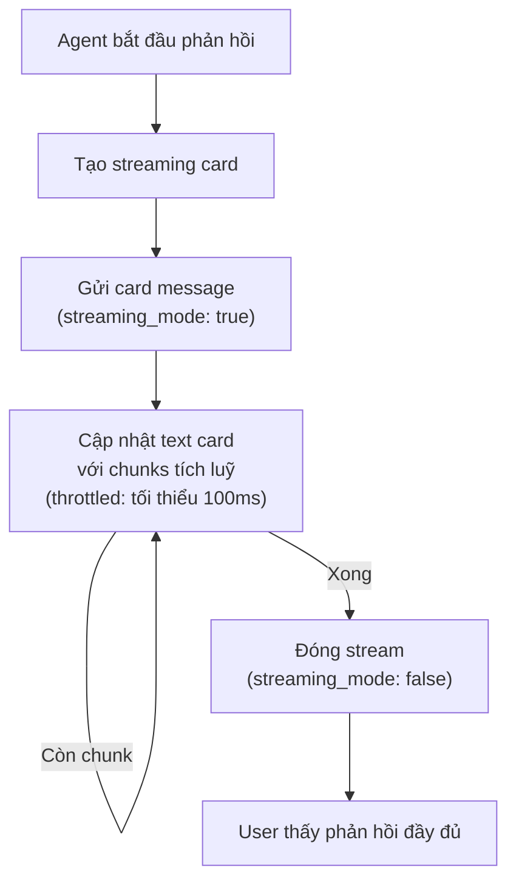

> Bản dịch từ [English version](/channel-feishu)

# Channel Larksuite

Tích hợp nhắn tin [Larksuite](https://www.larksuite.com/) hỗ trợ DM, nhóm, streaming card, và cập nhật theo thời gian thực qua WebSocket hoặc webhook.

## Thiết lập

**Tạo Larksuite App:**

1. Vào https://open.larksuite.com
2. Tạo custom app → điền Basic Information
3. Trong "Bots" → bật tính năng "Bot"
4. Đặt tên bot và avatar
5. Sao chép `App ID` và `App Secret`
6. Cấp các API scope cần thiết (xem [Required API Scopes](#required-api-scopes) bên dưới)
7. Đặt Contact Range thành **"All members"** trong Permissions & Scopes → Contacts
8. Publish phiên bản app (scope chỉ có hiệu lực sau khi publish)

**Bật Larksuite:**

```json
{
  "channels": {
    "feishu": {
      "enabled": true,
      "app_id": "YOUR_APP_ID",
      "app_secret": "YOUR_APP_SECRET",
      "connection_mode": "websocket",
      "domain": "lark",
      "dm_policy": "pairing",
      "group_policy": "open"
    }
  }
}
```

## Cấu hình

Tất cả config key nằm trong `channels.feishu`:

| Key | Kiểu | Mặc định | Mô tả |
|-----|------|---------|-------------|
| `enabled` | bool | false | Bật/tắt channel |
| `app_id` | string | bắt buộc | App ID từ Larksuite Developer Console |
| `app_secret` | string | bắt buộc | App Secret từ Larksuite Developer Console |
| `encrypt_key` | string | -- | Khoá mã hoá tin nhắn tuỳ chọn |
| `verification_token` | string | -- | Token xác minh webhook tuỳ chọn |
| `domain` | string | `"lark"` | `"lark"` (Larksuite) hoặc domain tuỳ chỉnh |
| `connection_mode` | string | `"websocket"` | `"websocket"` hoặc `"webhook"` |
| `webhook_port` | int | 3000 | Cổng server webhook (0=mount trên gateway mux) |
| `webhook_path` | string | `"/feishu/events"` | Đường dẫn endpoint webhook |
| `allow_from` | list | -- | Danh sách trắng user ID (DM) |
| `dm_policy` | string | `"pairing"` | `pairing`, `allowlist`, `open`, `disabled` |
| `group_policy` | string | `"open"` | `open`, `allowlist`, `disabled` |
| `group_allow_from` | list | -- | Danh sách trắng group ID |
| `require_mention` | bool | true | Yêu cầu mention bot trong nhóm |
| `topic_session_mode` | string | `"disabled"` | `"disabled"` hoặc `"enabled"` để cô lập thread |
| `text_chunk_limit` | int | 4000 | Số ký tự tối đa mỗi tin nhắn |
| `media_max_mb` | int | 30 | Kích thước file media tối đa (MB) |
| `render_mode` | string | `"auto"` | `"auto"` (tự phát hiện), `"card"`, `"raw"` |
| `streaming` | bool | true | Bật cập nhật streaming card |
| `reaction_level` | string | `"off"` | `off`, `minimal` (chỉ ⏳), `full` |

## Chế độ Transport

### WebSocket (Mặc định)

Kết nối liên tục với tự động kết nối lại. Khuyến nghị cho độ trễ thấp.

```json
{
  "connection_mode": "websocket"
}
```

### Webhook

Larksuite gửi event qua HTTP POST. Chọn:

1. **Mount trên gateway mux** (`webhook_port: 0`): Handler dùng chung cổng gateway chính
2. **Server riêng** (`webhook_port: 3000`): Listener webhook chuyên dụng

```json
{
  "connection_mode": "webhook",
  "webhook_port": 0,
  "webhook_path": "/feishu/events"
}
```

Sau đó cấu hình URL webhook trong Larksuite Developer Console:
- Gateway mux: `https://your-gateway.com/feishu/events`
- Server riêng: `https://your-webhook-host:3000/feishu/events`

## Required API Scopes

App Larksuite của bạn cần 15 scope sau. Dashboard hiển thị danh sách đầy đủ trong panel thu gọn khi tạo hoặc chỉnh sửa channel Feishu.

| Scope | Mục đích |
|-------|---------|
| `im:message` | Nhắn tin cốt lõi |
| `im:message:readonly` | Đọc tin nhắn (reply context) |
| `im:message.p2p_msg:send` | Gửi DM |
| `im:message.group_msg:send` | Gửi tin nhắn nhóm |
| `im:message.group_at_msg` | Gửi tin nhắn @-mention |
| `im:message.group_at_msg:readonly` | Đọc tin nhắn @-mention |
| `im:chat` | Quản lý chat |
| `im:chat:readonly` | Đọc thông tin chat |
| `im:resource` | Upload/download media |
| `contact:user.base:readonly` | Đọc hồ sơ người dùng |
| `contact:user.id:readonly` | Phân giải user ID |
| `contact:user.employee_id:readonly` | Phân giải employee ID |
| `contact:user.phone:readonly` | Phân giải số điện thoại |
| `contact:user.email:readonly` | Phân giải email |
| `contact:department.id:readonly` | Tra cứu phòng ban |

> **Quan trọng:** Sau khi cấp scope, đặt **Contact Range** thành **"All members"** trong Permissions & Scopes → Contacts, rồi publish phiên bản app mới. Nếu không, phân giải contact sẽ trả về tên trống.

## Tính năng

### Reply Context

Khi người dùng trả lời một tin nhắn trong DM, GoClaw đưa tin nhắn gốc vào làm context cho agent. Trong DM, chú thích `[From: sender_name]` được thêm vào đầu để agent biết ai đã gửi tin nhắn.

### Streaming Card

Cập nhật theo thời gian thực được gửi dưới dạng interactive card message có animation:



Cập nhật được throttle để tránh rate limiting. Hiển thị dùng tần số animation 50ms (bước 2 ký tự).

### Xử lý Media

**Nhận vào**: Hình ảnh, file, audio, video, sticker tự động tải xuống và lưu:

| Loại | Phần mở rộng |
|------|-----------|
| Hình ảnh | `.png` |
| File | Phần mở rộng gốc |
| Audio | `.opus` |
| Video | `.mp4` |
| Sticker | `.png` |

Tối đa 30 MB mặc định (`media_max_mb`).

**Gửi đi**: File tự động được phát hiện và upload với đúng loại (opus, mp4, pdf, doc, xls, ppt, hoặc stream).

**Tin nhắn post dạng rich**: GoClaw cũng trích xuất hình ảnh được nhúng trong tin nhắn rich-text `post` của Lark (không chỉ tin nhắn hình ảnh độc lập). Ảnh trong nội dung post được tải xuống và đưa vào context tin nhắn đến cùng với media khác.

### Hỗ trợ @Mention

Bot gửi @mention Lark gốc trong tin nhắn nhóm. Khi phản hồi của agent chứa pattern `@open_id` (ví dụ `@ou_abc123`), chúng được tự động chuyển thành phần tử `at` gốc của Lark, kích hoạt thông báo thực sự đến người dùng được đề cập. Hoạt động trong cả tin nhắn văn bản `post` và card tương tác.

### Phân giải Mention

Larksuite gửi token placeholder (ví dụ: `@_user_1`). Bot phân tích danh sách mention và phân giải thành `@DisplayName`.

### Cô lập Session theo Thread

Khi `topic_session_mode: "enabled"`, mỗi thread có cuộc trò chuyện riêng biệt:

```
Session key: "{chatID}:topic:{rootMessageID}"
```

Các thread khác nhau trong cùng nhóm duy trì lịch sử riêng.

### Slash Command (Quản lý quyền ghi file)

Trong nhóm chat, thành viên có thể quản lý quyền ghi file bằng slash command:

| Lệnh | Mô tả |
|------|-------|
| `/addwriter <@mention hoặc reply>` | Cấp quyền ghi file cho người dùng trong nhóm |
| `/removewriter <@mention hoặc reply>` | Thu hồi quyền ghi file của người dùng |
| `/writers` | Liệt kê tất cả người dùng có quyền ghi file trong nhóm |

**Cách chỉ định người dùng mục tiêu:** Reply vào tin nhắn của họ và gửi lệnh, hoặc @mention họ trong cùng tin nhắn. Có thể tự cấp quyền cho bản thân bằng cách @mention chính mình.

**Phân quyền:** Chỉ các file writer hiện có mới được quản lý danh sách. Khi danh sách trống, người đầu tiên có thể khởi tạo bằng cách chỉ định mục tiêu cụ thể.

> Các lệnh này chỉ hoạt động trong nhóm chat. DM sẽ bị từ chối.

### Tự động tải tài liệu Lark Docx

Khi một URL tài liệu Lark docx được dán vào chat, GoClaw tự động phát hiện và tải nội dung tài liệu qua Lark API, đưa trực tiếp vào prompt của agent — không cần gọi tool.

**Định dạng URL hỗ trợ:**
- `https://*.feishu.cn/docx/<id>`
- `https://*.larksuite.com/docx/<id>`

**Scope quyền app bắt buộc:** `docx:document:readonly` — thêm trong Larksuite Developer Console dưới mục Permissions & Scopes.

**Chi tiết triển khai:**
- LRU cache: 128 mục, TTL 5 phút (các link lặp lại trong cùng phiên được phục vụ từ cache)
- Nội dung được cắt ngắn ở 8.000 rune để vừa với context window của agent
- Các doc ID trùng lặp trong cùng tin nhắn được gộp lại — mỗi tài liệu chỉ được tải một lần

> Chỉ hỗ trợ URL `/docx/`. Sheets, Base, Wiki và các loại tài liệu Lark khác nằm ngoài phạm vi.

### Tool list_group_members

Khi kết nối với kênh Larksuite, agent có quyền dùng tool `list_group_members`. Tool này trả về tất cả thành viên của nhóm chat hiện tại cùng `open_id` và tên hiển thị.

```
list_group_members(channel?, chat_id?) → { count, members: [{ member_id, name }] }
```

Các trường hợp dùng: kiểm tra thành viên trong nhóm, xác định người dùng trước khi mention, theo dõi sự hiện diện. Để @mention thành viên trong phản hồi, dùng `@member_id` (ví dụ `@ou_abc123`) — bot tự chuyển thành mention Lark gốc có thông báo.

> Tool này chỉ khả dụng trên kênh Feishu/Lark. Nó sẽ không xuất hiện trong danh sách tool cho các loại kênh khác.

### Danh sách tool cho phép theo topic

Forum topic hỗ trợ danh sách trắng tool riêng. Cấu hình trong cài đặt tool của agent hoặc metadata kênh:

| Giá trị | Hành vi |
|-------|----------|
| `nil` (bỏ qua) | Kế thừa danh sách tool của nhóm cha |
| `[]` (rỗng) | Không cho phép tool nào trong topic này |
| `["web_search", "group:fs"]` | Chỉ cho phép các tool này |

Tiền tố `group:fs` chọn tất cả tool trong nhóm `fs` (Feishu/Lark). Cú pháp `group:xxx` này tương tự với cấu hình topic của Telegram.

## Xử lý sự cố

| Vấn đề | Giải pháp |
|-------|----------|
| "Invalid app credentials" | Kiểm tra app_id và app_secret. Đảm bảo app đã được publish. |
| Webhook không nhận event | Xác minh URL webhook có thể truy cập công khai. Kiểm tra event subscription trong Larksuite Developer Console. |
| WebSocket liên tục ngắt kết nối | Kiểm tra mạng. Xác minh app có permission `im:message`. |
| Streaming card không cập nhật | Đảm bảo `streaming: true`. Kiểm tra `render_mode` (auto/card). Tin nhắn ngắn hơn giới hạn render dạng plain text. |
| Upload media thất bại | Xác minh loại file khớp. Kiểm tra kích thước file dưới `media_max_mb`. |
| Mention không được phân tích | Đảm bảo bot được mention. Kiểm tra mention list trong webhook payload. |

## Tiếp theo

- [Tổng quan](./overview.md) — Khái niệm và chính sách channel
- [Telegram](./telegram.md) — Thiết lập Telegram bot
- [Zalo OA](./zalo-oa.md) — Zalo Official Account
- [Browser Pairing](./browser-pairing.md) — Luồng pairing

<!-- goclaw-source: 050aafc9 | cập nhật: 2026-04-15 -->
