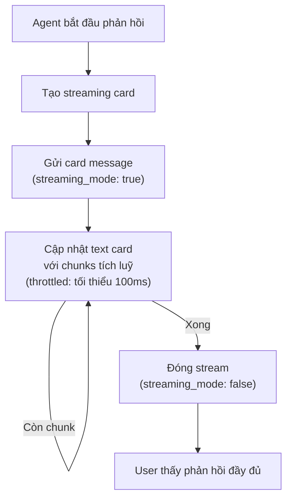

> Bản dịch từ [English version](#channel-feishu)

# Channel Larksuite

Tích hợp nhắn tin [Larksuite](https://www.larksuite.com/) hỗ trợ DM, nhóm, streaming card, và cập nhật theo thời gian thực qua WebSocket hoặc webhook.

## Thiết lập

**Tạo Larksuite App:**

1. Vào https://open.larksuite.com
2. Tạo custom app → điền Basic Information
3. Trong "Bots" → bật tính năng "Bot"
4. Đặt tên bot và avatar
5. Sao chép `App ID` và `App Secret`
6. Cấp permissions: `im:message`, `im:message.p2p_msg:send`, `im:message.group_msg:send`, `contact:user.id:readonly`

**Bật Larksuite:**

```json
{
  "channels": {
    "feishu": {
      "enabled": true,
      "app_id": "YOUR_APP_ID",
      "app_secret": "YOUR_APP_SECRET",
      "connection_mode": "websocket",
      "domain": "lark",
      "dm_policy": "pairing",
      "group_policy": "open"
    }
  }
}
```

## Cấu hình

Tất cả config key nằm trong `channels.feishu`:

| Key | Kiểu | Mặc định | Mô tả |
|-----|------|---------|-------------|
| `enabled` | bool | false | Bật/tắt channel |
| `app_id` | string | bắt buộc | App ID từ Larksuite Developer Console |
| `app_secret` | string | bắt buộc | App Secret từ Larksuite Developer Console |
| `encrypt_key` | string | -- | Khoá mã hoá tin nhắn tuỳ chọn |
| `verification_token` | string | -- | Token xác minh webhook tuỳ chọn |
| `domain` | string | `"lark"` | `"lark"` (Larksuite) hoặc domain tuỳ chỉnh |
| `connection_mode` | string | `"websocket"` | `"websocket"` hoặc `"webhook"` |
| `webhook_port` | int | 3000 | Cổng server webhook (0=mount trên gateway mux) |
| `webhook_path` | string | `"/feishu/events"` | Đường dẫn endpoint webhook |
| `allow_from` | list | -- | Danh sách trắng user ID (DM) |
| `dm_policy` | string | `"pairing"` | `pairing`, `allowlist`, `open`, `disabled` |
| `group_policy` | string | `"open"` | `open`, `allowlist`, `disabled` |
| `group_allow_from` | list | -- | Danh sách trắng group ID |
| `require_mention` | bool | true | Yêu cầu mention bot trong nhóm |
| `topic_session_mode` | string | `"disabled"` | `"disabled"` hoặc `"enabled"` để cô lập thread |
| `text_chunk_limit` | int | 4000 | Số ký tự tối đa mỗi tin nhắn |
| `media_max_mb` | int | 30 | Kích thước file media tối đa (MB) |
| `render_mode` | string | `"auto"` | `"auto"` (tự phát hiện), `"card"`, `"raw"` |
| `streaming` | bool | true | Bật cập nhật streaming card |
| `reaction_level` | string | `"off"` | `off`, `minimal` (chỉ ⏳), `full` |

## Chế độ Transport

### WebSocket (Mặc định)

Kết nối liên tục với tự động kết nối lại. Khuyến nghị cho độ trễ thấp.

```json
{
  "connection_mode": "websocket"
}
```

### Webhook

Larksuite gửi event qua HTTP POST. Chọn:

1. **Mount trên gateway mux** (`webhook_port: 0`): Handler dùng chung cổng gateway chính
2. **Server riêng** (`webhook_port: 3000`): Listener webhook chuyên dụng

```json
{
  "connection_mode": "webhook",
  "webhook_port": 0,
  "webhook_path": "/feishu/events"
}
```

Sau đó cấu hình URL webhook trong Larksuite Developer Console:
- Gateway mux: `https://your-gateway.com/feishu/events`
- Server riêng: `https://your-webhook-host:3000/feishu/events`

## Tính năng

### Streaming Card

Cập nhật theo thời gian thực được gửi dưới dạng interactive card message có animation:



Cập nhật được throttle để tránh rate limiting. Hiển thị dùng tần số animation 50ms (bước 2 ký tự).

### Xử lý Media

**Nhận vào**: Hình ảnh, file, audio, video, sticker tự động tải xuống và lưu:

| Loại | Phần mở rộng |
|------|-----------|
| Hình ảnh | `.png` |
| File | Phần mở rộng gốc |
| Audio | `.opus` |
| Video | `.mp4` |
| Sticker | `.png` |

Tối đa 30 MB mặc định (`media_max_mb`).

**Gửi đi**: File tự động được phát hiện và upload với đúng loại (opus, mp4, pdf, doc, xls, ppt, hoặc stream).

### Phân giải Mention

Larksuite gửi token placeholder (ví dụ: `@_user_1`). Bot phân tích danh sách mention và phân giải thành `@DisplayName`.

### Cô lập Session theo Thread

Khi `topic_session_mode: "enabled"`, mỗi thread có cuộc trò chuyện riêng biệt:

```
Session key: "{chatID}:topic:{rootMessageID}"
```

Các thread khác nhau trong cùng nhóm duy trì lịch sử riêng.

## Xử lý sự cố

| Vấn đề | Giải pháp |
|-------|----------|
| "Invalid app credentials" | Kiểm tra app_id và app_secret. Đảm bảo app đã được publish. |
| Webhook không nhận event | Xác minh URL webhook có thể truy cập công khai. Kiểm tra event subscription trong Larksuite Developer Console. |
| WebSocket liên tục ngắt kết nối | Kiểm tra mạng. Xác minh app có permission `im:message`. |
| Streaming card không cập nhật | Đảm bảo `streaming: true`. Kiểm tra `render_mode` (auto/card). Tin nhắn ngắn hơn giới hạn render dạng plain text. |
| Upload media thất bại | Xác minh loại file khớp. Kiểm tra kích thước file dưới `media_max_mb`. |
| Mention không được phân tích | Đảm bảo bot được mention. Kiểm tra mention list trong webhook payload. |

## Tiếp theo

- [Tổng quan](#channels-overview) — Khái niệm và chính sách channel
- [Telegram](#channel-telegram) — Thiết lập Telegram bot
- [Zalo OA](#channel-zalo-oa) — Zalo Official Account
- [Browser Pairing](#channel-browser-pairing) — Luồng pairing

<!-- goclaw-source: 57754a5 | cập nhật: 2026-03-18 -->
