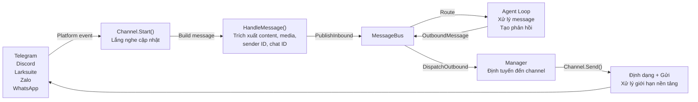
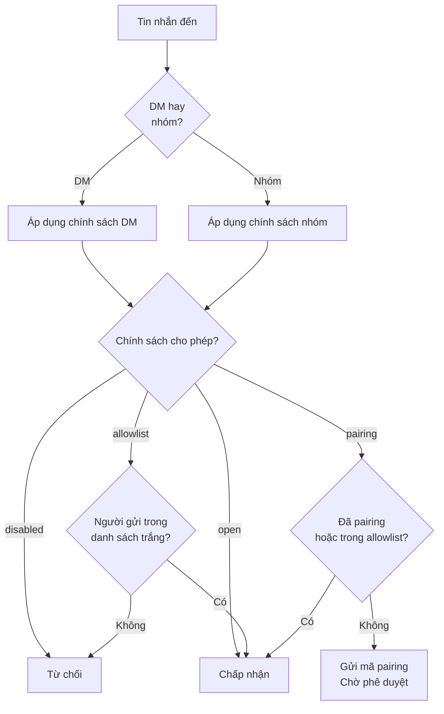

> Bản dịch từ [English version](../../channels/overview.md)

# Tổng quan về Channel

Channel kết nối các nền tảng nhắn tin (Telegram, Discord, Larksuite, v.v.) với agent runtime của GoClaw thông qua một message bus thống nhất. Mỗi channel dịch các sự kiện đặc thù của nền tảng thành object `InboundMessage` chuẩn hoá và chuyển đổi phản hồi của agent thành output phù hợp với nền tảng đó.

## Luồng tin nhắn



## Chính sách Channel

Kiểm soát ai có thể gửi tin nhắn qua DM hoặc cài đặt nhóm.

### Chính sách DM

| Chính sách | Hành vi | Use Case |
|--------|----------|----------|
| `pairing` | Yêu cầu mã 8 ký tự để phê duyệt user mới | Truy cập an toàn, có kiểm soát |
| `allowlist` | Chỉ chấp nhận người gửi trong danh sách trắng | Nhóm hạn chế |
| `open` | Chấp nhận tất cả DM | Bot công khai |
| `disabled` | Từ chối tất cả DM | Chỉ dùng trong nhóm |

### Chính sách Nhóm

| Chính sách | Hành vi | Use Case |
|--------|----------|----------|
| `open` | Chấp nhận tất cả tin nhắn nhóm | Nhóm công khai |
| `allowlist` | Chỉ chấp nhận nhóm trong danh sách trắng | Nhóm hạn chế |
| `disabled` | Không nhận tin nhắn nhóm | Chỉ dùng DM |

### Luồng đánh giá chính sách



## Định dạng Session Key

Session key xác định cuộc trò chuyện và luồng duy nhất trên các nền tảng.

| Context | Định dạng | Ví dụ |
|---------|--------|---------|
| Telegram DM | Chat ID | `"123456"` |
| Telegram nhóm | Chat ID + nhóm | `"-12345"` |
| Telegram topic/thread | Chat + topic ID | `"-12345:topic:99"` |
| Larksuite DM/nhóm | Conversation ID | `"oc_xyz..."` |
| Larksuite thread | Conversation + root message | `"oc_xyz:topic:{msg_id}"` |
| Discord DM/channel | Channel ID | `"987654"` |

## So sánh Channel

| Tính năng | Telegram | Discord | Larksuite | Zalo OA | Zalo Pers | WhatsApp |
|---------|----------|---------|--------|---------|-----------|----------|
| **Transport** | Long polling | Gateway events | WS/Webhook | Long polling | Internal proto | WS bridge |
| **Hỗ trợ DM** | Có | Có | Có | Có | Có | Có |
| **Hỗ trợ nhóm** | Có | Có | Có | Không | Có | Có |
| **Streaming** | Có (typing) | Có (edit) | Có (card) | Không | Không | Không |
| **Media** | Photos, voice, files | Files, embeds | Images, files | Images (5MB) | -- | JSON |
| **Định dạng phong phú** | HTML | Markdown | Cards | Plain text | Plain text | Plain |
| **Reaction** | Có | -- | Có | -- | -- | -- |
| **Pairing** | Có | Có | Có | Có | Có | Có |
| **Giới hạn tin nhắn** | 4,096 | 2,000 | 4,000 | 2,000 | 2,000 | N/A |

## Checklist triển khai

Khi thêm channel mới, hãy implement các method sau:

- **`Name()`** — Trả về định danh channel (ví dụ: `"telegram"`)
- **`Start(ctx)`** — Bắt đầu lắng nghe tin nhắn
- **`Stop(ctx)`** — Dừng graceful
- **`Send(ctx, msg)`** — Gửi tin nhắn đến nền tảng
- **`IsRunning()`** — Báo cáo trạng thái đang chạy
- **`IsAllowed(senderID)`** — Kiểm tra allowlist

Interface tuỳ chọn:

- **`StreamingChannel`** — Cập nhật tin nhắn theo thời gian thực (chunks, typing indicator)
- **`ReactionChannel`** — Emoji reaction trạng thái (thinking, done, error)
- **`WebhookChannel`** — HTTP handler có thể mount trên gateway mux chính
- **`BlockReplyChannel`** — Ghi đè cài đặt block_reply của gateway

## Pattern phổ biến

### Xử lý tin nhắn

Tất cả channel dùng `BaseChannel.HandleMessage()` để chuyển tiếp tin nhắn đến bus:

```go
ch.HandleMessage(
    senderID,        // "telegram:123" hoặc "discord:456@guild"
    chatID,          // nơi gửi phản hồi
    content,         // văn bản của user
    media,           // URL/đường dẫn file
    metadata,        // gợi ý định tuyến
    "direct",        // hoặc "group"
)
```

### Khớp Allowlist

Hỗ trợ sender ID ghép như `"123|username"`. Allowlist có thể chứa:

- User ID: `"123456"`
- Username: `"@alice"`
- Ghép: `"123456|alice"`
- Wildcard: Không hỗ trợ

### Rate Limiting

Channel có thể áp dụng giới hạn tốc độ theo từng user. Cấu hình qua cài đặt channel hoặc implement logic tuỳ chỉnh.

## Tiếp theo

- [Telegram](./telegram.md) — Hướng dẫn đầy đủ tích hợp Telegram
- [Discord](./discord.md) — Thiết lập Discord bot
- [Larksuite](./larksuite.md) — Tích hợp Larksuite với streaming card
- [WebSocket](./websocket.md) — Agent API trực tiếp qua WS
- [Browser Pairing](./browser-pairing.md) — Luồng pairing bằng mã 8 ký tự
