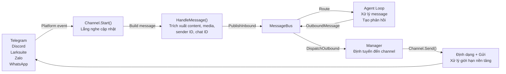
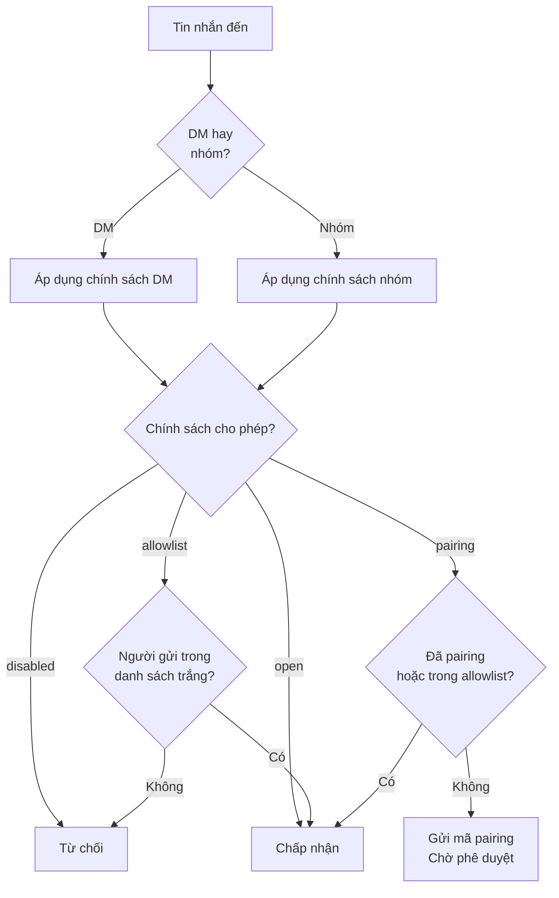

> Bản dịch từ [English version](/channels-overview)

# Tổng quan về Channel

Channel kết nối các nền tảng nhắn tin (Telegram, Discord, Larksuite, v.v.) với agent runtime của GoClaw thông qua một message bus thống nhất. Mỗi channel dịch các sự kiện đặc thù của nền tảng thành object `InboundMessage` chuẩn hoá và chuyển đổi phản hồi của agent thành output phù hợp với nền tảng đó.

## Luồng tin nhắn



## Chính sách Channel

Kiểm soát ai có thể gửi tin nhắn qua DM hoặc cài đặt nhóm.

### Chính sách DM

| Chính sách | Hành vi | Use Case |
|--------|----------|----------|
| `pairing` | Yêu cầu mã 8 ký tự để phê duyệt user mới | Truy cập an toàn, có kiểm soát |
| `allowlist` | Chỉ chấp nhận người gửi trong danh sách trắng | Nhóm hạn chế |
| `open` | Chấp nhận tất cả DM | Bot công khai |
| `disabled` | Từ chối tất cả DM | Chỉ dùng trong nhóm |

### Chính sách Nhóm

| Chính sách | Hành vi | Use Case |
|--------|----------|----------|
| `open` | Chấp nhận tất cả tin nhắn nhóm | Nhóm công khai |
| `allowlist` | Chỉ chấp nhận nhóm trong danh sách trắng | Nhóm hạn chế |
| `disabled` | Không nhận tin nhắn nhóm | Chỉ dùng DM |

### Luồng đánh giá chính sách



## Định dạng Session Key

Session key xác định cuộc trò chuyện và luồng duy nhất trên các nền tảng. Tất cả key đều theo định dạng chuẩn `agent:{agentId}:{rest}`.

| Context | Định dạng | Ví dụ |
|---------|--------|---------|
| DM | `agent:{agentId}:{channel}:direct:{peerId}` | `agent:default:telegram:direct:386246614` |
| Nhóm | `agent:{agentId}:{channel}:group:{groupId}` | `agent:default:telegram:group:-100123456` |
| Forum topic | `agent:{agentId}:{channel}:group:{groupId}:topic:{topicId}` | `agent:default:telegram:group:-100123456:topic:99` |
| DM thread | `agent:{agentId}:{channel}:direct:{peerId}:thread:{threadId}` | `agent:default:telegram:direct:386246614:thread:5` |
| Subagent | `agent:{agentId}:subagent:{label}` | `agent:default:subagent:my-task` |

## Ghi chú xử lý Media

### Media từ tin nhắn được reply

GoClaw trích xuất file đính kèm media từ tin nhắn đang được reply trên tất cả các channel có hỗ trợ reply. Khi user reply vào tin nhắn chứa hình ảnh hoặc file, các file đó được tự động đưa vào context tin nhắn đến của agent — không cần thêm bước nào.

### Giới hạn kích thước Media gửi ra

Trường config `media_max_bytes` áp đặt giới hạn kích thước upload media ra ngoài do agent gửi, theo từng channel. File vượt giới hạn sẽ bị bỏ qua và ghi log. Mỗi channel có giá trị mặc định riêng (ví dụ: 20 MB cho Telegram, 30 MB cho Feishu/Lark). Cấu hình theo từng channel nếu cần.

## So sánh Channel

| Tính năng | Telegram | Discord | Larksuite | Zalo OA | Zalo Pers | WhatsApp |
|---------|----------|---------|--------|---------|-----------|----------|
| **Transport** | Long polling | Gateway events | WS/Webhook | Long polling | Internal proto | WS bridge |
| **Hỗ trợ DM** | Có | Có | Có | Có | Có | Có |
| **Hỗ trợ nhóm** | Có | Có | Có | Không | Có | Có |
| **Streaming** | Có (typing) | Có (edit) | Có (card) | Không | Không | Không |
| **Media** | Photos, voice, files | Files, embeds | Images, files (30MB) | Images (5MB) | -- | JSON |
| **Reply media** | Có | Có | Có | -- | -- | -- |
| **Định dạng phong phú** | HTML | Markdown | Cards | Plain text | Plain text | Plain |
| **Hỗ trợ thread** | Có | -- | -- | -- | -- | -- |
| **Reaction** | Có | -- | Có | -- | -- | -- |
| **Pairing** | Có | Có | Có | Có | Có | Có |
| **Giới hạn tin nhắn** | 4,096 | 2,000 | 4,000 | 2,000 | 2,000 | N/A |

## Chẩn Đoán Sức Khỏe Kênh

GoClaw theo dõi tình trạng runtime của mỗi channel instance và cung cấp chẩn đoán hành động khi có sự cố. Trạng thái sức khỏe được cung cấp qua WebSocket method `channels.status` và trang tổng quan dashboard.

### Trạng thái sức khỏe

| Trạng thái | Ý nghĩa |
|------------|---------|
| `registered` | Channel đã cấu hình nhưng chưa khởi động |
| `starting` | Channel đang khởi tạo |
| `healthy` | Hoạt động bình thường |
| `degraded` | Hoạt động nhưng có vấn đề |
| `failed` | Đã dừng do lỗi |
| `stopped` | Dừng thủ công |

### Phân loại lỗi

Khi channel gặp lỗi, GoClaw phân loại lỗi thành một trong bốn danh mục:

| Loại | Nguyên nhân thường gặp | Cách khắc phục |
|------|------------------------|----------------|
| `auth` | Token/secret không hợp lệ hoặc hết hạn | Kiểm tra lại thông tin xác thực hoặc xác thực lại |
| `config` | Thiếu cài đặt bắt buộc, proxy không hợp lệ | Hoàn thành các trường bắt buộc trong cài đặt channel |
| `network` | Timeout, từ chối kết nối, lỗi DNS | Kiểm tra khả năng kết nối upstream và cài đặt proxy |
| `unknown` | Lỗi không nhận diện được | Kiểm tra log server để xem lỗi đầy đủ |

Mỗi lỗi bao gồm **gợi ý khắc phục** — hướng dẫn ngắn cho operator chỉ đến giao diện UI cụ thể (panel thông tin xác thực, cài đặt nâng cao, hoặc trang chi tiết) nơi có thể giải quyết vấn đề. Dashboard hiển thị các gợi ý này trực tiếp trên channel card.

### Theo dõi sức khỏe

Hệ thống sức khỏe theo dõi lịch sử lỗi theo từng channel:
- **Số lần lỗi liên tiếp** — reset khi channel phục hồi
- **Tổng số lần lỗi** — bộ đếm trọn đời
- **Thời điểm lỗi đầu tiên/cuối cùng** — để chẩn đoán vấn đề không liên tục
- **Thời điểm healthy cuối cùng** — khi channel hoạt động lần cuối

---

## Checklist triển khai

Khi thêm channel mới, hãy implement các method sau:

- **`Name()`** — Trả về định danh channel (ví dụ: `"telegram"`)
- **`Start(ctx)`** — Bắt đầu lắng nghe tin nhắn
- **`Stop(ctx)`** — Dừng graceful
- **`Send(ctx, msg)`** — Gửi tin nhắn đến nền tảng
- **`IsRunning()`** — Báo cáo trạng thái đang chạy
- **`IsAllowed(senderID)`** — Kiểm tra allowlist

Interface tuỳ chọn:

- **`StreamingChannel`** — Cập nhật tin nhắn theo thời gian thực (chunks, typing indicator)
- **`ReactionChannel`** — Emoji reaction trạng thái (thinking, done, error)
- **`WebhookChannel`** — HTTP handler có thể mount trên gateway mux chính
- **`BlockReplyChannel`** — Ghi đè cài đặt block_reply của gateway

## Pattern phổ biến

### Xử lý tin nhắn

Tất cả channel dùng `BaseChannel.HandleMessage()` để chuyển tiếp tin nhắn đến bus:

```go
ch.HandleMessage(
    senderID,        // "telegram:123" hoặc "discord:456@guild"
    chatID,          // nơi gửi phản hồi
    content,         // văn bản của user
    media,           // URL/đường dẫn file
    metadata,        // gợi ý định tuyến
    "direct",        // hoặc "group"
)
```

### Khớp Allowlist

Hỗ trợ sender ID ghép như `"123|username"`. Allowlist có thể chứa:

- User ID: `"123456"`
- Username: `"@alice"`
- Ghép: `"123456|alice"`
- Wildcard: Không hỗ trợ

### Rate Limiting

Channel có thể áp dụng giới hạn tốc độ theo từng user. Cấu hình qua cài đặt channel hoặc implement logic tuỳ chỉnh.

## Tiếp theo

- [Telegram](/channel-telegram) — Hướng dẫn đầy đủ tích hợp Telegram
- [Discord](/channel-discord) — Thiết lập Discord bot
- [Larksuite](/channel-feishu) — Tích hợp Larksuite với streaming card
- [WebSocket](/channel-websocket) — Agent API trực tiếp qua WS
- [Browser Pairing](/channel-browser-pairing) — Luồng pairing bằng mã 8 ký tự

<!-- goclaw-source: c5bfbc96 | cập nhật: 2026-04-02 -->
