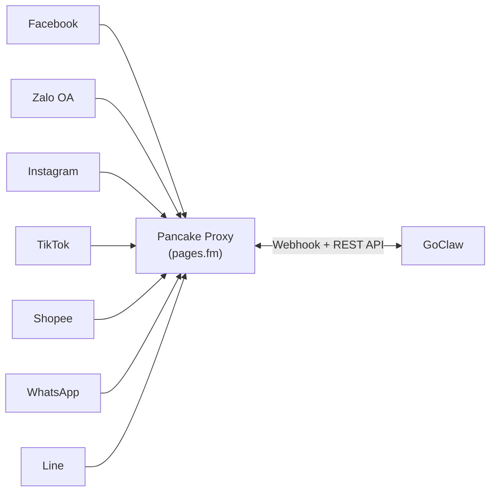

> Bản dịch từ [English version](/channel-pancake)

# Kênh Pancake

Proxy kênh đa nền tảng thống nhất được cung cấp bởi Pancake (pages.fm). Một API key Pancake duy nhất cho phép truy cập Facebook, Zalo OA, Instagram, TikTok, WhatsApp và Line — không cần OAuth riêng cho từng nền tảng.

## Pancake là gì?

Pancake là nền tảng thương mại xã hội cung cấp proxy nhắn tin thống nhất trên nhiều mạng xã hội. Thay vì tích hợp từng API nền tảng riêng lẻ, GoClaw kết nối với Pancake một lần và tiếp cận người dùng trên tất cả nền tảng kết nối thông qua một channel instance duy nhất.

## Nền tảng hỗ trợ

| Nền tảng | Độ dài tin nhắn tối đa | Định dạng |
|----------|----------------------|-----------|
| Facebook | 2.000 | Văn bản thuần (loại bỏ markdown) |
| Zalo OA | 2.000 | Văn bản thuần (loại bỏ markdown) |
| Instagram | 1.000 | Văn bản thuần (loại bỏ markdown) |
| TikTok | 500 | Văn bản thuần, cắt ngắn ở 500 ký tự |
| Shopee | 500 | Văn bản thuần, cắt ngắn ở 500 ký tự |
| WhatsApp | 4.096 | Định dạng WhatsApp gốc (*in đậm*, _in nghiêng_) |
| Line | 5.000 | Văn bản thuần (loại bỏ markdown) |

## Cài đặt

### Cài đặt phía Pancake

1. Tạo tài khoản Pancake tại [pages.fm](https://pages.fm)
2. Kết nối các trang mạng xã hội (Facebook, Zalo OA, v.v.) với Pancake
3. Tạo Pancake API key từ cài đặt tài khoản
4. Ghi lại Page ID từ Pancake dashboard

### Cài đặt phía GoClaw

1. **Channels > Add Channel > Pancake**
2. Nhập thông tin xác thực:
   - **API Key**: API key cấp người dùng của Pancake
   - **Page Access Token**: Token cấp trang cho tất cả page API
   - **Page ID**: Định danh trang Pancake
3. Tùy chọn đặt **Webhook Secret** để xác minh chữ ký HMAC-SHA256
4. Cấu hình tính năng theo nền tảng (inbox reply, comment reply)

Chỉ vậy thôi — một channel phục vụ tất cả nền tảng kết nối với trang Pancake đó.

### Cài đặt qua file config

Dành cho channel dựa trên config file (thay vì DB instance):

```json
{
  "channels": {
    "pancake": {
      "enabled": true,
      "instances": [
        {
          "name": "my-facebook-page",
          "credentials": {
            "api_key": "your_pancake_api_key",
            "page_access_token": "your_page_access_token",
            "webhook_secret": "optional_hmac_secret"
          },
          "config": {
            "page_id": "your_page_id",
            "features": {
              "inbox_reply": true,
              "comment_reply": true,
              "private_reply": false,
              "first_inbox": true,
              "auto_react": false
            },
            "private_reply_message": "Cảm ơn {{commenter_name}} đã bình luận! Chúng tôi sẽ DM bạn ngay.",
            "comment_reply_options": {
              "include_post_context": true,
              "filter": "all"
            }
          }
        }
      ]
    }
  }
}
```

## Cấu hình

| Key | Kiểu | Mặc định | Mô tả |
|-----|------|----------|-------|
| `api_key` | string | -- | API key cấp người dùng của Pancake (bắt buộc) |
| `page_access_token` | string | -- | Token cấp trang cho tất cả page API (bắt buộc) |
| `webhook_secret` | string | -- | Secret xác minh HMAC-SHA256 tùy chọn |
| `page_id` | string | -- | Định danh trang Pancake (bắt buộc) |
| `webhook_page_id` | string | -- | Page ID nền tảng gốc trong webhook (nếu khác `page_id`) |
| `platform` | string | tự phát hiện | Ghi đè nền tảng: facebook/zalo/instagram/tiktok/shopee/whatsapp/line |
| `features.inbox_reply` | bool | -- | Bật trả lời tin nhắn inbox |
| `features.comment_reply` | bool | -- | Bật trả lời bình luận |
| `features.private_reply` | bool | -- | Gửi một DM một lần cho người bình luận sau khi reply comment (stateless, không cần DB) |
| `features.auto_react` | bool | -- | Tự động thích bình luận của người dùng trên Facebook (chỉ Facebook) |
| `auto_react_options.allow_post_ids` | list | -- | Chỉ react bình luận trên các post ID này (nil = tất cả bài đăng) |
| `auto_react_options.deny_post_ids` | list | -- | Không bao giờ react trên các post ID này (ghi đè allow) |
| `auto_react_options.allow_user_ids` | list | -- | Chỉ react bình luận từ các user ID này (nil = tất cả người dùng) |
| `auto_react_options.deny_user_ids` | list | -- | Không bao giờ react bình luận từ các user ID này (ghi đè allow) |
| `comment_reply_options.include_post_context` | bool | false | Thêm nội dung bài đăng gốc vào đầu comment gửi cho agent |
| `comment_reply_options.filter` | string | `"all"` | Chế độ lọc bình luận: `"all"` hoặc `"keyword"` |
| `comment_reply_options.keywords` | list | -- | Bắt buộc khi `filter="keyword"` — chỉ xử lý bình luận chứa các từ khóa này |
| `private_reply_message` | string | mặc định EN | Template DM gửi cho `features.private_reply`. Hỗ trợ biến `{{commenter_name}}` và `{{post_title}}`. Nếu để trống, dùng thông báo tiếng Anh mặc định. |
| `first_inbox_message` | string | mặc định | Nội dung DM tùy chỉnh gửi cho tính năng first inbox |
| `post_context_cache_ttl` | string | `"15m"` | TTL cache nội dung bài đăng lấy cho context bình luận (ví dụ `"30m"`) |
| `block_reply` | bool | -- | Ghi đè gateway block_reply (nil=kế thừa) |
| `allow_from` | list | -- | Danh sách trắng User/Group ID |

## Kiến trúc



- **Một channel instance = một trang Pancake** (phục vụ nhiều nền tảng)
- **Nền tảng tự phát hiện** tại Start() từ metadata trang Pancake
- **Dựa trên Webhook** — không polling, server Pancake đẩy sự kiện đến GoClaw
- Một HTTP handler duy nhất tại `/channels/pancake/webhook` định tuyến đến đúng channel theo page_id

## Tính năng

### Hỗ trợ đa nền tảng

Một Pancake channel instance có thể phục vụ nhiều nền tảng đồng thời. Nền tảng được xác định bởi metadata trang Pancake:

- Tại Start(), GoClaw gọi `GET /pages` để liệt kê tất cả trang và khớp với page_id đã cấu hình
- Trường `platform` (facebook/zalo/instagram/tiktok/shopee/whatsapp/line) được lấy từ metadata trang
- Nếu nền tảng không được cấu hình hoặc phát hiện thất bại, mặc định là "facebook" với giới hạn 2.000 ký tự

### Webhook Delivery

Pancake dùng webhook push (không polling) để gửi tin nhắn:

- GoClaw đăng ký một route duy nhất: `POST /channels/pancake/webhook`
- Tất cả webhook trang Pancake định tuyến qua một handler, phân phối theo `page_id`
- Luôn trả về HTTP 200 — Pancake tạm dừng webhook nếu >80% lỗi trong cửa sổ 30 phút
- Xác minh chữ ký HMAC-SHA256 qua header `X-Pancake-Signature` (khi `webhook_secret` được đặt)

Cấu trúc webhook payload:

```json
{
  "event_type": "messaging",
  "page_id": "your_page_id",
  "data": {
    "conversation": {
      "id": "pageID_senderID",
      "type": "INBOX",
      "from": { "id": "sender_id", "name": "Sender Name" },
      "assignee_ids": ["staff_id_1"]
    },
    "message": {
      "id": "msg_unique_id",
      "message": "Hello from customer",
      "attachments": [{ "type": "image", "url": "https://..." }]
    }
  }
}
```

Chỉ xử lý sự kiện hội thoại `INBOX`. Sự kiện `COMMENT` bị bỏ qua trừ khi bật `comment_reply`.

#### Webhook Shopee

Shopee dùng định dạng conversation ID khác: `spo_{page_numeric}_{sender_id}`. GoClaw tự động nhận diện prefix `spo_` và tách `page_id` dạng `spo_{page_numeric}`:

```json
{
  "event_type": "messaging",
  "data": {
    "conversation": {
      "id": "spo_25409726_109139680425439630",
      "type": "INBOX",
      "from": { "id": "109139680425439630", "name": "Test Buyer" }
    },
    "message": {
      "id": "spo_msg_1",
      "content": "Shop oi con hang khong?"
    }
  }
}
```

Dedup Shopee hoạt động ở webhook-level (giống TikTok) — dựa vào `message_id` trong payload, không dùng DB state.

### Loại trùng lặp tin nhắn

Pancake dùng at-least-once delivery, vì vậy các webhook delivery trùng lặp là bình thường:

- **Dedup tin nhắn**: `sync.Map` theo key `msg:{message_id}` với TTL 24 giờ (inbox) hoặc `comment:{message_id}` (comment)
- **Phát hiện echo đi**: Lưu trước fingerprint tin nhắn trước khi gửi, triệt tiêu webhook echo của chính chúng ta (TTL 45 giây)
- Background cleaner xóa các mục hết hạn mỗi 5 phút để tránh tốn bộ nhớ
- Tin nhắn thiếu `message_id` bỏ qua dedup (tránh va chạm slot chung)
- **TikTok và Shopee**: dedup ở webhook-level; không cần thêm DB state

### Ngăn vòng lặp trả lời

Nhiều lớp bảo vệ ngăn bot trả lời chính tin nhắn của mình:

1. **Lọc tin nhắn tự gửi của trang**: Bỏ qua tin nhắn có `sender_id == page_id`
2. **Lọc nhân viên được phân công**: Bỏ qua tin nhắn từ nhân viên Pancake được phân công cho hội thoại
3. **Phát hiện echo đi**: Khớp nội dung đến với các tin nhắn vừa gửi

### Hỗ trợ media

**Media nhận vào**: Attachment đến dưới dạng URL trong webhook payload. GoClaw đưa chúng trực tiếp vào nội dung tin nhắn chuyển đến agent pipeline.

**Media gửi ra**: File được upload qua `POST /pages/{id}/upload_contents` (multipart/form-data), sau đó gửi dưới dạng `content_ids` trong một API call riêng. Media và văn bản được gửi tuần tự:

1. Upload media file, thu thập attachment ID
2. Gửi attachment message với content_ids
3. Tiếp theo là tin nhắn văn bản (nếu có)

Nếu upload media thất bại, phần văn bản vẫn được gửi kèm cảnh báo. Đường dẫn media phải tuyệt đối để tránh directory traversal.

### Định dạng tin nhắn

Output của LLM được chuyển từ Markdown sang định dạng phù hợp với nền tảng:

| Nền tảng | Hành vi |
|----------|---------|
| Facebook | Loại bỏ markdown, giữ văn bản thuần (Messenger không hỗ trợ định dạng phong phú) |
| WhatsApp | Chuyển `**in đậm**` thành `*in đậm*`, giữ `_in nghiêng_`, loại bỏ header |
| TikTok | Loại bỏ markdown + cắt ngắn ở 500 rune |
| Shopee | Loại bỏ markdown + cắt ngắn ở 500 rune (giống TikTok) |
| Instagram / Zalo / Line | Loại bỏ tất cả markdown, trả về văn bản thuần |

Tin nhắn dài tự động được chia nhỏ theo giới hạn ký tự của từng nền tảng. Chia theo rune (không theo byte) đảm bảo các ký tự đa byte (CJK, tiếng Việt, emoji) không bị hỏng.

### Chế độ Inbox và Comment

Pancake hỗ trợ hai loại hội thoại:

- **INBOX**: Tin nhắn trực tiếp từ người dùng (mặc định, luôn được xử lý)
- **COMMENT**: Bình luận trên bài đăng xã hội (kiểm soát bởi feature flag `comment_reply`)

Loại hội thoại được lưu trong metadata tin nhắn dưới dạng `pancake_mode` ("inbox" hoặc "comment"), cho phép agent phản hồi khác nhau tùy theo nguồn.

### Tính năng bình luận

Khi `features.comment_reply: true`, các tùy chọn bổ sung kiểm soát xử lý bình luận:

**Lọc bình luận** (`comment_reply_options.filter`):
- `"all"` (mặc định) — xử lý tất cả bình luận
- `"keyword"` — chỉ xử lý bình luận chứa một trong các `keywords` đã cấu hình

**Post context** (`comment_reply_options.include_post_context: true`): lấy nội dung bài đăng gốc và thêm vào đầu nội dung bình luận trước khi gửi cho agent. Hữu ích khi bình luận quá ngắn để hiểu mà không có ngữ cảnh. Nội dung bài đăng được cache (TTL mặc định: 15 phút, cấu hình qua `post_context_cache_ttl`).

**Auto-react** (`features.auto_react: true`): tự động thích mọi bình luận hợp lệ đến trên Facebook (chỉ nền tảng Facebook). Hoạt động độc lập với `comment_reply` — có thể react mà không cần reply.

Giới hạn phạm vi react bằng `auto_react_options`:

| Trường | Kiểu | Hành vi |
|--------|------|---------|
| `allow_post_ids` | list | Chỉ react bình luận trên các post ID này (nil = tất cả bài đăng) |
| `deny_post_ids` | list | Không bao giờ react trên các post ID này (ghi đè allow) |
| `allow_user_ids` | list | Chỉ react bình luận từ các user ID này (nil = tất cả người dùng) |
| `deny_user_ids` | list | Không bao giờ react bình luận từ các user ID này (ghi đè allow) |

Danh sách deny luôn được ưu tiên hơn danh sách allow. Bỏ qua `auto_react_options` hoàn toàn nghĩa là không có lọc phạm vi (react tất cả bình luận hợp lệ).

**First inbox** (`features.first_inbox: true`): sau khi reply bình luận, gửi một DM chào mời một lần cho người bình luận qua first-inbox flow. Chỉ gửi một lần mỗi người dùng mỗi lần khởi động lại. Tùy chỉnh nội dung DM bằng `first_inbox_message`.

### Private Reply (Stateless DM)

`features.private_reply: true` gửi một DM riêng tư đến người bình luận ngay sau khi reply comment công khai — không cần bảng DB hay trạng thái in-memory.

**Cơ chế idempotency**: Dựa vào webhook-level comment dedup (phía trên) và Facebook's per-comment `private_replies` endpoint — Facebook trả về lỗi nếu DM đã được gửi cho comment đó, GoClaw log cảnh báo và tiếp tục.

**Template message**: Cấu hình qua `private_reply_message` với các biến:

| Biến | Nội dung |
|------|---------|
| `{{commenter_name}}` | Tên hiển thị của người bình luận (đã sanitize) |
| `{{post_title}}` | Nội dung bài đăng liên quan (lấy từ post cache) |

Biến được thay thế literal — giá trị bị pre-sanitize (xóa `{{` và `}}`) để ngăn template injection. Nếu `private_reply_message` để trống, dùng thông báo tiếng Anh mặc định: `"Thanks for your comment! We'll DM you shortly."`

**Private reply khác first inbox như thế nào:**

| | `private_reply` | `first_inbox` |
|-|----------------|--------------|
| Trigger | Mỗi lần reply comment | Lần đầu tiên mỗi user (per restart) |
| Idempotency | FB API + webhook dedup (stateless) | In-memory set per restart |
| Config key | `private_reply_message` | `first_inbox_message` |

### Tình trạng kênh

Lỗi API được ánh xạ sang trạng thái tình trạng kênh:

| Loại lỗi | HTTP Code | Trạng thái |
|----------|-----------|------------|
| Lỗi xác thực | 401, 403, 4001, 4003 | Failed (token hết hạn hoặc không hợp lệ) |
| Bị giới hạn tốc độ | 429, 4029 | Degraded (có thể phục hồi) |
| Lỗi API không xác định | Các mã khác | Degraded (có thể phục hồi) |

Lỗi ở tầng ứng dụng (HTTP 200 với `success: false` trong JSON body) cũng được phát hiện và coi là lỗi gửi.

## Xử lý sự cố

| Sự cố | Giải pháp |
|-------|-----------|
| "api_key is required" khi khởi động | Thêm `api_key` vào credentials. Lấy từ cài đặt tài khoản Pancake. |
| "page_access_token is required" | Thêm `page_access_token` vào credentials. Đây là token cấp trang từ Pancake. |
| "page_id is required" | Thêm `page_id` vào config. Tìm trong URL Pancake dashboard. |
| Xác minh token thất bại | `page_access_token` có thể đã hết hạn hoặc không hợp lệ. Tạo lại từ Pancake dashboard. |
| Không nhận được tin nhắn | Kiểm tra webhook URL đã được cấu hình: `https://your-goclaw-host/channels/pancake/webhook`. |
| Webhook signature không khớp | Xác minh `webhook_secret` khớp với secret đã cấu hình trong Pancake dashboard. |
| "no channel instance for page_id" | `page_id` trong webhook không khớp với channel nào đã đăng ký. Kiểm tra config. |
| Nền tảng hiển thị là unknown | `platform` được tự phát hiện. Đảm bảo trang đã kết nối trong Pancake. Có thể ghi đè thủ công. |
| Upload media thất bại | Đường dẫn media phải tuyệt đối. Kiểm tra file tồn tại và có thể đọc. |
| Tin nhắn bị trùng lặp | Đây là bình thường — dedup xử lý. Nếu vẫn tiếp diễn, kiểm tra xem Pancake webhook config có bị đăng ký đôi không. |

## Tiếp theo

- [Tổng quan kênh](/channels-overview) — Khái niệm và chính sách kênh
- [WhatsApp](/channel-whatsapp) — Tích hợp WhatsApp trực tiếp
- [Telegram](/channel-telegram) — Cài đặt Telegram bot
- [Cài đặt đa kênh](/recipe-multi-channel) — Cấu hình nhiều kênh

<!-- goclaw-source: 29457bb3 | cập nhật: 2026-04-25 -->
