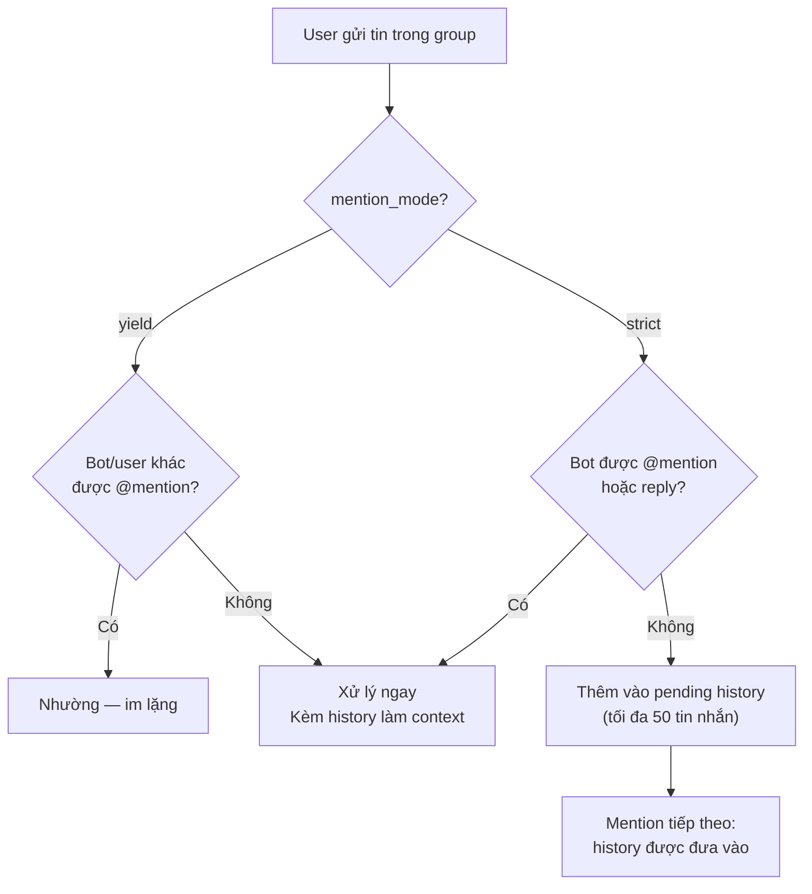

> Bản dịch từ [English version](#channel-telegram)

# Channel Telegram

Tích hợp Telegram bot qua long polling (Bot API). Hỗ trợ DM, nhóm, forum topic, chuyển giọng nói thành văn bản, và phản hồi streaming.

## Thiết lập

**Tạo Telegram Bot:**
1. Nhắn tin @BotFather trên Telegram
2. `/newbot` → chọn tên và username
3. Sao chép token (định dạng: `123456:ABCDEFGHIJKLMNOPQRSTUVWxyz...`)

> **Quan trọng — Group Privacy Mode:** Mặc định, Telegram bot chạy ở **privacy mode** và chỉ nhận được command (`/`) và @mention trong group. Để bot đọc được tất cả tin nhắn trong group (cần thiết cho history buffer, `require_mention: false`, và group context), nhắn **@BotFather** → `/setprivacy` → chọn bot → **Disable**. Nếu không, bot sẽ bỏ qua hầu hết tin nhắn trong group.

**Bật Telegram:**

```json
{
  "channels": {
    "telegram": {
      "enabled": true,
      "token": "YOUR_BOT_TOKEN",
      "dm_policy": "pairing",
      "group_policy": "open",
      "allow_from": ["alice", "bob"]
    }
  }
}
```

## Cấu hình

Tất cả config key nằm trong `channels.telegram`:

| Key | Kiểu | Mặc định | Mô tả |
|-----|------|---------|-------------|
| `enabled` | bool | false | Bật/tắt channel |
| `token` | string | bắt buộc | Bot API token từ BotFather |
| `proxy` | string | -- | HTTP proxy (ví dụ: `http://proxy:8080`) |
| `allow_from` | list | -- | Allowlist user ID hoặc username |
| `dm_policy` | string | `"pairing"` | `pairing`, `allowlist`, `open`, `disabled` |
| `group_policy` | string | `"open"` | `open`, `allowlist`, `disabled` |
| `require_mention` | bool | true | Yêu cầu mention @bot trong group |
| `mention_mode` | string | `"strict"` | `strict` = chỉ phản hồi khi @mention; `yield` = phản hồi trừ khi bot khác được @mention (group nhiều bot) |
| `history_limit` | int | 50 | Tin nhắn chờ tối đa mỗi nhóm (0=tắt) |
| `dm_stream` | bool | false | Bật streaming cho DM (chỉnh sửa placeholder) |
| `group_stream` | bool | false | Bật streaming cho nhóm (tin nhắn mới) |
| `draft_transport` | bool | false | Dùng `sendMessageDraft` cho DM streaming (stealth preview, không thông báo mỗi lần edit) |
| `reasoning_stream` | bool | true | Hiển thị reasoning token dưới dạng tin nhắn riêng trước câu trả lời |
| `block_reply` | bool | -- | Ghi đè cài đặt `block_reply` của gateway cho channel này (nil = kế thừa) |
| `reaction_level` | string | `"off"` | `off`, `minimal` (chỉ ⏳), `full` (⏳💬🛠️✅❌🔄) |
| `media_max_bytes` | int | 20MB | Kích thước file media tối đa |
| `link_preview` | bool | true | Hiển thị xem trước URL |
| `force_ipv4` | bool | false | Bắt buộc dùng IPv4 cho tất cả kết nối Telegram API |
| `api_server` | string | -- | URL server Telegram Bot API tuỳ chỉnh (ví dụ: `http://localhost:8081`) |
| `stt_proxy_url` | string | -- | URL dịch vụ STT (để chuyển giọng nói thành văn bản) |
| `stt_api_key` | string | -- | Bearer token cho STT proxy |
| `stt_timeout_seconds` | int | 30 | Timeout cho request STT |
| `voice_agent_id` | string | -- | Định tuyến voice message đến agent cụ thể |

**Giới hạn upload media**: Trường `media_max_bytes` áp đặt hard limit cho outbound media upload do agent gửi (mặc định 20 MB). File vượt giới hạn bị skip và ghi log. Không ảnh hưởng đến inbound media từ user.

## Cấu hình nhóm

Ghi đè cài đặt theo từng nhóm (và theo topic) dùng object `groups`.

```json
{
  "channels": {
    "telegram": {
      "token": "...",
      "groups": {
        "-100123456789": {
          "group_policy": "allowlist",
          "allow_from": ["@alice", "@bob"],
          "require_mention": false,
          "topics": {
            "42": {
              "require_mention": true,
              "tools": ["web_search", "file_read"],
              "system_prompt": "You are a research assistant."
            }
          }
        },
        "*": {
          "system_prompt": "Global system prompt for all groups."
        }
      }
    }
  }
}
```

Các config key cho nhóm:

- `group_policy` — Ghi đè chính sách cấp nhóm
- `allow_from` — Ghi đè allowlist
- `require_mention` — Ghi đè yêu cầu mention
- `mention_mode` — Ghi đè mention mode (`strict` hoặc `yield`)
- `skills` — Whitelist skill (nil=tất cả, []=không có)
- `tools` — Whitelist tool (hỗ trợ cú pháp `group:xxx`)
- `system_prompt` — Extra system prompt cho nhóm này
- `topics` — Ghi đè theo topic (key: topic/thread ID)

## Tính năng

### Mention Gating

Trong group, bot chỉ phản hồi tin nhắn có mention nó (mặc định `require_mention: true`). Khi không được mention, tin nhắn được lưu vào pending history buffer (mặc định 50 tin nhắn) và được đưa vào context khi bot được mention. Reply vào tin nhắn của bot được tính là mention.

#### Mention Mode

| Mode | Hành vi | Trường hợp sử dụng |
|------|---------|---------------------|
| `strict` (mặc định) | Chỉ phản hồi khi @mention hoặc reply | Group có 1 bot |
| `yield` | Phản hồi tất cả tin nhắn TRỪ KHI bot/user khác được @mention | Group nhiều bot |

**Yield mode** cho phép nhiều bot cùng hoạt động trong một group:
- Bot phản hồi tất cả tin nhắn khi không có @mention cụ thể nhắm đến bot khác
- Nếu user @mention bot khác, bot này im lặng (nhường)
- Tin nhắn từ bot khác tự động bị bỏ qua để tránh vòng lặp vô hạn giữa các bot
- Cross-bot @command vẫn hoạt động (ví dụ: `@my_bot help` gửi bởi bot khác)

```json
{
  "channels": {
    "telegram": {
      "mention_mode": "yield",
      "require_mention": false
    }
  }
}
```



### Group Concurrency

Group session hỗ trợ tối đa **3 agent run đồng thời**. Khi đạt giới hạn này, các tin nhắn tiếp theo sẽ được xếp hàng chờ. Áp dụng cho tất cả group context và forum topic.

### Forum Topic

Cấu hình hành vi bot theo từng forum topic:

| Khía cạnh | Key | Ví dụ |
|--------|-----|---------|
| Topic ID | Chat ID + topic ID | `-12345:topic:99` |
| Tra cứu config | Merge theo lớp | Global → Wildcard → Group → Topic |
| Giới hạn tool | `tools: ["web_search"]` | Chỉ web search trong topic |
| Extra prompt | `system_prompt` | Hướng dẫn dành riêng cho topic |

### Định dạng tin nhắn

Markdown output được chuyển đổi sang Telegram HTML với escape đúng chuẩn:

```
LLM output (Markdown)
  → Trích xuất bảng/code → Chuyển Markdown sang HTML
  → Khôi phục placeholder → Chunk theo 4,000 ký tự
  → Gửi dạng HTML (fallback: plain text)
```

Bảng được render dạng ASCII trong tag `<pre>`. Ký tự CJK được tính là chiều rộng 2 cột.

### Speech-to-Text (STT)

Voice và audio message có thể được chuyển thành văn bản:

```json
{
  "channels": {
    "telegram": {
      "stt_proxy_url": "https://stt.example.com",
      "stt_api_key": "sk-...",
      "stt_timeout_seconds": 30,
      "voice_agent_id": "voice_assistant"
    }
  }
}
```

Khi user gửi voice message:
1. File được tải xuống từ Telegram
2. Gửi đến STT proxy dạng multipart (file + tenant_id)
3. Transcript được thêm vào đầu tin nhắn: `[audio: filename] Transcript: text`
4. Định tuyến đến `voice_agent_id` nếu được cấu hình, ngược lại đến agent mặc định

### Streaming

Bật cập nhật phản hồi trực tiếp:

- **DM** (`dm_stream`): Edit placeholder "Thinking..." khi từng chunk đến. Mặc định dùng `sendMessage+editMessageText`; đặt `draft_transport: true` để dùng `sendMessageDraft` (stealth preview, không thông báo mỗi lần edit, nhưng có thể gây lỗi "reply to deleted message" trên một số client).
- **Group** (`group_stream`): Gửi placeholder, edit với phản hồi đầy đủ

Mặc định tắt. Khi bật với `reasoning_stream: true` (mặc định), reasoning token hiển thị dưới dạng tin nhắn riêng trước câu trả lời cuối cùng.

### Reaction

Hiển thị trạng thái emoji trên tin nhắn user. Đặt `reaction_level`:

> Typing indicator reaction giờ có error recovery tốt hơn — invalid reaction type được handle gracefully thay vì gây lỗi.

- `off` — Không có reaction
- `minimal` — Chỉ ⏳ (đang suy nghĩ)
- `full` — ⏳ (suy nghĩ) → 🛠️ (dùng tool) → ✅ (xong) hoặc ❌ (lỗi)

### Lệnh Bot

Lệnh được xử lý trước bước message enrichment:

| Lệnh | Hành vi | Hạn chế |
|---------|----------|-----------|
| `/help` | Hiển thị danh sách lệnh | -- |
| `/start` | Chuyển tiếp đến agent | -- |
| `/stop` | Huỷ lần chạy hiện tại | -- |
| `/stopall` | Huỷ tất cả lần chạy | -- |
| `/reset` | Xoá lịch sử session | Chỉ Writer |
| `/status` | Trạng thái bot + username | -- |
| `/tasks` | Danh sách task của team | -- |
| `/task_detail <id>` | Xem task | -- |
| `/addwriter` | Thêm file writer nhóm | Chỉ Writer |
| `/removewriter` | Xoá file writer nhóm | Chỉ Writer |
| `/writers` | Liệt kê writer nhóm | -- |

Writer là thành viên nhóm được phép chạy lệnh nhạy cảm (`/reset`, ghi file). Quản lý qua `/addwriter` và `/removewriter` (reply vào tin nhắn của user mục tiêu).

## Network Isolation

Mỗi Telegram instance duy trì HTTP transport riêng biệt — không share connection pool giữa các bot. Điều này ngăn cross-bot contention và cho phép network routing theo từng account.

| Tuỳ chọn | Mặc định | Mô tả |
|--------|---------|-------------|
| `force_ipv4` | false | Bắt buộc dùng IPv4 cho tất cả connection. Hữu ích cho sticky routing hoặc khi IPv6 bị lỗi/chặn. |
| `proxy` | -- | URL HTTP proxy cho instance bot này (ví dụ: `http://proxy:8080`). |
| `api_server` | -- | Server Telegram Bot API tuỳ chỉnh. Hữu ích với local Bot API server hoặc private deployment. |

**Sticky IPv4 fallback**: Khi `force_ipv4: true`, dialer được lock vào `tcp4` lúc khởi động, đảm bảo source IP nhất quán cho tất cả request đến Telegram. Hữu ích cho rate limit management trong môi trường có IPv6 không ổn định.

```json
{
  "channels": {
    "telegram": {
      "token": "...",
      "force_ipv4": true,
      "proxy": "http://proxy.example.com:8080",
      "api_server": "http://localhost:8081"
    }
  }
}
```

## Xử lý sự cố

| Vấn đề | Giải pháp |
|-------|----------|
| Bot không phản hồi trong group | Đảm bảo đã tắt privacy mode qua @BotFather (`/setprivacy` → Disable). Kiểm tra `require_mention=true` (mặc định) — mention bot hoặc reply vào tin nhắn của nó. Với group nhiều bot, thử `mention_mode: "yield"`. |
| Tải media thất bại | Xác minh bot đã Disable privacy mode trong @BotFather (`/setprivacy` → Disable). Kiểm tra giới hạn `media_max_bytes`. |
| Thiếu transcript STT | Xác minh URL proxy STT và API key. Kiểm tra log về timeout. |
| Streaming không hoạt động | Bật `dm_stream` hoặc `group_stream`. Đảm bảo provider hỗ trợ streaming. |
| Định tuyến topic thất bại | Kiểm tra topic ID trong config key (integer thread ID). Generic topic (ID=1) bị loại bỏ trong Telegram API. |

## Tiếp theo

- [Tổng quan](#channels-overview) — Khái niệm và chính sách channel
- [Discord](#channel-discord) — Thiết lập Discord bot
- [Browser Pairing](#channel-browser-pairing) — Luồng pairing
- [Sessions & History](#sessions-and-history) — Lịch sử cuộc trò chuyện

<!-- goclaw-source: 0dab087f | cập nhật: 2026-03-26 -->
