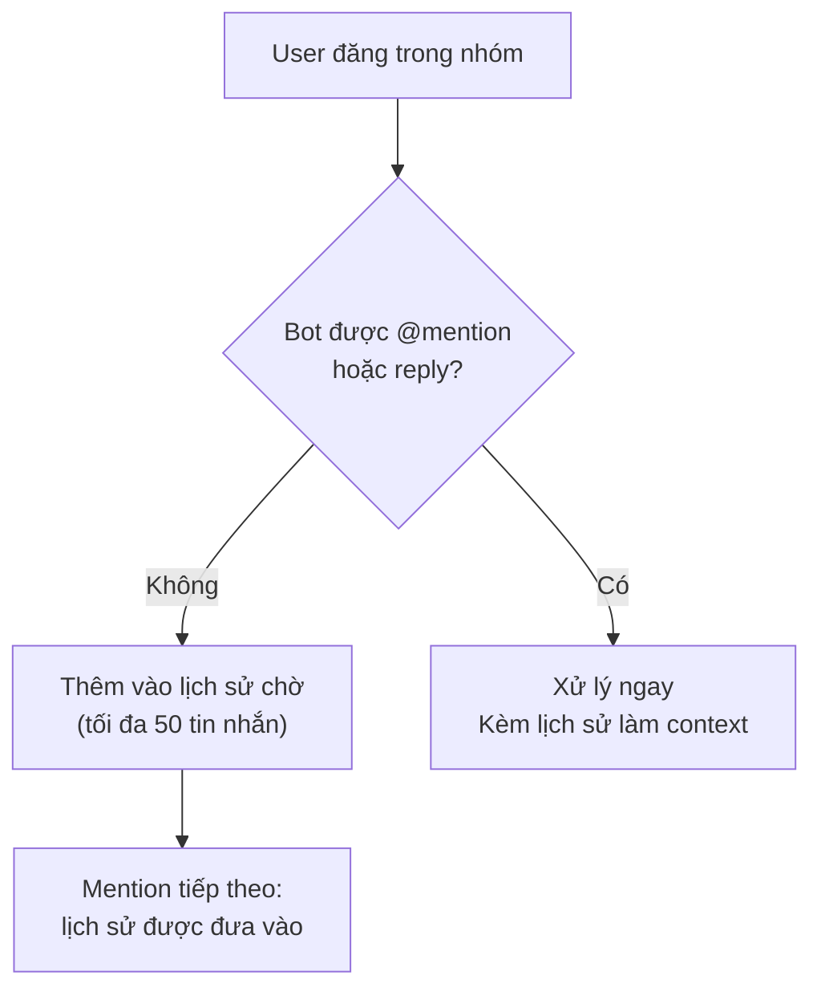

> Bản dịch từ [English version](#channel-telegram)

# Channel Telegram

Tích hợp Telegram bot qua long polling (Bot API). Hỗ trợ DM, nhóm, forum topic, chuyển giọng nói thành văn bản, và phản hồi streaming.

## Thiết lập

**Tạo Telegram Bot:**
1. Nhắn tin @BotFather trên Telegram
2. `/newbot` → chọn tên và username
3. Sao chép token (định dạng: `123456:ABCDEFGHIJKLMNOPQRSTUVWxyz...`)

**Bật Telegram:**

```json
{
  "channels": {
    "telegram": {
      "enabled": true,
      "token": "YOUR_BOT_TOKEN",
      "dm_policy": "pairing",
      "group_policy": "open",
      "allow_from": ["alice", "bob"]
    }
  }
}
```

## Cấu hình

Tất cả config key nằm trong `channels.telegram`:

| Key | Kiểu | Mặc định | Mô tả |
|-----|------|---------|-------------|
| `enabled` | bool | false | Bật/tắt channel |
| `token` | string | bắt buộc | Bot API token từ BotFather |
| `proxy` | string | -- | HTTP proxy (ví dụ: `http://proxy:8080`) |
| `allow_from` | list | -- | Danh sách trắng user ID hoặc username |
| `dm_policy` | string | `"pairing"` | `pairing`, `allowlist`, `open`, `disabled` |
| `group_policy` | string | `"open"` | `open`, `allowlist`, `disabled` |
| `require_mention` | bool | true | Yêu cầu mention @bot trong nhóm |
| `history_limit` | int | 50 | Tin nhắn chờ tối đa mỗi nhóm (0=tắt) |
| `dm_stream` | bool | false | Bật streaming cho DM (chỉnh sửa placeholder) |
| `group_stream` | bool | false | Bật streaming cho nhóm (tin nhắn mới) |
| `reaction_level` | string | `"off"` | `off`, `minimal` (chỉ ⏳), `full` (⏳💬🛠️✅❌🔄) |
| `media_max_bytes` | int | 20MB | Kích thước file media tối đa |
| `link_preview` | bool | true | Hiển thị xem trước URL |
| `stt_proxy_url` | string | -- | URL dịch vụ STT (để chuyển giọng nói thành văn bản) |
| `stt_api_key` | string | -- | Bearer token cho STT proxy |
| `stt_timeout_seconds` | int | 30 | Timeout cho request STT |
| `voice_agent_id` | string | -- | Định tuyến voice message đến agent cụ thể |

## Cấu hình nhóm

Ghi đè cài đặt theo từng nhóm (và theo topic) dùng object `groups`.

```json
{
  "channels": {
    "telegram": {
      "token": "...",
      "groups": {
        "-100123456789": {
          "group_policy": "allowlist",
          "allow_from": ["@alice", "@bob"],
          "require_mention": false,
          "topics": {
            "42": {
              "require_mention": true,
              "tools": ["web_search", "file_read"],
              "system_prompt": "You are a research assistant."
            }
          }
        },
        "*": {
          "system_prompt": "Global system prompt for all groups."
        }
      }
    }
  }
}
```

Các config key cho nhóm:

- `group_policy` — Ghi đè chính sách cấp nhóm
- `allow_from` — Ghi đè allowlist
- `require_mention` — Ghi đè yêu cầu mention
- `skills` — Danh sách trắng skill (nil=tất cả, []=không có)
- `tools` — Danh sách trắng tool (hỗ trợ cú pháp `group:xxx`)
- `system_prompt` — Extra system prompt cho nhóm này
- `topics` — Ghi đè theo topic (key: topic/thread ID)

## Tính năng

### Mention Gating

Trong nhóm, bot chỉ phản hồi tin nhắn có mention nó (mặc định `require_mention: true`). Khi không được mention, tin nhắn được lưu vào buffer lịch sử chờ (mặc định 50 tin nhắn) và được đưa vào context khi bot được mention. Reply vào tin nhắn của bot được tính là mention.



### Forum Topic

Cấu hình hành vi bot theo từng forum topic:

| Khía cạnh | Key | Ví dụ |
|--------|-----|---------|
| Topic ID | Chat ID + topic ID | `-12345:topic:99` |
| Tra cứu config | Merge theo lớp | Global → Wildcard → Group → Topic |
| Giới hạn tool | `tools: ["web_search"]` | Chỉ web search trong topic |
| Extra prompt | `system_prompt` | Hướng dẫn dành riêng cho topic |

### Định dạng tin nhắn

Markdown output được chuyển đổi sang Telegram HTML với escape đúng chuẩn:

```
LLM output (Markdown)
  → Trích xuất bảng/code → Chuyển Markdown sang HTML
  → Khôi phục placeholder → Chunk theo 4,000 ký tự
  → Gửi dạng HTML (fallback: plain text)
```

Bảng được render dạng ASCII trong tag `<pre>`. Ký tự CJK được tính là chiều rộng 2 cột.

### Speech-to-Text (STT)

Voice và audio message có thể được chuyển thành văn bản:

```json
{
  "channels": {
    "telegram": {
      "stt_proxy_url": "https://stt.example.com",
      "stt_api_key": "sk-...",
      "stt_timeout_seconds": 30,
      "voice_agent_id": "voice_assistant"
    }
  }
}
```

Khi user gửi voice message:
1. File được tải xuống từ Telegram
2. Gửi đến STT proxy dạng multipart (file + tenant_id)
3. Transcript được thêm vào đầu tin nhắn: `[audio: filename] Transcript: text`
4. Định tuyến đến `voice_agent_id` nếu được cấu hình, ngược lại đến agent mặc định

### Streaming

Bật cập nhật phản hồi trực tiếp:

- **DM** (`dm_stream`): Chỉnh sửa placeholder "Thinking..." khi từng chunk đến
- **Nhóm** (`group_stream`): Gửi placeholder, chỉnh sửa với phản hồi đầy đủ

Mặc định tắt do vấn đề với Telegram draft API.

### Reaction

Hiển thị trạng thái emoji trên tin nhắn user. Đặt `reaction_level`:

> Các reaction typing indicator hiện được xử lý với khả năng phục hồi lỗi tốt hơn — các loại reaction không hợp lệ được bắt một cách gracefully thay vì gây ra lỗi.

- `off` — Không có reaction
- `minimal` — Chỉ ⏳ (đang suy nghĩ)
- `full` — ⏳ (suy nghĩ) → 🛠️ (dùng tool) → ✅ (xong) hoặc ❌ (lỗi)

### Lệnh Bot

Lệnh được xử lý trước khi làm phong phú tin nhắn:

| Lệnh | Hành vi | Hạn chế |
|---------|----------|-----------|
| `/help` | Hiển thị danh sách lệnh | -- |
| `/start` | Chuyển tiếp đến agent | -- |
| `/stop` | Huỷ lần chạy hiện tại | -- |
| `/stopall` | Huỷ tất cả lần chạy | -- |
| `/reset` | Xoá lịch sử session | Chỉ Writer |
| `/status` | Trạng thái bot + username | -- |
| `/tasks` | Danh sách task của team | -- |
| `/task_detail <id>` | Xem task | -- |
| `/addwriter` | Thêm file writer nhóm | Chỉ Writer |
| `/removewriter` | Xoá file writer nhóm | Chỉ Writer |
| `/writers` | Liệt kê writer nhóm | -- |

Writer là thành viên nhóm được phép chạy lệnh nhạy cảm (`/reset`, ghi file). Quản lý qua `/addwriter` và `/removewriter` (reply vào tin nhắn của user mục tiêu).

## Xử lý sự cố

| Vấn đề | Giải pháp |
|-------|----------|
| Bot không phản hồi trong nhóm | Kiểm tra `require_mention=true` (mặc định). Mention bot hoặc reply vào tin nhắn của nó. |
| Tải media thất bại | Xác minh bot có quyền "Can read all group messages" trong @BotFather. Kiểm tra giới hạn `media_max_bytes`. |
| Thiếu transcript STT | Xác minh URL proxy STT và API key. Kiểm tra log về timeout. |
| Streaming không hoạt động | Bật `dm_stream` hoặc `group_stream`. Đảm bảo provider hỗ trợ streaming. |
| Định tuyến topic thất bại | Kiểm tra topic ID trong config key (integer thread ID). Generic topic (ID=1) bị loại bỏ trong Telegram API. |

## Tiếp theo

- [Tổng quan](#channels-overview) — Khái niệm và chính sách channel
- [Discord](#channel-discord) — Thiết lập Discord bot
- [Browser Pairing](#channel-browser-pairing) — Luồng pairing
- [Sessions & History](#sessions-and-history) — Lịch sử cuộc trò chuyện

<!-- goclaw-source: 120fc2d | cập nhật: 2026-03-18 -->
