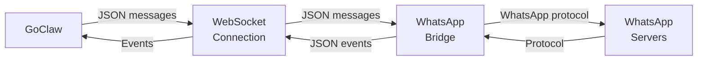

> Bản dịch từ [English version](/channel-whatsapp)

# Channel WhatsApp

Tích hợp WhatsApp qua WebSocket bridge bên ngoài. GoClaw kết nối với dịch vụ bridge (ví dụ: whatsapp-web.js) để xử lý giao thức WhatsApp.

## Thiết lập

**Yêu cầu:**
- Dịch vụ WhatsApp bridge đang chạy (ví dụ: whatsapp-web.js)
- URL bridge có thể truy cập từ GoClaw

**Khởi động WhatsApp Bridge:**

Ví dụ dùng whatsapp-web.js:

```bash
npm install -g whatsapp-web.js
# Khởi động bridge server trên localhost:3001
whatsapp-bridge --port 3001
```

Bridge của bạn cần expose một WebSocket endpoint (ví dụ: `ws://localhost:3001`).

**Bật WhatsApp:**

```json
{
  "channels": {
    "whatsapp": {
      "enabled": true,
      "bridge_url": "ws://localhost:3001",
      "dm_policy": "open",
      "group_policy": "open",
      "allow_from": []
    }
  }
}
```

## Cấu hình

Tất cả config key nằm trong `channels.whatsapp`:

| Key | Kiểu | Mặc định | Mô tả |
|-----|------|---------|-------------|
| `enabled` | bool | false | Bật/tắt channel |
| `bridge_url` | string | bắt buộc | URL WebSocket đến bridge (ví dụ: `ws://bridge:3001`) |
| `allow_from` | list | -- | Danh sách trắng user/group ID |
| `dm_policy` | string | `"open"` | `open`, `allowlist`, `pairing`, `disabled` |
| `group_policy` | string | `"open"` | `open`, `allowlist`, `disabled` |
| `block_reply` | bool | -- | Ghi đè block_reply của gateway (nil=kế thừa) |

## Tính năng

### Kết nối Bridge

GoClaw kết nối với bridge qua WebSocket và gửi/nhận JSON message.



### Hỗ trợ DM và Nhóm

Bridge phát hiện group chat qua hậu tố `@g.us` trong chat ID:

- **DM**: `"1234567890@c.us"`
- **Nhóm**: `"123-456@g.us"`

Chính sách được áp dụng tương ứng (chính sách DM cho DM, chính sách nhóm cho nhóm).

### Định dạng tin nhắn

Tin nhắn là JSON object:

```json
{
  "from": "1234567890@c.us",
  "body": "Hello!",
  "type": "chat",
  "id": "message_id_123"
}
```

Media được truyền dạng mảng đường dẫn file:

```json
{
  "from": "1234567890@c.us",
  "body": "Photo",
  "media": ["/tmp/photo.jpg"],
  "type": "image"
}
```

### Tự động Kết nối lại

Nếu kết nối bridge bị đứt:
- Exponential backoff: 1s → tối đa 30s
- Thử kết nối lại liên tục
- Log cảnh báo khi kết nối lại thất bại

## Pattern phổ biến

### Gửi đến Chat

```go
manager.SendToChannel(ctx, "whatsapp", "1234567890@c.us", "Hello!")
```

### Kiểm tra xem Chat có phải Nhóm không

```go
isGroup := strings.HasSuffix(chatID, "@g.us")
```

## Xử lý sự cố

| Vấn đề | Giải pháp |
|-------|----------|
| "Connection refused" | Xác minh bridge đang chạy. Kiểm tra `bridge_url` đúng và có thể truy cập. |
| "WebSocket: close normal closure" | Bridge tắt graceful. Khởi động lại dịch vụ bridge. |
| Liên tục thử kết nối lại | Bridge bị down hoặc không thể truy cập. Kiểm tra log bridge. |
| Không nhận được tin nhắn | Xác minh bridge đang nhận WhatsApp event. Kiểm tra log bridge. |
| Phát hiện nhóm thất bại | Đảm bảo chat ID kết thúc bằng `@g.us` cho nhóm, `@c.us` cho DM. |
| Media không được gửi | Đảm bảo đường dẫn file có thể truy cập từ bridge. Kiểm tra bridge có hỗ trợ media không. |

## Tiếp theo

- [Tổng quan](/channels-overview) — Khái niệm và chính sách channel
- [Telegram](/channel-telegram) — Thiết lập Telegram bot
- [Larksuite](/channel-feishu) — Tích hợp Larksuite
- [Browser Pairing](/channel-browser-pairing) — Luồng pairing

<!-- goclaw-source: 57754a5 | cập nhật: 2026-03-18 -->
