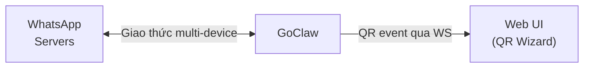

> Bản dịch từ [English version](/channel-whatsapp)

# Channel WhatsApp

Tích hợp WhatsApp trực tiếp. GoClaw kết nối trực tiếp đến giao thức multi-device của WhatsApp — không cần bridge hay dịch vụ Node.js bên ngoài. Trạng thái xác thực được lưu trong database (PostgreSQL hoặc SQLite).

## Thiết lập

1. **Channels > Add Channel > WhatsApp**
2. Chọn agent, bấm **Create & Scan QR**
3. Quét QR bằng WhatsApp (Bạn > Thiết bị liên kết > Liên kết thiết bị)
4. Cấu hình chính sách DM/nhóm theo nhu cầu

Vậy là xong — không cần triển khai bridge, không cần container phụ.

### Cấu hình qua file config

Cho channel cấu hình qua file (thay vì DB instance):

```json
{
  "channels": {
    "whatsapp": {
      "enabled": true,
      "dm_policy": "pairing",
      "group_policy": "pairing"
    }
  }
}
```

## Cấu hình

Tất cả config key nằm trong `channels.whatsapp` (file config) hoặc config JSON của instance (DB):

| Key | Kiểu | Mặc định | Mô tả |
|-----|------|---------|-------|
| `enabled` | bool | `false` | Bật/tắt channel |
| `allow_from` | list | -- | Danh sách trắng user/group ID |
| `dm_policy` | string | `"pairing"` | `pairing`, `open`, `allowlist`, `disabled` |
| `group_policy` | string | `"pairing"` (DB) / `"open"` (config) | `pairing`, `open`, `allowlist`, `disabled` |
| `require_mention` | bool | `false` | Chỉ trả lời trong nhóm khi bot được @mention |
| `history_limit` | int | `200` | Số tin nhắn nhóm tối đa cho ngữ cảnh (0=tắt) |
| `block_reply` | bool | -- | Ghi đè block_reply của gateway (nil=kế thừa) |

## Kiến trúc



- **GoClaw** kết nối trực tiếp đến WhatsApp server qua giao thức multi-device
- Trạng thái xác thực lưu trong database — tồn tại qua khởi động lại
- Một channel instance = một số điện thoại WhatsApp
- Không bridge, không Node.js, không shared volume

## Tính năng

### Xác thực QR Code

WhatsApp yêu cầu quét QR để liên kết thiết bị. Quy trình:

1. GoClaw tạo mã QR để liên kết thiết bị
2. Chuỗi QR được mã hóa thành PNG (base64) và gửi đến UI wizard qua WS event
3. Web UI hiển thị ảnh QR
4. Người dùng quét bằng WhatsApp (Bạn > Thiết bị liên kết > Liên kết thiết bị)
5. Xác thực được xác nhận qua sự kiện kết nối

**Xác thực lại**: Dùng nút "Re-authenticate" trong bảng channels để buộc quét QR mới (đăng xuất phiên WhatsApp hiện tại và xóa thông tin thiết bị đã lưu).

### Chính sách DM và Nhóm

Nhóm WhatsApp có chat ID kết thúc bằng `@g.us`:

- **DM**: `"1234567890@s.whatsapp.net"`
- **Nhóm**: `"120363012345@g.us"`

Các chính sách có sẵn:

| Chính sách | Hành vi |
|-----------|---------|
| `open` | Chấp nhận tất cả tin nhắn |
| `pairing` | Yêu cầu phê duyệt mã pairing (mặc định cho DB instance) |
| `allowlist` | Chỉ user trong `allow_from` |
| `disabled` | Từ chối tất cả tin nhắn |

Chính sách `pairing` cho nhóm: nhóm chưa ghép nối nhận mã pairing. Phê duyệt qua `goclaw pairing approve <CODE>`.

### @Mention Gating

Khi `require_mention` là `true`, bot chỉ trả lời trong nhóm khi được @mention trực tiếp. Tin nhắn không mention được ghi lại cho ngữ cảnh — khi bot được mention, lịch sử nhóm gần đây được thêm vào đầu tin nhắn.

Fail-closed — nếu JID của bot chưa xác định, tin nhắn sẽ bị bỏ qua.

### Hỗ trợ Media

GoClaw tải media đến trực tiếp (ảnh, video, audio, tài liệu, sticker) vào file tạm, sau đó chuyển vào pipeline agent.

Loại media đến được hỗ trợ: image, video, audio, document, sticker (tối đa 20 MB mỗi file).

Media đi: GoClaw upload file lên server WhatsApp với mã hóa phù hợp. Hỗ trợ image, video, audio và document kèm caption.

### Định dạng tin nhắn

Output LLM được chuyển đổi từ Markdown sang định dạng native của WhatsApp:

| Markdown | WhatsApp | Hiển thị |
|----------|----------|---------|
| `**bold**` | `*bold*` | **bold** |
| `_italic_` | `_italic_` | _italic_ |
| `~~strikethrough~~` | `~strikethrough~` | ~~strikethrough~~ |
| `` `inline code` `` | `` `inline code` `` | `code` |
| `# Header` | `*Header*` | **Header** |
| `[text](url)` | `text url` | text url |
| `- list item` | `• list item` | • list item |

Fenced code block được giữ nguyên dạng ` ``` `. Tag HTML từ output LLM được tiền xử lý thành Markdown trước khi chuyển đổi. Tin nhắn dài tự động được chia nhỏ tại ~4096 ký tự, tách ở ranh giới đoạn hoặc dòng.

### Chỉ báo đang nhập

GoClaw hiển thị "đang nhập..." trong WhatsApp khi agent xử lý tin nhắn. WhatsApp xóa chỉ báo sau ~10 giây, nên GoClaw làm mới mỗi 8 giây cho đến khi gửi trả lời.

### Tự động kết nối lại

Tự động kết nối lại khi kết nối bị đứt:
- Logic reconnect tích hợp xử lý retry với exponential backoff
- Trạng thái sức khỏe channel được cập nhật (degraded → healthy khi kết nối lại)
- Không cần vòng lặp reconnect thủ công

### Địa chỉ LID

WhatsApp dùng định danh kép: phone JID (`@s.whatsapp.net`) và LID (`@lid`). Nhóm có thể dùng địa chỉ LID. GoClaw chuẩn hóa về phone JID để kiểm tra chính sách, tra cứu pairing và allowlist nhất quán.

## Xử lý sự cố

| Vấn đề | Giải pháp |
|--------|----------|
| Không hiển thị QR | Kiểm tra log GoClaw. Đảm bảo server kết nối được WhatsApp server (port 443, 5222). |
| Quét QR nhưng không xác thực | Trạng thái xác thực có thể bị hỏng. Dùng nút "Re-authenticate" hoặc khởi động lại channel. |
| Không nhận tin nhắn | Kiểm tra `dm_policy` và `group_policy`. Nếu là `pairing`, user/nhóm cần phê duyệt qua `goclaw pairing approve`. |
| Không nhận media | Kiểm tra log GoClaw tìm "media download failed". Đảm bảo thư mục temp ghi được. Tối đa 20 MB mỗi file. |
| Chỉ báo đang nhập bị kẹt | GoClaw tự hủy typing khi gửi trả lời. Nếu bị kẹt, kết nối WhatsApp có thể đã đứt — kiểm tra health channel. |
| Tin nhắn nhóm bị bỏ qua | Kiểm tra `group_policy`. Nếu là `pairing`, nhóm cần phê duyệt. Nếu `require_mention` là true, @mention bot. |
| "logged out" trong log | WhatsApp đã thu hồi phiên. Dùng nút "Re-authenticate" để quét QR mới. |
| Lỗi `bridge_url` khi khởi động | `bridge_url` không còn được hỗ trợ. WhatsApp giờ chạy native — xóa `bridge_url` khỏi config/credentials. |

## Di chuyển từ Bridge

Nếu trước đây bạn dùng Baileys bridge (config `bridge_url`):

1. Xóa `bridge_url` khỏi config hoặc credentials channel
2. Xóa/dừng container bridge (không cần nữa)
3. Xóa shared volume bridge (`wa_media`)
4. Xác thực lại qua quét QR trong UI (trạng thái xác thực bridge cũ không tương thích)

GoClaw sẽ phát hiện config `bridge_url` cũ và hiển thị lỗi di chuyển rõ ràng.

## Tiếp theo

- [Tổng quan](/channels-overview) — Khái niệm và chính sách channel
- [Telegram](/channel-telegram) — Thiết lập Telegram bot
- [Larksuite](/channel-feishu) — Tích hợp Larksuite
- [Browser Pairing](/channel-browser-pairing) — Luồng pairing

<!-- goclaw-source: 050aafc9 | cập nhật: 2026-04-09 -->
