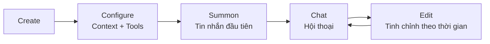

> Bản dịch từ [English version](/agents-explained)

# Agents Explained

> Agent là gì, hoạt động như thế nào, và sự khác biệt giữa open và predefined.

## Tổng quan

Một agent trong GoClaw là một LLM có tính cách, tool, và memory. Bạn cấu hình những gì nó biết (context file), những gì nó có thể làm (tool), và LLM nào chạy nó (provider + model). Mỗi agent chạy trong vòng lặp riêng, xử lý cuộc hội thoại độc lập.

## Cấu thành một Agent

Một agent kết hợp bốn thứ:

1. **LLM** — Language model tạo ra phản hồi (provider + model)
2. **Context File** — File Markdown định nghĩa tính cách, kiến thức, và quy tắc
3. **Tool** — Những gì agent có thể làm (search, code, browse, v.v.)
4. **Memory** — Thông tin dài hạn được lưu qua các cuộc hội thoại

## Loại Agent

GoClaw có hai loại agent với mô hình chia sẻ khác nhau:

### Open Agent

Mỗi người dùng có bản copy riêng hoàn chỉnh của tất cả context file. Người dùng có thể tùy chỉnh hoàn toàn tính cách, hướng dẫn, và hành vi của agent — agent thích nghi độc lập theo từng người. File được lưu xuyên suốt các session.

- Tất cả 7 context file là per-user (bao gồm MEMORY.md)
- Người dùng có thể đọc và sửa mọi file (SOUL.md, IDENTITY.md, AGENTS.md, USER.md, v.v.)
- Người dùng mới bắt đầu từ template cấp agent, sau đó phân hóa khi tùy chỉnh
- Phù hợp: personal assistant, workflow cá nhân, prototyping và testing nhanh (mỗi user tùy chỉnh tính cách mà không ảnh hưởng người khác)

### Predefined Agent

Agent có tính cách cố định, chung cho tất cả — không user nào thay đổi được qua chat. Mỗi người dùng chỉ có file hồ sơ cá nhân. Hãy nghĩ như một chatbot công ty — cùng giọng điệu thương hiệu, nhưng biết bạn là ai.

- 4 context file chia sẻ cho tất cả người dùng (SOUL, IDENTITY, AGENTS, TOOLS) — chỉ đọc từ chat
- 3 file per-user (USER.md, USER_PREDEFINED.md, BOOTSTRAP.md)
- File chung chỉ có thể sửa từ dashboard quản lý (không qua hội thoại)
- Phù hợp: team bot, branded assistant, customer support — nơi tính cách nhất quán quan trọng

| Khía cạnh | Open | Predefined |
|-----------|------|-----------|
| File cấp agent | Template (copy cho mỗi user) | 4 chung (SOUL, IDENTITY, AGENTS, TOOLS) |
| File per-user | Tất cả 7 | 3 (USER.md, USER_PREDEFINED.md, BOOTSTRAP.md) |
| User sửa qua chat | Tất cả file | Chỉ USER.md |
| Tính cách | Phân hóa theo user | Cố định, giống nhau cho mọi người |
| Trường hợp dùng | Personal assistant | Team/company bot |

## Context File

Mỗi agent có tối đa 7 context file định hình hành vi của nó:

| File | Mục đích | Nội dung ví dụ |
|------|---------|----------------|
| `AGENTS.md` | Hướng dẫn vận hành, quy tắc memory, hướng dẫn an toàn | "Luôn lưu thông tin quan trọng vào memory..." |
| `SOUL.md` | Tính cách và giọng điệu | "Bạn là một mentor lập trình thân thiện..." |
| `IDENTITY.md` | Tên, avatar, lời chào | "Tên: CodeBot, Emoji: 🤖" |
| `TOOLS.md` | Hướng dẫn sử dụng tool *(chỉ load từ filesystem — không được DB-route, bị loại trừ khỏi context file interceptor)* | "Dùng web_search cho các sự kiện hiện tại..." |
| `USER.md` | Hồ sơ người dùng, timezone, tùy chọn | "Timezone: Asia/Saigon, Language: Vietnamese" |
| `USER_PREDEFINED.md` | Hồ sơ người dùng cho predefined agent *(chỉ dành cho predefined agent, thay thế USER.md ở cấp agent)* | "Thông tin thành viên nhóm, tùy chọn chung..." |
| `BOOTSTRAP.md` | Nghi thức chạy lần đầu (tự động xóa sau khi hoàn tất) | "Giới thiệu bản thân và tìm hiểu về người dùng..." |

Cộng thêm `MEMORY.md` — ghi chú bền vững được agent tự cập nhật (định tuyến đến hệ thống memory).

Context file là Markdown. Sửa qua web dashboard, API, hoặc để agent tự chỉnh sửa trong cuộc hội thoại.

### Truncation

Context file lớn được tự động cắt bớt để phù hợp với context window của LLM:
- Giới hạn mỗi file: 20.000 ký tự
- Tổng ngân sách: 24.000 ký tự
- Truncation giữ 70% từ đầu và 20% từ cuối

## Vòng đời Agent



1. **Create** — Định nghĩa tên agent, provider, model qua dashboard hoặc API
2. **Configure** — Viết context file, đặt quyền tool
3. **Summon** — Gửi tin nhắn đầu tiên; bootstrap file được seed tự động
4. **Chat** — Cuộc hội thoại liên tục với memory và sử dụng tool
5. **Edit** — Tinh chỉnh context file, điều chỉnh cài đặt khi cần

## Kiểm soát truy cập Agent

Khi người dùng cố truy cập agent, GoClaw kiểm tra theo thứ tự:

1. Agent có tồn tại không?
2. Đây có phải agent mặc định không? → Cho phép (mọi người đều dùng được agent mặc định)
3. Người dùng có phải chủ sở hữu không? → Cho phép với role owner
4. Người dùng có share record không? → Cho phép với role shared

Role: `admin` (toàn quyền), `operator` (dùng + sửa), `viewer` (chỉ đọc)

## Định tuyến Agent

Config `bindings` ánh xạ channel đến agent:

```jsonc
{
  "bindings": {
    "telegram": {
      "direct": {
        "386246614": "code-helper"  // User này chat với code-helper
      },
      "group": {
        "-100123456": "team-bot"    // Group này dùng team-bot
      }
    }
  }
}
```

Cuộc hội thoại chưa có binding sẽ đến agent mặc định.

## Các vấn đề thường gặp

| Vấn đề | Giải pháp |
|--------|-----------|
| Agent bỏ qua hướng dẫn | Kiểm tra nội dung SOUL.md và AGENTS.md; đảm bảo context file không bị truncate |
| Lỗi "Agent not found" | Xác minh agent tồn tại trong dashboard; kiểm tra `agents.list` trong config |
| Context file không cập nhật | Với predefined agent, file chung cập nhật cho tất cả user; file per-user cần sửa per-user |

## Trạng thái Agent

Agent có thể ở một trong bốn trạng thái:

| Trạng thái | Ý nghĩa |
|------------|---------|
| `active` | Agent đang hoạt động và chấp nhận cuộc hội thoại |
| `inactive` | Agent bị vô hiệu hóa; cuộc hội thoại bị từ chối |
| `summoning` | Agent đang được khởi tạo lần đầu |
| `summon_failed` | Khởi tạo thất bại; kiểm tra cấu hình provider và model |

## Tự tiến hóa (Self-Evolution)

Predefined agent với `self_evolve` được bật có thể tự cập nhật `SOUL.md` trong quá trình hội thoại. Điều này cho phép giọng điệu và phong cách của agent tiến hóa theo thời gian dựa trên các tương tác. Cập nhật được áp dụng ở cấp agent và ảnh hưởng đến tất cả người dùng. Các file chung khác (IDENTITY.md, AGENTS.md) vẫn được bảo vệ và chỉ có thể chỉnh sửa từ dashboard.

## Chế độ System Prompt

GoClaw xây dựng system prompt theo hai chế độ:

- **PromptFull** — dùng cho lần chạy agent chính. Bao gồm tất cả 19+ phần: skills, MCP tools, memory recall, user identity, messaging, silent-reply rules, và đầy đủ context file.
- **PromptMinimal** — dùng cho subagent (spawn qua tool `spawn`) và cron job. Context thu gọn chỉ gồm các phần cần thiết (tooling, safety, workspace, bootstrap file). Giảm thời gian khởi động và token cho các thao tác nhẹ.

## NO_REPLY Suppression

Agent có thể trả về `NO_REPLY` trong phản hồi cuối để ngăn gửi tin nhắn hiển thị cho người dùng. GoClaw phát hiện chuỗi này trong quá trình finalizing và bỏ qua việc gửi tin hoàn toàn — gọi là "silent completion." Được dùng nội bộ bởi memory flush agent khi không có gì để lưu, và có thể dùng trong hướng dẫn agent tuỳ chỉnh cho các tình huống tương tự.

## Mid-Loop Compaction

Trong các task chạy dài, GoClaw kích hoạt context compaction **ngay giữa vòng lặp** — không chỉ sau khi run hoàn tất. Khi prompt token vượt 75% context window (cấu hình qua `MaxHistoryShare`, mặc định `0.75`), agent tóm tắt ~70% đầu tiên của các message trong bộ nhớ, giữ lại ~30% cuối, rồi tiếp tục lặp. Điều này ngăn tràn context mà không cần hủy task hiện tại.

## Tự động tóm tắt và Memory Flush

Sau mỗi lần chạy, GoClaw đánh giá có cần compact session history không:

- **Trigger**: history vượt 50 message HOẶC token ước tính vượt 75% context window
- **Memory flush trước** (đồng bộ): agent ghi thông tin quan trọng vào file `memory/YYYY-MM-DD.md` trước khi lịch sử bị truncate
- **Tóm tắt** (background): LLM tóm tắt các message cũ; history được truncate còn 4 message cuối; bản tóm tắt được lưu cho session tiếp theo

## Neo danh tính (Identity Anchoring)

Predefined agent có cơ chế bảo vệ tích hợp chống lại social engineering. Nếu người dùng cố thuyết phục agent bỏ qua SOUL.md hoặc hành động ngoài danh tính đã định nghĩa, agent được thiết kế để kháng cự. Các file danh tính chung được inject vào system prompt ở mức ưu tiên cao hơn hướng dẫn của người dùng.

## Cải tiến Subagent

Khi agent spawn subagent qua tool `spawn`, các tính năng sau được áp dụng:

### Rate Limiting theo Edition

Struct `Edition` áp đặt hai giới hạn phạm vi tenant cho việc sử dụng subagent:

| Trường | Mô tả |
|--------|-------|
| `MaxSubagentConcurrent` | Số subagent tối đa chạy song song mỗi tenant |
| `MaxSubagentDepth` | Độ sâu lồng nhau tối đa — ngăn chuỗi delegation không giới hạn |

Các giới hạn này được đặt theo từng edition và kiểm tra tại thời điểm spawn.

### Theo dõi chi phí Token

Mỗi subagent tích lũy số token input và output theo từng lần gọi. Tổng được lưu vào database và đưa vào announce message, giúp agent parent có đầy đủ thông tin về chi phí delegation.

### WaitAll Orchestration

`spawn(action=wait, timeout=N)` chặn parent cho đến khi tất cả các children đã spawn hoàn tất. Cho phép pattern fan-out/fan-in mà không cần polling.

### Auto-Retry với Backoff

`MaxRetries` có thể cấu hình (mặc định `2`) với linear backoff xử lý lỗi LLM tạm thời tự động. Parent chỉ được thông báo khi thất bại vĩnh viễn sau khi hết tất cả lần retry.

### SubagentDenyAlways

Subagent không thể spawn subagent lồng nhau — tool `team_tasks` bị chặn trong ngữ cảnh subagent. Mọi delegation phải xuất phát từ agent cấp cao nhất.

### Producer-Consumer Announce Queue

Kết quả subagent lệch thời gian được xếp hàng và gộp thành một lần announce LLM run duy nhất ở phía parent. Điều này giảm các lần đánh thức không cần thiết khi nhiều subagent hoàn tất vào các thời điểm khác nhau.

## Tiếp theo

- [Sessions and History](/sessions-and-history) — Cách cuộc hội thoại được lưu trữ
- [Tools Overview](/tools-overview) — Tool agent có thể dùng
- [Memory System](/memory-system) — Memory dài hạn và tìm kiếm

<!-- goclaw-source: c388364d | cập nhật: 2026-04-01 -->
