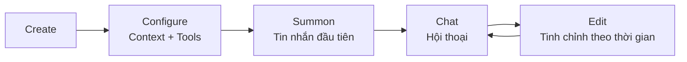

> Bản dịch từ [English version](../../core-concepts/agents-explained.md)

# Agents Explained

> Agent là gì, hoạt động như thế nào, và sự khác biệt giữa open và predefined.

## Tổng quan

Một agent trong GoClaw là một LLM có tính cách, tool, và memory. Bạn cấu hình những gì nó biết (context file), những gì nó có thể làm (tool), và LLM nào chạy nó (provider + model). Mỗi agent chạy trong vòng lặp riêng, xử lý cuộc hội thoại độc lập.

## Cấu thành một Agent

Một agent kết hợp bốn thứ:

1. **LLM** — Language model tạo ra phản hồi (provider + model)
2. **Context File** — File Markdown định nghĩa tính cách, kiến thức, và quy tắc
3. **Tool** — Những gì agent có thể làm (search, code, browse, v.v.)
4. **Memory** — Thông tin dài hạn được lưu qua các cuộc hội thoại

## Loại Agent

GoClaw có hai loại agent với mô hình chia sẻ khác nhau:

### Open Agent

Mỗi người dùng có bộ context file riêng hoàn chỉnh. Agent thích nghi với từng người dùng độc lập.

- Tất cả 7 context file là per-user
- Người dùng có thể tùy chỉnh hoàn toàn tính cách của agent
- Phù hợp: personal assistant, workflow cá nhân

### Predefined Agent

Agent có tính cách chung, nhưng mỗi người dùng có file hồ sơ cá nhân. Hãy nghĩ như một chatbot công ty biết bạn là ai.

- 4 context file chia sẻ cho tất cả người dùng (AGENTS, SOUL, IDENTITY, TOOLS)
- 2 file per-user (USER.md, BOOTSTRAP.md)
- Phù hợp: team bot, shared assistant, customer support

| Khía cạnh | Open | Predefined |
|-----------|------|-----------|
| File cấp agent | Không | 4 (chung: AGENTS, SOUL, IDENTITY, TOOLS) |
| File per-user | Tất cả 6 | 2 (USER.md, BOOTSTRAP.md) |
| Tùy chỉnh | Hoàn toàn per-user | Tính cách chung, hồ sơ cá nhân |
| Trường hợp dùng | Personal assistant | Team/company bot |

## Context File

Mỗi agent có tối đa 6 context file định hình hành vi của nó:

| File | Mục đích | Nội dung ví dụ |
|------|---------|----------------|
| `AGENTS.md` | Hướng dẫn vận hành, quy tắc memory, hướng dẫn an toàn | "Luôn lưu thông tin quan trọng vào memory..." |
| `SOUL.md` | Tính cách và giọng điệu | "Bạn là một mentor lập trình thân thiện..." |
| `IDENTITY.md` | Tên, avatar, lời chào | "Tên: CodeBot, Emoji: 🤖" |
| `TOOLS.md` | Hướng dẫn sử dụng tool | "Dùng web_search cho các sự kiện hiện tại..." |
| `USER.md` | Hồ sơ người dùng, timezone, tùy chọn | "Timezone: Asia/Saigon, Language: Vietnamese" |
| `BOOTSTRAP.md` | Nghi thức chạy lần đầu (tự động xóa sau khi hoàn tất) | "Giới thiệu bản thân và tìm hiểu về người dùng..." |

Cộng thêm `MEMORY.md` — ghi chú bền vững được agent tự cập nhật (định tuyến đến hệ thống memory).

Context file là Markdown. Sửa qua web dashboard, API, hoặc để agent tự chỉnh sửa trong cuộc hội thoại.

### Truncation

Context file lớn được tự động cắt bớt để phù hợp với context window của LLM:
- Giới hạn mỗi file: 20.000 ký tự
- Tổng ngân sách: 24.000 ký tự
- Truncation giữ 70% từ đầu và 20% từ cuối

## Vòng đời Agent



1. **Create** — Định nghĩa tên agent, provider, model qua dashboard hoặc API
2. **Configure** — Viết context file, đặt quyền tool
3. **Summon** — Gửi tin nhắn đầu tiên; bootstrap file được seed tự động
4. **Chat** — Cuộc hội thoại liên tục với memory và sử dụng tool
5. **Edit** — Tinh chỉnh context file, điều chỉnh cài đặt khi cần

## Kiểm soát truy cập Agent

Khi người dùng cố truy cập agent, GoClaw kiểm tra theo thứ tự:

1. Agent có tồn tại không?
2. Đây có phải agent mặc định không? → Cho phép (mọi người đều dùng được agent mặc định)
3. Người dùng có phải chủ sở hữu không? → Cho phép với role owner
4. Người dùng có share record không? → Cho phép với role shared

Role: `admin` (toàn quyền), `operator` (dùng + sửa), `viewer` (chỉ đọc)

## Định tuyến Agent

Config `bindings` ánh xạ channel đến agent:

```jsonc
{
  "bindings": {
    "telegram": {
      "direct": {
        "386246614": "code-helper"  // User này chat với code-helper
      },
      "group": {
        "-100123456": "team-bot"    // Group này dùng team-bot
      }
    }
  }
}
```

Cuộc hội thoại chưa có binding sẽ đến agent mặc định.

## Các vấn đề thường gặp

| Vấn đề | Giải pháp |
|--------|-----------|
| Agent bỏ qua hướng dẫn | Kiểm tra nội dung SOUL.md và RULES.md; đảm bảo context file không bị truncate |
| Lỗi "Agent not found" | Xác minh agent tồn tại trong dashboard; kiểm tra `agents.list` trong config |
| Context file không cập nhật | Với predefined agent, file chung cập nhật cho tất cả user; file per-user cần sửa per-user |

## Tiếp theo

- [Sessions and History](sessions-and-history.md) — Cách cuộc hội thoại được lưu trữ
- [Tools Overview](tools-overview.md) — Tool agent có thể dùng
- [Memory System](memory-system.md) — Memory dài hạn và tìm kiếm
