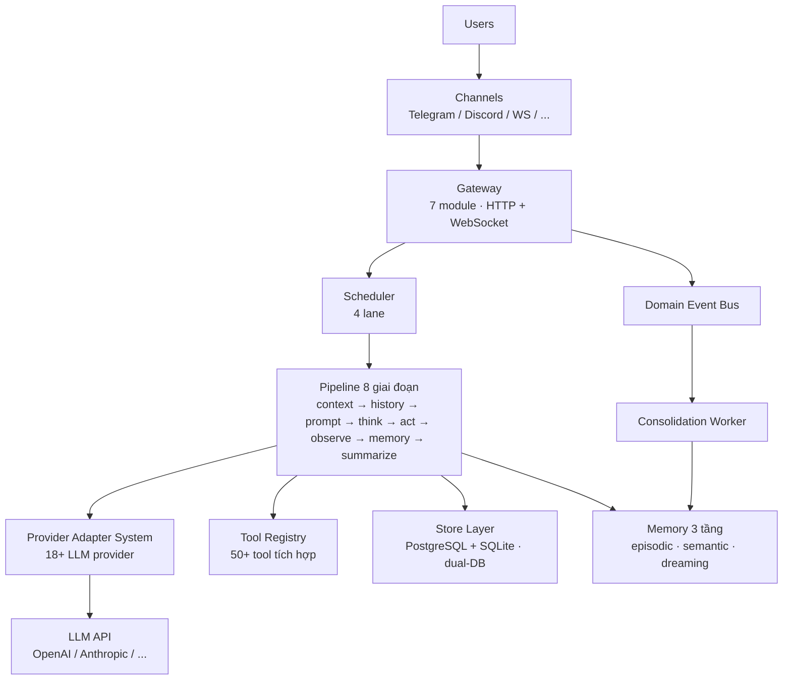

> Bản dịch từ [English version](/how-goclaw-works)

# GoClaw hoạt động như thế nào

> Kiến trúc đằng sau AI agent gateway của GoClaw.

## Tổng quan

GoClaw là một gateway đứng giữa người dùng và LLM provider. Nó quản lý toàn bộ vòng đời của cuộc hội thoại AI: nhận tin nhắn, định tuyến đến agent, gọi LLM, thực thi tool, và trả phản hồi về qua các channel nhắn tin.

## Sơ đồ kiến trúc



## Pipeline 8 giai đoạn

Trong v3, mỗi lần chạy agent đều đi qua **pipeline 8 giai đoạn có thể cắm thêm được**. Chế độ hai đường chạy cũ đã bị loại bỏ — tất cả agent luôn dùng pipeline này.

```
Setup (chạy một lần)
└─ ContextStage — inject context agent/user/workspace

Vòng lặp lặp lại (tối đa 20 lần mỗi lượt)
├─ ThinkStage   — xây dựng system prompt, lọc tool, gọi LLM
├─ PruneStage   — trim context khi cần, trigger memory flush
├─ ToolStage    — thực thi tool call (song song khi có thể)
├─ ObserveStage — xử lý kết quả tool, thêm vào message buffer
└─ CheckpointStage — theo dõi vòng lặp, kiểm tra điều kiện thoát

Finalize (chạy một lần, tồn tại kể cả khi bị huỷ)
└─ FinalizeStage — làm sạch output, flush message, cập nhật session metadata
```

### Chi tiết các giai đoạn

| Giai đoạn | Phase | Chức năng |
|-----------|-------|-----------|
| **ContextStage** | Setup | Inject context agent/user/workspace; giải quyết file per-user |
| **ThinkStage** | Iteration | Xây dựng system prompt (15+ phần), gọi LLM, phát streaming chunk |
| **PruneStage** | Iteration | Trim context khi ≥ 30% đầy (nhẹ) hoặc ≥ 50% đầy (mạnh); trigger memory flush |
| **ToolStage** | Iteration | Thực thi tool call — goroutine song song cho nhiều call |
| **ObserveStage** | Iteration | Xử lý kết quả tool; xử lý `NO_REPLY` silent completion |
| **CheckpointStage** | Iteration | Tăng đếm vòng; thoát khi đạt max-iter hoặc context bị huỷ |
| **FinalizeStage** | Finalize | Chạy 7 bước sanitize output; flush message nguyên tử; cập nhật session metadata |

## Luồng tin nhắn

Đây là những gì xảy ra khi người dùng gửi tin nhắn:

1. **Nhận** — Tin nhắn đến qua channel (Telegram, WebSocket, v.v.)
2. **Validate** — Input guard kiểm tra injection pattern; tin nhắn bị cắt bớt ở 32 KB
3. **Định tuyến** — Scheduler gán tin nhắn cho agent dựa trên channel binding
4. **Queue** — Per-session queue quản lý concurrency (1 mỗi DM session; tối đa 3 cho group)
5. **Build Context** — ContextStage inject identity, workspace, file per-user
6. **Pipeline Loop** — Pipeline 8 giai đoạn chạy tối đa 20 vòng mỗi lượt
7. **Sanitize** — FinalizeStage làm sạch output (loại bỏ thinking tag, XML lỗi, trùng lặp)
8. **Deliver** — Phản hồi được gửi về qua channel gốc

## Scheduler Lane

GoClaw dùng scheduler theo lane để quản lý concurrency:

| Lane | Concurrency | Mục đích |
|------|:-----------:|---------|
| `main` | 30 | Tin nhắn channel và WebSocket request |
| `subagent` | 50 | Tác vụ subagent được spawn |
| `team` | 100 | Agent-to-agent delegation |
| `cron` | 30 | Cron job lên lịch |

Mỗi lane có semaphore riêng. Điều này ngăn cron job làm chậm tin nhắn người dùng, và giữ delegation không làm quá tải hệ thống.

> Giới hạn concurrency có thể cấu hình qua env var: `GOCLAW_LANE_MAIN`, `GOCLAW_LANE_SUBAGENT`, `GOCLAW_LANE_TEAM`, `GOCLAW_LANE_CRON`.

## Các thành phần

| Thành phần | Chức năng |
|-----------|----------|
| **Gateway** | HTTP + WebSocket server; được tách thành 7 module (deps, http_wiring, events, lifecycle, tools_wiring, methods, router) |
| **Domain Event Bus** | Phát sự kiện có kiểu với worker pool, dedup, và retry — điều phối consolidation worker |
| **Provider Adapter System** | Quản lý 18+ LLM provider; Anthropic native, OpenAI-compatible, ACP (stdio JSON-RPC) |
| **Tool Registry** | 50+ tool tích hợp với kiểm soát truy cập dựa trên policy (mở rộng qua MCP và custom tool) |
| **Store Layer** | Dual-DB: PostgreSQL (`pgx/v5`) cho production + SQLite (`modernc.org/sqlite`) cho desktop; dùng chung base/ dialect |
| **Memory 3 tầng** | Episodic (sự kiện gần đây) → Semantic (tóm tắt trừu tượng) → Dreaming (tổng hợp mới); điều phối bởi consolidation worker |
| **Orchestration Module** | Generic `BatchQueue[T]` để tổng hợp kết quả; ChildResult capture; helper chuyển đổi media |
| **Consolidation Worker** | Episodic, semantic, dreaming, dedup worker tiêu thụ sự kiện từ DomainEventBus |
| **Channel Manager** | Adapter cho Telegram, Discord, WhatsApp (native qua Baileys bridge), Zalo, Feishu |
| **Scheduler** | Concurrency 4 lane với per-session queue |

## Tổng quan hệ thống v3

GoClaw v3 đi kèm năm hệ thống mới — mỗi hệ thống có trang riêng:

| Hệ thống | Tính năng bổ sung |
|----------|------------------|
| [Knowledge Vault](/knowledge-vault) | Mạng lưới wikilink ngữ nghĩa, hybrid search BM25 + vector, tự động inject vào prompt (L0) |
| [Memory 3 tầng](/memory-system) | Pipeline consolidation episodic → semantic → dreaming điều phối bởi DomainEventBus |
| [Agent Evolution](/agent-evolution) | Theo dõi pattern sử dụng tool/retrieval; tự động đề xuất và áp dụng thay đổi prompt/tool |
| [Mode Prompt System](/model-steering) | Chế độ prompt có thể chuyển đổi (PromptFull và PromptMinimal) với override theo từng agent |
| [Multi-Tenant v3](/multi-tenancy) | Phạm vi user ID phức hợp trên toàn bộ 22+ store interface; vault grant; skill grant |

## Các vấn đề thường gặp

| Vấn đề | Giải pháp |
|--------|-----------|
| Agent không phản hồi | Kiểm tra scheduler lane concurrency; xác minh provider API key |
| Phản hồi chậm | Context window lớn + nhiều tool = LLM call chậm hơn; giảm số tool hoặc context |
| Tool call thất bại | Kiểm tra mức `tools.exec_approval`; xem lại deny pattern cho lệnh shell |

## Tiếp theo

- [Agents Explained](/agents-explained) — Tìm hiểu sâu về loại agent và context file
- [Tools Overview](/tools-overview) — Danh mục tool đầy đủ
- [Sessions and History](/sessions-and-history) — Cách cuộc hội thoại được lưu trữ

<!-- goclaw-source: 050aafc9 | cập nhật: 2026-04-09 -->
