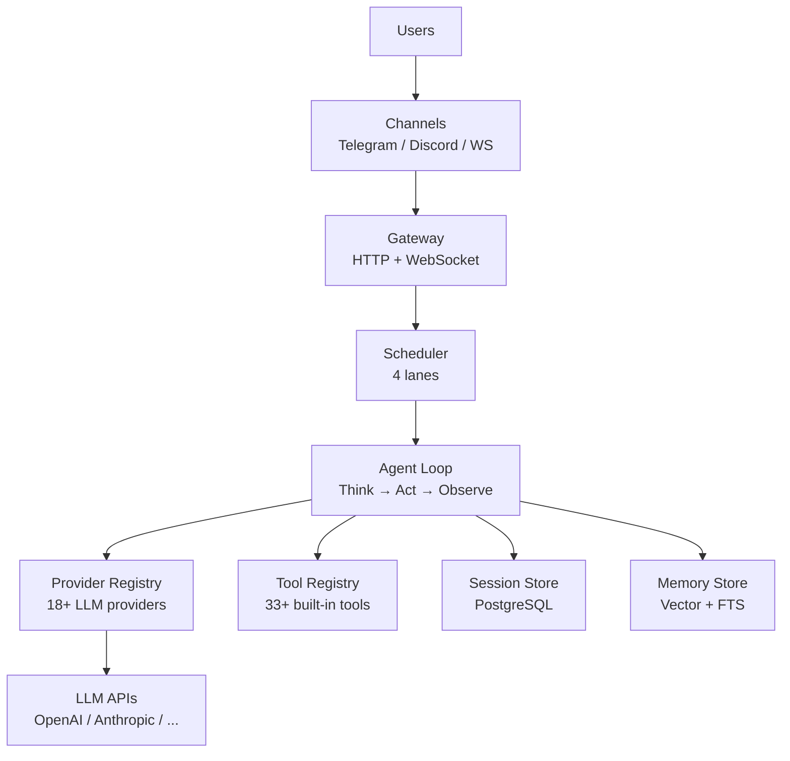
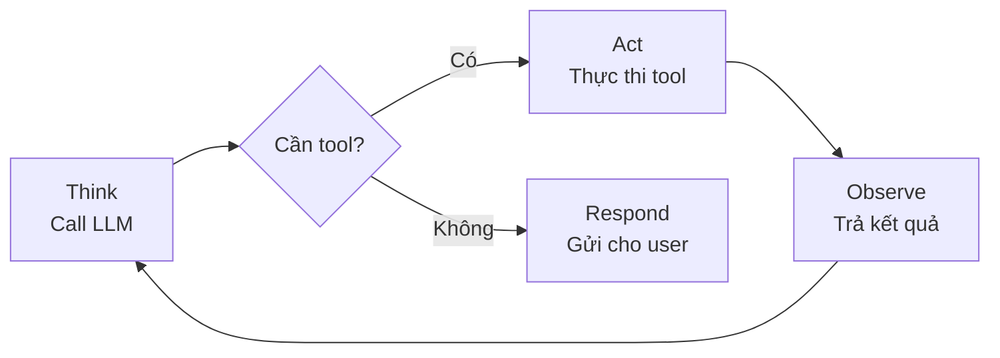

> Bản dịch từ [English version](#how-goclaw-works)

# GoClaw hoạt động như thế nào

> Kiến trúc đằng sau AI agent gateway của GoClaw.

## Tổng quan

GoClaw là một gateway đứng giữa người dùng và LLM provider. Nó quản lý toàn bộ vòng đời của cuộc hội thoại AI: nhận tin nhắn, định tuyến đến agent, gọi LLM, thực thi tool, và trả phản hồi về qua các channel nhắn tin.

## Sơ đồ kiến trúc

## Agent Loop

Mỗi lượt hội thoại đều đi qua chu kỳ **Think → Act → Observe**:

### 1. Think (Suy nghĩ)

Agent tập hợp system prompt (20+ phần bao gồm identity, tool, memory, context file) và gửi cuộc hội thoại đến LLM provider. LLM quyết định bước tiếp theo.

### 2. Act (Hành động)

Nếu LLM muốn dùng tool (tìm kiếm web, đọc file, chạy code), GoClaw thực thi nó. Nhiều tool call chạy song song khi có thể.

### 3. Observe (Quan sát)

Kết quả từ tool được gửi lại cho LLM. LLM có thể gọi thêm tool hoặc tạo phản hồi cuối cùng. Vòng lặp này lặp lại tối đa 20 lần mỗi lượt.

GoClaw phát hiện vòng lặp tool: **cảnh báo** được ghi sau 3 lần gọi giống nhau liên tiếp, và vòng lặp bị **dừng bắt buộc** sau 5 lần gọi giống nhau không có tiến triển.

## Luồng tin nhắn

Đây là những gì xảy ra khi người dùng gửi tin nhắn:

1. **Nhận** — Tin nhắn đến qua channel (Telegram, WebSocket, v.v.)
2. **Validate** — Input guard kiểm tra injection pattern; tin nhắn bị cắt bớt ở 32KB
3. **Định tuyến** — Scheduler gán tin nhắn cho agent dựa trên channel binding
4. **Queue** — Per-session queue quản lý concurrency (1 mỗi session, xử lý tuần tự theo mặc định)
5. **Build Context** — System prompt được tập hợp: identity + tool + memory + history
6. **LLM Loop** — Chu kỳ Think → Act → Observe (tối đa 20 lần)
7. **Sanitize** — Phản hồi được làm sạch (loại bỏ thinking tag, XML lỗi, trùng lặp)
8. **Deliver** — Phản hồi được gửi về qua channel gốc

## Scheduler Lane

GoClaw dùng scheduler theo lane để quản lý concurrency:

| Lane | Concurrency | Mục đích |
|------|:-----------:|---------|
| `main` | 30 | Tin nhắn channel và WebSocket request |
| `subagent` | 50 | Tác vụ subagent được spawn |
| `delegate` | 100 | Agent-to-agent delegation |
| `cron` | 30 | Cron job lên lịch |

Mỗi lane có semaphore riêng. Điều này ngăn cron job làm chậm tin nhắn của người dùng, và giữ delegation không làm quá tải hệ thống.

> Giới hạn concurrency có thể cấu hình qua env var: `GOCLAW_LANE_MAIN`, `GOCLAW_LANE_SUBAGENT`, `GOCLAW_LANE_CRON`.

## Các thành phần

| Thành phần | Chức năng |
|-----------|----------|
| **Gateway** | HTTP + WebSocket server trên port 18790 |
| **Provider Registry** | Quản lý 18+ kết nối và thông tin xác thực LLM provider |
| **Tool Registry** | 34+ tool tích hợp sẵn với kiểm soát truy cập dựa trên policy (mở rộng qua MCP và custom tool) |
| **Session Store** | Write-behind cache + PostgreSQL persistence |
| **Memory Store** | Hybrid search với pgvector + tsvector |
| **Channel Manager** | Adapter cho Telegram, Discord, WhatsApp, Zalo, Feishu |
| **Scheduler** | Concurrency 4 lane với per-session queue |
| **Bootstrap** | Hệ thống template cho context file (SOUL, IDENTITY, TOOLS, v.v.) |

## Các vấn đề thường gặp

| Vấn đề | Giải pháp |
|--------|-----------|
| Agent không phản hồi | Kiểm tra scheduler lane concurrency; xác minh provider API key |
| Phản hồi chậm | Context window lớn + nhiều tool = LLM call chậm hơn; giảm số tool hoặc context |
| Tool call thất bại | Kiểm tra mức `tools.exec_approval`; xem lại deny pattern cho lệnh shell |

## Tiếp theo

- [Agents Explained](#agents-explained) — Tìm hiểu sâu về loại agent và context file
- [Tools Overview](#tools-overview) — Danh mục tool đầy đủ
- [Sessions and History](#sessions-and-history) — Cách cuộc hội thoại được lưu trữ

<!-- goclaw-source: 57754a5 | cập nhật: 2026-03-18 -->
