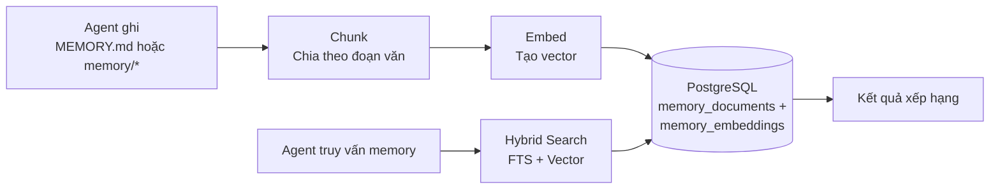

> Bản dịch từ [English version](#memory-system)

# Memory System

> Cách agent ghi nhớ thông tin qua các cuộc hội thoại bằng hybrid search.

## Tổng quan

GoClaw cho agent khả năng memory dài hạn bền vững qua các session. Khi agent học được điều gì quan trọng — tên bạn, sở thích, chi tiết dự án — nó lưu dưới dạng memory document. Sau đó, agent truy xuất memory liên quan bằng cách kết hợp full-text search và vector similarity.

## Cách hoạt động

### Ghi Memory

Khi agent ghi vào `MEMORY.md` hoặc file trong `memory/*`, GoClaw:

1. **Chặn** thao tác ghi file (định tuyến đến DB, không phải filesystem)
2. **Chia chunk** văn bản theo ranh giới đoạn văn (tối đa 1.000 ký tự mỗi chunk)
3. **Embed** mỗi chunk bằng embedding provider được cấu hình
4. **Lưu** cả văn bản (với tsvector cho FTS) và embedding vector

> Chỉ file `.md` mới được chunk và embed. Các file không phải markdown (ví dụ `.json`, `.txt`) được lưu vào DB nhưng **không được lập chỉ mục hay tìm kiếm** qua `memory_search`.

### Tìm kiếm Memory

Khi agent gọi `memory_search`, GoClaw chạy hybrid search:

| Phương pháp | Trọng số | Cách hoạt động |
|-------------|:--------:|----------------|
| Full-text search (FTS) | 0.3 | PostgreSQL `tsvector` matching — tốt cho thuật ngữ chính xác |
| Vector similarity | 0.7 | `pgvector` cosine distance — tốt cho nghĩa ngữ nghĩa |

Kết quả được kết hợp và chấm điểm:

1. FTS score × 0.3 + Vector score × 0.7 *(khi cả hai nguồn đều có kết quả; nếu một nguồn trống, toàn bộ trọng số dồn vào nguồn còn lại)*
2. Per-user boost: kết quả có phạm vi user hiện tại nhận hệ số 1.2×
3. Deduplication: nếu cả kết quả user-scoped và global đều khớp, bản user thắng
4. Normalize: chia tất cả score cho score cao nhất

**Fallback**: nếu tìm kiếm per-user không có kết quả, GoClaw tự động fallback sang memory toàn cục. Áp dụng cho cả `MEMORY.md` và file `memory/*.md`.

### Knowledge Graph Search

`knowledge_graph_search` bổ sung cho `memory_search` khi cần truy vấn quan hệ và thực thể. Trong khi `memory_search` truy xuất các đoạn văn bản, `knowledge_graph_search` duyệt quan hệ giữa các thực thể — hữu ích cho câu hỏi như "Alice đang làm dự án nào?" hay "agent này dùng tool gì?"

## Memory vs Session

| Khía cạnh | Memory | Session |
|-----------|--------|---------|
| Thời gian tồn tại | Vĩnh viễn (cho đến khi xóa) | Per-conversation |
| Nội dung | Thông tin, tùy chọn, kiến thức | Lịch sử tin nhắn |
| Tìm kiếm | Hybrid (FTS + vector) | Truy cập tuần tự |
| Phạm vi | Per-user per-agent | Per-session key |

Memory dành cho những thứ đáng nhớ mãi mãi. Session dành cho luồng hội thoại.

## Auto Memory Flush

Trong quá trình [auto-compaction](#sessions-and-history), GoClaw trích xuất thông tin quan trọng từ cuộc hội thoại và lưu vào memory trước khi tóm tắt history.

- **Trigger**: >50 tin nhắn HOẶC >75% context window (một trong hai điều kiện kích hoạt compaction)
- **Quy trình**: Flush đồng bộ, tối đa 5 lần lặp, timeout 90 giây
- **Những gì được lưu**: Thông tin quan trọng, tùy chọn người dùng, quyết định, action item

Memory flush chỉ kích hoạt như một phần của auto-compaction — không hoạt động độc lập. Flush chạy đồng bộ trong compaction lock và ghi thêm thông tin trích xuất vào `memory/YYYY-MM-DD.md`.

Điều này có nghĩa agent dần xây dựng kiến thức về mỗi người dùng mà không cần lệnh "nhớ cái này" rõ ràng.

## MEMORY.md

Agent cũng có thể đọc/ghi `MEMORY.md` trực tiếp — một file có cấu trúc chứa các thông tin chính. File này:

- Tự động được đưa vào system prompt
- Per-user với open agent, per-user với predefined agent
- Được định tuyến đến database (không phải filesystem)

## Yêu cầu

Memory cần:

- **PostgreSQL 15+** với extension `pgvector`
- Một **embedding provider** được cấu hình (OpenAI, Anthropic, hoặc tương thích)
- `memory: true` trong agent config (bật mặc định)

Đặt `memory: false` trong config của agent để tắt hoàn toàn memory cho agent đó — không đọc, không ghi, không auto-flush.

## Các vấn đề thường gặp

| Vấn đề | Giải pháp |
|--------|-----------|
| Memory search không trả kết quả | Kiểm tra extension pgvector đã cài; xác minh embedding provider đã cấu hình |
| Agent quên mọi thứ | Đảm bảo `memory: true` trong config; kiểm tra auto-compaction có chạy không |
| Memory không liên quan xuất hiện | Memory tích lũy theo thời gian; cân nhắc xóa memory cũ qua API |

## Tiếp theo

- [Multi-Tenancy](#multi-tenancy) — Cách ly memory per-user
- [Sessions and History](#sessions-and-history) — Lịch sử hội thoại hoạt động như thế nào
- [Agents Explained](#agents-explained) — Loại agent và context file

<!-- goclaw-source: 57754a5 | cập nhật: 2026-03-18 -->
