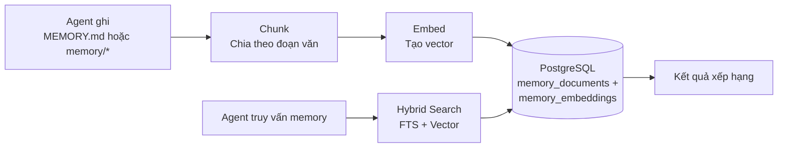

> Bản dịch từ [English version](/memory-system)

# Memory System

> Cách agent ghi nhớ thông tin qua các cuộc hội thoại bằng hybrid search.

## Tổng quan

GoClaw cho agent khả năng memory dài hạn bền vững qua các session. Khi agent học được điều gì quan trọng — tên bạn, sở thích, chi tiết dự án — nó lưu dưới dạng memory document. Sau đó, agent truy xuất memory liên quan bằng cách kết hợp full-text search và vector similarity.

## Cách hoạt động

### Ghi Memory

Khi agent ghi vào `MEMORY.md` hoặc file trong `memory/*`, GoClaw:

1. **Chặn** thao tác ghi file (định tuyến đến DB, không phải filesystem)
2. **Chia chunk** văn bản theo ranh giới đoạn văn (tối đa 1.000 ký tự mỗi chunk)
3. **Embed** mỗi chunk bằng embedding provider được cấu hình
4. **Lưu** cả văn bản (với tsvector cho FTS) và embedding vector

> Chỉ file `.md` mới được chunk và embed. Các file không phải markdown (ví dụ `.json`, `.txt`) được lưu vào DB nhưng **không được lập chỉ mục hay tìm kiếm** qua `memory_search`.

### Tìm kiếm Memory

Khi agent gọi `memory_search`, GoClaw chạy hybrid search kết hợp FTS và vector similarity:

| Phương pháp | Trọng số | Cách hoạt động |
|-------------|:--------:|----------------|
| Full-text search (FTS) | 0.3 | PostgreSQL `tsvector` + `plainto_tsquery('simple')` — tốt cho thuật ngữ chính xác |
| Vector similarity | 0.7 | `pgvector` cosine distance — tốt cho nghĩa ngữ nghĩa |

**Thuật toán weighted merge**: FTS score được normalize về khoảng 0..1 (vector score đã là 0..1), sau đó kết hợp theo `(FTS × 0.3) + (vector × 0.7)`. Khi chỉ một kênh có kết quả, score của kênh đó được dùng trực tiếp (trọng số hiệu quả normalize về 1.0).

Kết quả sau đó được xếp hạng:

1. Per-user boost: kết quả có phạm vi user hiện tại nhận hệ số 1.2×
2. Deduplication: nếu cả kết quả user-scoped và global đều khớp, bản user thắng
3. Sắp xếp cuối theo weighted score

**Embedding cache**: Bảng `embedding_cache` được tích hợp vào hot path `IndexDocument`. Việc re-index nội dung không thay đổi sẽ tái sử dụng embedding đã cache thay vì gọi embedding provider, giảm độ trễ và chi phí API.

**Fallback**: nếu tìm kiếm per-user không có kết quả, GoClaw tự động fallback sang memory toàn cục. Áp dụng cho cả `MEMORY.md` và file `memory/*.md`.

### Knowledge Graph Search

`knowledge_graph_search` bổ sung cho `memory_search` khi cần truy vấn quan hệ và thực thể. Trong khi `memory_search` truy xuất các đoạn văn bản, `knowledge_graph_search` duyệt quan hệ giữa các thực thể — hữu ích cho câu hỏi như "Alice đang làm dự án nào?" hay "agent này dùng tool gì?"

## Memory vs Session

| Khía cạnh | Memory | Session |
|-----------|--------|---------|
| Thời gian tồn tại | Vĩnh viễn (cho đến khi xóa) | Per-conversation |
| Nội dung | Thông tin, tùy chọn, kiến thức | Lịch sử tin nhắn |
| Tìm kiếm | Hybrid (FTS + vector) | Truy cập tuần tự |
| Phạm vi | Per-user per-agent | Per-session key |

Memory dành cho những thứ đáng nhớ mãi mãi. Session dành cho luồng hội thoại.

## Auto Memory Flush

Trong quá trình [auto-compaction](/sessions-and-history), GoClaw trích xuất thông tin quan trọng từ cuộc hội thoại và lưu vào memory trước khi tóm tắt history.

- **Trigger**: >50 tin nhắn HOẶC >85% context window (một trong hai điều kiện kích hoạt compaction)
- **Quy trình**: Flush đồng bộ, tối đa 5 lần lặp, timeout 90 giây
- **Những gì được lưu**: Thông tin quan trọng, tùy chọn người dùng, quyết định, action item
- **Thứ tự**: Memory flush chạy **trước** khi compaction history — thông tin được lưu bền vững trước, sau đó history mới được tóm tắt và rút gọn

Memory flush chỉ kích hoạt như một phần của auto-compaction — không hoạt động độc lập. Flush chạy đồng bộ trong compaction lock và ghi thêm thông tin trích xuất vào `memory/YYYY-MM-DD.md`. Điều này có nghĩa agent dần xây dựng kiến thức về mỗi người dùng mà không cần lệnh "nhớ cái này" rõ ràng.

### Extractive Memory Fallback

Nếu LLM-based flush thất bại (timeout, lỗi provider, output không hợp lệ), GoClaw sẽ fallback sang **extractive memory**: một lượt quét keyword-based qua cuộc hội thoại để trích xuất thông tin chính mà không cần gọi LLM. Điều này đảm bảo memory luôn được lưu dù LLM không khả dụng, với chất lượng trích xuất thấp hơn.

## Các Loại File Memory

GoClaw nhận diện bốn loại file memory:

| File | Vai trò | Ghi chú |
|---|---|---|
| `MEMORY.md` | Memory có cấu trúc (Markdown) | File chính; tự động đưa vào system prompt |
| `memory.md` | Fallback cho `MEMORY.md` | Được kiểm tra nếu thiếu `MEMORY.md` |
| `MEMORY.json` | Index machine-readable | Deprecated — không còn được khuyến nghị |
| Inline (`memory/*.md`) | File theo ngày từ auto-flush | Được lập chỉ mục và tìm kiếm; ví dụ `memory/2026-03-23.md` |

Tất cả variant `.md` đều được chunk, embed và tìm kiếm qua `memory_search`. `MEMORY.json` được lưu nhưng không được lập chỉ mục.

## Yêu cầu

Memory cần:

- **PostgreSQL 15+** với extension `pgvector`
- Một **embedding provider** được cấu hình (OpenAI, Anthropic, hoặc tương thích)
- `memory: true` trong agent config (bật mặc định)

Đặt `memory: false` trong config của agent để tắt hoàn toàn memory cho agent đó — không đọc, không ghi, không auto-flush.

## Chia sẻ Memory trong Team

Khi các agent làm việc theo [team](#agent-teams), thành viên có thể **đọc memory của leader** dưới dạng fallback:

- **`memory_search`**: Tìm trong memory riêng của thành viên trước. Nếu không có kết quả, tự động fallback sang memory của leader và merge kết quả.
- **`memory_get`**: Đọc từ memory riêng trước. Nếu file không tìm thấy, fallback sang memory của leader.
- **Ghi bị chặn**: Thành viên team không thể lưu hoặc sửa memory — chỉ leader mới có quyền ghi. Thành viên cố ghi sẽ nhận: *"memory is read-only for team members"*.

Điều này cho phép chia sẻ kiến thức trong team mà không cần sao chép. Leader tích lũy kiến thức chung, và tất cả thành viên tự động hưởng lợi.

## Các vấn đề thường gặp

| Vấn đề | Giải pháp |
|--------|-----------|
| Memory search không trả kết quả | Kiểm tra extension pgvector đã cài; xác minh embedding provider đã cấu hình |
| Agent quên mọi thứ | Đảm bảo `memory: true` trong config; kiểm tra auto-compaction có chạy không |
| Memory không liên quan xuất hiện | Memory tích lũy theo thời gian; cân nhắc xóa memory cũ qua API |

## Tiếp theo

- [Multi-Tenancy](/multi-tenancy) — Cách ly memory per-user
- [Sessions and History](/sessions-and-history) — Lịch sử hội thoại hoạt động như thế nào
- [Agents Explained](/agents-explained) — Loại agent và context file

<!-- goclaw-source: 6551c2d1 | cập nhật: 2026-03-27 -->
