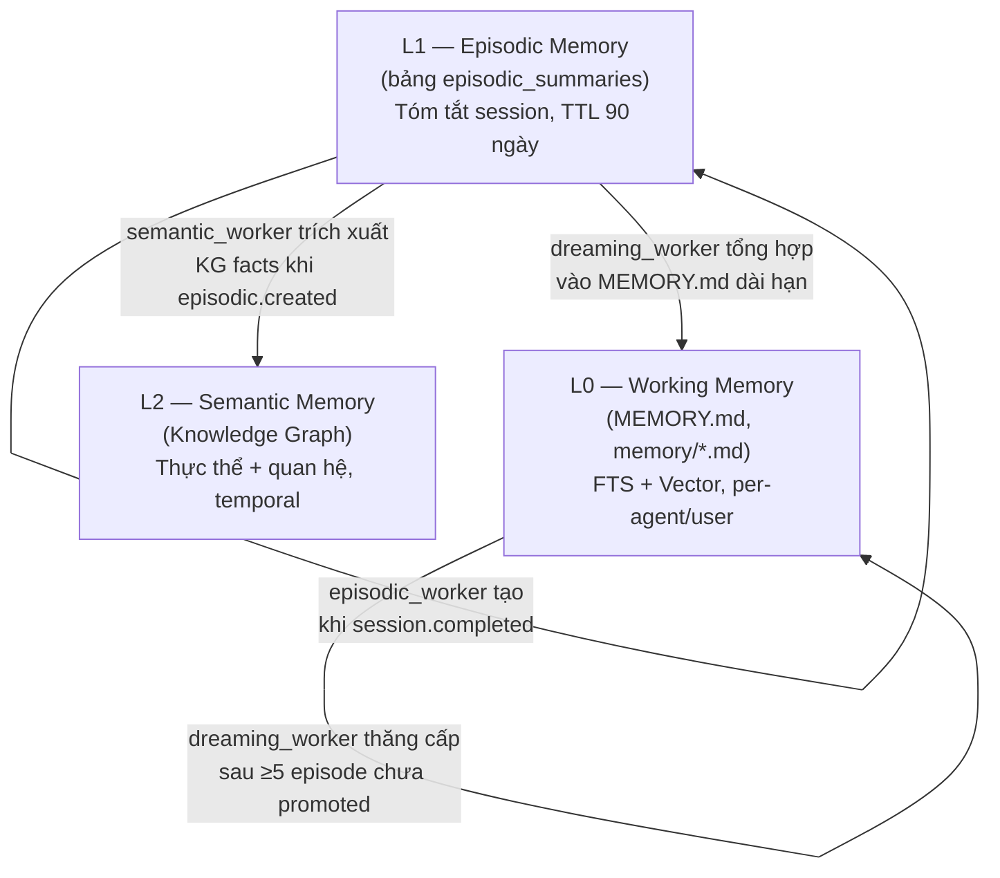
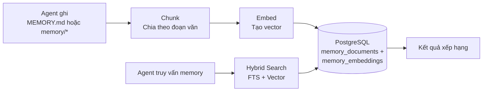
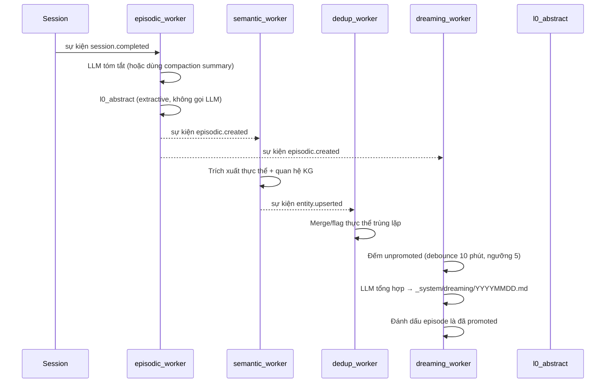

> Bản dịch từ [English version](../../core-concepts/memory-system.md)

# Memory System

> Cách agent ghi nhớ thông tin qua các cuộc hội thoại bằng kiến trúc 3 tầng với consolidation tự động.

## Tổng quan

GoClaw v3 cho agent khả năng memory dài hạn bền vững qua các session. Memory được tổ chức thành ba tầng — working memory, episodic memory và semantic memory — mỗi tầng phục vụ một mục đích riêng trong vòng đời ghi nhớ. Pipeline consolidation chạy nền tự động thăng cấp memory qua các tầng mà không cần agent can thiệp.

## Kiến Trúc Memory 3 Tầng

| Tầng | Lưu trữ | Nội dung | Thời gian tồn tại | Tìm kiếm |
|------|---------|---------|---------|--------|
| **L0 Working** | `memory_documents` + `memory_embeddings` | Thông tin agent tự lưu, ghi chú auto-flush, kết quả dreaming | Vĩnh viễn cho đến khi xóa | Hybrid FTS + vector |
| **L1 Episodic** | `episodic_summaries` | Tóm tắt session, key topic, L0 abstract | 90 ngày (có thể cấu hình) | FTS + HNSW vector |
| **L2 Semantic** | Bảng Knowledge Graph | Thực thể, quan hệ, cửa sổ hiệu lực temporal | Vĩnh viễn | Duyệt đồ thị |

### Ranh giới tầng và quy tắc thăng cấp

- **Session → L1**: Khi session kết thúc, `episodic_worker` tóm tắt session thành một dòng trong `episodic_summaries`. Dùng compaction summary nếu có; nếu không thì gọi LLM với tin nhắn session (timeout 30 giây, tối đa 1.024 token).
- **L1 → L2**: Sau khi mỗi episodic summary được tạo, `semantic_worker` trích xuất các thực thể và quan hệ KG từ văn bản tóm tắt và đưa vào knowledge graph với hiệu lực temporal (`valid_from` = now).
- **L1 → L0**: Khi có ≥5 episodic entry chưa được promoted cho một cặp agent/user, `dreaming_worker` tổng hợp chúng thành tài liệu Markdown dài hạn ghi vào `_system/dreaming/YYYYMMDD-consolidated.md` và đánh dấu các episode là đã promoted.

## Cách hoạt động

### Ghi Memory (L0)

Khi agent ghi vào `MEMORY.md` hoặc file trong `memory/*`, GoClaw:

1. **Chặn** thao tác ghi file (định tuyến đến DB, không phải filesystem)
2. **Chia chunk** văn bản theo ranh giới đoạn văn (tối đa 1.000 ký tự mỗi chunk)
3. **Embed** mỗi chunk bằng embedding provider được cấu hình
4. **Lưu** cả văn bản (với tsvector cho FTS) và embedding vector

> Chỉ file `.md` mới được chunk và embed. Các file không phải markdown (ví dụ `.json`, `.txt`) được lưu vào DB nhưng **không được lập chỉ mục hay tìm kiếm** qua `memory_search`.

### Tìm kiếm Memory

Khi agent gọi `memory_search`, GoClaw chạy hybrid search kết hợp FTS và vector similarity:

| Phương pháp | Trọng số | Cách hoạt động |
|-------------|:--------:|----------------|
| Full-text search (FTS) | 0.3 | PostgreSQL `tsvector` + `plainto_tsquery('simple')` — tốt cho thuật ngữ chính xác |
| Vector similarity | 0.7 | `pgvector` cosine distance — tốt cho nghĩa ngữ nghĩa |

**Thuật toán weighted merge**: FTS score được normalize về khoảng 0..1 (vector score đã là 0..1), sau đó kết hợp theo `(FTS × 0.3) + (vector × 0.7)`. Khi chỉ một kênh có kết quả, score của kênh đó được dùng trực tiếp (trọng số hiệu quả normalize về 1.0).

Kết quả sau đó được xếp hạng:

1. Per-user boost: kết quả có phạm vi user hiện tại nhận hệ số 1.2×
2. Deduplication: nếu cả kết quả user-scoped và global đều khớp, bản user thắng
3. Sắp xếp cuối theo weighted score

**Embedding cache**: Bảng `embedding_cache` được tích hợp vào hot path `IndexDocument`. Việc re-index nội dung không thay đổi sẽ tái sử dụng embedding đã cache thay vì gọi embedding provider, giảm độ trễ và chi phí API.

**Fallback**: nếu tìm kiếm per-user không có kết quả, GoClaw tự động fallback sang memory toàn cục. Áp dụng cho cả `MEMORY.md` và file `memory/*.md`.

### Knowledge Graph Search

`knowledge_graph_search` bổ sung cho `memory_search` khi cần truy vấn quan hệ và thực thể. Trong khi `memory_search` truy xuất các đoạn văn bản, `knowledge_graph_search` duyệt quan hệ giữa các thực thể — hữu ích cho câu hỏi như "Alice đang làm dự án nào?" hay "agent này dùng tool gì?"

## Consolidation Workers

Pipeline consolidation chạy hoàn toàn trong nền, theo hướng sự kiện qua internal event bus. Các worker được đăng ký một lần lúc khởi động qua `consolidation.Register()` và subscribe vào domain event.

### `episodic_worker`

**Trigger**: sự kiện `session.completed`
**Hành động**: Tạo một dòng `episodic_summaries` cho mỗi session hoàn thành.

- Kiểm tra `source_id` (`sessionKey:compactionCount`) để ngăn tạo summary trùng lặp.
- Dùng compaction summary nếu có; nếu không đọc tin nhắn session và gọi LLM với timeout 30 giây.
- Tạo **L0 abstract** — tóm tắt extractive 1 câu (~200 rune) để inject context nhanh, không gọi LLM.
- Trích xuất `key_topics` là các cụm danh từ riêng viết hoa để tăng cường FTS.
- Đặt `expires_at` là 90 ngày kể từ khi tạo (có thể cấu hình qua `episodic_ttl_days`).
- Phát sự kiện `episodic.created` cho các worker phía sau.

### `semantic_worker`

**Trigger**: sự kiện `episodic.created`
**Hành động**: Trích xuất thực thể và quan hệ knowledge graph từ văn bản episodic summary.

- Gọi `EntityExtractor` (trích xuất KG, không phải gọi LLM thô).
- Gán `valid_from = now()` và scope theo `agent_id` + `user_id` cho các thực thể được trích xuất.
- Đưa vào KG store qua `IngestExtraction`.
- Phát sự kiện `entity.upserted` cho dedup worker.
- Lỗi là non-fatal — lỗi trích xuất được ghi log warning và không chặn pipeline.

### `dedup_worker`

**Trigger**: sự kiện `entity.upserted`
**Hành động**: Phát hiện và merge các thực thể KG trùng lặp sau mỗi lần trích xuất.

- Gọi `kgStore.DedupAfterExtraction` với các entity ID vừa được upsert.
- Merge các thực thể tương đương về ngữ nghĩa và flag những thực thể mơ hồ.
- Worker cuối chuỗi — không phát sự kiện phía sau.
- Lỗi là non-fatal.

### `dreaming_worker`

**Trigger**: sự kiện `episodic.created`
**Hành động**: Tổng hợp các episodic summary chưa được promoted thành memory L0 dài hạn.

- **Debounce**: bỏ qua nếu đã chạy trong vòng 10 phút gần nhất cho cùng cặp agent/user.
- **Ngưỡng**: yêu cầu ≥5 episodic entry chưa promoted trước khi chạy (có thể cấu hình).
- Lấy tối đa 10 entry chưa promoted và gọi LLM để tổng hợp thông tin dài hạn (tối đa 4.096 token).
- Prompt tổng hợp trích xuất: sở thích người dùng, thông tin dự án, pattern lặp lại, quyết định quan trọng.
- Ghi kết quả vào `_system/dreaming/YYYYMMDD-consolidated.md` trong L0 memory và lập chỉ mục cho tìm kiếm.
- Đánh dấu tất cả entry đã xử lý là `promoted_at = now()`.

### `l0_abstract`

Không phải worker độc lập — là tiện ích được `episodic_worker` gọi để tạo L0 abstract ngắn từ summary đầy đủ. Dùng phương pháp extractive tách câu (không gọi LLM, không thêm độ trễ). Abstract được lưu trong cột `l0_abstract` của `episodic_summaries` và dùng bởi auto-injector.

**Dọn dẹp định kỳ**: Một goroutine chạy mỗi 6 giờ để xóa các episodic summary đã qua `expires_at`.

## Auto-Injector

**Auto-injector** tự động đưa các memory liên quan vào system prompt của agent ở đầu mỗi turn, trước khi gọi LLM.

- **Interface**: `AutoInjector.Inject(ctx, InjectParams)` — được gọi một lần mỗi turn trong giai đoạn build context.
- **Cách hoạt động**: Kiểm tra tin nhắn của người dùng với memory index. Trả về phần được định dạng cho system prompt (chuỗi rỗng nếu không có gì liên quan). Ngân sách: tối đa ~200 token L0 abstract.
- **Tham số mặc định** (có thể ghi đè per-agent trong `agents.settings` JSONB):

| Tham số | Mặc định | Mô tả |
|---------|---------|-------|
| `auto_inject_enabled` | `true` | Bật/tắt auto-injection |
| `auto_inject_threshold` | `0.3` | Điểm liên quan tối thiểu (0–1) để memory được inject |
| `auto_inject_max_tokens` | `200` | Ngân sách token cho phần memory được inject |
| `episodic_ttl_days` | `90` | Số ngày trước khi episodic summary hết hạn |
| `consolidation_enabled` | `true` | Bật/tắt pipeline consolidation |

Injector trả về `InjectResult` với các trường quan sát: `MatchCount`, `Injected` và `TopScore`.

## Trivial Filter

**Trivial filter** ngăn các tin nhắn ít giá trị kích hoạt memory injection, giảm truy vấn cơ sở dữ liệu không cần thiết.

`isTrivialMessage(msg)` trả về `true` khi tin nhắn chứa ít hơn 3 từ có nghĩa sau khi loại bỏ stopword (lời chào như "hi", "ok", "thanks", xác nhận, phản hồi một từ). Tin nhắn trivial bỏ qua hoàn toàn auto-injector.

## Memory vs Session

| Khía cạnh | Memory | Session |
|-----------|--------|---------|
| Thời gian tồn tại | Vĩnh viễn (cho đến khi xóa) | Per-conversation |
| Nội dung | Thông tin, tùy chọn, kiến thức | Lịch sử tin nhắn |
| Tìm kiếm | Hybrid (FTS + vector) | Truy cập tuần tự |
| Phạm vi | Per-user per-agent | Per-session key |

Memory dành cho những thứ đáng nhớ mãi mãi. Session dành cho luồng hội thoại.

## Auto Memory Flush

Trong quá trình [auto-compaction](../../core-concepts/sessions-and-history.md), GoClaw trích xuất thông tin quan trọng từ cuộc hội thoại và lưu vào memory trước khi tóm tắt history.

- **Trigger**: >50 tin nhắn HOẶC >85% context window (một trong hai điều kiện kích hoạt compaction)
- **Quy trình**: Flush đồng bộ, tối đa 5 lần lặp, timeout 90 giây
- **Những gì được lưu**: Thông tin quan trọng, tùy chọn người dùng, quyết định, action item
- **Thứ tự**: Memory flush chạy **trước** khi compaction history — thông tin được lưu bền vững trước, sau đó history mới được tóm tắt và rút gọn

Memory flush chỉ kích hoạt như một phần của auto-compaction — không hoạt động độc lập. Flush chạy đồng bộ trong compaction lock và ghi thêm thông tin trích xuất vào `memory/YYYY-MM-DD.md`. Điều này có nghĩa agent dần xây dựng kiến thức về mỗi người dùng mà không cần lệnh "nhớ cái này" rõ ràng.

### Extractive Memory Fallback

Nếu LLM-based flush thất bại (timeout, lỗi provider, output không hợp lệ), GoClaw sẽ fallback sang **extractive memory**: một lượt quét keyword-based qua cuộc hội thoại để trích xuất thông tin chính mà không cần gọi LLM. Điều này đảm bảo memory luôn được lưu dù LLM không khả dụng, với chất lượng trích xuất thấp hơn.

## Các Loại File Memory

GoClaw nhận diện bốn loại file memory:

| File | Vai trò | Ghi chú |
|---|---|---|
| `MEMORY.md` | Memory có cấu trúc (Markdown) | File chính; tự động đưa vào system prompt |
| `memory.md` | Fallback cho `MEMORY.md` | Được kiểm tra nếu thiếu `MEMORY.md` |
| `MEMORY.json` | Index machine-readable | Deprecated — không còn được khuyến nghị |
| Inline (`memory/*.md`) | File theo ngày từ auto-flush | Được lập chỉ mục và tìm kiếm; ví dụ `memory/2026-03-23.md` |

Tất cả variant `.md` đều được chunk, embed và tìm kiếm qua `memory_search`. `MEMORY.json` được lưu nhưng không được lập chỉ mục.

## Yêu cầu

Memory cần:

- **PostgreSQL 15+** với extension `pgvector`
- Một **embedding provider** được cấu hình (OpenAI, Anthropic, hoặc tương thích)
- `memory: true` trong agent config (bật mặc định)

Đặt `memory: false` trong config của agent để tắt hoàn toàn memory cho agent đó — không đọc, không ghi, không auto-flush.

## Chia sẻ Memory trong Team

Khi các agent làm việc theo [team](#agent-teams), thành viên có thể **đọc memory của leader** dưới dạng fallback:

- **`memory_search`**: Tìm trong memory riêng của thành viên trước. Nếu không có kết quả, tự động fallback sang memory của leader và merge kết quả.
- **`memory_get`**: Đọc từ memory riêng trước. Nếu file không tìm thấy, fallback sang memory của leader.
- **Ghi bị chặn**: Thành viên team không thể lưu hoặc sửa memory — chỉ leader mới có quyền ghi. Thành viên cố ghi sẽ nhận: *"memory is read-only for team members"*.

Điều này cho phép chia sẻ kiến thức trong team mà không cần sao chép. Leader tích lũy kiến thức chung, và tất cả thành viên tự động hưởng lợi.

## Các vấn đề thường gặp

| Vấn đề | Giải pháp |
|--------|-----------|
| Memory search không trả kết quả | Kiểm tra extension pgvector đã cài; xác minh embedding provider đã cấu hình |
| Agent quên mọi thứ | Đảm bảo `memory: true` trong config; kiểm tra auto-compaction có chạy không |
| Memory không liên quan xuất hiện | Memory tích lũy theo thời gian; cân nhắc xóa memory cũ qua API |
| Episodic summary không được tạo | Xác minh consolidation worker đã đăng ký lúc khởi động; kiểm tra event bus đang chạy |
| dreaming_worker không bao giờ promote | Kiểm tra ≥5 session đã hoàn thành cho cặp agent/user; xem log debounce |

## Tiếp theo

- [Multi-Tenancy](/multi-tenancy) — Cách ly memory per-user
- [Sessions and History](./sessions-and-history.md) — Lịch sử hội thoại hoạt động như thế nào
- [Context Pruning](/context-pruning) — Pruning tích hợp với pipeline consolidation như thế nào
- [Agents Explained](/agents-explained) — Loại agent và context file

<!-- goclaw-source: 050aafc9 | cập nhật: 2026-04-09 -->
