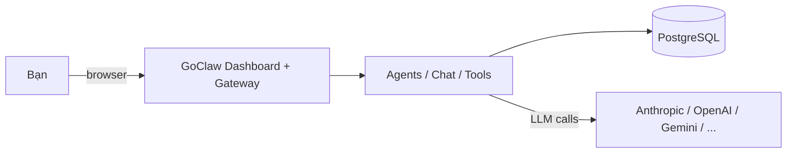
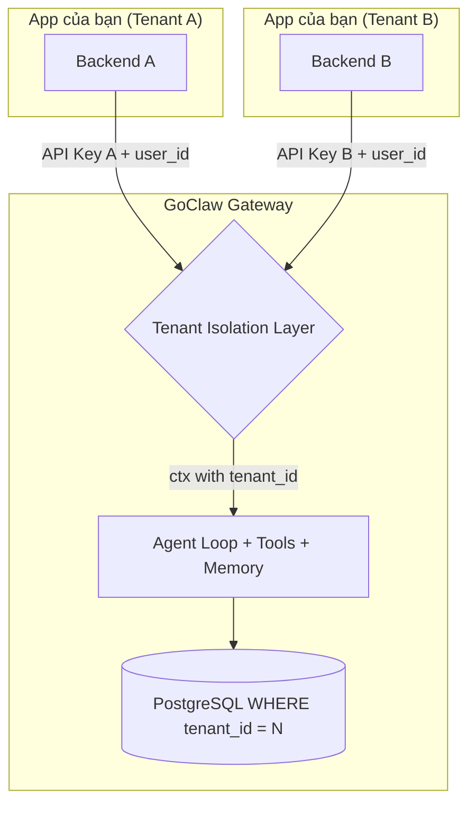
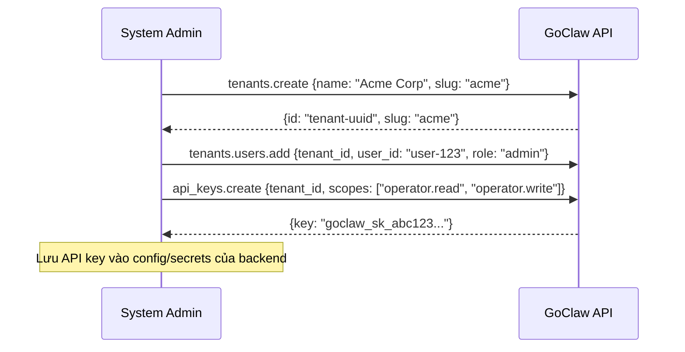

> Bản dịch từ [English version](../../core-concepts/multi-tenancy.md)

# Multi-Tenancy

> Cách GoClaw cô lập dữ liệu — từ một người dùng đơn lẻ đến một nền tảng SaaS với nhiều khách hàng.

## Tổng quan

GoClaw hỗ trợ hai chế độ triển khai: **personal** (single-tenant, một người dùng hoặc nhóm nhỏ) và **SaaS** (multi-tenant, nhiều khách hàng được cô lập). Cả hai chế độ dùng cùng một binary — bạn chọn chế độ bằng cách cấu hình và kết nối tới GoClaw. Trong cả hai chế độ, mọi dữ liệu đều được phân vùng để người dùng không thể thấy agent, session, hay memory của nhau.

---

## Chế độ triển khai

### Chế độ Personal (Single-Tenant)

Dùng GoClaw như một AI backend độc lập với dashboard web tích hợp sẵn. Không cần frontend hay backend riêng.



**Cách hoạt động:**
- Đăng nhập bằng gateway token qua dashboard web tích hợp sẵn
- Tạo agent, cấu hình LLM provider, chat — tất cả từ dashboard
- Kết nối các kênh chat (Telegram, Discord, v.v.) để nhắn tin
- Toàn bộ dữ liệu lưu dưới tenant "master" mặc định — không cần cấu hình tenant

**Thiết lập:**

```bash
# Build và onboard
go build -o goclaw . && ./goclaw onboard

# Khởi động gateway
source .env.local && ./goclaw

# Mở dashboard tại http://localhost:3777
# Đăng nhập bằng gateway token + user ID "system"
```

**Identity propagation:** GoClaw không tự xác thực người dùng. App của bạn truyền user ID qua header `X-GoClaw-User-Id` — GoClaw phân vùng toàn bộ dữ liệu theo ID đó. Mỗi người dùng có session, memory, context file, và workspace riêng biệt:

```bash
curl -X POST http://localhost:3777/v1/chat/completions \
  -H "Authorization: Bearer YOUR_GATEWAY_TOKEN" \
  -H "X-GoClaw-User-Id: user-123" \
  -H "Content-Type: application/json" \
  -d '{"model": "agent:my-agent", "messages": [{"role": "user", "content": "Xin chào"}]}'
```

**Khi nào dùng:** AI assistant cá nhân, nhóm nhỏ, công cụ self-hosted, phát triển và kiểm thử.

---

### Chế độ SaaS (Multi-Tenant)

Tích hợp GoClaw như AI engine phía sau ứng dụng SaaS của bạn. App của bạn xử lý auth, billing, và UI. GoClaw xử lý AI. Mỗi tenant được cô lập hoàn toàn — agent, session, memory, team, LLM provider, MCP server, và file.



**Cách hoạt động:**
- Backend của mỗi tenant kết nối bằng một **API key gắn với tenant** — GoClaw tự động phân vùng toàn bộ dữ liệu
- **Tenant Isolation Layer** phân giải `tenant_id` từ thông tin xác thực và đưa vào Go context
- Mọi câu SQL đều thực thi `WHERE tenant_id = $N` — fail-closed, không rò rỉ dữ liệu giữa các tenant

**Khi nào dùng:** Sản phẩm SaaS có tính năng AI, nền tảng đa khách hàng, giải pháp AI white-label.

---

## Thiết lập Tenant

Thiết lập tenant mới gồm ba bước: tạo tenant, thêm người dùng, rồi tạo API key cho backend của bạn.



Mỗi tenant có riêng: agent, session, team, memory, LLM provider, MCP server, và skill. Một API key gắn với tenant tự động phân vùng mọi request — không cần header bổ sung ngoài `X-GoClaw-User-Id`.

**Nâng cấp từ personal mode:** Khi bạn cần nhiều môi trường cô lập (khách hàng, phòng ban, dự án), hãy tạo thêm tenant. Tính năng multi-tenant sẽ kích hoạt tự động — không cần migration.

---

## Phân giải Tenant

GoClaw xác định tenant từ thông tin xác thực được dùng để kết nối:

| Thông tin xác thực | Phân giải tenant | Trường hợp dùng |
|---------------------|-----------------|-----------------|
| **Gateway token** + owner user ID | Tất cả tenant (cross-tenant) | Quản trị hệ thống |
| **Gateway token** + non-owner user ID | Tenant mà user là thành viên | Người dùng dashboard |
| **API key** (gắn tenant) | Tự động từ `tenant_id` của key | Tích hợp SaaS thông thường |
| **API key** (system-level) + `X-GoClaw-Tenant-Id` | Giá trị header (UUID hoặc slug) | Công cụ admin cross-tenant |
| **Browser pairing** | Tenant đã pair | Dashboard operator |
| **Không có thông tin xác thực** | Master tenant | Dev / single-user mode |

**Owner IDs:** Cấu hình qua `GOCLAW_OWNER_IDS` (cách nhau bằng dấu phẩy). Chỉ owner mới có quyền cross-tenant với gateway token. Mặc định: `system`.

**Khuyến nghị cho SaaS:** Dùng API key gắn với tenant. Tenant được phân giải tự động — backend của bạn không cần gửi thêm tenant header.

---

## HTTP API Headers

Tất cả HTTP endpoint chấp nhận các header chuẩn sau:

| Header | Bắt buộc | Mô tả |
|--------|:---:|-------|
| `Authorization` | Có | `Bearer <api-key-hoặc-gateway-token>` |
| `X-GoClaw-User-Id` | Có | User ID của app bạn (tối đa 255 ký tự). Phân vùng session và dữ liệu per-user |
| `X-GoClaw-Tenant-Id` | Không | UUID hoặc slug của tenant. Chỉ cần cho system-level key |
| `X-GoClaw-Agent-Id` | Không | ID của agent đích (thay thế cho field `model`) |
| `Accept-Language` | Không | Ngôn ngữ cho thông báo lỗi: `en`, `vi`, `zh` |

### Chat (tương thích OpenAI)

```bash
curl -X POST https://goclaw.example.com/v1/chat/completions \
  -H "Authorization: Bearer goclaw_sk_abc123..." \
  -H "X-GoClaw-User-Id: user-456" \
  -H "Content-Type: application/json" \
  -d '{
    "model": "agent:my-agent",
    "messages": [{"role": "user", "content": "Xin chào"}]
  }'
```

API key được gắn với tenant "Acme Corp" — response chỉ chứa dữ liệu thuộc tenant đó.

### Quản trị hệ thống (cross-tenant)

```bash
# Liệt kê agent của một tenant cụ thể (cần gateway token + owner user ID)
curl https://goclaw.example.com/v1/agents \
  -H "Authorization: Bearer $GATEWAY_TOKEN" \
  -H "X-GoClaw-Tenant-Id: acme" \
  -H "X-GoClaw-User-Id: system"
```

---

## Các loại kết nối

Tất cả kết nối đều đi qua Tenant Isolation Layer trước khi đến agent engine:

| Kết nối | Phương thức xác thực | Phân giải tenant | Cô lập |
|---------|---------------------|-----------------|--------|
| **HTTP API** | `Bearer` token | Tự động từ `tenant_id` của API key | Per-request |
| **WebSocket** | Token khi `connect` | Tự động từ `tenant_id` của API key | Per-session |
| **Chat Channels** | Không (webhook/WS) | Baked vào config của channel instance trong DB | Per-instance |
| **Dashboard** | Gateway token hoặc browser pairing | Tenant membership của user | Per-session |

**Chat channel** (Telegram, Discord, Zalo, Slack, WhatsApp, Feishu) kết nối trực tiếp tới GoClaw. Tenant isolation được baked vào channel instance lúc đăng ký — không cần API key cho từng message.

---

## API Key Scopes

API key dùng scope để kiểm soát mức quyền truy cập:

| Scope | Role | Quyền hạn |
|-------|------|-----------|
| `operator.admin` | admin | Toàn quyền — agent, config, API key, tenant |
| `operator.read` | viewer | Chỉ đọc — liệt kê agent, session, config |
| `operator.write` | operator | Đọc + ghi — chat, tạo session, quản lý agent |
| `operator.approvals` | operator | Duyệt/từ chối execution request |
| `operator.provision` | operator | Tạo tenant và quản lý tenant user |
| `operator.pairing` | operator | Quản lý device pairing |

Key có `["operator.read", "operator.write"]` có role `operator`. Key có `["operator.admin"]` có role `admin`.

---

## Per-Tenant Overrides

Tenant có thể tùy chỉnh môi trường của mình mà không ảnh hưởng đến tenant khác:

| Tính năng | Phạm vi | Cách thực hiện |
|-----------|---------|---------------|
| **LLM Providers** | Per-tenant | Mỗi tenant đăng ký API key và model riêng |
| **Builtin Tools** | Per-tenant | Bật/tắt qua `builtin_tool_tenant_configs` |
| **Skills** | Per-tenant | Bật/tắt qua `skill_tenant_configs` |
| **MCP Servers** | Per-tenant + per-user | Server-level dùng chung, user-level có thể override credential |

**Hai tầng credential của MCP:**
- **Server-level** (dùng chung): cấu hình trong form MCP server, dùng cho tất cả user trong tenant
- **User-level** (override): cấu hình qua "My Credentials" — API key per-user được merge lúc runtime (user thắng khi trùng key)

Khi `require_user_credentials` được bật trên MCP server, user không có personal credential sẽ không thể dùng server đó.

---

## Security Model

| Vấn đề | Cách GoClaw xử lý |
|--------|------------------|
| Lộ API key | Key chỉ nằm ở backend của bạn — không bao giờ gửi lên browser |
| Truy cập dữ liệu cross-tenant | Tất cả câu SQL đều có `WHERE tenant_id = $N` (fail-closed) |
| Rò rỉ event | Server-side 3-mode filter: unscoped admin, scoped admin, regular user |
| Thiếu tenant context | Fail-closed: trả về lỗi, không bao giờ trả dữ liệu không được lọc |
| Lưu trữ API key | Key được hash bằng SHA-256 at rest; UI chỉ hiển thị prefix |
| Giả mạo tenant | Tenant được phân giải từ binding của API key, không từ header của client |
| Leo thang đặc quyền | Role được suy ra từ scope của key, không từ claim của client |
| Lạm dụng gateway token | Chỉ owner ID được cấu hình mới có cross-tenant; các user khác bị phân vùng theo tenant |
| Thu hồi quyền truy cập tenant | WS event chủ động + lỗi `TENANT_ACCESS_REVOKED` buộc UI đăng xuất ngay lập tức |
| Bảo mật URL file | File token được ký bằng HMAC (`?ft=`) — gateway token không bao giờ xuất hiện trong URL |

---

## Dữ liệu được cô lập

Trong personal mode, mọi dữ liệu được phân vùng theo `user_id`:

| Dữ liệu | Bảng | Cô lập |
|---------|------|--------|
| Context file | `user_context_files` | Per-user per-agent |
| Agent profile | `user_agent_profiles` | Per-user per-agent |
| Agent override | `user_agent_overrides` | Per-user provider/model |
| Session | `sessions` | Per-user per-agent per-channel |
| Memory | `memory_documents` | Per-user per-agent |
| Trace | `traces` | Per-user filterable |
| MCP grant | `mcp_user_grants` | Per-user MCP server access |

Trong SaaS mode, cô lập theo user_id như trên vẫn áp dụng bên trong mỗi tenant, và **hơn 40 bảng** có cột `tenant_id` với ràng buộc NOT NULL để thực thi ranh giới tenant. `api_keys.tenant_id` có thể là NULL — NULL nghĩa là system-level cross-tenant key.

**Master tenant** (UUID `0193a5b0-7000-7000-8000-000000000001`): Toàn bộ dữ liệu legacy và mặc định. Triển khai single-tenant dùng duy nhất tenant này.

---

## Biến môi trường

| Biến | Mặc định | Mô tả |
|------|---------|-------|
| `GOCLAW_OWNER_IDS` | `system` | Danh sách user ID có quyền cross-tenant (cách nhau bằng dấu phẩy) |
| `GOCLAW_LOG_LEVEL` | `info` | Log level: `debug`, `info`, `warn`, `error` |
| `GOCLAW_CONFIG` | `config.json5` | Đường dẫn tới file cấu hình gateway |

---

## Sự cố thường gặp

| Vấn đề | Giải pháp |
|--------|-----------|
| Người dùng thấy dữ liệu của nhau | Kiểm tra `X-GoClaw-User-Id` được gửi đúng theo từng request |
| Không có user isolation | Đảm bảo bạn đang gửi header user ID; nếu thiếu, tất cả request dùng chung một session |
| Agent không truy cập được | Kiểm tra bảng `agent_shares`; user cần có share entry rõ ràng cho agent không phải mặc định |
| Trả về dữ liệu sai tenant | Dùng API key gắn tenant — đừng dựa vào header `X-GoClaw-Tenant-Id` trừ khi dùng system-level key |
| Cross-tenant access bị từ chối | Kiểm tra user ID có trong `GOCLAW_OWNER_IDS` cho các thao tác admin |

---

## Tiếp theo

- [How GoClaw Works](how-goclaw-works.md) — Tổng quan kiến trúc
- [Sessions and History](sessions-and-history.md) — Quản lý session per-user
- [Agents Explained](agents-explained.md) — Các loại agent và kiểm soát truy cập
- [API Keys](../getting-started/api-keys.md) — Tạo và quản lý API key

<!-- goclaw-source: latest | cập nhật: 2026-03-23 -->
