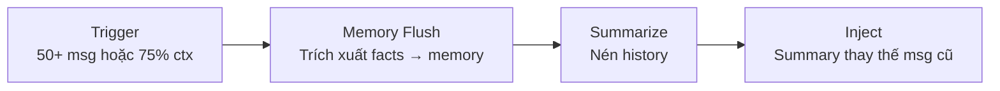

> Bản dịch từ [English version](/sessions-and-history)

# Sessions và History

> Cách GoClaw theo dõi cuộc hội thoại và quản lý lịch sử tin nhắn.

## Tổng quan

Session là một luồng hội thoại giữa người dùng và agent trên một channel cụ thể. GoClaw lưu lịch sử tin nhắn trong PostgreSQL, tự động nén cuộc hội thoại dài, và quản lý concurrency để các agent không xung đột nhau.

## Session Key

Mỗi session có một key duy nhất xác định người dùng, agent, channel, và loại chat:

```
agent:{agentId}:{channel}:{kind}:{chatId}
```

| Loại | Định dạng key | Ví dụ |
|------|--------------|-------|
| DM | `agent:default:telegram:direct:386246614` | Chat riêng |
| Group | `agent:default:telegram:group:-100123456` | Chat nhóm |
| Topic | `agent:default:telegram:group:-100123456:topic:99` | Forum topic |
| Thread | `agent:default:telegram:direct:386246614:thread:5` | Reply theo thread |
| Subagent | `agent:default:subagent:my-task` | Subtask được spawn |
| Cron | `agent:default:cron:reminder-job` | Job lên lịch |

Định dạng key này có nghĩa là cùng một người dùng chat với cùng một agent trên Telegram và Discord sẽ có hai session riêng với lịch sử độc lập.

> **Session Metadata:** Mỗi session theo dõi các trường bổ sung bên cạnh key: `label` (tên hiển thị), `channel`, `model`, `provider`, `spawned_by` (ID session cha cho subagent), `spawn_depth`, `input_tokens`, `output_tokens`, `compaction_count`, và `context_window`. Các trường này có thể truy vấn cho mục đích phân tích và debugging.

## Lưu trữ tin nhắn

Tin nhắn được lưu dưới dạng JSONB trong PostgreSQL với write-behind cache:

1. **Đọc** — Lần đầu truy cập, load từ DB vào memory cache
2. **Ghi** — Tin nhắn tích lũy trong memory trong suốt một lượt
3. **Flush** — Cuối lượt, tất cả tin nhắn ghi vào DB nguyên tử
4. **Liệt kê** — Liệt kê session luôn đọc từ DB (không phải cache)

Cách này tối thiểu hóa DB write trong khi đảm bảo durability.

## History Pipeline

Trước khi gửi history cho LLM, GoClaw chạy pipeline 3 giai đoạn:

### 1. Giới hạn lượt

Chỉ giữ N lượt user gần nhất (và các tin nhắn assistant/tool liên quan). Các lượt cũ hơn bị loại bỏ để nằm trong context window.

### 2. Prune Context

Kết quả tool có thể lớn. GoClaw cắt bớt qua hai lượt:

| Điều kiện | Hành động |
|-----------|----------|
| Token ratio ≥ 0.3 | **Soft trim**: Kết quả tool vượt quá 4.000 ký tự → giữ 1.500 đầu + 1.500 cuối |
| Token ratio ≥ 0.5 | **Hard clear**: Thay toàn bộ kết quả tool bằng `[Old tool result content cleared]` |

Tin nhắn được bảo vệ (không bao giờ bị prune): 3 tin nhắn assistant gần nhất. System message và tin nhắn user đầu tiên tạo thành tiền tố ổn định (stable prefix) không bao giờ bị prune.

### 3. Sanitize

Sửa các cặp tool_use/tool_result bị tách vỡ do truncation. LLM kỳ vọng các cặp khớp nhau — tool call mồ côi gây lỗi.

## Kiến trúc Pipeline V3

Trong v3 (bật qua feature flag `pipeline_enabled`), agent loop được tái cấu trúc thành **pipeline 8 giai đoạn** thay thế `runLoop()` monolithic của v2. Luồng session tương ứng với các giai đoạn sau:

| Giai đoạn | Nội dung |
|-----------|---------|
| **ContextStage** (một lần) | Inject context, resolve workspace per-user, đảm bảo file per-user tồn tại |
| **ThinkStage** | Xây dựng system prompt, chạy history pipeline, lọc tool (PolicyEngine), gọi LLM |
| **PruneStage** | Ước tính token ratio; soft trim ≥30%, hard clear ≥50%; trigger memory flush nếu vượt ngưỡng compaction |
| **ToolStage** | Thực thi tool call — một tool tuần tự, nhiều tool song song với sắp xếp kết quả |
| **ObserveStage** | Xử lý kết quả tool, xử lý `NO_REPLY`, thêm tin nhắn assistant |
| **CheckpointStage** | Tăng counter iteration; dừng khi đạt max iteration hoặc bị hủy |
| **FinalizeStage** (một lần) | Sanitize output, flush tin nhắn nguyên tử, cập nhật metadata session, emit run event |

**Memory consolidation trong v3**: PruneStage kích hoạt memory flush **đồng bộ trong vòng lặp iteration** (không chỉ cuối session). Điều này có nghĩa là các lượt chạy dài trích xuất episodic fact trước khi history bị prune, thay vì chờ giai đoạn compaction sau lượt. Ngưỡng 75% context window vẫn áp dụng.

Cả v2 và v3 đều có hành vi bên ngoài giống hệt nhau; sự khác biệt pipeline là kiến trúc nội bộ.

## Auto-Compaction

Cuộc hội thoại dài kích hoạt nén tự động:

**Trigger:**
- Hơn 50 tin nhắn trong session, HOẶC
- History vượt quá 75% context window của agent

**Điều gì xảy ra:**



1. **Memory flush** (đồng bộ, timeout 90 giây) — Thông tin quan trọng được trích xuất và lưu vào hệ thống memory
2. **Summarize** (nền, timeout 120 giây) — Tin nhắn cũ được nén thành summary
3. **Inject** — Summary thay thế tin nhắn cũ; ít nhất 4 tin nhắn (hoặc 30% tổng số, tùy giá trị nào lớn hơn) được giữ nguyên

Một per-session lock ngăn nén đồng thời. Nếu lần nén thứ hai kích hoạt trong khi một lần đang chạy, nó sẽ bị bỏ qua.

### Nén giữa vòng lặp (Mid-Loop Compaction)

GoClaw cũng có thể nén history **trong khi agent đang xử lý một lượt dài** nếu context vượt ngưỡng giữa vòng lặp. Logic tóm tắt 75% vẫn được áp dụng. Điều này hoàn toàn trong suốt với agent — nó tiếp tục chạy với history đã được nén.

## Concurrency

| Loại chat | Tối đa đồng thời | Ghi chú |
|-----------|:-----------:|-------|
| DM | 1 | Single-threaded — tin nhắn xếp hàng |
| Group | 1 (có thể cấu hình) | Mặc định tuần tự; có thể tăng qua `ScheduleOpts.MaxConcurrent` |

Group session có thể giảm concurrency khi mức sử dụng context cao.

> **Cấu hình concurrency:** Cả DM và Group đều mặc định xử lý tuần tự (`MaxConcurrent: 1`). Giá trị cao hơn (ví dụ: 3) có thể được đặt cho thành viên team hoặc agent link thông qua `ScheduleOpts.MaxConcurrent`.

### Queue Mode

| Mode | Hành vi |
|------|---------|
| `queue` | FIFO — tin nhắn xử lý theo thứ tự |
| `followup` | Tin nhắn mới gộp với tin nhắn đang xếp hàng |
| `interrupt` | Hủy tác vụ hiện tại, xử lý tin nhắn mới |

Dung lượng queue mặc định là 10. Khi đầy, tin nhắn cũ nhất bị loại bỏ (drop policy: `old`). Cửa sổ debounce mặc định là 800ms — các tin nhắn đến nhanh trong khoảng thời gian này được gộp lại trước khi xử lý.

### User Control

- `/stop` — Hủy tác vụ đang chạy lâu nhất
- `/stopall` — Hủy tất cả tác vụ và xóa queue

## Các vấn đề thường gặp

| Vấn đề | Giải pháp |
|--------|-----------|
| Agent "quên" tin nhắn cũ | History đã được nén; kiểm tra memory để xem facts được trích xuất |
| Phản hồi chậm trong group | Giảm group concurrency hoặc kích thước context window |
| Phản hồi trùng | Kiểm tra queue mode; mode `queue` ngăn điều này |

## Tiếp theo

- [Memory System](./memory-system.md) — Memory dài hạn hoạt động như thế nào
- [Tools Overview](/tools-overview) — Tool có sẵn cho agent
- [Multi-Tenancy](/multi-tenancy) — Cách ly session per-user

<!-- goclaw-source: 050aafc9 | cập nhật: 2026-04-09 -->
