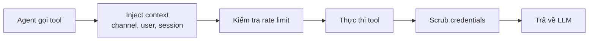

> Bản dịch từ [English version](../../core-concepts/tools-overview.md)

# Tools Overview

> 34+ tool tích hợp sẵn mà agent có thể dùng, được phân loại theo nhóm.

## Tổng quan

Tool là cách agent tương tác với thế giới ngoài việc tạo ra văn bản. Agent có thể tìm kiếm web, đọc file, chạy code, truy vấn memory, phân công cho agent khác, và nhiều hơn. GoClaw gồm 34+ tool tích hợp sẵn (có thể mở rộng qua MCP và custom tool per-agent) thuộc 13 danh mục.

## Danh mục Tool

| Danh mục | Tool | Chức năng |
|----------|-------|----------|
| **Filesystem** | read_file, write_file, edit, list_files | Đọc, ghi, và chỉnh sửa file trong workspace của agent |
| **Runtime** | exec | Chạy lệnh shell |
| **Web** | web_search, web_fetch | Tìm kiếm web (Brave/DuckDuckGo) và fetch trang |
| **Memory** | memory_search, memory_get, knowledge_graph_search | Truy vấn memory dài hạn (hybrid vector + FTS search) và knowledge graph |
| **Sessions** | sessions_list, sessions_history, sessions_send, session_status | Quản lý conversation session |
| **Delegation** | handoff, delegate_search, evaluate_loop | Phân công tác vụ cho agent khác |
| **Subagents** | spawn | Spawn subtask dưới dạng subagent |
| **Teams** | team_tasks, team_message | Cộng tác với agent team qua task board |
| **UI** | browser | Duyệt web |
| **Automation** | cron | Lên lịch job định kỳ |
| **Messaging** | message | Gửi tin nhắn |
| **Media** | read_image, create_image, read_document, read_audio, read_video, create_video, create_audio, tts | Đọc và tạo hình ảnh, tài liệu, audio, video, và text-to-speech |
| **Skills** | use_skill, skill_search, publish_skill | Khám phá, gọi, và xuất bản skill |

> Các tool bổ sung như `mcp_tool_search` và tool đặc thù theo channel được đăng ký động.

## Luồng thực thi Tool

Khi agent gọi một tool:



1. **Inject context** — Channel, chat ID, user ID, và sandbox key được inject
2. **Rate limit** — Rate limiter per-session ngăn lạm dụng
3. **Thực thi** — Tool chạy và tạo output
4. **Scrub** — Credentials và dữ liệu nhạy cảm được xóa khỏi output
5. **Trả về** — Kết quả sạch trả về LLM cho lần lặp tiếp theo

## Tool Profile

Profile kiểm soát tool nào agent có thể truy cập:

| Profile | Tool có sẵn |
|---------|-------------|
| `full` | Tất cả tool |
| `coding` | Filesystem, runtime, sessions, memory, web, images, skills |
| `messaging` | Messaging, web, sessions, images, skills |
| `minimal` | Chỉ session_status |

Đặt profile trong agent config:

```jsonc
{
  "agents": {
    "defaults": {
      "tools_profile": "full"
    },
    "list": {
      "readonly-bot": {
        "tools_profile": "messaging"
      }
    }
  }
}
```

## Policy Engine

Ngoài profile, policy engine 7 bước cho phép kiểm soát chi tiết:

1. Profile toàn cục (bộ cơ sở)
2. Ghi đè profile theo provider
3. Allow list toàn cục (giao nhau)
4. Allow override theo provider
5. Allow list per-agent
6. Allow per-agent per-provider
7. Allow cấp group

Sau allow list, **deny list** xóa tool, rồi **alsoAllow** thêm lại (hợp nhất).

### Ví dụ: Giới hạn Agent

```jsonc
{
  "agents": {
    "list": {
      "safe-bot": {
        "tools_profile": "full",
        "tools_deny": ["exec", "write_file"],
        "tools_also_allow": ["read_file"]
      }
    }
  }
}
```

## Filesystem Interceptor

Hai interceptor đặc biệt định tuyến thao tác file đến database:

### Context File Interceptor

Khi agent đọc/ghi context file (SOUL.md, IDENTITY.md, AGENTS.md, USER.md, USER_PREDEFINED.md, BOOTSTRAP.md), thao tác được định tuyến đến bảng `user_context_files` thay vì filesystem. TOOLS.md bị loại trừ khỏi routing. Điều này cho phép tùy chỉnh per-user và cách ly đa tenant.

### Memory Interceptor

Ghi vào `MEMORY.md` hoặc `memory/*` được định tuyến đến bảng `memory_documents`, tự động chia chunk và tạo embedding để tìm kiếm.

## Bảo mật Shell

Tool `exec` có deny pattern tích hợp sẵn để ngăn lệnh nguy hiểm:

| Danh mục | Pattern bị chặn |
|----------|-----------------|
| Destructive | `rm -rf /`, `del /f`, `rmdir /s` |
| Disk | `mkfs`, `dd if=`, `> /dev/sd*` |
| System | `shutdown`, `reboot`, `poweroff` |
| Fork bomb | `:(){ ... };:` |
| RCE | `curl \| sh`, `wget -O - \| sh` |
| Reverse shell | `/dev/tcp/`, `nc -e` |
| Eval | `eval $()`, `base64 -d \| sh` |

Cài đặt `tools.exec_approval` thêm một lớp phê duyệt bổ sung (`full`, `light`, hoặc `none`).

## Custom Tool và MCP

Ngoài tool tích hợp sẵn, bạn có thể mở rộng agent bằng:

- **Custom Tool** — Định nghĩa tool qua dashboard hoặc API với input schema và handler
- **MCP Server** — Kết nối Model Context Protocol server để đăng ký tool động

Xem [Custom Tools](#custom-tools) và [MCP Integration](#mcp-integration) để biết chi tiết.

## Các vấn đề thường gặp

| Vấn đề | Giải pháp |
|--------|-----------|
| Agent không dùng được tool | Kiểm tra tools_profile và deny list; xác minh tool tồn tại trong profile |
| Lệnh shell bị chặn | Xem lại deny pattern; điều chỉnh mức `exec_approval` |
| Kết quả tool quá lớn | GoClaw tự động cắt kết quả >4.000 ký tự; thử query cụ thể hơn |

## Tiếp theo

- [Memory System](memory-system.md) — Memory dài hạn và tìm kiếm hoạt động như thế nào
- [Multi-Tenancy](multi-tenancy.md) — Truy cập tool per-user và cách ly
- [Custom Tools](#custom-tools) — Xây dựng tool của riêng bạn
