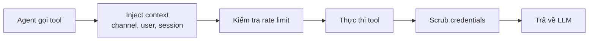

> Bản dịch từ [English version](/tools-overview)

# Tools Overview

> 50+ tool tích hợp sẵn mà agent có thể dùng, được phân loại theo nhóm.

## Tổng quan

Tool là cách agent tương tác với thế giới ngoài việc tạo ra văn bản. Agent có thể tìm kiếm web, đọc file, chạy code, truy vấn memory, cộng tác qua agent team, và nhiều hơn. GoClaw gồm 50+ tool tích hợp sẵn (có thể mở rộng qua MCP và custom tool per-agent) thuộc 14 danh mục.

## Danh mục Tool

| Danh mục | Tool | Chức năng |
|----------|-------|----------|
| **Filesystem** (`group:fs`) | read_file, write_file, edit, list_files, search, glob | Đọc, ghi, chỉnh sửa và tìm kiếm file trong workspace của agent |
| **Runtime** (`group:runtime`) | exec, credentialed_exec | Chạy lệnh shell; thực thi CLI tool với credentials được inject |
| **Web** (`group:web`) | web_search, web_fetch | Tìm kiếm web (Exa, Tavily, Brave, DuckDuckGo) và fetch trang |
| **Memory** (`group:memory`) | memory_search, memory_get, memory_expand | Truy vấn memory dài hạn (hybrid vector + FTS search); mở rộng nội dung episodic đầy đủ theo ID (L2 retrieval) |
| **Knowledge** (`group:knowledge`) | vault_search, knowledge_graph_search, skill_search | Tìm kiếm thống nhất vault/memory/knowledge-graph; tìm kiếm thực thể và quan hệ; khám phá skill |
| **Vault** | vault_search | Tìm kiếm vault document và knowledge graph |
| **Sessions** (`group:sessions`) | sessions_list, sessions_history, sessions_send, session_status, spawn | Quản lý conversation session; spawn subagent |
| **Teams** (`group:teams`) | team_tasks, team_message | Cộng tác với agent team qua task board và mailbox chung |
| **Automation** (`group:automation`) | cron, datetime | Lên lịch job định kỳ; lấy ngày/giờ hiện tại |
| **Messaging** (`group:messaging`) | message, create_forum_topic | Gửi tin nhắn; tạo topic forum Telegram |
| **Tạo Media** (`group:media_gen`) | create_image, create_image_byteplus, create_audio, create_video, create_video_byteplus, tts | Tạo hình ảnh, audio, video, và text-to-speech |
| **Browser** | browser | Điều hướng trang web, chụp ảnh màn hình, tương tác với element |
| **Đọc Media** (`group:media_read`) | read_image, read_audio, read_document, read_video | Phân tích hình ảnh, chuyển ngữ audio, trích xuất tài liệu, phân tích video |
| **Skills** (`group:skills`) | use_skill, publish_skill | Gọi và xuất bản skill |
| **Workspace** | workspace_dir | Resolve workspace directory theo team/user context |
| **AI** | openai_compat_call | Gọi endpoint tương thích OpenAI với định dạng request tùy chỉnh |

### Provider web_search

`web_search` hỗ trợ bốn provider, được thử theo thứ tự:

| Provider | Ghi chú |
|----------|---------|
| **Exa** | Yêu cầu `EXA_API_KEY` |
| **Tavily** | Yêu cầu `TAVILY_API_KEY` |
| **Brave** | Yêu cầu `BRAVE_API_KEY` |
| **DuckDuckGo** | Fallback miễn phí — dùng cuối cùng nếu không có API key cho các provider khác |

Cấu hình thứ tự provider qua `provider_order` trong cài đặt tool:

```json
{
  "tools": {
    "web_search": {
      "provider_order": ["exa", "tavily", "brave", "duckduckgo"]
    }
  }
}
```

DuckDuckGo không cần API key và luôn khả dụng như fallback cuối cùng.

### Tool Memory & Vault mới trong V3

**Memory layers** (v3 hai tầng retrieval):

| Tool | Tầng | Mô tả |
|------|------|-------|
| `memory_search` | L1 | BM25 + hybrid vector search; trả về abstract và điểm số |
| `memory_expand` | L2 | Load nội dung episodic đầy đủ theo ID từ kết quả `memory_search` |

Dùng `memory_search` trước để khám phá ID episodic liên quan, sau đó `memory_expand` để lấy nội dung đầy đủ. Cách này tiết kiệm token khi chỉ cần một vài entry.

**Vault linking** hiện được xử lý tự động bởi enrichment pipeline. Xem [Knowledge Vault](../../advanced/knowledge-vault.md).

> `vault_link` và `vault_backlinks` đã bị xóa. Việc tạo wikilink tường minh và tra cứu backlink không còn cần thiết — enrichment pipeline tự động quản lý các mối quan hệ tài liệu.

**Tool media BytePlus** (`create_image_byteplus`, `create_video_byteplus`) khả dụng khi cấu hình provider `byteplus`. Cả hai dùng async job polling: tạo ảnh qua Seedream trả về URL sau khi job hoàn thành; tạo video qua Seedance polling `/text-to-video-pro/status/{id}` để lấy kết quả.

> Các tool bổ sung như `mcp_tool_search` và tool đặc thù theo channel được đăng ký động. Tool group có thể dùng tiền tố `group:` trong allow/deny list (ví dụ: `group:fs`).

> **Lưu ý về delegation**: Tool `delegate` đã bị xóa. Delegation hiện được thực hiện hoàn toàn qua agent team: lead tạo task trên board chung (`team_tasks`) và delegate cho member agent qua `spawn`. Xem [Agent Teams](#agent-teams) để biết thêm.

## Luồng thực thi Tool

Khi agent gọi một tool:



1. **Inject context** — Channel, chat ID, user ID, và sandbox key được inject
2. **Rate limit** — Rate limiter per-session ngăn lạm dụng
3. **Thực thi** — Tool chạy và tạo output
4. **Scrub** — Credentials và dữ liệu nhạy cảm được xóa khỏi output
5. **Trả về** — Kết quả sạch trả về LLM cho lần lặp tiếp theo

## Tool Profile

Profile kiểm soát tool nào agent có thể truy cập:

| Profile | Tool có sẵn |
|---------|-------------|
| `full` | Tất cả tool đã đăng ký (không giới hạn) |
| `coding` | `group:fs`, `group:runtime`, `group:sessions`, `group:memory`, `group:web`, `group:knowledge`, `group:media_gen`, `group:media_read`, `group:skills` |
| `messaging` | `group:messaging`, `group:web`, `group:sessions`, `group:media_read`, `skill_search` |
| `minimal` | Chỉ `session_status` |

Đặt profile trong agent config:

```jsonc
{
  "agents": {
    "defaults": {
      "tools_profile": "full"
    },
    "list": {
      "readonly-bot": {
        "tools_profile": "messaging"
      }
    }
  }
}
```

## Tool Aliases

GoClaw đăng ký alias để agent có thể tham chiếu tool bằng tên khác. Điều này cho phép tương thích với Claude Code skills và các tên tool cũ:

| Alias | Maps to |
|-------|---------|
| `Read` | `read_file` |
| `Write` | `write_file` |
| `Edit` | `edit` |
| `Bash` | `exec` |
| `WebFetch` | `web_fetch` |
| `WebSearch` | `web_search` |
| `edit_file` | `edit` |

Alias xuất hiện dưới dạng mô tả một dòng trong system prompt. Chúng không phải tool riêng biệt — gọi alias sẽ kích hoạt tool gốc.

### Sắp xếp xác định (Deterministic Ordering)

Tất cả tên tool, alias và mô tả MCP tool được sắp xếp theo thứ tự chữ cái trước khi đưa vào system prompt. Điều này đảm bảo prompt prefix giống hệt nhau giữa các request, tối đa hóa tỷ lệ cache hit của LLM prompt (Anthropic và OpenAI cache theo exact prefix match).

## Policy Engine

Ngoài profile, policy engine 7 bước cho phép kiểm soát chi tiết:

1. Profile toàn cục (bộ cơ sở)
2. Ghi đè profile theo provider
3. Allow list toàn cục (giao nhau)
4. Allow override theo provider
5. Allow list per-agent
6. Allow per-agent per-provider
7. Allow cấp group

Sau allow list, **deny list** xóa tool, rồi **alsoAllow** thêm lại (hợp nhất). Tool group (`group:fs`, `group:runtime`, v.v.) có thể dùng trong bất kỳ allow/deny list nào.

### Ví dụ: Giới hạn Agent

```jsonc
{
  "agents": {
    "list": {
      "safe-bot": {
        "tools_profile": "full",
        "tools_deny": ["exec", "write_file"],
        "tools_also_allow": ["read_file"]
      }
    }
  }
}
```

## Filesystem Interceptor

Hai interceptor đặc biệt định tuyến thao tác file đến database:

### Context File Interceptor

Khi agent đọc/ghi context file (SOUL.md, IDENTITY.md, AGENTS.md, USER.md, USER_PREDEFINED.md, BOOTSTRAP.md, HEARTBEAT.md), thao tác được định tuyến đến bảng `user_context_files` thay vì filesystem. TOOLS.md bị loại trừ khỏi routing. Điều này cho phép tùy chỉnh per-user và cách ly đa tenant.

### Memory Interceptor

Ghi vào `MEMORY.md`, `memory.md`, hoặc `memory/*` được định tuyến đến bảng `memory_documents`, tự động chia chunk và tạo embedding để tìm kiếm.

## Bảo mật Shell

### `credentialed_exec` — Inject Credentials Bảo mật cho CLI

Tool `credentialed_exec` chạy CLI tool (gh, gcloud, aws, kubectl, terraform) với credentials được tự động inject trực tiếp vào process con dưới dạng biến môi trường — không qua shell, không lộ credentials. Các lớp bảo mật: xác minh đường dẫn (chặn giả mạo `./gh`), chặn toán tử shell (`;`, `|`, `&&`), pattern deny per-binary (ví dụ: chặn `auth\s+`), và output scrubbing.

### `exec` — Bảo mật Shell

Tool `exec` áp dụng 15 nhóm deny — tất cả đều bật theo mặc định:

| Nhóm | Pattern bị chặn |
|------|-----------------|
| `destructive_ops` | `rm -rf`, `del /f`, `mkfs`, `dd`, `shutdown`, fork bomb |
| `data_exfiltration` | `curl\|sh`, `wget\|sh`, DNS exfil, `/dev/tcp/`, curl POST/PUT, truy cập localhost |
| `reverse_shell` | `nc`/`ncat`/`netcat`, `socat`, `openssl s_client`, `telnet`, socket python/perl/ruby/node, `mkfifo` |
| `code_injection` | `eval $`, `base64 -d\|sh` |
| `privilege_escalation` | `sudo`, `su -`, `nsenter`, `unshare`, `mount`, `capsh`/`setcap` |
| `dangerous_paths` | `chmod` trên `/`, `chown` trên `/`, `chmod +x` trên `/tmp` `/var/tmp` `/dev/shm` |
| `env_injection` | `LD_PRELOAD`, `DYLD_INSERT_LIBRARIES`, `LD_LIBRARY_PATH`, `GIT_EXTERNAL_DIFF`, `BASH_ENV` |
| `container_escape` | `docker.sock`, `/proc/sys/`, `/sys/` |
| `crypto_mining` | `xmrig`, `cpuminer`, `stratum+tcp://` |
| `filter_bypass` | `sed /e`, `sort --compress-program`, `git --upload-pack`, `rg --pre=`, `man --html=` |
| `network_recon` | `nmap`/`masscan`/`zmap`, `ssh/scp@`, tunnel `chisel`/`ngrok`/`cloudflared` |
| `package_install` | `pip install`, `npm install`, `apk add`, `yarn add`, `pnpm add` |
| `persistence` | `crontab`, ghi vào `.bashrc`/`.profile`/`.zshrc` |
| `process_control` | `kill -9`, `killall`, `pkill` |
| `env_dump` | `env`, `printenv`, `/proc/*/environ`, `echo $GOCLAW_*` secrets |

### Ghi đè Per-Agent

Admin có thể tắt nhóm cụ thể theo từng agent:

```jsonc
{
  "agents": {
    "list": {
      "dev-bot": {
        "shell_deny_groups": {
          "package_install": false,
          "process_control": false
        }
      }
    }
  }
}
```

### Kiểm tra Exemption nghiêm ngặt

Khi lệnh shell khớp deny pattern, GoClaw kiểm tra path exemption (ví dụ: `.goclaw/skills-store/`). Logic exemption rất chặt chẽ:

- **Tất cả hoặc không** — Mọi field trong lệnh khớp deny pattern đều phải được exemption riêng lẻ. Một field không được exempt sẽ chặn toàn bộ lệnh
- **Chặn path traversal** — Field chứa `..` không bao giờ được exempt, ngăn chặn escape qua `../../etc/passwd`
- **Loại bỏ dấu ngoặc** — Dấu ngoặc bao quanh (`"`, `'`) được loại trước khi so khớp, vì LLM thường đặt path trong ngoặc

Điều này ngăn chặn tấn công bypass qua pipe/comment như `cat /app/data/skills-store/tool.py | cat /app/data/secret` — field thứ hai khớp deny nhưng không có exemption, nên toàn bộ lệnh bị chặn.

Cài đặt `tools.exec_approval` thêm một lớp phê duyệt bổ sung (`full`, `light`, hoặc `none`).

## spawn — Điều phối Subagent

Tool `spawn` (thuộc `group:sessions`) tạo và chạy subagent. Các tính năng chính:

| Tính năng | Chi tiết |
|-----------|---------|
| **WaitAll** | `spawn(action=wait, timeout=N)` chặn parent cho đến khi tất cả các children đã spawn hoàn tất. Hữu ích cho pattern fan-out/fan-in. |
| **Auto-retry** | `MaxRetries` có thể cấu hình (mặc định `2`) với linear backoff khi LLM gặp lỗi. Lỗi tạm thời được tự động retry. |
| **Token tracking** | Mỗi subagent tích lũy số token input/output theo từng lần gọi. Tổng cộng được đưa vào announce message để parent có thể theo dõi chi phí. |
| **SubagentDenyAlways** | Subagent không thể spawn subagent lồng nhau — tool `team_tasks` bị chặn trong ngữ cảnh subagent. Ngăn chuỗi delegation không giới hạn. |
| **Producer-consumer announce queue** | Kết quả subagent lệch nhau được xếp hàng và gộp thành một lần announce LLM run duy nhất ở phía parent, giảm bớt các lần đánh thức không cần thiết. |

```jsonc
// Ví dụ: fan-out rồi wait
spawn(action=start, prompt="Summarize part A")
spawn(action=start, prompt="Summarize part B")
spawn(action=wait, timeout=120)  // chặn cho đến khi cả hai hoàn tất
```

## Bảo mật Session Tool

Các session tool (`sessions_list`, `sessions_history`, `sessions_send`) được gia cố với validation fail-closed:

- **Ngăn phantom session**: tra cứu session dùng Get (chỉ đọc), không bao giờ dùng GetOrCreate, ngăn tạo session ngoài ý muốn
- **Xác thực ownership**: session key phải khớp prefix của agent đang gọi (`agent:{agentID}:*`)
- **Thiết kế fail-closed**: thiếu agentID hoặc ownership không hợp lệ sẽ trả lỗi ngay — không bao giờ cho qua
- **Chặn tự gửi**: tool `message` chặn agent gửi tin nhắn đến channel/chat hiện tại của chính mình, ngăn gửi trùng media

## Adaptive Tool Timing

GoClaw theo dõi thời gian thực thi per-tool trong mỗi session. Nếu một lần gọi tool mất hơn 2× giá trị tối đa lịch sử (với ít nhất 3 mẫu trước), một thông báo slow-tool được phát ra. Ngưỡng mặc định cho tool chưa có lịch sử là 120 giây.

## Custom Tool và MCP

Ngoài tool tích hợp sẵn, bạn có thể mở rộng agent bằng:

- **Custom Tool** — Định nghĩa tool qua dashboard hoặc API với input schema và handler
- **MCP Server** — Kết nối Model Context Protocol server để đăng ký tool động

Xem [Custom Tools](/custom-tools) và [MCP Integration](/mcp-integration) để biết chi tiết.

## Các vấn đề thường gặp

| Vấn đề | Giải pháp |
|--------|-----------|
| Agent không dùng được tool | Kiểm tra tools_profile và deny list; xác minh tool tồn tại trong profile |
| Lệnh shell bị chặn | Xem lại deny pattern; điều chỉnh mức `exec_approval` |
| Kết quả tool quá lớn | GoClaw tự động cắt kết quả >4.000 ký tự; thử query cụ thể hơn |

### Browser Automation

Tool `browser` cho phép agent điều khiển trình duyệt headless (Chrome/Chromium). Phải bật trong config (`tools.browser.enabled: true`).

**Cơ chế an toàn:**

| Tham số | Mặc định | Config Key | Mô tả |
|---------|----------|------------|-------|
| Action timeout | 30 giây | `tools.browser.action_timeout_ms` | Thời gian tối đa mỗi browser action |
| Idle timeout | 10 phút | `tools.browser.idle_timeout_ms` | Tự đóng trang sau khi idle (0 = tắt, âm = tắt) |
| Max pages | 5 | `tools.browser.max_pages` | Số trang mở tối đa mỗi tenant |

Tất cả tham số đều tùy chọn — giá trị mặc định áp dụng khi không cấu hình.

## Tiếp theo

- [Memory System](./memory-system.md) — Memory dài hạn và tìm kiếm hoạt động như thế nào
- [Multi-Tenancy](/multi-tenancy) — Truy cập tool per-user và cách ly
- [Custom Tools](/custom-tools) — Xây dựng tool của riêng bạn

<!-- goclaw-source: 050aafc9 | cập nhật: 2026-04-09 -->
