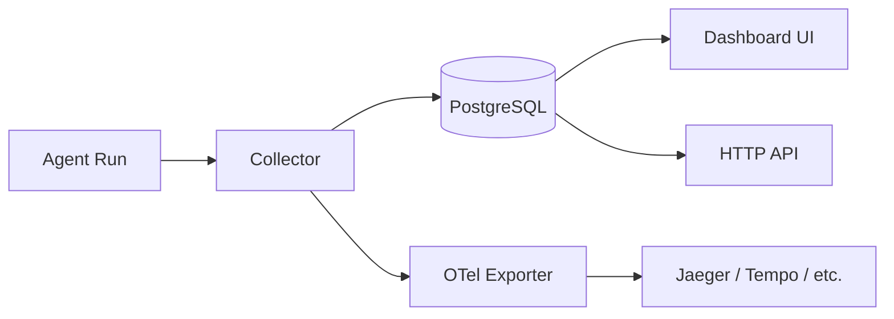

> Bản dịch từ [English version](#deploy-observability)

# Observability

> Theo dõi mọi LLM call, tool use, và agent run — từ dashboard tích hợp đến Jaeger và xa hơn.

## Tổng quan

GoClaw có tracing tích hợp ghi lại mỗi agent run dưới dạng **trace** và mỗi LLM call hay tool use dưới dạng **span**. Traces được lưu trong PostgreSQL và hiển thị ngay trên dashboard. Nếu cần tích hợp với observability stack hiện tại (Grafana Tempo, Datadog, Honeycomb, Jaeger), bạn có thể export spans qua OTLP khi build với `-tags otel`.



## Cách tracing hoạt động

`tracing.Collector` chạy background flush loop (mỗi 5 giây) để:

1. Drain in-memory buffer 1000 spans
2. Batch-insert spans vào PostgreSQL
3. Chuyển spans đến bất kỳ `SpanExporter` nào đã đính kèm (OTel, v.v.)
4. Cập nhật aggregate counters mỗi trace (tổng tokens, duration, status)

Traces và spans liên kết qua `trace_id`. Mỗi agent run tạo một trace; LLM call và tool invocation trong run đó trở thành child span.

**Các loại span được ghi:**

| Loại span | Ghi lại gì |
|-----------|------------|
| `llm_call` | Model, tokens vào/ra, finish reason, latency |
| `tool_call` | Tên tool, call ID, duration, status |
| `agent_run` | Toàn bộ run lifecycle, output preview |

## Xem Traces

### Dashboard

Mở phần **Traces** trong web UI (mặc định: `http://localhost:18790`). Có thể lọc theo agent, date range, và status.

### Verbose Mode

Mặc định, input message bị cắt còn 500 ký tự trong span preview. Để lưu toàn bộ LLM input (hữu ích khi debug):

```bash
export GOCLAW_TRACE_VERBOSE=1
./goclaw
```

> Chỉ dùng verbose mode ở môi trường dev — full message có thể rất lớn.

## OpenTelemetry Export

OTel exporter chỉ được compile khi thêm `-tags otel`. Build mặc định không có dependency OTel.

### Build với OTel support

```bash
go build -tags otel -o goclaw .
```

### Cấu hình qua environment

```bash
export GOCLAW_TELEMETRY_ENABLED=true
export GOCLAW_TELEMETRY_ENDPOINT=localhost:4317   # OTLP gRPC endpoint
export GOCLAW_TELEMETRY_PROTOCOL=grpc             # "grpc" (mặc định) hoặc "http"
export GOCLAW_TELEMETRY_INSECURE=true             # bỏ qua TLS cho local dev
export GOCLAW_TELEMETRY_SERVICE_NAME=goclaw-gateway
```

Hoặc qua `config.json`:

```json
{
  "telemetry": {
    "enabled": true,
    "endpoint": "tempo:4317",
    "protocol": "grpc",
    "insecure": false,
    "service_name": "goclaw-gateway"
  }
}
```

Spans được export theo `gen_ai.*` semantic conventions (OpenTelemetry GenAI SIG), cộng thêm các `goclaw.*` custom attributes để liên kết với PostgreSQL trace store.

## Tích hợp Jaeger

Overlay `docker-compose.otel.yml` có sẵn sẽ khởi động Jaeger all-in-one và kết nối tự động với GoClaw:

```bash
docker compose \
  -f docker-compose.yml \
  -f docker-compose.postgres.yml \
  -f docker-compose.otel.yml \
  up
```

Jaeger UI tại **http://localhost:16686**.

Overlay cài đặt:

```yaml
# docker-compose.otel.yml (trích)
services:
  jaeger:
    image: jaegertracing/all-in-one:1.68.0
    ports:
      - "16686:16686"  # Jaeger UI
      - "4317:4317"    # OTLP gRPC
      - "4318:4318"    # OTLP HTTP
    environment:
      - COLLECTOR_OTLP_ENABLED=true

  goclaw:
    build:
      args:
        ENABLE_OTEL: "true"   # compile với -tags otel
    environment:
      - GOCLAW_TELEMETRY_ENABLED=true
      - GOCLAW_TELEMETRY_ENDPOINT=jaeger:4317
      - GOCLAW_TELEMETRY_PROTOCOL=grpc
      - GOCLAW_TELEMETRY_INSECURE=true
```

## Các Attribute Chính trong Exported Spans

| Attribute | Mô tả |
|-----------|-------|
| `gen_ai.request.model` | Tên LLM model |
| `gen_ai.system` | Provider (anthropic, openai, v.v.) |
| `gen_ai.usage.input_tokens` | Tokens dùng làm input |
| `gen_ai.usage.output_tokens` | Tokens sinh ra làm output |
| `gen_ai.response.finish_reason` | Lý do model dừng |
| `goclaw.span_type` | `llm_call`, `tool_call`, `agent_run` |
| `goclaw.tool.name` | Tên tool cho tool span |
| `goclaw.trace_id` | UUID liên kết về PostgreSQL |
| `goclaw.duration_ms` | Wall-clock duration |

## Phân tích Usage

GoClaw tổng hợp token counts và chi phí thành hourly snapshots qua background worker. Dữ liệu này cung cấp cho biểu đồ usage trên dashboard và API endpoint `/v1/usage`.

Bảng `usage_snapshots` lưu trữ aggregates được tính sẵn theo agent, user, và provider — giúp dashboard query nhanh ngay cả với hàng triệu spans.

Bảng `activity_logs` ghi lại hành động admin, thay đổi config, và sự kiện bảo mật như một audit trail.

## Streaming Log Thời gian thực

WebSocket client đã kết nối có thể subscribe nhận live log events. Tầng `LogTee` chặn tất cả `slog` records và:

1. Cache 100 entry gần nhất trong ring buffer (subscriber mới nhận history gần đây)
2. Broadcast đến client đã subscribe theo log level họ chọn
3. Tự động ẩn các field nhạy cảm: `key`, `token`, `secret`, `password`, `dsn`, `credential`, `authorization`, `cookie`

Điều này nghĩa là người dùng dashboard xem log thời gian thực mà không cần SSH, và secrets không bao giờ bị lộ qua log stream.

## Các vấn đề thường gặp

| Vấn đề | Nguyên nhân có thể | Cách xử lý |
|--------|-------------------|------------|
| Không có span trong Jaeger | Binary build thiếu `-tags otel` | Rebuild với `go build -tags otel` |
| `GOCLAW_TELEMETRY_ENABLED` bị bỏ qua | Thiếu OTel build tag | Kiểm tra `ENABLE_OTEL: "true"` trong docker build args |
| Span buffer full (log warning) | Agent throughput cao | Tăng buffer hoặc giảm flush interval trong code |
| Input preview bị cắt | Hành vi bình thường | Đặt `GOCLAW_TRACE_VERBOSE=1` để lấy full input |
| Spans xuất hiện trong DB nhưng không trong Jaeger | Endpoint cấu hình sai | Kiểm tra `GOCLAW_TELEMETRY_ENDPOINT` và khả năng kết nối port |

## Tiếp theo

- [Production Checklist](#deploy-checklist) — khuyến nghị monitoring và alerting
- [Docker Compose Setup](#deploy-docker-compose) — tham chiếu đầy đủ compose file
- [Security Hardening](#deploy-security) — bảo mật deployment

<!-- goclaw-source: 57754a5 | cập nhật: 2026-03-18 -->
