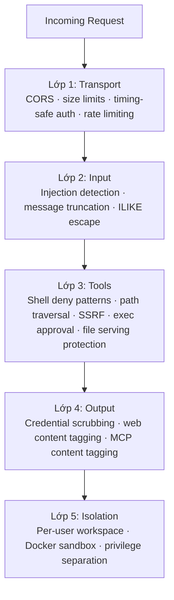
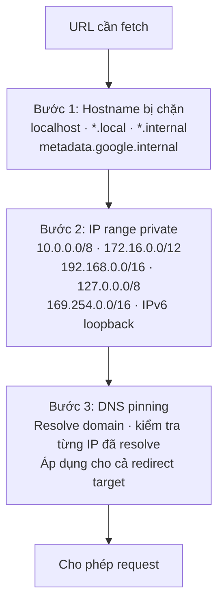

> Bản dịch từ [English version](/deploy-security)

# Tăng cường bảo mật

> GoClaw dùng năm lớp bảo vệ độc lập — transport, input, tools, output, và isolation — để bypass một lớp không ảnh hưởng đến các lớp còn lại.

## Tổng quan

Mỗi lớp hoạt động độc lập. Cùng nhau chúng tạo thành kiến trúc defense-in-depth bao phủ toàn bộ request lifecycle từ WebSocket connection đến tool execution output của agent.



---

## Lớp 1: Transport Security

Kiểm soát những gì đến được gateway ở cấp network và HTTP.

| Cơ chế | Chi tiết |
|--------|---------|
| CORS | `checkOrigin()` kiểm tra với `gateway.allowed_origins`; danh sách trống cho phép tất cả (tương thích ngược) |
| Giới hạn WebSocket message | 512 KB — gorilla/websocket tự đóng khi vượt quá |
| Giới hạn HTTP body | 1 MB — áp dụng trước khi decode JSON |
| Token auth | `crypto/subtle.ConstantTimeCompare` — kiểm tra bearer token an toàn về thời gian |
| Rate limiting | Token bucket mỗi user/IP; cấu hình qua `gateway.rate_limit_rpm` (0 = tắt) |
| Dev mode | Gateway token trống → cấp quyền admin (chỉ dùng cho môi trường local/single-user — không dùng trong production) |

**Hành động hardening:**

```json
{
  "gateway": {
    "allowed_origins": ["https://your-dashboard.example.com"],
    "rate_limit_rpm": 20
  }
}
```

Đặt `allowed_origins` theo domain dashboard trong production. Để trống chỉ khi bạn kiểm soát tất cả WebSocket client.

---

## Lớp 2: Input — Injection Detection

Input guard quét mọi tin nhắn user để tìm 6 pattern prompt injection trước khi đến LLM.

| Pattern ID | Phát hiện |
|-----------|---------|
| `ignore_instructions` | "ignore all previous instructions" |
| `role_override` | "you are now…", "pretend you are…" |
| `system_tags` | `<system>`, `[SYSTEM]`, `[INST]`, `<<SYS>>` |
| `instruction_injection` | "new instructions:", "override:", "system prompt:" |
| `null_bytes` | Ký tự null `\x00` (cố ý obfuscate) |
| `delimiter_escape` | "end of system", `</instructions>`, `</prompt>` |

**Hành động có thể cấu hình** qua `gateway.injection_action`:

| Giá trị | Hành vi |
|---------|---------|
| `"off"` | Tắt hoàn toàn |
| `"log"` | Log ở info level, tiếp tục |
| `"warn"` (mặc định) | Log ở warning level, tiếp tục |
| `"block"` | Log warning, trả lỗi, dừng xử lý |

Với deployment public-facing hoặc multi-user agent chia sẻ, dùng `"block"`.

**Message truncation:** Tin nhắn vượt `gateway.max_message_chars` (mặc định 32,000) bị cắt bớt — không bị reject — và LLM được thông báo về việc cắt bớt.

**ILIKE ESCAPE:** Tất cả database ILIKE query (search/filter) đều escape ký tự `%`, `_`, và `\` trước khi thực thi, ngăn chặn tấn công SQL wildcard injection.

---

## Lớp 3: Tool Security

Bảo vệ khỏi command execution nguy hiểm, truy cập file trái phép, và server-side request forgery.

### Shell deny groups

15 danh mục lệnh bị chặn theo mặc định. Tất cả group đều **bật (bị chặn)** sẵn. Có thể ghi đè per-agent qua `shell_deny_groups` trong agent config.

| # | Group | Ví dụ |
|---|-------|-------|
| 1 | `destructive_ops` | `rm -rf /`, `dd if=`, `mkfs`, `reboot`, `shutdown` |
| 2 | `data_exfiltration` | `curl \| sh`, truy cập localhost, DNS query |
| 3 | `reverse_shell` | `nc -e`, `socat`, Python/Node socket |
| 4 | `code_injection` | `eval $()`, `base64 -d \| sh` |
| 5 | `privilege_escalation` | `sudo`, `su -`, `nsenter`, `mount`, `setcap`, `halt`, `doas`, `pkexec`, `runuser` |
| 6 | `dangerous_paths` | `chmod`/`chown` trên đường dẫn `/` |
| 7 | `env_injection` | `LD_PRELOAD=`, `DYLD_INSERT_LIBRARIES=` |
| 8 | `container_escape` | `docker.sock`, `/proc/sys/`, `/sys/kernel/` |
| 9 | `crypto_mining` | `xmrig`, `cpuminer`, stratum URL |
| 10 | `filter_bypass` | `sed /e`, `git --upload-pack=`, CVE mitigation |
| 11 | `network_recon` | `nmap`, `ssh@`, `ngrok`, `chisel` |
| 12 | `package_install` | `pip install`, `npm i`, `apk add`, `yarn` |
| 13 | `persistence` | `crontab`, `.bashrc`, tee shell init |
| 14 | `process_control` | `kill -9`, `killall`, `pkill` |
| 15 | `env_dump` | `env`, `printenv`, biến `GOCLAW_*`, `/proc/*/environ` |

Để cho phép một group cụ thể cho một agent, đặt thành `false` trong config của agent:

```json
{
  "agents": {
    "list": {
      "devops-bot": {
        "shell_deny_groups": {
          "package_install": false,
          "process_control": false
        }
      }
    }
  }
}
```

### Path traversal prevention

`resolvePath()` áp dụng `filepath.Clean()` rồi `HasPrefix()` để đảm bảo tất cả file path nằm trong workspace của agent. Với `restrict_to_workspace: true` (mặc định trên agents), bất kỳ path nào ngoài workspace đều bị chặn.

Bốn filesystem tool (`read_file`, `write_file`, `list_files`, `edit`) đều implement interface `PathDenyable`. Agent loop gọi `DenyPaths(".goclaw")` khi khởi động — agent không thể đọc thư mục internal của GoClaw. Tool `list_files` lọc bỏ hoàn toàn các path bị deny khỏi directory listing.

### Bảo vệ path traversal khi serve file

Endpoint serve file (`/v1/files/...`) kiểm tra tất cả path được yêu cầu để ngăn chặn tấn công directory traversal. Bất kỳ path nào chứa chuỗi `../` hoặc resolve ra ngoài thư mục cho phép đều bị từ chối với lỗi 400.

### SSRF protection (3 bước kiểm tra)

Áp dụng cho tất cả URL fetch outbound của tool `web_fetch`:



### Credentialed exec (Direct Exec Mode)

Với các tool cần credentials (ví dụ: `gh`, `aws`), GoClaw dùng direct process execution thay vì shell — loại bỏ hoàn toàn khả năng shell injection.

4 lớp bảo vệ:
1. **Không dùng shell** — `exec.CommandContext(binary, args...)`, không bao giờ `sh -c`
2. **Kiểm tra path** — binary được resolve thành absolute path qua `exec.LookPath()`, khớp với config
3. **Deny patterns** — danh sách regex deny theo từng binary cho arguments (`deny_args`) và verbose flags (`deny_verbose`)
4. **Output scrubbing** — credentials đăng ký lúc runtime được scrub khỏi stdout/stderr

Shell metacharacter (`;`, `|`, `&`, `$()`, backtick) được phát hiện và từ chối trước khi thực thi.

### Giới hạn đầu ra shell

Lệnh thực thi trên host có stdout và stderr giới hạn **1 MB** mỗi loại. Nếu lệnh vượt giới hạn này, đầu ra bị cắt bớt kèm cờ hiệu để ngăn ghi thêm. Thực thi trong sandbox dùng giới hạn container Docker thay thế.

### XML parsing (phòng chống XXE)

GoClaw đã thay thế parser `xml.etree.ElementTree` của stdlib bằng `defusedxml` trong tất cả các đường dẫn xử lý XML. `defusedxml` chặn các cuộc tấn công XML eXternal Entity (XXE). Áp dụng cho mọi agent tool hoặc skill xử lý XML input.

### Exec approval

Xem [Exec Approval](/exec-approval) để biết flow phê duyệt đầy đủ. Tối thiểu, bật `ask: "on-miss"` để hỏi trước khi chạy các network và infrastructure tool:

```json
{
  "tools": {
    "execApproval": {
      "security": "full",
      "ask": "on-miss"
    }
  }
}
```

---

## Lớp 4: Output Security

Ngăn secrets rò rỉ qua tool output hoặc LLM response.

### Credential scrubbing (tự động)

Tất cả tool output đi qua regex scrubber để redact các secret format đã biết. Thay thế bằng `[REDACTED]`:

| Pattern | Ví dụ |
|---------|-------|
| OpenAI keys | `sk-...` |
| Anthropic keys | `sk-ant-...` |
| GitHub tokens | `ghp_`, `gho_`, `ghu_`, `ghs_`, `ghr_` |
| AWS access keys | `AKIA...` |
| Connection strings | `postgres://...`, `mysql://...` |
| Env var patterns | `KEY=...`, `SECRET=...`, `DSN=...` |
| Chuỗi hex dài | Chuỗi hex 64+ ký tự |
| DSN / database URLs | `DSN=...`, `DATABASE_URL=...`, `REDIS_URL=...`, `MONGO_URI=...` |
| Generic key-value | `api_key=...`, `token=...`, `secret=...`, `bearer=...` (không phân biệt hoa thường) |
| Runtime env vars | Các pattern `VIRTUAL_*=...` |

13 regex pattern tổng cộng bao phủ tất cả các secret format phổ biến.

Scrubbing bật mặc định. Để tắt (không khuyến nghị):

```json
{ "tools": { "scrub_credentials": false } }
```

Bạn cũng có thể đăng ký runtime values để scrub động (ví dụ server IP phát hiện lúc runtime) qua `AddDynamicScrubValues()` trong custom tool integrations.

### Web content tagging

Nội dung fetch từ URL bên ngoài được bọc:

```
<<<EXTERNAL_UNTRUSTED_CONTENT>>>
[nội dung fetch ở đây]
<<<END_EXTERNAL_UNTRUSTED_CONTENT>>>
```

Điều này báo hiệu cho LLM rằng nội dung không đáng tin và không được coi là instructions.

Các content marker được bảo vệ chống Unicode homoglyph spoofing — GoClaw sanitize các ký tự trông giống nhau (ví dụ: chữ `а` Cyrillic vs chữ `a` Latin) để ngăn nội dung bên ngoài giả mạo boundary marker.

### MCP content tagging

Kết quả tool từ MCP server được bọc bằng cùng các content marker không đáng tin:

```
<<<EXTERNAL_UNTRUSTED_CONTENT>>> (MCP server: my-server, tool: search)
[kết quả tool ở đây]
<<<END_EXTERNAL_UNTRUSTED_CONTENT>>>
```

Header xác định server và tên tool. Footer cảnh báo LLM không làm theo hướng dẫn từ nội dung. Các thử nghiệm breakout marker được sanitize.

---

## Lớp 5: Isolation

### Per-user workspace isolation

Mỗi user có một thư mục sandbox riêng. Hai cấp độ:

| Cấp độ | Pattern thư mục |
|--------|----------------|
| Per-agent | `~/.goclaw/{agent-key}-workspace/` |
| Per-user | `{agent-workspace}/user_{sanitized_user_id}/` |

User ID được sanitize — ký tự ngoài `[a-zA-Z0-9_-]` trở thành gạch dưới. Ví dụ: `group:telegram:-1001234` → `group_telegram_-1001234`.

### Docker entrypoint — tách biệt đặc quyền

Container Docker của GoClaw dùng mô hình ba giai đoạn đặc quyền:

**Giai đoạn 1: Root (`docker-entrypoint.sh`)**
- Cài lại system package đã lưu từ `/app/data/.runtime/apk-packages`
- Khởi động `pkg-helper` (service chạy quyền root trên Unix socket `/tmp/pkg.sock`, mode 0660, group `goclaw`)
- Thiết lập thư mục runtime cho Python và Node.js

**Giai đoạn 2: Chuyển sang user `goclaw` (`su-exec`)**
- App chính chạy với tư cách `goclaw` (UID 1000) qua `su-exec goclaw /app/goclaw`
- Tất cả thao tác agent thực hiện trong context này
- Yêu cầu system package được ủy quyền cho `pkg-helper` qua Unix socket

**Giai đoạn 3: Sandbox tùy chọn (per-agent)**
- Thực thi shell có thể được sandbox trong Docker container (có thể cấu hình)

### pkg-helper — root service

`pkg-helper` chạy với quyền root trên Unix socket (`/tmp/pkg.sock`, 0660 `root:goclaw`). Chỉ chấp nhận yêu cầu `apk add` / `apk del` từ user `goclaw`. Các capability Docker Compose cần thiết:

| Capability | Mục đích |
|-----------|---------|
| `SETUID` | `su-exec` chuyển đặc quyền |
| `SETGID` | Membership group cho socket |
| `CHOWN` | Thiết lập ownership thư mục runtime |
| `DAC_OVERRIDE` | Truy cập socket pkg-helper |

Tất cả capability còn lại bị drop (`cap_drop: ALL`). Cấu hình compose đầy đủ:

```yaml
cap_drop:
  - ALL
cap_add:
  - SETUID
  - SETGID
  - CHOWN
  - DAC_OVERRIDE
security_opt:
  - no-new-privileges:true
tmpfs:
  - /tmp:size=256m,noexec,nosuid
```

### Thư mục runtime

Package và dữ liệu runtime được lưu trong `/app/data/.runtime`, tồn tại qua các lần tái tạo container:

| Đường dẫn | Owner | Mục đích |
|-----------|-------|---------|
| `/app/data/.runtime/apk-packages` | 0666 | Danh sách apk package đã lưu |
| `/app/data/.runtime/pip` | goclaw | Python packages (`$PIP_TARGET`) |
| `/app/data/.runtime/npm-global` | goclaw | npm packages (`$NPM_CONFIG_PREFIX`) |
| `/tmp/pkg.sock` | root:goclaw 0660 | Unix socket pkg-helper |

### Docker sandbox

Để agent thực thi shell trong môi trường cô lập, bật Docker sandbox:

```bash
# Build sandbox image
docker build -t goclaw-sandbox:bookworm-slim -f Dockerfile.sandbox .
```

```json
{
  "sandbox": {
    "mode": "all",
    "image": "goclaw-sandbox:bookworm-slim",
    "workspace_access": "rw",
    "scope": "session"
  }
}
```

Container hardening áp dụng tự động:

| Cài đặt | Giá trị |
|---------|---------|
| Root filesystem | Read-only (`--read-only`) |
| Capabilities | Tất cả bị drop (`--cap-drop ALL`) |
| Quyền mới | Vô hiệu hóa (`--security-opt no-new-privileges`) |
| Giới hạn memory | 512 MB |
| Giới hạn CPU | 1.0 |
| Network | Tắt (`--network none`) |
| Max output | 1 MB |
| Timeout | 300 giây |

Sandbox modes: `off` (exec trực tiếp trên host), `non-main` (sandbox tất cả trừ main agent), `all` (sandbox mọi agent).

---

## Sửa lỗi Session IDOR

Tất cả năm `chat.*` WebSocket method (`chat.send`, `chat.abort`, `chat.stop`, `chat.stopall`, `chat.reset`) đều xác minh caller sở hữu session trước khi thực hiện. Helper `requireSessionOwner` trong `internal/gateway/methods/access.go` thực hiện kiểm tra này. User không phải admin cung cấp `sessionKey` thuộc về user khác sẽ nhận lỗi phân quyền — thao tác không bao giờ được thực thi.

---

## Pairing Auth — Tăng cường bảo mật

Device pairing của browser hoạt động theo nguyên tắc fail-closed:

| Kiểm soát | Chi tiết |
|---------|---------|
| Fail-closed | Kiểm tra `IsPaired()` chặn session chưa pair — không fallback sang truy cập mở |
| Rate limiting | Tối đa 3 pairing request đang chờ mỗi tài khoản; ngăn chặn enumeration spam |
| TTL enforcement | Pairing code hết hạn sau 60 phút; token thiết bị đã pair hết hạn sau 30 ngày |
| Approval flow | Yêu cầu `device.pair.approve` qua WebSocket từ session admin đã xác thực |

---

## Encryption

Secrets lưu trong PostgreSQL được mã hóa AES-256-GCM:

| Gì | Bảng | Cột |
|----|-------|-----|
| LLM provider API keys | `llm_providers` | `api_key` |
| MCP server API keys | `mcp_servers` | `api_key` |
| Custom tool env vars | `custom_tools` | `env` |
| Channel credentials | `channel_instances` | `credentials` |

Đặt encryption key trước lần chạy đầu:

```bash
# Tạo key mạnh
openssl rand -hex 32

# Thêm vào .env
GOCLAW_ENCRYPTION_KEY=your-64-char-hex-key
```

Format lưu: `"aes-gcm:" + base64(12-byte nonce + ciphertext + GCM tag)`. Giá trị không có prefix được trả về plaintext để tương thích migration.

---

## RBAC — 3 Role

WebSocket RPC method và HTTP endpoint được kiểm soát theo role. Role có thứ bậc.

| Role | Quyền chính |
|------|-------------|
| **Viewer** | `agents.list`, `config.get`, `sessions.list`, `health`, `status`, `skills.list` |
| **Operator** | + `chat.send`, `chat.abort`, `sessions.delete/reset`, `cron.*`, `skills.update` |
| **Admin** | + `config.apply/patch`, `agents.create/update/delete`, `channels.toggle`, `device.pair.approve/revoke` |

### API Keys

Để kiểm soát truy cập chi tiết hơn, hãy tạo API key có scope thay vì chia sẻ gateway token. Key được hash bằng SHA-256 trước khi lưu và cache trong 5 phút.

Thứ tự ưu tiên xác thực:
1. **Gateway token** → Admin role (toàn quyền)
2. **API key** → Role được suy ra từ scopes
3. **Không có token** → Operator (tương thích ngược); nếu không cấu hình gateway token → Admin (dev mode)

Các scope có sẵn:

| Scope | Cấp độ truy cập |
|-------|----------------|
| `operator.admin` | Toàn quyền admin |
| `operator.read` | Chỉ đọc (tương đương viewer) |
| `operator.write` | Đọc + ghi |
| `operator.approvals` | Quản lý exec approval |
| `operator.pairing` | Quản lý device pairing |

API key được truyền qua header `Authorization: Bearer {key}`, giống như gateway token.

---

## Bảo vệ Ghi đè File Memory

Memory interceptor ngăn chặn mất dữ liệu âm thầm khi agent cố gắng ghi đè file memory hiện có bằng nội dung khác. Khi ghi ở chế độ replace và mục tiêu đã có nội dung khác, giá trị cũ được capture và trả về để agent có thể được cảnh báo trước khi dữ liệu bị mất.

---

## Hệ thống Config Permissions

GoClaw cung cấp ba RPC method để kiểm soát người dùng nào có thể thay đổi cấu hình của agent:

| Method | Mô tả |
|--------|-------|
| `config.permissions.list` | Liệt kê tất cả quyền đã cấp cho agent |
| `config.permissions.grant` | Cấp quyền cho user cụ thể thay đổi config type |
| `config.permissions.revoke` | Thu hồi quyền đã cấp trước đó |

Mặc định, việc thay đổi cấu hình yêu cầu quyền admin. Cấp quyền cho `userId` với `scope` và `configType` cụ thể cho phép user đó thực hiện thay đổi mà không cần toàn quyền admin.

---

## Goroutine Panic Recovery

GoClaw bọc tất cả goroutine nền trong panic recovery handler qua package `safego`. Nếu một goroutine bị panic, lỗi được bắt và ghi log thay vì crash toàn bộ server. Không cần cấu hình — panic recovery luôn hoạt động.

---

## Hardening Checklist

Dùng trước khi expose GoClaw ra internet hoặc cho người dùng chia sẻ:

- [ ] Đặt `GOCLAW_GATEWAY_TOKEN` bằng token ngẫu nhiên mạnh
- [ ] Đặt `GOCLAW_ENCRYPTION_KEY` bằng key ngẫu nhiên 32 byte (64 ký tự hex)
- [ ] Đặt `gateway.allowed_origins` theo domain dashboard
- [ ] Đặt `gateway.rate_limit_rpm` (ví dụ `20`) để giới hạn request rate mỗi user
- [ ] Đặt `gateway.injection_action` thành `"block"` cho các deployment public-facing
- [ ] Bật exec approval với `tools.execApproval.ask: "on-miss"` (hoặc `"always"`)
- [ ] Bật Docker sandbox với `sandbox.mode: "all"` cho workload agent không tin cậy
- [ ] Đặt `POSTGRES_PASSWORD` bằng mật khẩu mạnh (không dùng mặc định `"goclaw"`)
- [ ] Bật TLS trên PostgreSQL (`sslmode=require` trong DSN)
- [ ] Review `gateway.owner_ids` — chỉ user ID tin cậy mới có quyền owner
- [ ] Đặt `agents.restrict_to_workspace: true` (đây là mặc định — không tắt)
- [ ] Tạo scoped API key cho các integration thay vì chia sẻ gateway token
- [ ] Cấu hình `tools.credentialed_exec` cho các CLI tool integration an toàn (gh, aws, v.v.)
- [ ] Review shell deny groups — cả 15 group đều bật theo mặc định; chỉ nới lỏng cho agent cụ thể cần thiết
- [ ] Xác minh sandbox mode không fallback sang thực thi host (fail-closed)
- [ ] Xác nhận `GOCLAW_GATEWAY_TOKEN` đã được đặt — token trống bật dev mode (admin cho tất cả)

---

## Security Logging

Tất cả security event log ở `slog.Warn` với prefix `security.*`:

| Event | Ý nghĩa |
|-------|---------|
| `security.injection_detected` | Phát hiện prompt injection pattern |
| `security.injection_blocked` | Tin nhắn bị reject (action = block) |
| `security.rate_limited` | Request bị reject bởi rate limiter |
| `security.cors_rejected` | WebSocket connection bị reject bởi CORS policy |
| `security.message_truncated` | Tin nhắn bị cắt ở `max_message_chars` |

Lọc tất cả security event:

```bash
./goclaw 2>&1 | grep '"security\.'
# hoặc với structured logs:
journalctl -u goclaw | grep 'security\.'
```

---

## Các vấn đề thường gặp

| Vấn đề | Nguyên nhân | Cách xử lý |
|--------|-------------|------------|
| Tin nhắn hợp lệ bị chặn | `injection_action: "block"` quá chặt | Chuyển sang `"warn"` và review logs trước khi bật lại block |
| Agent đọc được file ngoài workspace | `restrict_to_workspace: false` trên agent | Bật lại (mặc định là `true`) |
| Credentials xuất hiện trong tool output | `scrub_credentials: false` | Xóa override đó — scrubbing bật mặc định |
| Sandbox không cô lập được | Sandbox mode là `"off"` | Đặt `sandbox.mode` thành `"non-main"` hoặc `"all"` |
| Encryption key chưa đặt | `GOCLAW_ENCRYPTION_KEY` trống | Đặt trước lần chạy đầu; rotate cần re-encrypt stored secrets |
| Tất cả user có quyền admin | `GOCLAW_GATEWAY_TOKEN` chưa đặt | Đặt token mạnh; để trống = dev mode |

---

## Tiếp theo

- [Exec Approval](../advanced/exec-approval.md) — human-in-the-loop cho shell commands
- [Sandbox](../advanced/sandbox.md) — chi tiết cấu hình Docker sandbox
- [Docker Compose](./docker-compose.md) — deploy với security settings qua compose overlays
- [Database Setup](./database-setup.md) — PostgreSQL TLS và encrypted secret storage

<!-- goclaw-source: 050aafc9 | updated: 2026-04-09 -->
