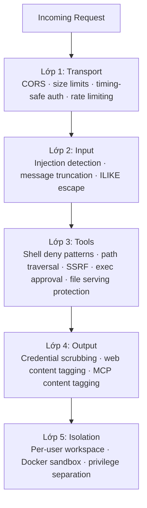
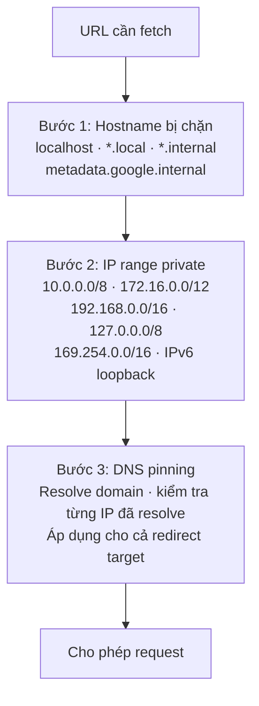

> Bản dịch từ [English version](/deploy-security)

# Tăng cường bảo mật

> GoClaw dùng năm lớp bảo vệ độc lập — transport, input, tools, output, và isolation — để bypass một lớp không ảnh hưởng đến các lớp còn lại.

## Tổng quan

Mỗi lớp hoạt động độc lập. Cùng nhau chúng tạo thành kiến trúc defense-in-depth bao phủ toàn bộ request lifecycle từ WebSocket connection đến tool execution output của agent.


```mermaid
flowchart TD
    REQ["Incoming Request"] --> L1["Lớp 1: Transport\nCORS · size limits · timing-safe auth · rate limiting"]
    L1 --> L2["Lớp 2: Input\nInjection detection · message truncation · ILIKE escape"]
    L2 --> L3["Lớp 3: Tools\nShell deny patterns · path traversal · SSRF · exec approval · file serving protection"]
    L3 --> L4["Lớp 4: Output\nCredential scrubbing · web content tagging · MCP content tagging"]
    L4 --> L5["Lớp 5: Isolation\nPer-user workspace · Docker sandbox · privilege separation"]
```

---

## Lớp 1: Transport Security

Kiểm soát những gì đến được gateway ở cấp network và HTTP.

| Cơ chế | Chi tiết |
|--------|---------|
| CORS | `checkOrigin()` kiểm tra với `gateway.allowed_origins`; danh sách trống cho phép tất cả (tương thích ngược) |
| Giới hạn WebSocket message | 512 KB — gorilla/websocket tự đóng khi vượt quá |
| Giới hạn HTTP body | 1 MB — áp dụng trước khi decode JSON |
| Token auth | `crypto/subtle.ConstantTimeCompare` — kiểm tra bearer token an toàn về thời gian |
| Rate limiting | Token bucket mỗi user/IP; cấu hình qua `gateway.rate_limit_rpm` (0 = tắt) |
| Dev mode | Gateway token trống → cấp quyền admin (chỉ dùng cho môi trường local/single-user — không dùng trong production) |

**Hành động hardening:**

```json
{
  "gateway": {
    "allowed_origins": ["https://your-dashboard.example.com"],
    "rate_limit_rpm": 20
  }
}
```

Đặt `allowed_origins` theo domain dashboard trong production. Để trống chỉ khi bạn kiểm soát tất cả WebSocket client.

---

## Lớp 2: Input — Injection Detection

Input guard quét mọi tin nhắn user để tìm 6 pattern prompt injection trước khi đến LLM.

| Pattern ID | Phát hiện |
|-----------|---------|
| `ignore_instructions` | "ignore all previous instructions" |
| `role_override` | "you are now…", "pretend you are…" |
| `system_tags` | `<system>`, `[SYSTEM]`, `[INST]`, `<<SYS>>` |
| `instruction_injection` | "new instructions:", "override:", "system prompt:" |
| `null_bytes` | Ký tự null `\x00` (cố ý obfuscate) |
| `delimiter_escape` | "end of system", `</instructions>`, `</prompt>` |

**Hành động có thể cấu hình** qua `gateway.injection_action`:

| Giá trị | Hành vi |
|---------|---------|
| `"off"` | Tắt hoàn toàn |
| `"log"` | Log ở info level, tiếp tục |
| `"warn"` (mặc định) | Log ở warning level, tiếp tục |
| `"block"` | Log warning, trả lỗi, dừng xử lý |

Với deployment public-facing hoặc multi-user agent chia sẻ, dùng `"block"`.

**Message truncation:** Tin nhắn vượt `gateway.max_message_chars` (mặc định 32,000) bị cắt bớt — không bị reject — và LLM được thông báo về việc cắt bớt.

**ILIKE ESCAPE:** Tất cả database ILIKE query (search/filter) đều escape ký tự `%`, `_`, và `\` trước khi thực thi, ngăn chặn tấn công SQL wildcard injection.

---

## Lớp 3: Tool Security

Bảo vệ khỏi command execution nguy hiểm, truy cập file trái phép, và server-side request forgery.

### Shell deny groups

15 danh mục lệnh bị chặn theo mặc định. Tất cả group đều **bật (bị chặn)** sẵn. Có thể ghi đè per-agent qua `shell_deny_groups` trong agent config.

| # | Group | Ví dụ |
|---|-------|-------|
| 1 | `destructive_ops` | `rm -rf /`, `dd if=`, `mkfs`, `reboot`, `shutdown` |
| 2 | `data_exfiltration` | `curl \| sh`, truy cập localhost, DNS query |
| 3 | `reverse_shell` | `nc -e`, `socat`, Python/Node socket |
| 4 | `code_injection` | `eval $()`, `base64 -d \| sh` |
| 5 | `privilege_escalation` | `sudo`, `su -`, `nsenter`, `mount`, `setcap`, `halt`, `doas`, `pkexec`, `runuser` |
| 6 | `dangerous_paths` | `chmod`/`chown` trên đường dẫn `/` |
| 7 | `env_injection` | `LD_PRELOAD=`, `DYLD_INSERT_LIBRARIES=` |
| 8 | `container_escape` | `docker.sock`, `/proc/sys/`, `/sys/kernel/` |
| 9 | `crypto_mining` | `xmrig`, `cpuminer`, stratum URL |
| 10 | `filter_bypass` | `sed /e`, `git --upload-pack=`, CVE mitigation |
| 11 | `network_recon` | `nmap`, `ssh@`, `ngrok`, `chisel` |
| 12 | `package_install` | `pip install`, `npm i`, `apk add`, `yarn` |
| 13 | `persistence` | `crontab`, `.bashrc`, tee shell init |
| 14 | `process_control` | `kill -9`, `killall`, `pkill` |
| 15 | `env_dump` | `env`, `printenv`, biến `GOCLAW_*`, `/proc/*/environ` |

Để cho phép một group cụ thể cho một agent, đặt thành `false` trong config của agent:

```json
{
  "agents": {
    "list": {
      "devops-bot": {
        "shell_deny_groups": {
          "package_install": false,
          "process_control": false
        }
      }
    }
  }
}
```

### Global shell deny-groups — runtime toggle

`config.tools.shellDenyGroups` là một `map[string]bool` cho phép bật hoặc tắt deny-group toàn cục mà không cần khởi động lại gateway. Thay đổi có hiệu lực ngay lập tức qua live-reload `bus.TopicConfigChanged`. Quá trình reload clone snapshot config trước khi áp dụng, nên việc *tắt* group được giữ đúng qua reload, và nó cũng reload các policy shell-deny cấp provider (Claude CLI / ACP), không chỉ exec tool toàn cục.

```json
{
  "tools": {
    "shellDenyGroups": {
      "package_install": false,
      "env_dump": false
    }
  }
}
```

**Thứ tự ưu tiên:** `shell_deny_groups` per-agent luôn ưu tiên hơn cài đặt global. Giá trị global chỉ áp dụng khi một group nhất định không được đặt rõ ràng trong config của agent. Điều này cho phép bạn nới lỏng một group trên toàn gateway trong khi vẫn khóa chặt cho các agent cụ thể.

Xem [`reference/config-reference.md`](../reference/config-reference.md) để biết tham chiếu đầy đủ trường `tools.shellDenyGroups`.

### Path traversal prevention

`resolvePath()` áp dụng `filepath.Clean()` rồi `HasPrefix()` để đảm bảo tất cả file path nằm trong workspace của agent. Với `restrict_to_workspace: true` (mặc định trên agents), bất kỳ path nào ngoài workspace đều bị chặn.

Bốn filesystem tool (`read_file`, `write_file`, `list_files`, `edit`) đều implement interface `PathDenyable`. Agent loop gọi `DenyPaths(".goclaw")` khi khởi động — agent không thể đọc thư mục internal của GoClaw. Tool `list_files` lọc bỏ hoàn toàn các path bị deny khỏi directory listing.

**Ngoại lệ cho interpreter venv.** Interpreter Python do GoClaw quản lý được miễn trừ khỏi deny `.goclaw/` để agent có thể chạy trực tiếp. GoClaw resolve `<home>/.goclaw/venv/bin/python3` (lần theo symlink) một lần khi khởi động và miễn trừ thư mục interpreter đã *resolve*; nếu không có venv thì im lặng bỏ qua. Đây là path duy nhất dưới `.goclaw/` mà exec có thể chạm tới.

### Bảo vệ path traversal khi serve file

Endpoint serve file (`/v1/files/...`) kiểm tra tất cả path được yêu cầu để ngăn chặn tấn công directory traversal. Bất kỳ path nào chứa chuỗi `../` hoặc resolve ra ngoài thư mục cho phép đều bị từ chối với lỗi 400.

### SSRF protection (3 bước kiểm tra)

Áp dụng cho tất cả URL fetch outbound của tool `web_fetch`:


```mermaid
flowchart TD
    U["URL cần fetch"] --> S1["Bước 1: Hostname bị chặn\nlocalhost · *.local · *.internal\nmetadata.google.internal"]
    S1 --> S2["Bước 2: IP range private\n10.0.0.0/8 · 172.16.0.0/12\n192.168.0.0/16 · 127.0.0.0/8\n169.254.0.0/16 · IPv6 loopback"]
    S2 --> S3["Bước 3: DNS pinning\nResolve domain · kiểm tra từng IP đã resolve\nÁp dụng cho cả redirect target"]
    S3 --> A["Cho phép request"]
```

### Credentialed exec (Direct Exec Mode)

Với các tool cần credentials (ví dụ: `gh`, `aws`), GoClaw dùng direct process execution thay vì shell — loại bỏ hoàn toàn khả năng shell injection.

4 lớp bảo vệ:
1. **Không dùng shell** — `exec.CommandContext(binary, args...)`, không bao giờ `sh -c`
2. **Kiểm tra path** — binary được resolve thành absolute path qua `exec.LookPath()`, khớp với config
3. **Deny patterns** — danh sách regex deny theo từng binary cho arguments (`deny_args`) và verbose flags (`deny_verbose`)
4. **Output scrubbing** — credentials đăng ký lúc runtime được scrub khỏi stdout/stderr

Shell metacharacter (`;`, `|`, `&`, `$()`, backtick) được phát hiện và từ chối trước khi thực thi.

### Kiểm tra grant thực thi (Exec grant enforcement)

Kiểm tra grant ở cấp agent chạy **trước** bất kỳ lần spawn process nào, chặn agent không được cấp quyền thực thi binary đã đăng ký:

| Kiểm soát | Chi tiết |
|---------|---------|
| **Tra cứu grant** | `store.SecureCLIStore.IsRegisteredBinary()` kiểm tra bảng `secure_cli_agent_grants`. Binary không phải global yêu cầu có row cho agent đang gọi. |
| **Fail-closed** | Nếu tra cứu grant lỗi (DB down, timeout), exec bị từ chối kèm thông báo thử lại. Timeout mỗi lần tra cứu: 2 giây. |
| **Env scrubbing** | Khi lệnh bỏ qua đường dẫn credentialed (ví dụ: qua việc dùng tool `exec` theo cách xấu), môi trường process con được scrub khỏi tất cả credential key trước khi spawn — danh sách từ chối tĩnh cộng với key động từ mọi binary đã đăng ký trong tenant. |
| **Wrapper unwrap** | Shell wrapper (`sh -c`, `bash -c`, v.v.) cố tình né tránh path matching bị chặn. GoClaw kiểm tra tối đa 3 cấp nesting; chain sâu hơn bị từ chối là adversarial. |
| **Subagent wiring** | `ExecTool` của subagent dùng cùng `SecureCLIStore` qua `buildSubagentToolsRegistry`. Agent cha không thể bỏ qua gate bằng cách ủy quyền exec cho subagent đã spawn. |

Security log event từ grant gate:

| Event | Ý nghĩa |
|-------|---------|
| `security.credentialed_binary_denied` | Agent cố thực thi binary mà không có grant |
| `security.credentialed_binary_gate_error` | Tra cứu grant thất bại (DB error); exec bị từ chối |
| `security.credentialed_binary_wrapper_too_deep` | Shell wrapper lồng nhau > 3 cấp; bị từ chối là adversarial |

Cả ba event đều gồm các trường: `binary`, `wrapper`, `agent_id`, `tenant_id`, và tiền tố `command`.

### Giới hạn đầu ra shell

Lệnh thực thi trên host có stdout và stderr giới hạn **1 MB** mỗi loại. Nếu lệnh vượt giới hạn này, đầu ra bị cắt bớt kèm cờ hiệu để ngăn ghi thêm. Thực thi trong sandbox dùng giới hạn container Docker thay thế.

### XML parsing (phòng chống XXE)

GoClaw đã thay thế parser `xml.etree.ElementTree` của stdlib bằng `defusedxml` trong tất cả các đường dẫn xử lý XML. `defusedxml` chặn các cuộc tấn công XML eXternal Entity (XXE). Áp dụng cho mọi agent tool hoặc skill xử lý XML input.

### Exec approval

Xem [Exec Approval](/exec-approval) để biết flow phê duyệt đầy đủ. Tối thiểu, bật `ask: "on-miss"` để hỏi trước khi chạy các network và infrastructure tool:

```json
{
  "tools": {
    "execApproval": {
      "security": "full",
      "ask": "on-miss"
    }
  }
}
```

---

## Lớp 4: Output Security

Ngăn secrets rò rỉ qua tool output hoặc LLM response.

### Credential scrubbing (tự động)

Tất cả tool output đi qua regex scrubber để redact các secret format đã biết. Thay thế bằng `[REDACTED]`:

| Pattern | Ví dụ |
|---------|-------|
| OpenAI keys | `sk-...` |
| Anthropic keys | `sk-ant-...` |
| GitHub tokens | `ghp_`, `gho_`, `ghu_`, `ghs_`, `ghr_` |
| AWS access keys | `AKIA...` |
| Connection strings | `postgres://...`, `mysql://...` |
| Env var patterns | `KEY=...`, `SECRET=...`, `DSN=...` |
| Chuỗi hex dài | Chuỗi hex 64+ ký tự |
| DSN / database URLs | `DSN=...`, `DATABASE_URL=...`, `REDIS_URL=...`, `MONGO_URI=...` |
| Generic key-value | `api_key=...`, `token=...`, `secret=...`, `bearer=...` (không phân biệt hoa thường) |
| Runtime env vars | Các pattern `VIRTUAL_*=...` |

13 regex pattern tổng cộng bao phủ tất cả các secret format phổ biến.

Scrubbing bật mặc định. Để tắt (không khuyến nghị):

```json
{ "tools": { "scrub_credentials": false } }
```

Bạn cũng có thể đăng ký runtime values để scrub động (ví dụ server IP phát hiện lúc runtime) qua `AddDynamicScrubValues()` trong custom tool integrations.

### Web content tagging

Nội dung fetch từ URL bên ngoài được bọc:

```
<<<EXTERNAL_UNTRUSTED_CONTENT>>>
[nội dung fetch ở đây]
<<<END_EXTERNAL_UNTRUSTED_CONTENT>>>
```

Điều này báo hiệu cho LLM rằng nội dung không đáng tin và không được coi là instructions.

Các content marker được bảo vệ chống Unicode homoglyph spoofing — GoClaw sanitize các ký tự trông giống nhau (ví dụ: chữ `а` Cyrillic vs chữ `a` Latin) để ngăn nội dung bên ngoài giả mạo boundary marker.

### MCP content tagging

Kết quả tool từ MCP server được bọc bằng cùng các content marker không đáng tin:

```
<<<EXTERNAL_UNTRUSTED_CONTENT>>> (MCP server: my-server, tool: search)
[kết quả tool ở đây]
<<<END_EXTERNAL_UNTRUSTED_CONTENT>>>
```

Header xác định server và tên tool. Footer cảnh báo LLM không làm theo hướng dẫn từ nội dung. Các thử nghiệm breakout marker được sanitize.

---

## Lớp 5: Isolation

### Per-user workspace isolation

Mỗi user có một thư mục sandbox riêng. Hai cấp độ:

| Cấp độ | Pattern thư mục |
|--------|----------------|
| Per-agent | `~/.goclaw/{agent-key}-workspace/` |
| Per-user | `{agent-workspace}/user_{sanitized_user_id}/` |

User ID được sanitize — ký tự ngoài `[a-zA-Z0-9_-]` trở thành gạch dưới. Ví dụ: `group:telegram:-1001234` → `group_telegram_-1001234`.

### Docker entrypoint — tách biệt đặc quyền

Container Docker của GoClaw dùng mô hình ba giai đoạn đặc quyền:

**Giai đoạn 1: Root (`docker-entrypoint.sh`)**
- Cài lại system package đã lưu từ `/app/data/.runtime/apk-packages`
- Khởi động `pkg-helper` (service chạy quyền root trên Unix socket `/tmp/pkg.sock`, mode 0660, group `goclaw`)
- Thiết lập thư mục runtime cho Python và Node.js

**Giai đoạn 2: Chuyển sang user `goclaw` (`su-exec`)**
- App chính chạy với tư cách `goclaw` (UID 1000) qua `su-exec goclaw /app/goclaw`
- Tất cả thao tác agent thực hiện trong context này
- Yêu cầu system package được ủy quyền cho `pkg-helper` qua Unix socket

**Giai đoạn 3: Sandbox tùy chọn (per-agent)**
- Thực thi shell có thể được sandbox trong Docker container (có thể cấu hình)

### pkg-helper — root service

`pkg-helper` chạy với quyền root trên Unix socket (`/tmp/pkg.sock`, 0660 `root:goclaw`). Chỉ chấp nhận yêu cầu `apk add` / `apk del` từ user `goclaw`. Các capability Docker Compose cần thiết:

| Capability | Mục đích |
|-----------|---------|
| `SETUID` | `su-exec` chuyển đặc quyền |
| `SETGID` | Membership group cho socket |
| `CHOWN` | Thiết lập ownership thư mục runtime |
| `DAC_OVERRIDE` | Truy cập socket pkg-helper |

Tất cả capability còn lại bị drop (`cap_drop: ALL`). Cấu hình compose đầy đủ:

```yaml
cap_drop:
  - ALL
cap_add:
  - SETUID
  - SETGID
  - CHOWN
  - DAC_OVERRIDE
security_opt:
  - no-new-privileges:true
tmpfs:
  - /tmp:size=256m,noexec,nosuid
```

### Thư mục runtime

Package và dữ liệu runtime được lưu trong `/app/data/.runtime`, tồn tại qua các lần tái tạo container:

| Đường dẫn | Owner | Mục đích |
|-----------|-------|---------|
| `/app/data/.runtime/apk-packages` | 0666 | Danh sách apk package đã lưu |
| `/app/data/.runtime/pip` | goclaw | Python packages (`$PIP_TARGET`) |
| `/app/data/.runtime/npm-global` | goclaw | npm packages (`$NPM_CONFIG_PREFIX`) |
| `/tmp/pkg.sock` | root:goclaw 0660 | Unix socket pkg-helper |

### Docker sandbox

Để agent thực thi shell trong môi trường cô lập, bật Docker sandbox:

```bash
# Build sandbox image
docker build -t goclaw-sandbox:bookworm-slim -f Dockerfile.sandbox .
```

```json
{
  "sandbox": {
    "mode": "all",
    "image": "goclaw-sandbox:bookworm-slim",
    "workspace_access": "rw",
    "scope": "session"
  }
}
```

Container hardening áp dụng tự động:

| Cài đặt | Giá trị |
|---------|---------|
| Root filesystem | Read-only (`--read-only`) |
| Capabilities | Tất cả bị drop (`--cap-drop ALL`) |
| Quyền mới | Vô hiệu hóa (`--security-opt no-new-privileges`) |
| Giới hạn memory | 512 MB |
| Giới hạn CPU | 1.0 |
| Network | Tắt (`--network none`) |
| Max output | 1 MB |
| Timeout | 300 giây |

Sandbox modes: `off` (exec trực tiếp trên host), `non-main` (sandbox tất cả trừ main agent), `all` (sandbox mọi agent).

---

## Sửa lỗi Session IDOR

Tất cả năm `chat.*` WebSocket method (`chat.send`, `chat.abort`, `chat.stop`, `chat.stopall`, `chat.reset`) đều xác minh caller sở hữu session trước khi thực hiện. Helper `requireSessionOwner` trong `internal/gateway/methods/access.go` thực hiện kiểm tra này. User không phải admin cung cấp `sessionKey` thuộc về user khác sẽ nhận lỗi phân quyền — thao tác không bao giờ được thực thi.

---

## Pairing Auth — Tăng cường bảo mật

Device pairing của browser hoạt động theo nguyên tắc fail-closed:

| Kiểm soát | Chi tiết |
|---------|---------|
| Fail-closed | Kiểm tra `IsPaired()` chặn session chưa pair — không fallback sang truy cập mở |
| Rate limiting | Tối đa 3 pairing request đang chờ mỗi tài khoản; ngăn chặn enumeration spam |
| TTL enforcement | Pairing code hết hạn sau 60 phút; token thiết bị đã pair hết hạn sau 30 ngày |
| Approval flow | Yêu cầu `device.pair.approve` qua WebSocket từ session admin đã xác thực |

---

## Encryption

Secrets lưu trong PostgreSQL được mã hóa AES-256-GCM:

| Gì | Bảng | Cột |
|----|-------|-----|
| LLM provider API keys | `llm_providers` | `api_key` |
| MCP server API keys | `mcp_servers` | `api_key` |
| Custom tool env vars | `custom_tools` | `env` |
| Channel credentials | `channel_instances` | `credentials` |
| Webhook secrets | `webhooks` | `secret_hash`, `secret_enc` |
| Workstation credentials | `workstations` | `metadata` |

Đặt encryption key trước lần chạy đầu:

```bash
# Tạo key mạnh (base64, 44 ký tự = 32 byte thô)
openssl rand -base64 32

# Thêm vào .env
GOCLAW_ENCRYPTION_KEY=your-44-char-base64-key
```

Key được chấp nhận ở ba định dạng: base64 (44 ký tự, kết quả của `openssl rand -base64 32`), hex (64 ký tự, kết quả của `openssl rand -hex 32`), hoặc 32 byte thô. Cả ba đều giải ra cùng khóa AES 32 byte; dùng base64 là dạng chuẩn theo tài liệu environment variables.

Format lưu: `"aes-gcm:" + base64(12-byte nonce + ciphertext + GCM tag)`. Giá trị không có prefix được trả về plaintext để tương thích migration.

> **Phải giống nhau trên tất cả replica.** Trong deployment cluster, mọi gateway instance phải dùng cùng `GOCLAW_ENCRYPTION_KEY`. Rotate key yêu cầu mã hóa lại toàn bộ secret đã lưu trước khi khởi động lại.

Env var của credentialed-CLI cũng được mã hóa AES-256-GCM: `secure_cli_binaries`, `secure_cli_agent_grants`, `secure_cli_user_credentials`, và `secure_cli_agent_credentials` đều lưu secret trong cột `encrypted_env`. Mỗi entry mang một `kind` hiển thị — entry `sensitive` bị che trong các response API/UI thông thường và chỉ trả về qua luồng `env:reveal` đã audit; entry `value` (vd tên region hoặc profile) được trả về cho admin để review vận hành.

---

## Mô hình bảo mật Credential Adapter

[Typed credential adapter](/cli-credentials) là đường **được hệ thống tin cậy** để inject auth material vào tiến trình con CLI được spawn (`git clone`, `git push`, …). Đây là một trust boundary thứ hai, khác với denylist env do user paste — không phải để thay thế nó.

| Đường | Trust boundary |
|-------|----------------|
| Env var do user paste (loại credential `env`) | Tuyến phòng thủ đầu tiên — `ValidateGrantEnvVars` từ chối `GIT_SSH_COMMAND`, `LD_PRELOAD`, `PATH`, và phần còn lại của denylist |
| Env adapter do hệ thống inject (vd adapter `git`) | Tuyến thứ hai, có audit-trail — bỏ qua denylist theo thiết kế và phát một sự kiện audit cho mỗi lần inject |

Gõ sai tên adapter sẽ rơi xuống passthrough (hành vi denylist-only cũ) — **không có bypass ngầm**.

### Thứ tự ưu tiên credential

Khi adapter quyết định inject credential nào, nó chọn match **đầu tiên** theo thứ tự: **user override → credential channel/context → agent credential → env mặc định cấp binary**. Agent credential (`secure_cli_agent_credentials`) là ranh giới tin cậy mặc định cho git; user override hoặc credential channel/context sẽ thắng khi có mặt. Trường audit `credential_source` ghi lại lớp nào đã được dùng.

Với luồng PAT, adapter tổng hợp một entry config `http.<remote>.extraheader` với `Authorization: Basic base64("x-access-token:<token>")`. Token thô, payload base64, và toàn bộ header đều được đăng ký với scrubber. Khóa SSH riêng được xác thực **hai lần** khi lưu — đầu tiên bằng parser SSH của Go, sau đó bằng OpenSSH (`ssh-keygen -y -f`) khi có sẵn — nên các khóa lẽ ra sẽ lỗi sau này với chẩn đoán OpenSSH sẽ bị từ chối ngay từ đầu.

### Sự kiện audit: `security.system_env_injection`

Mỗi lần adapter inject phát ra **đúng một** dòng `slog.Warn` có cấu trúc. Hostname dạng plaintext cố tình **không bao giờ được log** — giữ audit log an toàn PII bên trong các tenant bị quản lý.

| Trường | Ghi chú |
|--------|---------|
| `msg` | luôn là `security.system_env_injection` |
| `adapter` | vd `git`, `passthrough` |
| `binary` | tên binary (`git`, …) |
| `user_id` | tenant user UUID (rỗng trong ngữ cảnh chỉ global) |
| `env_keys` | chỉ **tên** env var đã sort — không bao giờ là giá trị |
| `argv_prefix_len` | số phần tử argv được prepend, không phải nội dung |
| `host_scope_hash` | 8 ký tự hex đầu của `SHA-256(host_scope đã chuẩn hóa)`, hoặc `"none"` |
| `credential_source` | lớp ưu tiên nào đã cung cấp credential: `user`, `context`, `agent`, hoặc rỗng khi không có row credential theo phạm vi nào được chọn |

v1 **không có bảng audit chuyên dụng** — dòng này route qua `slog` ra stderr → systemd/journald hoặc Docker logs. Để grep hoạt động với một host cụ thể, tính trước hash của nó:

```sh
echo -n "github.com" | sha256sum | cut -c1-8
```

### Scrub output cho credentialed exec

Output của lệnh credentialed đi qua cùng regex scrubber như mọi output tool, cộng thêm credential đăng ký lúc runtime cho binary đó được scrub khỏi stdout/stderr trước khi kết quả tới LLM. Secret được inject qua adapter không bao giờ round-trip ngược lại hội thoại.

### Cảnh báo MITM SSH TOFU

Đường SSH của adapter git đặt `StrictHostKeyChecking=accept-new`, chấp nhận host key chưa biết ở lần kết nối đầu. Một attacker mạng nằm giữa GoClaw và git host có thể capture phiên SSH **đầu tiên** đó. Pre-seed `known_hosts` lúc deploy để đóng cửa sổ này — sau đó `accept-new` enforce match-or-fail:

```sh
ssh-keyscan github.com >> ~/.ssh/known_hosts
ssh-keyscan -p 22 gitea.internal >> ~/.ssh/known_hosts
```

### Tmpfile credential tạm thời

Adapter SSH ghi key PEM vào một tmpfile mode `0600` trong `os.TempDir()` (prefix `goclaw-gitkey-*`) và xóa nó qua deferred cleanup sau khi exec trả về. Một `SIGKILL` của tiến trình GoClaw bỏ qua cleanup đó, để lại file. `os.TempDir()` là per-user trên POSIX, nên phơi nhiễm chỉ giới hạn ở uid của GoClaw. Deployment bảo mật cao nên chạy quét định kỳ:

```sh
find "$TMPDIR" -name 'goclaw-gitkey-*' -mmin +60 -delete
```

---

## Bảo mật Webhook

> Xem [Webhooks](/advanced/webhooks) để biết tài liệu API đầy đủ.

### Bắt buộc có encryption key

Hệ thống webhook chỉ khởi động khi `GOCLAW_ENCRYPTION_KEY` được đặt. Nếu không có, tất cả route `/v1/webhooks/*` trả về `404` và gateway ghi log:

```
webhook subsystem disabled: GOCLAW_ENCRYPTION_KEY not set
```

Đây là thiết kế có chủ ý: key trống sẽ lưu webhook secret dưới dạng plaintext vào database, phá vỡ toàn bộ bảo vệ. Đặt key và khởi động lại để bật lại hệ thống.

### Ký HMAC (khuyến nghị)

Mỗi webhook row có `hmac_signing_key` (trả về một lần lúc tạo và lúc rotate). Dùng HMAC-SHA256 để ký request thay vì bearer secret:

```
X-Webhook-Id: <webhook-uuid>
X-GoClaw-Signature: t=<unix_seconds>,v1=<hmac_hex>
```

Thuật toán ký:

```
signing_key = hex.Decode(hmac_signing_key)       // hex_64 → 32 byte thô
payload     = "{unix_ts}.{raw_request_body}"
signature   = HMAC_SHA256(signing_key, payload)
header      = "t={unix_ts},v1={hex(signature)}"
```

**Bảo vệ lệch thời gian.** Request có `|now - t| > 300` giây bị từ chối. Đồng bộ đồng hồ caller qua NTP.

**Bảo vệ replay.** Sau khi HMAC signature hợp lệ được chấp nhận, gateway ghi `sha256(tenant_id|signature_hex)` vào nonce cache per-process (TTL 320 giây). Replay trả về `401` với audit event `security.webhook.hmac_replay`.

**Bắt buộc HMAC-only.** Đặt `require_hmac: true` trên webhook row để tắt xác thực bearer secret. Đây là cấu hình khuyến nghị cho integration production.

### Các tùy chọn bổ sung

| Trường | Ghi chú |
|--------|---------|
| `localhost_only` | Giới hạn caller chỉ `127.0.0.1` / `::1`. Tự động bật trên Lite edition. |
| `ip_allowlist` | IP hoặc dải CIDR. Để trống = cho phép mọi nguồn. `X-Forwarded-For` không được tin. |
| `rate_limit_per_min` | Giới hạn per-webhook (0 = dùng mặc định tenant). |

Xem [Webhooks](/advanced/webhooks) để biết tham chiếu payload tạo đầy đủ và ví dụ xác minh signature bằng Go, Node.js và Python.

---

## RBAC — 3 Role

WebSocket RPC method và HTTP endpoint được kiểm soát theo role. Role có thứ bậc.

| Role | Quyền chính |
|------|-------------|
| **Viewer** | `agents.list`, `config.get`, `sessions.list`, `health`, `status`, `skills.list` |
| **Operator** | + `chat.send`, `chat.abort`, `sessions.delete/reset`, `cron.*`, `skills.update` |
| **Admin** | + `config.apply/patch`, `agents.create/update/delete`, `channels.toggle`, `device.pair.approve/revoke` |

### API Keys

Để kiểm soát truy cập chi tiết hơn, hãy tạo API key có scope thay vì chia sẻ gateway token. Key được hash bằng SHA-256 trước khi lưu và cache trong 5 phút.

Thứ tự ưu tiên xác thực:
1. **Gateway token** → Admin role (toàn quyền)
2. **API key** → Role được suy ra từ scopes
3. **Không có token** → Operator (tương thích ngược); nếu không cấu hình gateway token → Admin (dev mode)

Các scope có sẵn:

| Scope | Cấp độ truy cập |
|-------|----------------|
| `operator.admin` | Toàn quyền admin |
| `operator.read` | Chỉ đọc (tương đương viewer) |
| `operator.write` | Đọc + ghi |
| `operator.approvals` | Quản lý exec approval |
| `operator.pairing` | Quản lý device pairing |

API key được truyền qua header `Authorization: Bearer {key}`, giống như gateway token.

---

## Bảo vệ Ghi đè File Memory

Memory interceptor ngăn chặn mất dữ liệu âm thầm khi agent cố gắng ghi đè file memory hiện có bằng nội dung khác. Khi ghi ở chế độ replace và mục tiêu đã có nội dung khác, giá trị cũ được capture và trả về để agent có thể được cảnh báo trước khi dữ liệu bị mất.

---

## Hệ thống Config Permissions

GoClaw cung cấp ba RPC method để kiểm soát người dùng nào có thể thay đổi cấu hình của agent:

| Method | Mô tả |
|--------|-------|
| `config.permissions.list` | Liệt kê tất cả quyền đã cấp cho agent |
| `config.permissions.grant` | Cấp quyền cho user cụ thể thay đổi config type |
| `config.permissions.revoke` | Thu hồi quyền đã cấp trước đó |

Mặc định, việc thay đổi cấu hình yêu cầu quyền admin. Cấp quyền cho `userId` với `scope` và `configType` cụ thể cho phép user đó thực hiện thay đổi mà không cần toàn quyền admin.

---

## Goroutine Panic Recovery

GoClaw bọc tất cả goroutine nền trong panic recovery handler qua package `safego`. Nếu một goroutine bị panic, lỗi được bắt và ghi log thay vì crash toàn bộ server. Không cần cấu hình — panic recovery luôn hoạt động.

---

## Hardening Checklist

Dùng trước khi expose GoClaw ra internet hoặc cho người dùng chia sẻ:

- [ ] Đặt `GOCLAW_GATEWAY_TOKEN` bằng token ngẫu nhiên mạnh
- [ ] Đặt `GOCLAW_ENCRYPTION_KEY` bằng key base64 32 byte (`openssl rand -base64 32`) — bắt buộc để dùng webhook, workstation credentials, và CLI grant env overrides
- [ ] Lưu `GOCLAW_ENCRYPTION_KEY` trong secret manager (Vault, AWS Secrets Manager, v.v.) — không commit vào `config.json` hay version control
- [ ] Đặt `gateway.allowed_origins` theo domain dashboard
- [ ] Đặt `gateway.rate_limit_rpm` (ví dụ `20`) để giới hạn request rate mỗi user
- [ ] Đặt `gateway.injection_action` thành `"block"` cho các deployment public-facing
- [ ] Bật exec approval với `tools.execApproval.ask: "on-miss"` (hoặc `"always"`)
- [ ] Bật Docker sandbox với `sandbox.mode: "all"` cho workload agent không tin cậy
- [ ] Đặt `POSTGRES_PASSWORD` bằng mật khẩu mạnh (không dùng mặc định `"goclaw"`)
- [ ] Bật TLS trên PostgreSQL (`sslmode=require` trong DSN)
- [ ] Review `gateway.owner_ids` — chỉ user ID tin cậy mới có quyền owner
- [ ] Đặt `agents.restrict_to_workspace: true` (đây là mặc định — không tắt)
- [ ] Tạo scoped API key cho các integration thay vì chia sẻ gateway token
- [ ] Cấu hình `tools.credentialed_exec` cho các CLI tool integration an toàn (gh, aws, v.v.)
- [ ] Review shell deny groups — cả 15 group đều bật theo mặc định; chỉ nới lỏng cho agent cụ thể cần thiết
- [ ] Xác minh sandbox mode không fallback sang thực thi host (fail-closed)
- [ ] Xác nhận `GOCLAW_GATEWAY_TOKEN` đã được đặt — token trống bật dev mode (admin cho tất cả)
- [ ] Với webhook: dùng `require_hmac: true` trên webhook row — tắt bearer auth, bắt buộc ký HMAC-SHA256
- [ ] Với webhook: đặt `localhost_only: true` (hoặc dùng `ip_allowlist`) cho webhook không dành cho public
- [ ] Không có plaintext credentials trong file config — dùng env var và secret manager

---

## Security Logging

Tất cả security event log ở `slog.Warn` với prefix `security.*`:

| Event | Ý nghĩa |
|-------|---------|
| `security.injection_detected` | Phát hiện prompt injection pattern |
| `security.injection_blocked` | Tin nhắn bị reject (action = block) |
| `security.rate_limited` | Request bị reject bởi rate limiter |
| `security.cors_rejected` | WebSocket connection bị reject bởi CORS policy |
| `security.message_truncated` | Tin nhắn bị cắt ở `max_message_chars` |
| `security.credentialed_binary_denied` | Agent cố thực thi binary không có grant |
| `security.credentialed_binary_gate_error` | Tra cứu grant thất bại; exec bị từ chối fail-closed |
| `security.credentialed_binary_wrapper_too_deep` | Shell wrapper lồng nhau > 3 cấp bị từ chối |

Lọc tất cả security event:

```bash
./goclaw 2>&1 | grep '"security\.'
# hoặc với structured logs:
journalctl -u goclaw | grep 'security\.'
```

---

## Các vấn đề thường gặp

| Vấn đề | Nguyên nhân | Cách xử lý |
|--------|-------------|------------|
| Tin nhắn hợp lệ bị chặn | `injection_action: "block"` quá chặt | Chuyển sang `"warn"` và review logs trước khi bật lại block |
| Agent đọc được file ngoài workspace | `restrict_to_workspace: false` trên agent | Bật lại (mặc định là `true`) |
| Credentials xuất hiện trong tool output | `scrub_credentials: false` | Xóa override đó — scrubbing bật mặc định |
| Sandbox không cô lập được | Sandbox mode là `"off"` | Đặt `sandbox.mode` thành `"non-main"` hoặc `"all"` |
| Encryption key chưa đặt hoặc webhook trả 404 | `GOCLAW_ENCRYPTION_KEY` trống | Đặt trước lần chạy đầu; hệ thống webhook sẽ bị tắt nếu không có key |
| Tất cả user có quyền admin | `GOCLAW_GATEWAY_TOKEN` chưa đặt | Đặt token mạnh; để trống = dev mode |

---

## Tiếp theo

- [Exec Approval](../advanced/exec-approval.md) — human-in-the-loop cho shell commands
- [Sandbox](../advanced/sandbox.md) — chi tiết cấu hình Docker sandbox
- [Docker Compose](./docker-compose.md) — deploy với security settings qua compose overlays
- [Database Setup](./database-setup.md) — PostgreSQL TLS và encrypted secret storage
- [Webhooks](../advanced/webhooks.md) — HTTP endpoint xác thực HMAC, xác minh signature, và bảo vệ replay
- [Workstations](../advanced/workstations.md) — mục tiêu thực thi từ xa, mô hình phân quyền, và nhật ký kiểm tra

<!-- goclaw-source: fabe86b3 | cập nhật: 2026-06-30 -->
