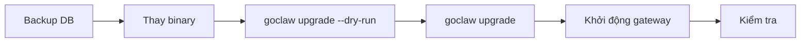

> Bản dịch từ [English version](/deploy-upgrading)

# Upgrading

> Cách upgrade GoClaw an toàn — binary, database schema, và data migration — không có bất ngờ.

## Tổng quan

Một lần upgrade GoClaw có hai phần:

1. **SQL migrations** — thay đổi schema áp dụng bởi `golang-migrate` (idempotent, có phiên bản)
2. **Data hooks** — Go-based data transformation tùy chọn chạy sau schema migrations (ví dụ backfill cột mới)

Lệnh `./goclaw upgrade` xử lý cả hai theo đúng thứ tự. An toàn khi chạy nhiều lần — hoàn toàn idempotent. Phiên bản schema hiện tại yêu cầu là **57**.



## Lệnh Upgrade

```bash
# Xem trước những gì sẽ xảy ra (không áp dụng thay đổi)
./goclaw upgrade --dry-run

# Hiển thị phiên bản schema hiện tại và các mục đang chờ
./goclaw upgrade --status

# Áp dụng tất cả SQL migration và data hook đang chờ
./goclaw upgrade
```

### Giải thích output status

```
  App version:     v1.2.0 (protocol 3)
  Schema current:  12
  Schema required: 14
  Status:          UPGRADE NEEDED (12 -> 14)

  Pending data hooks: 1
    - 013_backfill_agent_slugs

  Run 'goclaw upgrade' to apply all pending changes.
```

| Status | Ý nghĩa |
|--------|---------|
| `UP TO DATE` | Schema khớp với binary — không cần làm gì |
| `UPGRADE NEEDED` | Chạy `./goclaw upgrade` |
| `BINARY TOO OLD` | Binary cũ hơn DB schema — upgrade binary |
| `DIRTY` | Migration lỗi giữa chừng — xem phần recovery bên dưới |

## Quy trình Upgrade Chuẩn

### Bước 1 — Backup database

```bash
pg_dump -Fc "$GOCLAW_POSTGRES_DSN" > goclaw-backup-$(date +%Y%m%d).dump
```

Không bao giờ bỏ qua bước này. Schema migration không tự động reversible.

### Bước 2 — Thay binary

```bash
# Download binary mới hoặc build từ source
go build -o goclaw-new .

# Kiểm tra version
./goclaw-new upgrade --status
```

### Bước 3 — Dry run

```bash
./goclaw-new upgrade --dry-run
```

Review những SQL migration và data hook nào sẽ được áp dụng.

### Bước 4 — Áp dụng

```bash
./goclaw-new upgrade
```

Output dự kiến:

```
  App version:     v1.2.0 (protocol 3)
  Schema current:  12
  Schema required: 14

  Applying SQL migrations... OK (v12 -> v14)
  Running data hooks... 1 applied

  Upgrade complete.
```

### Bước 5 — Khởi động gateway

```bash
mv goclaw-new goclaw
./goclaw
```

### Bước 6 — Kiểm tra

- Mở dashboard và xác nhận agents load đúng
- Kiểm tra logs tìm dòng `ERROR` hoặc `WARN` khi khởi động
- Chạy thử một tin nhắn agent end-to-end

## Docker Compose Upgrade

Dùng overlay `docker-compose.upgrade.yml` để chạy upgrade dưới dạng one-shot container:

```bash
# Dry run
docker compose \
  -f docker-compose.yml \
  -f docker-compose.postgres.yml \
  -f docker-compose.upgrade.yml \
  run --rm upgrade --dry-run

# Áp dụng
docker compose \
  -f docker-compose.yml \
  -f docker-compose.postgres.yml \
  -f docker-compose.upgrade.yml \
  run --rm upgrade

# Kiểm tra status
docker compose \
  -f docker-compose.yml \
  -f docker-compose.postgres.yml \
  -f docker-compose.upgrade.yml \
  run --rm upgrade --status
```

Service `upgrade` khởi động, chạy `goclaw upgrade`, rồi thoát. Flag `--rm` tự xóa container sau khi xong.

> Đảm bảo `GOCLAW_ENCRYPTION_KEY` đã đặt trong `.env` — upgrade service cần nó để truy cập encrypted config.

## Auto-Upgrade khi Khởi động

Cho CI hoặc môi trường ephemeral khi các bước upgrade thủ công không thực tế:

```bash
export GOCLAW_AUTO_UPGRADE=true
./goclaw
```

Khi đặt, gateway kiểm tra schema khi khởi động và tự động áp dụng SQL migration và data hook đang chờ trước khi phục vụ traffic.

**Dùng cẩn thận trong production** — nên dùng `./goclaw upgrade` thủ công để kiểm soát timing và đảm bảo có backup trước.

## Quy trình Rollback

GoClaw không có rollback tự động. Nếu có sự cố:

### Tùy chọn A — Restore từ backup (an toàn nhất)

```bash
# Dừng gateway
# Restore DB từ backup trước khi upgrade
pg_restore -d "$GOCLAW_POSTGRES_DSN" goclaw-backup-20250308.dump

# Restore binary cũ
./goclaw-old
```

### Tùy chọn B — Xử lý dirty schema

Nếu migration lỗi giữa chừng, schema bị đánh dấu dirty:

```
  Status: DIRTY (failed migration)
  Fix:  ./goclaw migrate force 13
  Then: ./goclaw upgrade
```

Force migration version về trạng thái tốt cuối cùng, rồi chạy lại upgrade:

```bash
./goclaw migrate force 13
./goclaw upgrade
```

Chỉ làm điều này nếu bạn hiểu migration lỗi đã làm gì. Khi không chắc, restore từ backup.

### Tất cả migrate subcommands

```bash
./goclaw migrate up              # Áp dụng migration đang chờ
./goclaw migrate down            # Rollback một bước
./goclaw migrate down 3          # Rollback 3 bước
./goclaw migrate version         # Hiển thị version hiện tại + dirty state
./goclaw migrate force <version> # Force version (chỉ dùng khi recovery)
./goclaw migrate goto <version>  # Migrate đến version cụ thể
./goclaw migrate drop            # DROP ALL TABLES (nguy hiểm — chỉ dùng ở dev)
```

> **Theo dõi data hooks:** GoClaw lưu các Go transform sau migration trong bảng `data_migrations` riêng biệt (khác với `schema_migrations`). Chạy `./goclaw upgrade --status` để xem cả SQL migration version và data hooks đang chờ.

## Migration gần đây

### v3.11.x — Highlights và Breaking Changes

#### v3.11.3

- fix(migrations): `000057_heartbeat_provider_fk_set_null` — dọn sạch orphan phòng thủ; drop FK hiện có bằng cách tra tên constraint (xử lý tên tự sinh bị lệch), thêm lại với `ON DELETE SET NULL`. Khóa `ACCESS EXCLUSIVE` ngắn trên `agent_heartbeats` trong `ALTER TABLE` (dưới một giây với bảng nhỏ; heartbeat worker có thể tạm dừng ngắn).
- SQLite: schema v25 → v26 — rebuild toàn bộ bảng `agent_heartbeats` với mệnh đề FK mới; `INSERT … SELECT` tường minh 25 cột giữ nguyên toàn bộ dữ liệu hiện có. `idx_heartbeats_due` được tạo lại.

**Docker users:** BẮT BUỘC pull `ghcr.io/nextlevelbuilder/goclaw:v3.11.3` VÀ chạy `goclaw upgrade`. Image v3.11.2 cũ sẽ lỗi khi khởi động với:

```
schema version mismatch: required 57, current 56
```

**Bare-metal users:** rebuild binary và chạy `./goclaw upgrade`.

#### v3.11.2

- fix(migrations): drop scope-consistency check trước backfill UPDATEs — migration #56 follow-up; tránh lỗi constraint khi backfill trên data cũ

**Bước migration:** Migration #56 được áp dụng tự động khi khởi động lần tiếp theo (`goclaw upgrade` hoặc `GOCLAW_AUTO_UPGRADE=true`). Không cần bước thủ công.

#### v3.11.1

- ci(release): native arm64 runners + split-build manifest pattern

> **Lưu ý asset tên file:** OTel variant asset đã bị drop khỏi release pipeline. Nếu deploy script đang download asset tên `*-otel*`, hãy chuyển sang dùng regular asset.

#### v3.11.0

**Tính năng mới:**

- feat: Native `image_generation` cho Codex + OpenAI-compat — tri-level gate (provider capability → agent flag → per-request header `x-goclaw-no-image-gen`)
- feat: Tool `send_file` builtin + `DeliveredMedia` cross-tool dedup
- feat: `tools.shellDenyGroups` — runtime-reloadable global config cho deny-group (không cần restart)
- feat: Vault `chat_id` isolation — migration #56 thêm cột `chat_id` vào `vault_documents` để scope document theo chat
- feat: Pancake — TikTok + Shopee sub-platform support; private-reply stateless DM refactor
- feat: Codex pool — collapse `primary_first` trên public surface, per-modality round-robin (chat vs image)
- feat: Dynamic compact `max_tokens = clamp(in/25, 1024, 8192)` thay 4096 static; tool-schema tokens tính vào `OverheadTokens`
- feat: TTS — tenant `tts.timeout_ms`; Gemini text-only 400 fix; default model bump `gemini-3.1-flash-tts-preview`
- feat: Telegram bot self-identity injection + own @mention strip
- fix: Discord allowlist gate (#985/#1010)
- chore: Release pipeline — native arm64 runners, OTel variant DROPPED (đổi tên asset)

**BREAKING (clients):** Codex pool API responses giờ trả `priority_order` thay vì `primary_first` / `manual` cho cùng cấu hình. Client so sánh strategy string theo giá trị literal phải cập nhật. Legacy values vẫn được chấp nhận ở request body.

---

### Migration v3 (037–056) — Hướng dẫn nâng cấp v2→v3

Các migration này được áp dụng tự động qua `./goclaw upgrade`. Đây là **phiên bản major v3**. Đọc kỹ các breaking change trước khi nâng cấp từ v2.

Migration 048–056 bổ sung vault media linking, vault scope consistency enforcement, hệ thống agent hooks (phase 1–4), migration tenant-config cho `web_search`, và vault chat_id isolation. Không cần bước thủ công — data hook 055 tự động migrate API key từ `config.json5 tools.web.*` và blob `builtin_tool_tenant_configs.settings` cũ sang `config_secrets` khi khởi động lần đầu; migration 056 chạy tự động khi khởi động.

| Phiên bản | Thay đổi |
|-----------|----------|
| 037 | **V3 memory evolution** — tạo `episodic_summaries`, `agent_evolution_metrics`, `agent_evolution_suggestions`; thêm `valid_from`/`valid_until` vào bảng KG; chuyển 12 trường agent từ `other_config` JSONB sang cột riêng |
| 038 | **Knowledge Vault** — tạo `vault_documents`, `vault_links`, `vault_versions` |
| 039 | Xóa dữ liệu `agent_links` cũ |
| 040 | Thêm cột generated FTS `search_vector` + HNSW index vào `episodic_summaries` |
| 041 | Thêm cột `promoted_at` vào `episodic_summaries` cho dreaming pipeline |
| 042 | Thêm cột `summary` vào `vault_documents`; tái tạo FTS |
| 043 | Thêm `team_id`, `custom_scope` vào `vault_documents` và 9 bảng khác; unique constraint hỗ trợ team; trigger sửa scope |
| 044 | Seed file context `AGENTS_CORE.md` và `AGENTS_TASK.md` cho tất cả agent; xóa `AGENTS_MINIMAL.md` |
| 045 | `episodic_recall_tracking` — thêm `recall_count`, `recall_score`, `last_recalled_at` vào `episodic_summaries`; partial index cho việc ưu tiên episode trong dreaming worker |
| 046 | `vault_nullable_agent_id` — cho phép `vault_documents.agent_id` là NULL để hỗ trợ file vault team-scoped và tenant-shared |
| 047 | `cron_jobs_unique_constraint` — thêm unique constraint theo `(agent_id, tenant_id, name)` và xóa các hàng trùng lặp hiện có |
| 048 | `vault_media_linking` — thêm cột generated `base_name` vào `team_task_attachments`, `metadata JSONB` vào `vault_links`, sửa CASCADE FK constraints |
| 049 | `vault_path_prefix_index` — thêm concurrent index `idx_vault_docs_path_prefix` với `text_pattern_ops` cho truy vấn prefix nhanh |
| 050 | Seed tool `stt` (Speech-to-Text) vào `builtin_tools`. Xem [TTS & Voice](/advanced/tts-voice) để cấu hình. `ON CONFLICT DO NOTHING` — cài đặt tùy chỉnh được giữ nguyên. |
| 051 | Backfill `mode: "cache-ttl"` vào `agents.context_pruning` cho các agent đã có `context_pruning` tùy chỉnh nhưng thiếu trường `mode`. **Pruning vẫn là opt-in toàn cục** — migration này chỉ đặt `mode` cho agent đã có config tùy chỉnh; không tự động bật pruning cho agent nào. |
| 052 | Hệ thống agent hooks mới: tạo ba bảng `agent_hooks`, `hook_executions` và `tenant_hook_budget`. Xem [Hooks & Quality Gates](/advanced/hooks-quality-gates). |
| 053 | Mở rộng `agent_hooks`: thêm handler type `script` (script inline goja) và source marker `builtin`; xóa unique index theo scope để cho phép nhiều hook trên cùng một event. |
| 054 | Thêm cột `name` vào `agent_hooks` để đặt tên cho hook; tạo bảng junction N:M `agent_hook_agents` (thay FK `agent_id` 1:N); chuyển dữ liệu agent hiện có sang junction; đổi tên `agent_hooks` → `hooks` và `agent_hook_agents` → `hook_agents`. |
| 055 | Thêm CHECK constraint `vault_documents_scope_consistency` (NOT VALID) trên `vault_documents`. Đảm bảo: `personal` yêu cầu `agent_id NOT NULL`, `team` yêu cầu `team_id NOT NULL`, `shared` yêu cầu cả hai NULL, `custom` không ràng buộc. Chạy `ALTER TABLE vault_documents VALIDATE CONSTRAINT vault_documents_scope_consistency;` sau khi kiểm tra row cũ. |
| 056 | `vault_chat_id` — thêm cột `chat_id TEXT NULL` vào `vault_documents` + index `(tenant_id, chat_id, agent_id)`; drop scope-consistency check trước backfill UPDATEs (fix v3.11.2). |

#### Breaking Changes trong v3

| Thay đổi | Ảnh hưởng | Hành động cần làm |
|----------|-----------|------------------|
| Xóa `runLoop()` cũ (~745 LOC) | Tất cả agent giờ chạy pipeline v3 thống nhất 8 giai đoạn | Không cần — tự động |
| Xóa flag `v3PipelineEnabled` | Flag không còn được chấp nhận | Xóa `v3PipelineEnabled` khỏi `config.json` nếu có |
| Xóa toggle v2/v3 trên Web UI | Trang Settings không còn hiển thị toggle pipeline | Không cần |
| Xóa tool `workspace_read`/`workspace_write` | Truy cập file dùng tool chuẩn (`read_file`, `write_file`, `edit`) | Cập nhật prompt agent tham chiếu tên tool này |
| Xóa `bridge_url` WhatsApp | Giao thức WhatsApp trực tiếp thay sidecar Baileys | Xóa `bridge_url` khỏi config channel; xem [Cài đặt WhatsApp](/channels/whatsapp) |
| Xóa `docker-compose.whatsapp.yml` | File Docker Compose sidecar không còn tồn tại | Xóa khỏi deployment scripts |
| File tools tự resolve workspace team | `read_file`/`write_file` với path workspace team hoạt động trực tiếp | Không cần — minh bạch |
| Thống nhất store (`internal/store/base/`) | Tái cấu trúc nội bộ | Không cần — không thay đổi schema hay config |
| Xóa `config.json5 tools.web.*` | `web_search` giờ chỉ theo tenant; path toàn cục không còn được đọc | Xóa `tools.web.*` khỏi `config.json5`; cấu hình qua UI **Config → Tools → Web Search** hoặc API `/v1/tools/builtin/web_search/tenant-config`. API key được tự động migrate khi khởi động (hook 055) |

### Migration v2.x (024–032)

Năm migration này được tự động áp dụng khi khởi động khi nâng cấp lên v2.x. Không cần bước thủ công cho upgrade thông thường — chạy `./goclaw upgrade` như bình thường. Chỉ cần migration thủ công cho các bước nhảy phiên bản lớn nơi nên backup-and-restore.

| Phiên bản | Thay đổi |
|-----------|----------|
| 022 | Tạo bảng `agent_heartbeats` và `heartbeat_run_logs` cho heartbeat monitoring; thêm bảng permission tổng quát `agent_config_permissions` (thay thế `group_file_writers`) |
| 023 | Hỗ trợ hard-delete agent (FK constraint cascade trên sessions, cron_jobs, delegation_history, bảng team; unique index chỉ trên agent đang active); chuyển `group_file_writers` vào `agent_config_permissions` và xóa bảng cũ |
| 024 | Tái cấu trúc team attachments — xóa bảng workspace files cũ và `team_messages`; bảng `team_task_attachments` mới dựa trên path; thêm cột count denormalized và semantic embedding trên `team_tasks` |
| 025 | Thêm `embedding vector(1536)` vào `kg_entities` cho semantic knowledge graph entity search |
| 026 | Gắn API key với user cụ thể qua cột `owner_id`; thêm bảng kiểm soát truy cập `team_user_grants`; xóa bảng `handoff_routes` và `delegation_history` cũ |
| 027 | Tenant foundation — thêm bảng `tenants`, `tenant_users` và các bảng config per-tenant; backfill `tenant_id` vào 40+ bảng với master tenant UUID; cập nhật unique constraint theo tenant |
| 028 | Thêm `comment_type` vào `team_task_comments` cho blocker escalation support |
| 029 | Thêm bảng `system_configs` — key-value store per-tenant cho system settings (plain text; dùng `config_secrets` cho secrets) |
| 030 | Thêm GIN index trên cột JSONB `spans.metadata` (partial, `span_type = 'llm_call'`) và `sessions.metadata` để cải thiện query performance |
| 031 | Thêm cột generated `tsv tsvector` + GIN index vào `kg_entities` cho full-text search; tạo bảng `kg_dedup_candidates` cho review entity trùng lặp |
| 032 | Tạo bảng `secure_cli_user_credentials` cho credential CLI theo user; thêm cột `contact_type` vào `channel_contacts` |
| 033 | Cron payload columns | Chuyển `stateless`, `deliver`, `deliver_channel`, `deliver_to`, `wake_heartbeat` từ `payload` JSONB sang cột riêng trên `cron_jobs` |
| 034 | `subagent_tasks` | Lưu trữ subagent task vào DB để theo dõi trạng thái task |
| 035 | contact_thread_id | Thêm thread_id VARCHAR(100) và thread_type VARCHAR(20) vào channel_contacts; dọn sender_id bằng cách bỏ hậu tố \|username; tạo lại unique index với (tenant_id, channel_type, sender_id, COALESCE(thread_id, '')) |
| 036 | secure_cli_agent_grants | Tái cấu trúc CLI credentials từ per-binary agent assignment sang grants model; tạo bảng `secure_cli_agent_grants` cho truy cập per-agent với override cài đặt tùy chọn; thêm `is_global BOOLEAN` vào `secure_cli_binaries`; xóa cột `agent_id` khỏi `secure_cli_binaries` |

### Breaking Changes trong v2.x

- **Bảng `delegation_history` bị xóa** (migration 026): lịch sử delegation không còn lưu trong DB. Bất kỳ code hoặc tooling nào query bảng này sẽ lỗi. Kết quả delegation có trong response của agent tool.
- **Bảng `team_messages` bị xóa** (migration 024): mailbox peer-to-peer của team đã bị xóa. Giao tiếp team giờ dùng task comments.
- **Bảng `custom_tools` bị xóa** (migration 027): custom tools qua DB là dead code — agent loop không bao giờ kết nối chúng. Dùng `config.json` `tools.mcp_servers` thay thế.
- **Unique constraint theo tenant**: unique index trên `agents.agent_key`, `sessions.session_key`, `mcp_servers.name`, v.v. giờ bao gồm `tenant_id`. Transparent cho single-tenant deployment (tất cả row mặc định về master tenant).
- **API key user binding**: API key có `owner_id` đặt giờ ép `user_id = owner_id` khi xác thực. Các key cũ không có `owner_id` không bị ảnh hưởng.

### Kiểm tra phiên bản tự động

GoClaw v2.x tích hợp tính năng kiểm tra phiên bản tự động. Sau khi khởi động, gateway định kỳ poll GitHub releases ở nền và hiển thị thông báo trên dashboard khi có phiên bản mới hơn. Không cần cấu hình — tính năng chạy tự động và cần HTTPS ra ngoài đến `api.github.com`.

Xem toàn bộ lịch sử schema tại [Database Schema → Lịch sử Migration](/database-schema).

## Biến môi trường đã bị xóa gần đây

Các biến môi trường sau đã bị xóa và sẽ bị bỏ qua nếu còn đặt:

| Biến đã xóa | Lý do | Cách chuyển đổi |
|-------------|-------|-----------------|
| `GOCLAW_SESSIONS_STORAGE` | Sessions giờ chỉ dùng PostgreSQL | Xóa khỏi `.env` — không cần thay thế |
| `GOCLAW_MODE` | Managed mode giờ là mặc định | Xóa khỏi `.env` — không cần thay thế |

Nếu `.env` hoặc deployment scripts của bạn tham chiếu các biến này, hãy dọn dẹp để tránh nhầm lẫn.

## Checklist Breaking Changes

Trước mỗi lần upgrade, kiểm tra release notes về:

- [ ] Protocol version bump — client (dashboard, CLI) có thể cần update theo
- [ ] Config field đổi tên hoặc bị xóa — cập nhật `config.json` tương ứng
- [ ] Env var bị xóa — kiểm tra `.env` với `.env.example`
- [ ] Env var mới bắt buộc — ví dụ cài đặt encryption mới
- [ ] Tool hoặc provider bị xóa — xác nhận agents vẫn có tools đã cấu hình

## Các vấn đề thường gặp

| Vấn đề | Nguyên nhân | Cách xử lý |
|--------|-------------|------------|
| `Database not configured` | `GOCLAW_POSTGRES_DSN` chưa đặt | Đặt env var trước khi chạy upgrade |
| Status `DIRTY` | Migration trước lỗi giữa chừng | `./goclaw migrate force <version-1>` rồi retry |
| `BINARY TOO OLD` | Đang chạy binary cũ với schema mới hơn | Download hoặc build binary mới nhất |
| Upgrade bị treo | DB không kết nối được hoặc bị lock | Kiểm tra DB connectivity; tìm long-running transaction |
| Data hooks không chạy | Schema đã ở phiên bản yêu cầu | Data hooks chỉ chạy nếu schema vừa được migrate hoặc đang chờ |

## Tiếp theo

- [Production Checklist](/deploy-checklist) — kiểm tra đầy đủ trước khi go live
- [Database Setup](/deploy-database) — cài đặt PostgreSQL và pgvector
- [Observability](/deploy-observability) — theo dõi gateway sau khi upgrade

<!-- goclaw-source: 364d2d34 | cập nhật: 2026-04-29 -->
