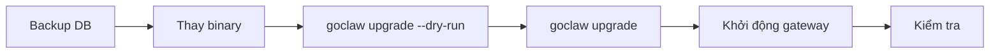

> Bản dịch từ [English version](#deploy-upgrading)

# Upgrading

> Cách upgrade GoClaw an toàn — binary, database schema, và data migration — không có bất ngờ.

## Tổng quan

Một lần upgrade GoClaw có hai phần:

1. **SQL migrations** — thay đổi schema áp dụng bởi `golang-migrate` (idempotent, có phiên bản)
2. **Data hooks** — Go-based data transformation tùy chọn chạy sau schema migrations (ví dụ backfill cột mới)

Lệnh `./goclaw upgrade` xử lý cả hai theo đúng thứ tự. An toàn khi chạy nhiều lần — hoàn toàn idempotent. Phiên bản schema hiện tại yêu cầu là **21**.



## Lệnh Upgrade

```bash
# Xem trước những gì sẽ xảy ra (không áp dụng thay đổi)
./goclaw upgrade --dry-run

# Hiển thị phiên bản schema hiện tại và các mục đang chờ
./goclaw upgrade --status

# Áp dụng tất cả SQL migration và data hook đang chờ
./goclaw upgrade
```

### Giải thích output status

```
  App version:     v1.2.0 (protocol 3)
  Schema current:  12
  Schema required: 14
  Status:          UPGRADE NEEDED (12 -> 14)

  Pending data hooks: 1
    - 013_backfill_agent_slugs

  Run 'goclaw upgrade' to apply all pending changes.
```

| Status | Ý nghĩa |
|--------|---------|
| `UP TO DATE` | Schema khớp với binary — không cần làm gì |
| `UPGRADE NEEDED` | Chạy `./goclaw upgrade` |
| `BINARY TOO OLD` | Binary cũ hơn DB schema — upgrade binary |
| `DIRTY` | Migration lỗi giữa chừng — xem phần recovery bên dưới |

## Quy trình Upgrade Chuẩn

### Bước 1 — Backup database

```bash
pg_dump -Fc "$GOCLAW_POSTGRES_DSN" > goclaw-backup-$(date +%Y%m%d).dump
```

Không bao giờ bỏ qua bước này. Schema migration không tự động reversible.

### Bước 2 — Thay binary

```bash
# Download binary mới hoặc build từ source
go build -o goclaw-new .

# Kiểm tra version
./goclaw-new upgrade --status
```

### Bước 3 — Dry run

```bash
./goclaw-new upgrade --dry-run
```

Review những SQL migration và data hook nào sẽ được áp dụng.

### Bước 4 — Áp dụng

```bash
./goclaw-new upgrade
```

Output dự kiến:

```
  App version:     v1.2.0 (protocol 3)
  Schema current:  12
  Schema required: 14

  Applying SQL migrations... OK (v12 -> v14)
  Running data hooks... 1 applied

  Upgrade complete.
```

### Bước 5 — Khởi động gateway

```bash
mv goclaw-new goclaw
./goclaw
```

### Bước 6 — Kiểm tra

- Mở dashboard và xác nhận agents load đúng
- Kiểm tra logs tìm dòng `ERROR` hoặc `WARN` khi khởi động
- Chạy thử một tin nhắn agent end-to-end

## Docker Compose Upgrade

Dùng overlay `docker-compose.upgrade.yml` để chạy upgrade dưới dạng one-shot container:

```bash
# Dry run
docker compose \
  -f docker-compose.yml \
  -f docker-compose.postgres.yml \
  -f docker-compose.upgrade.yml \
  run --rm upgrade --dry-run

# Áp dụng
docker compose \
  -f docker-compose.yml \
  -f docker-compose.postgres.yml \
  -f docker-compose.upgrade.yml \
  run --rm upgrade

# Kiểm tra status
docker compose \
  -f docker-compose.yml \
  -f docker-compose.postgres.yml \
  -f docker-compose.upgrade.yml \
  run --rm upgrade --status
```

Service `upgrade` khởi động, chạy `goclaw upgrade`, rồi thoát. Flag `--rm` tự xóa container sau khi xong.

> Đảm bảo `GOCLAW_ENCRYPTION_KEY` đã đặt trong `.env` — upgrade service cần nó để truy cập encrypted config.

## Auto-Upgrade khi Khởi động

Cho CI hoặc môi trường ephemeral khi các bước upgrade thủ công không thực tế:

```bash
export GOCLAW_AUTO_UPGRADE=true
./goclaw
```

Khi đặt, gateway kiểm tra schema khi khởi động và tự động áp dụng SQL migration và data hook đang chờ trước khi phục vụ traffic.

**Dùng cẩn thận trong production** — nên dùng `./goclaw upgrade` thủ công để kiểm soát timing và đảm bảo có backup trước.

## Quy trình Rollback

GoClaw không có rollback tự động. Nếu có sự cố:

### Tùy chọn A — Restore từ backup (an toàn nhất)

```bash
# Dừng gateway
# Restore DB từ backup trước khi upgrade
pg_restore -d "$GOCLAW_POSTGRES_DSN" goclaw-backup-20250308.dump

# Restore binary cũ
./goclaw-old
```

### Tùy chọn B — Xử lý dirty schema

Nếu migration lỗi giữa chừng, schema bị đánh dấu dirty:

```
  Status: DIRTY (failed migration)
  Fix:  ./goclaw migrate force 13
  Then: ./goclaw upgrade
```

Force migration version về trạng thái tốt cuối cùng, rồi chạy lại upgrade:

```bash
./goclaw migrate force 13
./goclaw upgrade
```

Chỉ làm điều này nếu bạn hiểu migration lỗi đã làm gì. Khi không chắc, restore từ backup.

### Tất cả migrate subcommands

```bash
./goclaw migrate up              # Áp dụng migration đang chờ
./goclaw migrate down            # Rollback một bước
./goclaw migrate down 3          # Rollback 3 bước
./goclaw migrate version         # Hiển thị version hiện tại + dirty state
./goclaw migrate force <version> # Force version (chỉ dùng khi recovery)
./goclaw migrate goto <version>  # Migrate đến version cụ thể
./goclaw migrate drop            # DROP ALL TABLES (nguy hiểm — chỉ dùng ở dev)
```

> **Theo dõi data hooks:** GoClaw lưu các Go transform sau migration trong bảng `data_migrations` riêng biệt (khác với `schema_migrations`). Chạy `./goclaw upgrade --status` để xem cả SQL migration version và data hooks đang chờ.

## Biến môi trường đã bị xóa gần đây

Các biến môi trường sau đã bị xóa và sẽ bị bỏ qua nếu còn đặt:

| Biến đã xóa | Lý do | Cách chuyển đổi |
|-------------|-------|-----------------|
| `GOCLAW_SESSIONS_STORAGE` | Sessions giờ chỉ dùng PostgreSQL | Xóa khỏi `.env` — không cần thay thế |
| `GOCLAW_MODE` | Managed mode giờ là mặc định | Xóa khỏi `.env` — không cần thay thế |

Nếu `.env` hoặc deployment scripts của bạn tham chiếu các biến này, hãy dọn dẹp để tránh nhầm lẫn.

## Checklist Breaking Changes

Trước mỗi lần upgrade, kiểm tra release notes về:

- [ ] Protocol version bump — client (dashboard, CLI) có thể cần update theo
- [ ] Config field đổi tên hoặc bị xóa — cập nhật `config.json` tương ứng
- [ ] Env var bị xóa — kiểm tra `.env` với `.env.example`
- [ ] Env var mới bắt buộc — ví dụ cài đặt encryption mới
- [ ] Tool hoặc provider bị xóa — xác nhận agents vẫn có tools đã cấu hình

## Các vấn đề thường gặp

| Vấn đề | Nguyên nhân | Cách xử lý |
|--------|-------------|------------|
| `Database not configured` | `GOCLAW_POSTGRES_DSN` chưa đặt | Đặt env var trước khi chạy upgrade |
| Status `DIRTY` | Migration trước lỗi giữa chừng | `./goclaw migrate force <version-1>` rồi retry |
| `BINARY TOO OLD` | Đang chạy binary cũ với schema mới hơn | Download hoặc build binary mới nhất |
| Upgrade bị treo | DB không kết nối được hoặc bị lock | Kiểm tra DB connectivity; tìm long-running transaction |
| Data hooks không chạy | Schema đã ở phiên bản yêu cầu | Data hooks chỉ chạy nếu schema vừa được migrate hoặc đang chờ |

## Tiếp theo

- [Production Checklist](#deploy-checklist) — kiểm tra đầy đủ trước khi go live
- [Database Setup](#deploy-database) — cài đặt PostgreSQL và pgvector
- [Observability](#deploy-observability) — theo dõi gateway sau khi upgrade

<!-- goclaw-source: 57754a5 | cập nhật: 2026-03-18 -->
