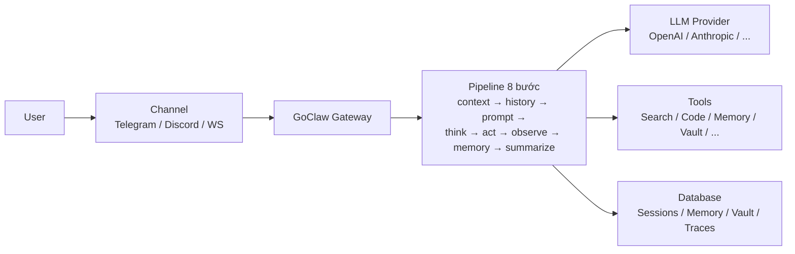

> Bản dịch từ [English version](/what-is-goclaw)

# GoClaw là gì?

> AI agent gateway đa tenant, kết nối LLM với các kênh nhắn tin, tool, và nhóm làm việc.

## Tổng quan

GoClaw là một AI agent gateway mã nguồn mở viết bằng Go. Nó cho phép bạn chạy các AI agent có thể chat trên Telegram, Discord, WhatsApp, và nhiều kênh khác — trong khi chia sẻ tool, memory, và context trong cùng một nhóm. Hãy hình dung nó như chiếc cầu nối giữa các LLM provider và thế giới thực.

## Tính năng chính

| Danh mục | Bạn nhận được |
|----------|--------------|
| **Multi-Tenant v3** | Cách ly per-user cho context, session, memory, trace; rate limit theo edition |
| **Pipeline Agent 8 bước** | context → history → prompt → think → act → observe → memory → summarize (v3, luôn bật) |
| **22 Loại Provider** | OpenAI, Anthropic, Google, Groq, DeepSeek, Mistral, xAI, và nhiều hơn (15 LLM API + local model + CLI agent + media) |
| **Messaging Channel** | Telegram, Discord, WhatsApp (native), Zalo, Zalo Personal, Larksuite, Slack, WebSocket |
| **32 Tool tích hợp sẵn** | File system, web search, browser, thực thi code, memory, và nhiều hơn |
| **64+ WebSocket RPC Method** | Điều khiển thời gian thực — chat, quản lý agent, trace, và nhiều hơn qua `/ws` |
| **Agent Orchestration** | Delegation (sync/async), team, handoff, evaluate loop, WaitAll qua `BatchQueue[T]` |
| **Memory 3 tầng** | L0/L1/L2 với consolidation worker (episodic, semantic, dreaming, dedup) |
| **Knowledge Vault** | Mạng lưới document wikilink, tự động tóm tắt và auto-link ngữ nghĩa bằng LLM, hybrid BM25 + vector search |
| **Knowledge Graph** | Trích xuất entity/relationship bằng LLM với graph traversal |
| **Agent Evolution** | Guardrail + suggestion engine; predefined agent tự tinh chỉnh SOUL.md / CAPABILITIES.md và xây dựng skill mới |
| **Mode Prompt System** | Chế độ prompt có thể chuyển đổi (full / task / minimal / none) với override per-agent |
| **Hỗ trợ MCP** | Kết nối Model Context Protocol server (stdio/SSE/HTTP) |
| **Skills System** | Knowledge base dạng SKILL.md với hybrid search; publishing, grant, skill draft từ evolution |
| **Quality Gates** | Kiểm tra chất lượng output bằng hook với vòng feedback |
| **Extended Thinking** | Chế độ suy luận per-provider (Anthropic, OpenAI, DashScope) |
| **Prompt Caching** | Giảm chi phí lên đến ~90% cho prefix lặp lại; v3 cache-boundary marker |
| **Web Dashboard** | Quản lý trực quan cho agent, provider, channel, vault, trace |
| **Bảo mật** | Rate limiting, SSRF protection, credential scrubbing, RBAC, vá session IDOR |
| **Dual-DB** | PostgreSQL (đầy đủ) hoặc SQLite desktop qua store Dialect chung |
| **Single Binary** | ~25 MB, khởi động <1 giây, chạy được trên VPS $5 |

## Dành cho ai?

- **Developer** xây dựng chatbot và assistant AI
- **Nhóm** cần AI agent dùng chung với phân quyền theo vai trò
- **Doanh nghiệp** cần cách ly đa tenant và audit trail

## Chế độ vận hành

GoClaw chạy trên **PostgreSQL** (production đa tenant đầy đủ) hoặc **SQLite** (desktop single-user). Cả hai đều hỗ trợ credential mã hóa, workspace per-user cách ly, và memory bền vững — mang lại cách ly hoàn toàn, audit trail đầy đủ, và tìm kiếm thông minh trong toàn bộ hội thoại. SQLite bỏ các tính năng chỉ có trên pgvector (vault auto-link ngữ nghĩa sẽ fallback sang lexical).

## Cách hoạt động

1. Người dùng gửi tin nhắn qua một **channel** (Telegram, WebSocket, v.v.)
2. **Gateway** định tuyến tin nhắn đến agent phù hợp dựa trên channel binding
3. **Pipeline 8 bước** chạy: lắp ghép context, lấy history, build prompt, think (LLM call), act (gọi tool), observe kết quả, cập nhật memory, summarize
4. Tool có thể **tìm kiếm web, chạy code, truy vấn memory, knowledge graph, hoặc knowledge vault**
5. Agent có thể **delegate** task cho subagent (với `BatchQueue[T]` để chờ song song), **hand off** cuộc hội thoại, hoặc chạy **evaluate loop** để kiểm soát chất lượng output
6. **Consolidation worker** chạy nền để thăng cấp fact episodic lên semantic memory; **vault enrich worker** tự động tóm tắt và liên kết ngữ nghĩa tài liệu mới
7. Phản hồi được gửi ngược lại qua channel đến người dùng

## Tiếp theo

- [Cài đặt](/installation) — Cài GoClaw trên máy của bạn
- [Quick Start](/quick-start) — Agent đầu tiên trong 5 phút
- [GoClaw hoạt động như thế nào](/how-goclaw-works) — Tìm hiểu sâu về kiến trúc

<!-- goclaw-source: 050aafc9 | cập nhật: 2026-04-09 -->
