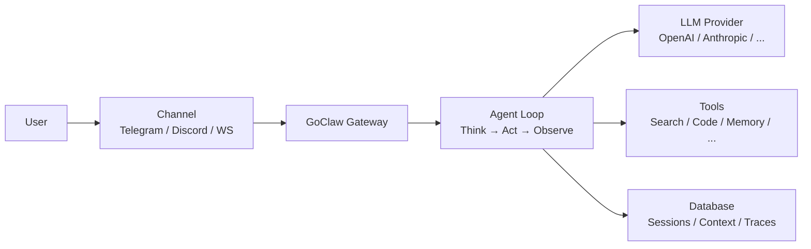

> Bản dịch từ [English version](../../getting-started/what-is-goclaw.md)

# GoClaw là gì?

> AI agent gateway đa tenant, kết nối LLM với các kênh nhắn tin, tool, và nhóm làm việc.

## Tổng quan

GoClaw là một AI agent gateway mã nguồn mở viết bằng Go. Nó cho phép bạn chạy các AI agent có thể chat trên Telegram, Discord, WhatsApp, và nhiều kênh khác — trong khi chia sẻ tool, memory, và context trong cùng một nhóm. Hãy hình dung nó như chiếc cầu nối giữa các LLM provider và thế giới thực.

## Tính năng chính

| Danh mục | Bạn nhận được |
|----------|--------------|
| **Đa Tenant** | Cách ly per-user cho context, session, memory, và trace |
| **13+ LLM Provider** | OpenAI, Anthropic, Google, Groq, DeepSeek, Mistral, xAI, và nhiều hơn |
| **6 Channel** | Telegram, Discord, WhatsApp, Zalo, Feishu/Lark, WebSocket |
| **60+ Tool tích hợp sẵn** | File system, web search, browser, thực thi code, memory, và nhiều hơn |
| **Agent Team** | Nhiều agent với task board chung và khả năng phân công |
| **Hỗ trợ MCP** | Kết nối với Model Context Protocol server để mở rộng khả năng |
| **Web Dashboard** | Quản lý trực quan cho agent, provider, channel, và trace |
| **Memory** | Bộ nhớ dài hạn với hybrid search (vector + full-text) |
| **Single Binary** | ~25 MB, khởi động <1 giây, chạy được trên VPS $5 |

## Dành cho ai?

- **Developer** xây dựng chatbot và assistant AI
- **Nhóm** cần AI agent dùng chung với phân quyền theo vai trò
- **Doanh nghiệp** cần cách ly đa tenant và audit trail

## Chế độ vận hành

GoClaw yêu cầu backend PostgreSQL với thông tin xác thực được mã hóa, hỗ trợ nhiều người dùng, và memory bền vững. Điều này mang lại cách ly đa tenant, tracing, và hybrid search ngay từ đầu.

## Cách hoạt động

1. Người dùng gửi tin nhắn qua một **channel** (Telegram, WebSocket, v.v.)
2. **Gateway** định tuyến tin nhắn đến agent phù hợp dựa trên channel binding
3. **Agent loop** gửi cuộc hội thoại đến LLM provider
4. LLM có thể gọi **tool** (tìm kiếm web, chạy code, truy vấn memory)
5. Phản hồi được gửi ngược lại qua channel đến người dùng

## Tiếp theo

- [Cài đặt](installation.md) — Cài GoClaw trên máy của bạn
- [Quick Start](quick-start.md) — Agent đầu tiên trong 5 phút
- [GoClaw hoạt động như thế nào](../core-concepts/how-goclaw-works.md) — Tìm hiểu sâu về kiến trúc
