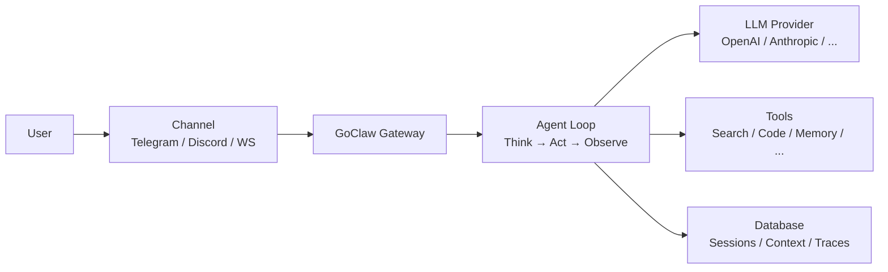

> Bản dịch từ [English version](/what-is-goclaw)

# GoClaw là gì?

> AI agent gateway đa tenant, kết nối LLM với các kênh nhắn tin, tool, và nhóm làm việc.

## Tổng quan

GoClaw là một AI agent gateway mã nguồn mở viết bằng Go. Nó cho phép bạn chạy các AI agent có thể chat trên Telegram, Discord, WhatsApp, và nhiều kênh khác — trong khi chia sẻ tool, memory, và context trong cùng một nhóm. Hãy hình dung nó như chiếc cầu nối giữa các LLM provider và thế giới thực.

## Tính năng chính

| Danh mục | Bạn nhận được |
|----------|--------------|
| **Đa Tenant** | Cách ly per-user cho context, session, memory, và trace |
| **22 Loại Provider** | OpenAI, Anthropic, Google, Groq, DeepSeek, Mistral, xAI, và nhiều hơn (15 LLM API + local model + CLI agent + media) |
| **7 Channel** | Telegram, Discord, WhatsApp, Zalo, Zalo Personal, Larksuite, Slack |
| **32 Tool tích hợp sẵn** | File system, web search, browser, thực thi code, memory, và nhiều hơn |
| **64+ WebSocket RPC Method** | Điều khiển thời gian thực — chat, quản lý agent, trace, và nhiều hơn qua `/ws` |
| **Agent Orchestration** | 4 pattern — delegation (sync/async), team, handoff, evaluate loop |
| **Knowledge Graph** | Trích xuất entity/relationship bằng LLM với graph traversal |
| **Hỗ trợ MCP** | Kết nối Model Context Protocol server (stdio/SSE/HTTP) |
| **Skills System** | Knowledge base dạng SKILL.md với hybrid search (BM25 + vector) |
| **Quality Gates** | Kiểm tra chất lượng output bằng hook với vòng feedback |
| **Extended Thinking** | Chế độ suy luận per-provider (Anthropic, OpenAI, DashScope) |
| **Prompt Caching** | Giảm chi phí lên đến ~90% cho prefix lặp lại |
| **Web Dashboard** | Quản lý trực quan cho agent, provider, channel, và trace |
| **Memory** | Bộ nhớ dài hạn với hybrid search (vector + full-text) |
| **Bảo mật** | Rate limiting, SSRF protection, credential scrubbing, RBAC |
| **Single Binary** | ~25 MB, khởi động <1 giây, chạy được trên VPS $5 |

## Dành cho ai?

- **Developer** xây dựng chatbot và assistant AI
- **Nhóm** cần AI agent dùng chung với phân quyền theo vai trò
- **Doanh nghiệp** cần cách ly đa tenant và audit trail

## Chế độ vận hành

GoClaw yêu cầu backend PostgreSQL với thông tin xác thực được mã hóa, hỗ trợ nhiều người dùng (mỗi người dùng có workspace riêng biệt), và memory bền vững. Điều này mang lại sự cách ly hoàn toàn giữa các người dùng, nhật ký hoạt động đầy đủ, và tìm kiếm thông minh trong toàn bộ hội thoại.

## Cách hoạt động

1. Người dùng gửi tin nhắn qua một **channel** (Telegram, WebSocket, v.v.)
2. **Gateway** định tuyến tin nhắn đến agent phù hợp dựa trên channel binding
3. **Agent loop** gửi cuộc hội thoại đến LLM provider
4. LLM có thể gọi **tool** (tìm kiếm web, chạy code, truy vấn memory, tìm kiếm knowledge graph)
5. Agent có thể **delegate** task cho agent khác, **hand off** cuộc hội thoại, hoặc chạy **evaluate loop** để kiểm soát chất lượng output
6. Phản hồi được gửi ngược lại qua channel đến người dùng

## Tiếp theo

- [Cài đặt](/installation) — Cài GoClaw trên máy của bạn
- [Quick Start](/quick-start) — Agent đầu tiên trong 5 phút
- [GoClaw hoạt động như thế nào](/how-goclaw-works) — Tìm hiểu sâu về kiến trúc

<!-- goclaw-source: 57754a5 | cập nhật: 2026-03-18 -->
