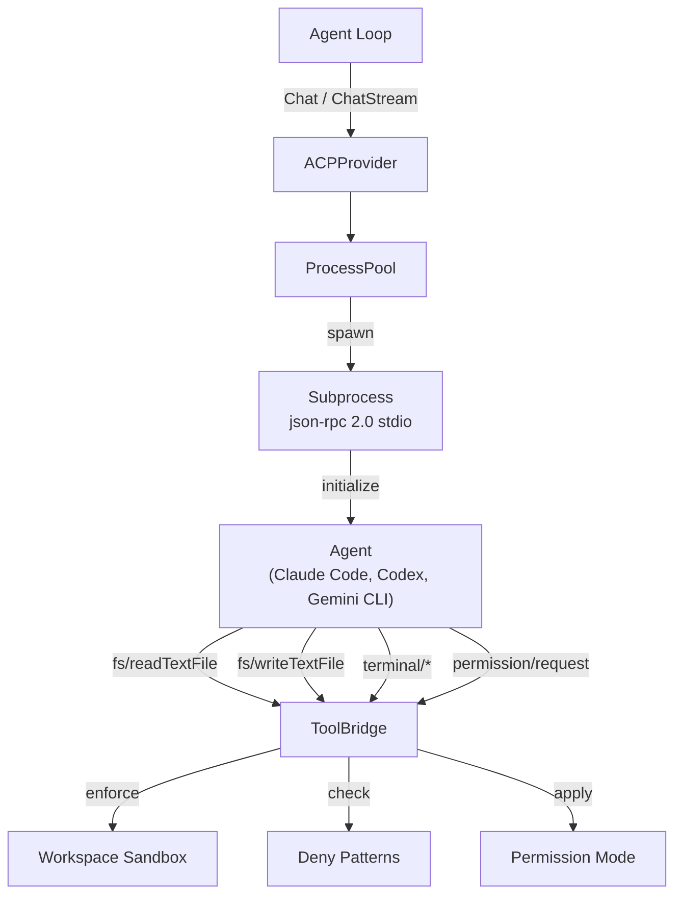
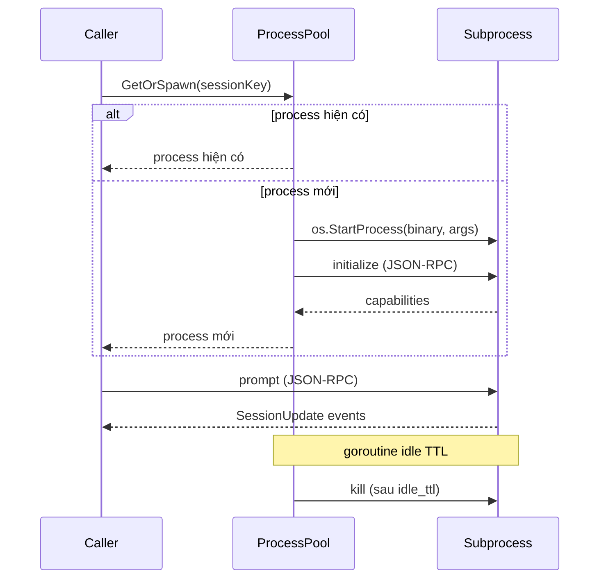

> Bản dịch từ [English version](/provider-acp)

# ACP (Agent Client Protocol)

> Sử dụng Claude Code, Codex CLI, hoặc Gemini CLI làm LLM provider thông qua Agent Client Protocol — được điều phối như JSON-RPC subprocess.

## ACP là gì?

ACP (Agent Client Protocol) cho phép GoClaw điều phối các external coding agent — Claude Code, OpenAI Codex CLI, Gemini CLI, hoặc bất kỳ agent tương thích ACP nào — như subprocess thông qua **JSON-RPC 2.0 over stdio**. Thay vì gọi HTTP API, GoClaw khởi chạy binary agent như child process và trao đổi message có cấu trúc qua pipe stdin/stdout.

Điều này cho phép ủy thác các tác vụ sinh code phức tạp cho các CLI agent chuyên biệt trong khi vẫn duy trì interface `Provider` thống nhất của GoClaw: phần còn lại của hệ thống xử lý ACP giống hệt các provider khác.



---

## Cấu hình

Thêm entry `acp` trong `providers` của `config.json`:

```json
{
  "providers": {
    "acp": {
      "binary": "claude",
      "args": ["--profile", "goclaw"],
      "model": "claude",
      "work_dir": "/tmp/workspace",
      "idle_ttl": "5m",
      "perm_mode": "approve-all"
    }
  }
}
```

### Các trường ACPConfig

| Trường | Kiểu | Mặc định | Mô tả |
|--------|------|---------|-------|
| `binary` | string | `"claude"` | Tên hoặc đường dẫn tuyệt đối của binary agent (ví dụ: `"claude"`, `"codex"`, `"gemini"`) |
| `args` | `[]string` | `[]` | Tham số khởi chạy bổ sung, thêm vào mỗi lần spawn subprocess |
| `model` | string | `"claude"` | Tên model/agent mặc định báo cáo cho caller |
| `work_dir` | string | bắt buộc | Thư mục workspace cơ sở — tất cả thao tác file được giới hạn trong đây |
| `idle_ttl` | string | `"5m"` | Thời gian sau đó subprocess idle bị dọn dẹp (Go duration string) |
| `perm_mode` | string | `"approve-all"` | Chính sách permission: `approve-all`, `approve-reads`, hoặc `deny-all` |

### Đăng ký qua Database

Provider cũng có thể được đăng ký động qua bảng `llm_providers`:

| Cột | Giá trị |
|-----|---------|
| `provider_type` | `"acp"` |
| `api_base` | tên binary (ví dụ: `"claude"`) |
| `settings` | `{"args": [...], "idle_ttl": "5m", "perm_mode": "approve-all", "work_dir": "..."}` |

---

## ProcessPool

`ProcessPool` quản lý vòng đời subprocess. Mỗi session (xác định bởi `session_key`) ánh xạ đến một subprocess tồn tại lâu dài:

1. **GetOrSpawn** — với mỗi request, lấy subprocess hiện có của session hoặc spawn mới.
2. **Initialize** — subprocess mới spawn nhận lời gọi JSON-RPC `initialize` để thương lượng protocol capabilities.
3. **Reap idle TTL** — goroutine nền định kỳ kiểm tra timestamp lần dùng cuối; process idle lâu hơn `idle_ttl` bị kill và xóa.
4. **Crash recovery** — nếu subprocess thoát bất ngờ, pool phát hiện broken pipe ở request tiếp theo, xóa entry cũ và spawn process mới một cách trong suốt.



---

## ToolBridge

Khi subprocess agent cần đọc file, chạy lệnh, hoặc yêu cầu permission, nó gửi JSON-RPC request ngược lại GoClaw qua stdio. `ToolBridge` xử lý các callback agent→client này:

| Method | Mô tả |
|--------|-------|
| `fs/readTextFile` | Đọc file trong workspace sandbox |
| `fs/writeTextFile` | Ghi file trong workspace sandbox |
| `terminal/createTerminal` | Spawn terminal subprocess |
| `terminal/terminalOutput` | Lấy terminal output và exit status |
| `terminal/waitForTerminalExit` | Block cho đến khi terminal thoát |
| `terminal/releaseTerminal` | Giải phóng terminal resource |
| `terminal/killTerminal` | Force-terminate terminal |
| `permission/request` | Yêu cầu phê duyệt của người dùng cho một hành động |

Mỗi lời gọi ToolBridge được kiểm tra qua:
1. **Workspace isolation** — đường dẫn phải nằm trong `work_dir`
2. **Deny pattern matching** — regex đường dẫn được kiểm tra trước khi thực thi
3. **Permission mode** — cổng kiểm tra cuối cùng dựa trên `perm_mode`

---

## Session Sequencing

Các request đồng thời đến cùng session có thể làm hỏng trạng thái file. ACP serialize các request per-session qua mutex `sessionMu`:

```go
unlock := p.lockSession(sessionKey)
defer unlock()
// Chat hoặc ChatStream thực thi với quyền truy cập serial được đảm bảo
```

Request đến các session khác nhau chạy song song, nhưng request đến cùng session được xếp hàng.

---

## Streaming vs Non-Streaming

### Chat (non-streaming)

Chờ subprocess agent thực thi xong prompt, sau đó thu thập tất cả `SessionUpdate` text block đã tích lũy và trả về một `ChatResponse` duy nhất. Dùng khi cần toàn bộ câu trả lời trước khi xử lý.

### ChatStream

Emit callback `StreamChunk` cho mỗi text delta khi agent tạo ra output. Hỗ trợ context cancellation: nếu caller hủy, GoClaw gửi notification JSON-RPC `session/cancel` đến subprocess. Trả về `ChatResponse` kết hợp khi hoàn tất.

---

## Workspace Sandbox

Tất cả thao tác file bị giới hạn trong `work_dir`. Các nỗ lực path traversal (ví dụ: `../../etc/passwd`) được phát hiện và từ chối trước khi đến filesystem.

### Deny Patterns

Regex pattern chặn truy cập vào đường dẫn nhạy cảm bất kể phạm vi workspace:

```json
[
  "^/etc/",
  "^\\.env",
  "^secret",
  "^[Cc]redentials"
]
```

Pattern được đánh giá với đường dẫn tuyệt đối đã resolve. Bất kỳ match nào sẽ khiến request bị từ chối với lỗi.

---

## Permission Modes

| Mode | Hành vi |
|------|---------|
| `approve-all` | Tất cả lời gọi `permission/request` được tự động phê duyệt (mặc định) |
| `approve-reads` | Thao tác đọc được phê duyệt; ghi filesystem bị từ chối |
| `deny-all` | Tất cả lời gọi `permission/request` bị từ chối |

---

## Xử lý nội dung

ACP dùng `ContentBlock` cho message, hỗ trợ text, image, và audio:

```go
type ContentBlock struct {
    Type     string // "text", "image", "audio"
    Text     string // nội dung text
    Data     string // base64-encoded cho image/audio
    MimeType string // ví dụ: "image/png", "audio/wav"
}
```

Với mỗi request, GoClaw:
1. Trích xuất system prompt và user message từ `ChatRequest.Messages`
2. Prepend system prompt vào user message đầu tiên (ACP agent không có API system riêng)
3. Đính kèm image content block như message block bổ sung

Với response, GoClaw:
1. Tích lũy `SessionUpdate` notification được emit trong quá trình thực thi
2. Thu thập tất cả text block thành nội dung response
3. Map `stopReason`: `"maxContextLength"` → `"length"`, còn lại → `"stop"`

---

## Lưu ý bảo mật

- **Subprocess isolation**: mỗi agent process chạy với cùng OS user như GoClaw. Dùng OS-level sandboxing (container, seccomp) để cô lập mạnh hơn.
- **Workspace confinement**: `work_dir` là thư mục duy nhất agent có thể đọc/ghi qua ToolBridge. Đặt thành thư mục riêng, không nhạy cảm.
- **Deny patterns**: cấu hình pattern khớp với layout secrets của bạn (`.env`, `credentials`, `*.pem`, v.v.)
- **Permission mode**: dùng `approve-reads` hoặc `deny-all` trong môi trường production nơi quyền ghi phải bị hạn chế.
- **Binary path**: chỉ định đường dẫn tuyệt đối cho `binary` để ngăn PATH injection attack.
- **idle_ttl**: giữ ngắn (≤10m) để giảm bề mặt tấn công từ subprocess bị xâm phạm.

---

## Tiếp theo

- [Tổng quan Provider](/providers-overview)
- [Claude CLI](/provider-claude-cli)
- [Custom / OpenAI-Compatible](/provider-custom)

<!-- goclaw-source: 120fc2d | cập nhật: 2026-03-23 -->
