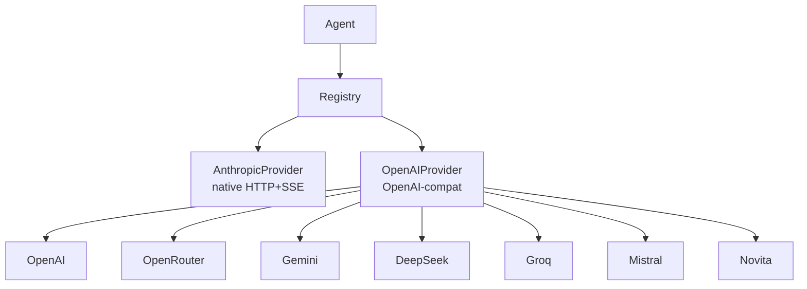

> Bản dịch từ [English version](/providers-overview)

# Tổng quan về Providers

> Providers là cầu nối giữa GoClaw và các LLM API — cấu hình một (hoặc nhiều) provider và mọi agent đều dùng được ngay.

## Tổng quan

Một provider bọc một LLM API và cung cấp interface chung: `Chat()`, `ChatStream()`, `DefaultModel()`, và `Name()`. GoClaw có hai cách triển khai provider: một native Anthropic client (custom HTTP+SSE) và một generic OpenAI-compatible client bao phủ OpenAI, OpenRouter, Gemini, DeepSeek, Groq, Mistral, và nhiều hơn nữa. Bạn chọn provider nào cho agent thông qua config của agent; phần còn lại của hệ thống không phụ thuộc vào provider cụ thể.

## Provider Interface

Mọi provider đều triển khai cùng một Go interface:

```
Chat()        — gọi blocking, trả về toàn bộ response
ChatStream()  — gọi streaming, bắn callback onChunk theo từng token
DefaultModel() — trả về tên model mặc định đã cấu hình
Name()        — trả về định danh provider (ví dụ: "anthropic", "openai")
```

Các provider hỗ trợ extended thinking cũng triển khai thêm `SupportsThinking() bool`.

## Thêm Provider

### Cấu hình tĩnh (config.json)

Thêm API key của bạn vào `providers.<name>`:

```json
{
  "providers": {
    "anthropic": {
      "api_key": "sk-ant-..."
    },
    "openai": {
      "api_key": "sk-...",
      "api_base": "https://api.openai.com/v1"
    },
    "openrouter": {
      "api_key": "sk-or-..."
    }
  }
}
```

Trường `api_base` là tùy chọn — mỗi provider đã có endpoint mặc định sẵn.

### Dashboard (bảng llm_providers)

Providers cũng có thể được lưu trong bảng `llm_providers` của PostgreSQL. API key được mã hóa khi lưu bằng AES-256-GCM. Bạn có thể thêm, sửa, hoặc xóa provider từ dashboard mà không cần khởi động lại GoClaw. Thay đổi có hiệu lực ở request tiếp theo.

> **Lưu ý:** `provider_type` là bất biến sau khi tạo — không thể thay đổi qua API hoặc dashboard. Để đổi loại provider, hãy xóa rồi tạo lại provider.

## Retry Logic

Tất cả provider đều dùng chung cơ chế retry thông qua `RetryDo()`:

| Cài đặt | Giá trị |
|---|---|
| Số lần thử tối đa | 3 |
| Độ trễ ban đầu | 300ms |
| Độ trễ tối đa | 30s |
| Jitter | ±10% |
| Status code có thể retry | 429, 500, 502, 503, 504 |
| Lỗi mạng có thể retry | timeout, connection reset, broken pipe, EOF |

Khi API trả về header `Retry-After` (hay gặp ở response 429), GoClaw dùng giá trị đó thay vì tự tính exponential backoff.

## Kiến trúc Provider



## Chuẩn hóa Tool Schema cho MCP Tools

Khi GoClaw kết nối MCP (Model Context Protocol) tools tới một provider, các tool schema được chuẩn hóa để phù hợp với định dạng mà provider yêu cầu. Các kiểu trường, mảng required và thuộc tính không được hỗ trợ sẽ được điều chỉnh tự động. Điều này giúp MCP tools hoạt động trên tất cả provider backend mà không cần điều chỉnh schema thủ công.

## Reasoning Effort theo Khả năng Model

Các tham số điều khiển reasoning effort (`reasoning_effort`, `thinking_budget`, v.v.) được kiểm tra dựa trên khả năng của model trước mỗi request. Nếu model đích không hỗ trợ reasoning effort, tham số đó sẽ được bỏ qua lặng lẽ — không trả về lỗi. Điều này có nghĩa là bạn có thể cấu hình reasoning effort ở cấp độ toàn cục và nó chỉ được áp dụng cho các model có hỗ trợ tính năng này.

## Tự động giới hạn max_tokens

Khi một model từ chối request vì `max_tokens` quá lớn, GoClaw tự động thử lại với giá trị được giới hạn. Cơ chế này xử lý cả tên tham số `max_tokens` và `max_completion_tokens` tùy theo provider. Việc thử lại diễn ra hoàn toàn trong suốt — agent không bao giờ thấy lỗi này.

## Lỗi thường gặp

| Lỗi | Nguyên nhân | Cách xử lý |
|---|---|---|
| `provider not found: X` | Sai tên provider hoặc thiếu config | Kiểm tra cách viết trong config.json khớp với tên provider |
| `HTTP 401` | API key không hợp lệ hoặc bị thiếu | Xác minh lại API key |
| `HTTP 429` | Vượt rate limit | GoClaw tự động retry; giảm số request đồng thời |
| Provider không hiển thị | Chưa đặt key | Thêm `api_key` vào config block của provider |

## Tiếp theo

- [Anthropic](./anthropic.md) — tích hợp Claude native với extended thinking
- [OpenAI](./openai.md) — GPT-4o, các model reasoning o-series
- [OpenRouter](./openrouter.md) — truy cập 100+ model qua một API key duy nhất
- [Gemini](./gemini.md) — Google Gemini qua endpoint tương thích OpenAI
- [DeepSeek](./deepseek.md) — DeepSeek với hỗ trợ reasoning_content
- [Groq](./groq.md) — inference cực nhanh
- [Mistral](./mistral.md) — các model Mistral AI
- [Novita AI](/provider-novita) — tương thích OpenAI, nhiều mô hình mã nguồn mở

<!-- goclaw-source: c388364d | updated: 2026-04-01 -->
