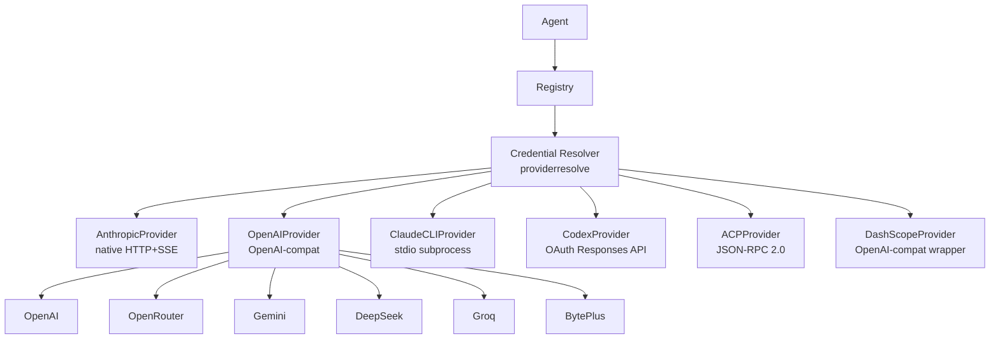

> Bản dịch từ [English version](/providers-overview)

# Tổng quan về Providers

> Providers là cầu nối giữa GoClaw và các LLM API — cấu hình một (hoặc nhiều) provider và mọi agent đều dùng được ngay.

## Tổng quan

Một provider bọc một LLM API và cung cấp interface chung: `Chat()`, `ChatStream()`, `DefaultModel()`, và `Name()`. GoClaw có sáu cách triển khai provider: một native Anthropic client (custom HTTP+SSE), một generic OpenAI-compatible client bao phủ 15+ API endpoint, Claude CLI (binary cục bộ qua stdio), Codex (OAuth-based ChatGPT Responses API), ACP (điều phối subagent qua JSON-RPC 2.0), và DashScope (Alibaba Qwen). Bạn chọn provider nào cho agent thông qua config của agent; phần còn lại của hệ thống không phụ thuộc vào provider cụ thể.

## Hệ thống Provider Adapter

GoClaw v3 giới thiệu lớp **provider adapter** có thể mở rộng. Mỗi loại provider đăng ký một adapter qua `adapter_register.go`. Các adapter dùng chung `SSEScanner` (`internal/providers/sse_reader.go`) để đọc Server-Sent Events theo từng dòng, loại bỏ sự trùng lặp streaming riêng biệt cho từng provider trước đây.

```
SSEScanner
└── Dùng chung bởi: Anthropic, OpenAI-compat, Codex adapter
    └── Đọc SSE data payload, theo dõi event type, dừng tại [DONE]
```

## Credential Resolver

Package `internal/providerresolve/` cung cấp **credential resolver** thống nhất (`ResolveConfiguredProvider`) dùng chung cho tất cả adapter. Resolver này:

1. Tra cứu provider từ tenant registry
2. Với provider `chatgpt_oauth` (Codex), giải quyết cấu hình pool routing từ cả provider-level defaults và agent-level overrides
3. Trả về `Provider` đúng (hoặc `ChatGPTOAuthRouter` cho pool strategy)

Credentials được lưu mã hóa (AES-256-GCM) trong bảng `llm_providers` của PostgreSQL và được giải mã khi tải — không bao giờ lưu plaintext trong bộ nhớ sau lần tải đầu tiên.

## Provider Interface

Mọi provider đều triển khai cùng một Go interface:

```
Chat()        — gọi blocking, trả về toàn bộ response
ChatStream()  — gọi streaming, bắn callback onChunk theo từng token
DefaultModel() — trả về tên model mặc định đã cấu hình
Name()        — trả về định danh provider (ví dụ: "anthropic", "openai")
```

Các provider hỗ trợ extended thinking cũng triển khai thêm `SupportsThinking() bool`.

## Các loại Provider được hỗ trợ

| Provider | Loại | Model mặc định |
|----------|------|----------------|
| **anthropic** | Native HTTP + SSE | `claude-sonnet-4-5-20250929` |
| **claude_cli** | stdio subprocess + MCP | `sonnet` |
| **codex** / **chatgpt_oauth** | OAuth Responses API | `gpt-5.3-codex` |
| **acp** | JSON-RPC 2.0 subagent | `claude` |
| **dashscope** | OpenAI-compat wrapper | `qwen3-max` |
| **openai** (+ 15+ biến thể) | OpenAI-compatible | Tùy model |

### Provider tương thích OpenAI

| Provider | API Base | Model mặc định |
|----------|----------|----------------|
| openai | `https://api.openai.com/v1` | `gpt-4o` |
| openrouter | `https://openrouter.ai/api/v1` | `anthropic/claude-sonnet-4-5-20250929` |
| groq | `https://api.groq.com/openai/v1` | `llama-3.3-70b-versatile` |
| deepseek | `https://api.deepseek.com/v1` | `deepseek-chat` |
| gemini | `https://generativelanguage.googleapis.com/v1beta/openai` | `gemini-2.0-flash` |
| mistral | `https://api.mistral.ai/v1` | `mistral-large-latest` |
| xai | `https://api.x.ai/v1` | `grok-3-mini` |
| minimax | `https://api.minimax.io/v1` | `MiniMax-M2.5` |
| cohere | `https://api.cohere.ai/compatibility/v1` | `command-a` |
| perplexity | `https://api.perplexity.ai` | `sonar-pro` |
| ollama | `http://localhost:11434/v1` | `llama3.3` |
| byteplus | `https://ark.ap-southeast.bytepluses.com/api/v3` | `seed-2-0-lite-260228` |

## Thêm Provider

### Cấu hình tĩnh (config.json)

Thêm API key của bạn vào `providers.<name>`:

```json
{
  "providers": {
    "anthropic": {
      "api_key": "sk-ant-..."
    },
    "openai": {
      "api_key": "sk-...",
      "api_base": "https://api.openai.com/v1"
    },
    "openrouter": {
      "api_key": "sk-or-..."
    }
  }
}
```

Trường `api_base` là tùy chọn — mỗi provider đã có endpoint mặc định sẵn.

### Dashboard (bảng llm_providers)

Providers cũng có thể được lưu trong bảng `llm_providers` của PostgreSQL. API key được mã hóa khi lưu bằng AES-256-GCM. Bạn có thể thêm, sửa, hoặc xóa provider từ dashboard mà không cần khởi động lại GoClaw. Thay đổi có hiệu lực ở request tiếp theo.

> **Lưu ý:** `provider_type` là bất biến sau khi tạo — không thể thay đổi qua API hoặc dashboard. Để đổi loại provider, hãy xóa rồi tạo lại provider.

## Kiến trúc Provider



## Retry Logic

Tất cả provider đều dùng chung cơ chế retry thông qua `RetryDo()`:

| Cài đặt | Giá trị |
|---|---|
| Số lần thử tối đa | 3 |
| Độ trễ ban đầu | 300ms |
| Độ trễ tối đa | 30s |
| Jitter | ±10% |
| Status code có thể retry | 429, 500, 502, 503, 504 |
| Lỗi mạng có thể retry | timeout, connection reset, broken pipe, EOF |

Khi API trả về header `Retry-After` (hay gặp ở response 429), GoClaw dùng giá trị đó thay vì tự tính exponential backoff.

## Tạo Media với BytePlus (Seedream & Seedance)

Provider `byteplus` hỗ trợ hai tính năng tạo media bất đồng bộ trên nền tảng BytePlus ModelArk:

| Tool | Model | Khả năng |
|------|-------|----------|
| `create_image_byteplus` | Seedream (ví dụ: `seedream-3-0`) | Tạo ảnh bất đồng bộ — gửi job và polling kết quả |
| `create_video_byteplus` | Seedance (ví dụ: `seedance-1-0`) | Tạo video bất đồng bộ — gửi job và polling `/text-to-video-pro/status/{id}` |

Cả hai tool đều khả dụng ngay khi cấu hình provider `byteplus`. Chúng dùng chung API key và `api_base` với text provider; endpoint media được suy ra tự động (luôn là `/api/v3`, không phải `/api/coding/v3`).

## ACP Provider (Claude Code, Codex CLI, Gemini CLI)

Provider `acp` điều phối các coding agent bên ngoài (Claude Code, Codex CLI, Gemini CLI, hoặc bất kỳ agent tương thích ACP nào) dưới dạng subprocess qua JSON-RPC 2.0 over stdio. Cấu hình qua `provider_type: "acp"` với các trường `binary`, `work_dir`, `idle_ttl`, và `perm_mode`. Xem [ACP Provider](/provider-acp) để biết chi tiết đầy đủ.

## Qwen 3.5 / DashScope — Thinking theo từng Model

Provider `dashscope` hỗ trợ extended thinking cho Qwen model với cơ chế kiểm tra thinking theo từng model. Khi có tools, streaming tự động bị tắt và GoClaw fallback sang một non-streaming call (giới hạn của DashScope). Thinking budget mapping: low=4,096, medium=16,384, high=32,768 tokens.

## OpenAI GPT-5 / o-series — Lưu ý

Với GPT-5 và các model o-series, dùng `max_completion_tokens` thay vì `max_tokens`. GoClaw tự động chọn tên tham số đúng dựa trên khả năng của model. Temperature được bỏ qua lặng lẽ với các model reasoning không hỗ trợ tính năng này.

## Anthropic Prompt Caching

Prompt caching của Anthropic được áp dụng qua `CacheMiddleware` trong pipeline middleware của request. Model alias được resolve trước khi tính cache key — ví dụ: `sonnet` resolve thành tên model đầy đủ trước khi gửi request.

## Codex OAuth Pool Routing

Khi có nhiều alias `chatgpt_oauth` được cấu hình, GoClaw có thể phân phối request qua chúng bằng pool strategy. Cấu hình qua `settings.codex_pool` trên provider chủ pool:

```json
{
  "name": "openai-codex",
  "provider_type": "chatgpt_oauth",
  "settings": {
    "codex_pool": {
      "strategy": "round_robin",
      "extra_provider_names": ["codex-work", "codex-personal"]
    }
  }
}
```

| Strategy | Hành vi |
|----------|---------|
| `round_robin` | Luân phiên request qua tài khoản ưu tiên và tất cả tài khoản bổ sung |
| `priority_order` | Thử tài khoản ưu tiên trước, sau đó dùng lần lượt các tài khoản bổ sung |
| `primary_first` | Giữ cố định tài khoản ưu tiên (tắt pool cho agent đó) |

Lỗi upstream có thể retry sẽ chuyển sang tài khoản tiếp theo trong cùng một request. Hoạt động pool theo agent được xem tại `GET /v1/agents/{id}/codex-pool-activity`.

## `reasoning_defaults` ở Cấp Provider

Provider (hiện tại là `chatgpt_oauth`) có thể lưu reasoning defaults dùng chung trong `settings.reasoning_defaults`. Agent kế thừa qua `reasoning.override_mode: "inherit"` hoặc ghi đè bằng `"custom"`. Xem [provider OpenAI](/provider-openai) để biết chi tiết đầy đủ.

## Reasoning Effort theo Khả năng Model

Các tham số điều khiển reasoning effort (`reasoning_effort`, `thinking_budget`, v.v.) được kiểm tra dựa trên khả năng của model trước mỗi request. Nếu model đích không hỗ trợ reasoning effort, tham số đó sẽ được bỏ qua lặng lẽ — không trả về lỗi. Bạn có thể cấu hình reasoning effort ở cấp toàn cục và nó chỉ được áp dụng cho các model có hỗ trợ.

## Datetime Tool cho Provider Context

Tool `datetime` tích hợp sẵn cho phép agent và provider truy cập ngày giờ hiện tại. Hữu ích cho các tác vụ reasoning nhạy cảm về thời gian và lên lịch mà không cần dựa vào knowledge cutoff của model.

## Tự động giới hạn max_tokens

Khi một model từ chối request vì `max_tokens` quá lớn, GoClaw tự động thử lại với giá trị được giới hạn. Cơ chế này xử lý cả tên tham số `max_tokens` và `max_completion_tokens` tùy theo provider. Việc thử lại diễn ra hoàn toàn trong suốt — agent không bao giờ thấy lỗi này.

## Chuẩn hóa Tool Schema cho MCP Tools

Khi GoClaw kết nối MCP (Model Context Protocol) tools tới một provider, các tool schema được chuẩn hóa để phù hợp với định dạng mà provider yêu cầu. Các kiểu trường, mảng required và thuộc tính không được hỗ trợ sẽ được điều chỉnh tự động. Điều này giúp MCP tools hoạt động trên tất cả provider backend mà không cần điều chỉnh schema thủ công.

## Lỗi thường gặp

| Lỗi | Nguyên nhân | Cách xử lý |
|---|---|---|
| `provider not found: X` | Sai tên provider hoặc thiếu config | Kiểm tra cách viết trong config.json khớp với tên provider |
| `HTTP 401` | API key không hợp lệ hoặc bị thiếu | Xác minh lại API key |
| `HTTP 429` | Vượt rate limit | GoClaw tự động retry; giảm số request đồng thời |
| Provider không hiển thị | Chưa đặt key | Thêm `api_key` vào config block của provider |

## Tiếp theo

- [Anthropic](./anthropic.md) — tích hợp Claude native với extended thinking
- [OpenAI](./openai.md) — GPT-4o, o-series, GPT-5 reasoning model
- [OpenRouter](./openrouter.md) — truy cập 100+ model qua một API key duy nhất
- [Gemini](./gemini.md) — Google Gemini qua endpoint tương thích OpenAI
- [DeepSeek](./deepseek.md) — DeepSeek với hỗ trợ reasoning_content
- [Groq](./groq.md) — inference cực nhanh
- [DashScope](./dashscope.md) — Alibaba Qwen model với hỗ trợ thinking
- [ACP](./acp.md) — điều phối subagent Claude Code, Codex CLI, Gemini CLI

<!-- goclaw-source: 050aafc9 | updated: 2026-04-09 -->
