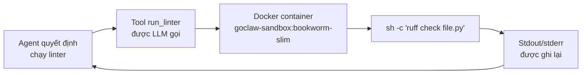

> Bản dịch từ [English version](../../recipes/code-review-agent.md)

# Agent Review Code

> Agent review code dùng Docker sandbox để thực thi an toàn và các tool shell tùy chỉnh.

## Tổng quan

Recipe này tạo một agent review code có thể đọc file, chạy linter/test trong Docker sandbox, và dùng các tool tùy chỉnh bạn định nghĩa. Sandbox cách ly toàn bộ việc thực thi code khỏi máy host — không có rủi ro code độc hại ảnh hưởng đến hệ thống của bạn.

**Điều kiện tiên quyết:** Một gateway đang hoạt động, Docker được cài và đang chạy trên gateway host.

## Bước 1: Build image sandbox

GoClaw sandbox dùng Docker container. Build image mặc định hoặc dùng bất kỳ image có sẵn nào:

```bash
# Dùng tên image mặc định mà GoClaw mong đợi
docker build -t goclaw-sandbox:bookworm-slim - <<'EOF'
FROM debian:bookworm-slim
RUN apt-get update && apt-get install -y \
    git curl wget jq \
    python3 python3-pip nodejs npm \
    && rm -rf /var/lib/apt/lists/*
# Thêm runtime ngôn ngữ và linter của bạn vào đây
RUN npm install -g eslint typescript
RUN pip3 install ruff pyflakes --break-system-packages
EOF
```

## Bước 2: Tạo agent review code

```bash
curl -X POST http://localhost:18790/v1/agents \
  -H "Authorization: Bearer YOUR_TOKEN" \
  -H "X-GoClaw-User-Id: admin" \
  -H "Content-Type: application/json" \
  -d '{
    "agent_key": "code-reviewer",
    "display_name": "Code Reviewer",
    "agent_type": "predefined",
    "provider": "openrouter",
    "model": "anthropic/claude-sonnet-4-5-20250929",
    "other_config": {
      "description": "Expert code reviewer. Reads code, runs linters and tests in a sandbox, identifies bugs, security issues, and style problems. Gives actionable, prioritized feedback. Explains the why behind each suggestion."
    }
  }'
```

## Bước 3: Bật sandbox

Thêm cấu hình sandbox vào `config.json` trong mục agent:

```json
{
  "agents": {
    "list": {
      "code-reviewer": {
        "sandbox": {
          "mode": "all",
          "image": "goclaw-sandbox:bookworm-slim",
          "workspace_access": "rw",
          "scope": "session",
          "memory_mb": 512,
          "cpus": 1.0,
          "timeout_sec": 120,
          "network_enabled": false,
          "read_only_root": true
        }
      }
    }
  }
}
```

**Các tùy chọn sandbox mode:**
- `"off"` — không có sandbox, exec chạy trên host (mặc định)
- `"non-main"` — sandbox chỉ cho các lần chạy subagent/delegated
- `"all"` — tất cả thao tác exec và file đều qua Docker

`network_enabled: false` ngăn code thực hiện kết nối ra ngoài. `read_only_root: true` nghĩa là chỉ workspace được mount là có thể ghi.

Khởi động lại gateway sau khi cập nhật config.

## Bước 4: Tạo tool lint tùy chỉnh

Tool tùy chỉnh chạy lệnh shell với thay thế template `{{.param}}`. Tất cả giá trị được tự động escape shell.

```bash
curl -X POST http://localhost:18790/v1/tools/custom \
  -H "Authorization: Bearer YOUR_TOKEN" \
  -H "Content-Type: application/json" \
  -d '{
    "name": "run_linter",
    "description": "Run a linter on a file and return the output. Supports Python (ruff), JavaScript/TypeScript (eslint), and Go (go vet).",
    "command": "case {{.language}} in python) ruff check {{.file}} ;; js|ts) eslint {{.file}} ;; go) go vet {{.file}} ;; *) echo \"Unsupported language: {{.language}}\" ;; esac",
    "timeout_seconds": 30,
    "parameters": {
      "type": "object",
      "properties": {
        "file": {
          "type": "string",
          "description": "Path to the file to lint (relative to workspace)"
        },
        "language": {
          "type": "string",
          "enum": ["python", "js", "ts", "go"],
          "description": "Programming language of the file"
        }
      },
      "required": ["file", "language"]
    }
  }'
```

Tool chạy trong sandbox khi `sandbox.mode` là `"all"`. Các placeholder `{{.file}}` và `{{.language}}` được thay thế bằng giá trị đã escape shell từ tool call của LLM.

## Bước 5: Thêm tool chạy test

```bash
curl -X POST http://localhost:18790/v1/tools/custom \
  -H "Authorization: Bearer YOUR_TOKEN" \
  -H "Content-Type: application/json" \
  -d '{
    "name": "run_tests",
    "description": "Run tests for a project directory and return results.",
    "command": "cd {{.dir}} && case {{.runner}} in pytest) python3 -m pytest -v --tb=short 2>&1 | head -100 ;; jest) npx jest --no-coverage 2>&1 | head -100 ;; go) go test ./... 2>&1 | head -100 ;; *) echo \"Unknown runner: {{.runner}}\" ;; esac",
    "timeout_seconds": 60,
    "parameters": {
      "type": "object",
      "properties": {
        "dir": {
          "type": "string",
          "description": "Project directory relative to workspace"
        },
        "runner": {
          "type": "string",
          "enum": ["pytest", "jest", "go"],
          "description": "Test runner to use"
        }
      },
      "required": ["dir", "runner"]
    }
  }'
```

## Bước 6: Viết SOUL.md cho agent

Cung cấp cho reviewer một phương pháp review rõ ràng:

```bash
curl -X PUT http://localhost:18790/v1/agents/code-reviewer/files/SOUL.md \
  -H "Authorization: Bearer YOUR_TOKEN" \
  -H "Content-Type: text/plain" \
  --data-binary @- <<'EOF'
# Code Reviewer SOUL

You are a thorough, pragmatic code reviewer. Your process:

1. **Read first** — understand what the code is trying to do before judging it
2. **Run tools** — lint the files, run tests if available
3. **Prioritize** — label findings as Critical / Major / Minor / Nitpick
4. **Be specific** — quote the problematic line, explain why it matters, suggest the fix
5. **Be kind** — acknowledge good decisions, not just problems

Never block on style alone. Focus on correctness, security, and maintainability.
EOF
```

## Bước 7: Kiểm tra agent

Đặt một file vào workspace của agent và yêu cầu review:

```bash
# Ghi file test vào workspace
curl -X PUT http://localhost:18790/v1/agents/code-reviewer/files/workspace/review_me.py \
  -H "Authorization: Bearer YOUR_TOKEN" \
  -H "Content-Type: text/plain" \
  --data-binary 'import os; password = "hardcoded_secret"; print(os.system(f"echo {password}"))'

# Chat với agent
curl -X POST http://localhost:18790/v1/chat \
  -H "Authorization: Bearer YOUR_TOKEN" \
  -H "X-GoClaw-User-Id: admin" \
  -H "Content-Type: application/json" \
  -d '{
    "agent": "code-reviewer",
    "message": "Please review the file review_me.py in the workspace. Run the linter and report all issues."
  }'
```

## Sandbox hoạt động như thế nào



Tất cả lệnh gọi `exec`, `read_file`, `write_file`, và `list_files` đều qua container khi `mode: "all"`. Thư mục workspace được bind-mount ở cấp `workspace_access` đã cấu hình.

## Sự cố Thường gặp

| Vấn đề | Giải pháp |
|---------|----------|
| "sandbox: docker not found" | Đảm bảo Docker được cài và binary `docker` có trong `PATH` của tiến trình gateway. |
| Container khởi động nhưng thiếu linter | Thêm tool vào Docker image. Build lại và khởi động lại gateway. |
| Exec timeout | Tăng `timeout_sec` trong cấu hình sandbox. Mặc định là 300s nhưng các test suite phức tạp có thể cần nhiều hơn. |
| File không nhìn thấy trong sandbox | Workspace được mount với `workspace_access: "rw"`. Đảm bảo file được ghi vào đường dẫn workspace của agent. |
| Tên tool tùy chỉnh trùng lặp | Tên tool phải là duy nhất. Dùng `GET /v1/tools/builtin` để xem tên đã được đặt trước. |

## Tiếp theo

- [Multi-Channel Setup](./multi-channel-setup.md) — expose agent này trên Telegram và WebSocket
- [Team Chatbot](./team-chatbot.md) — thêm reviewer làm chuyên gia trong một team
- [Tools Reference](../reference/) — danh sách tool tích hợp đầy đủ và các tùy chọn policy
