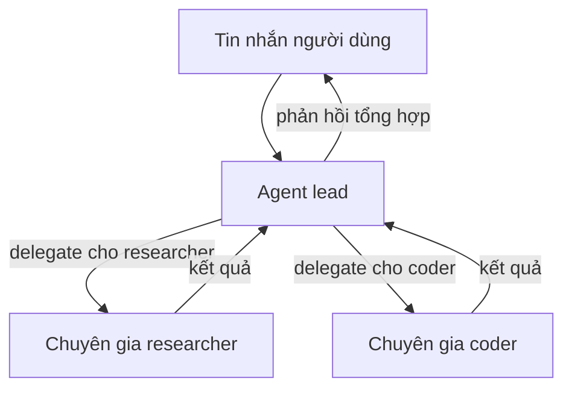

> Bản dịch từ [English version](/recipe-team-chatbot)

# Team Chatbot

> Team đa agent với lead điều phối và các sub-agent chuyên biệt cho các task khác nhau.

## Tổng quan

Recipe này xây dựng một team gồm ba agent: một lead xử lý hội thoại và phân công, cộng thêm hai chuyên gia (researcher và coder). Người dùng chỉ nói chuyện với lead — lead quyết định khi nào cần gọi chuyên gia. Team dùng hệ thống delegation tích hợp của GoClaw, nên lead có thể chạy các chuyên gia song song và tổng hợp kết quả.

**Bạn cần:**
- Một gateway đang hoạt động (chạy `./goclaw onboard` trước)
- Truy cập web dashboard tại `http://localhost:18790`
- Ít nhất một LLM provider đã cấu hình

## Bước 1: Tạo các agent chuyên gia

Các chuyên gia phải là agent **predefined** — chỉ agent predefined mới có thể nhận delegation.

Mở web dashboard và vào **Agents → Create Agent**. Tạo hai chuyên gia:

**Agent researcher:**
- **Key:** `researcher`
- **Display name:** Research Specialist
- **Type:** Predefined
- **Provider / Model:** Chọn provider và model bạn muốn
- **Description:** "Deep research specialist. Searches the web, reads pages, synthesizes findings into concise reports with sources. Factual, thorough, cites everything."

Click **Save**. Trường `description` kích hoạt **summoning** — gateway dùng LLM để tự động tạo SOUL.md và IDENTITY.md. Trạng thái agent sẽ chuyển từ `summoning` sang `active`.

**Agent coder:**

Lặp lại flow tương tự với:
- **Key:** `coder`
- **Display name:** Code Specialist
- **Type:** Predefined
- **Description:** "Senior software engineer. Writes clean, production-ready code. Explains implementation decisions. Prefers simple solutions. Tests edge cases."

Đợi cả hai agent đạt trạng thái `active` trước khi tiếp tục.

<details>
<summary><strong>Qua API</strong></summary>

```bash
# Researcher
curl -X POST http://localhost:18790/v1/agents \
  -H "Authorization: Bearer YOUR_TOKEN" \
  -H "X-GoClaw-User-Id: admin" \
  -H "Content-Type: application/json" \
  -d '{
    "agent_key": "researcher",
    "display_name": "Research Specialist",
    "agent_type": "predefined",
    "provider": "openrouter",
    "model": "anthropic/claude-sonnet-4-5-20250929",
    "other_config": {
      "description": "Deep research specialist. Searches the web, reads pages, synthesizes findings into concise reports with sources. Factual, thorough, cites everything."
    }
  }'

# Coder
curl -X POST http://localhost:18790/v1/agents \
  -H "Authorization: Bearer YOUR_TOKEN" \
  -H "X-GoClaw-User-Id: admin" \
  -H "Content-Type: application/json" \
  -d '{
    "agent_key": "coder",
    "display_name": "Code Specialist",
    "agent_type": "predefined",
    "provider": "openrouter",
    "model": "anthropic/claude-sonnet-4-5-20250929",
    "other_config": {
      "description": "Senior software engineer. Writes clean, production-ready code. Explains implementation decisions. Prefers simple solutions. Tests edge cases."
    }
  }'
```

Kiểm tra trạng thái agent cho đến khi `summoning` → `active`:

```bash
curl http://localhost:18790/v1/agents/researcher \
  -H "Authorization: Bearer YOUR_TOKEN"
```

</details>

## Bước 2: Tạo agent lead

Lead là agent **open** — mỗi người dùng có context riêng, tạo cảm giác như trợ lý cá nhân có cả một team phía sau.

Trong dashboard, vào **Agents → Create Agent**:
- **Key:** `lead`
- **Display name:** Assistant
- **Type:** Open
- **Provider / Model:** Chọn provider và model bạn muốn

Click **Save**.

<details>
<summary><strong>Qua API</strong></summary>

```bash
curl -X POST http://localhost:18790/v1/agents \
  -H "Authorization: Bearer YOUR_TOKEN" \
  -H "X-GoClaw-User-Id: admin" \
  -H "Content-Type: application/json" \
  -d '{
    "agent_key": "lead",
    "display_name": "Assistant",
    "agent_type": "open",
    "provider": "openrouter",
    "model": "anthropic/claude-sonnet-4-5-20250929"
  }'
```

</details>

## Bước 3: Tạo team

Vào **Teams → Create Team** trong dashboard:
- **Name:** Assistant Team
- **Description:** Personal assistant team with research and coding capabilities
- **Lead:** Chọn `lead`
- **Members:** Thêm `researcher` và `coder`

Click **Save**. Tạo team tự động thiết lập delegation link từ lead đến mỗi member. Context của lead agent giờ bao gồm file `TEAM.md` liệt kê các chuyên gia có sẵn và cách delegate cho họ.

<details>
<summary><strong>Qua API</strong></summary>

Quản lý team dùng WebSocket RPC. Kết nối đến `ws://localhost:18790/ws` và gửi:

```json
{
  "type": "req",
  "id": "1",
  "method": "teams.create",
  "params": {
    "name": "Assistant Team",
    "lead": "lead",
    "members": ["researcher", "coder"],
    "description": "Personal assistant team with research and coding capabilities"
  }
}
```

</details>

## Bước 4: Kết nối channel

Vào **Channels → Create Instance** trong dashboard:
- **Channel type:** Telegram (hoặc Discord, Slack, v.v.)
- **Name:** `team-telegram`
- **Agent:** Chọn `lead`
- **Credentials:** Dán bot token của bạn
- **Config:** Thiết lập DM policy và các tùy chọn riêng cho channel

Click **Save**. Channel hoạt động ngay lập tức — không cần khởi động lại gateway.

> **Quan trọng:** Chỉ gắn agent lead vào channel. Các chuyên gia không nên có binding channel riêng — họ nhận việc hoàn toàn qua delegation.

<details>
<summary><strong>Qua config.json</strong></summary>

Hoặc thêm binding vào `config.json` rồi khởi động lại gateway:

```json
{
  "bindings": [
    {
      "agentId": "lead",
      "match": {
        "channel": "telegram"
      }
    }
  ]
}
```

```bash
./goclaw
```

</details>

## Bước 5: Kiểm tra delegation

Gửi cho bot tin nhắn cần cả nghiên cứu lẫn code:

> "Những khác biệt chính giữa mô hình async của Rust và goroutine của Go là gì? Sau đó viết cho tôi một HTTP server đơn giản bằng mỗi ngôn ngữ."

Lead sẽ:
1. Delegate câu hỏi nghiên cứu cho `researcher`
2. Delegate yêu cầu code cho `coder`
3. Chạy cả hai song song (tối đa giới hạn `maxConcurrent`, mặc định 3 mỗi link)
4. Tổng hợp và trả lời với cả hai kết quả

## Bước 6: Theo dõi với Task Board

Mở **Teams → Assistant Team → Task Board** trong dashboard. Kanban board hiển thị delegation task theo thời gian thực:

- **Cột:** To-Do, In-Progress, Done — task tự động di chuyển khi chuyên gia làm việc
- **Cập nhật real-time:** Board refresh qua delta update, không cần reload thủ công
- **Chi tiết task:** Click vào task để xem agent được giao, trạng thái và output
- **Thao tác hàng loạt:** Chọn nhiều task bằng checkbox để xóa hoặc đổi trạng thái hàng loạt

Task Board là cách tốt nhất để xác minh delegation hoạt động đúng và debug khi chuyên gia không phản hồi như mong đợi.

## Workspace scope

Mỗi team có workspace cho các file được tạo trong quá trình thực thi task. Scope có thể cấu hình:

| Mode | Hành vi | Phù hợp cho |
|------|---------|-------------|
| **Isolated** (mặc định) | Mỗi cuộc hội thoại có folder riêng (`teams/{teamID}/{chatID}/`) | Bảo mật giữa người dùng, task độc lập |
| **Shared** | Tất cả member truy cập chung một folder (`teams/{teamID}/`) | Task cộng tác nơi agent xây dựng trên output của nhau |

Cấu hình qua team settings — trong dashboard, vào **Teams → team của bạn → Settings** và đặt **Workspace Scope** thành `shared` hoặc `isolated`.

**Giới hạn:** Tối đa 10 MB mỗi file, 100 file mỗi scope.

## Thông báo tiến độ

Team hỗ trợ thông báo tiến độ tự động với hai chế độ:

| Chế độ | Hành vi |
|--------|---------|
| **Direct** | Cập nhật tiến độ gửi trực tiếp đến chat channel — người dùng thấy trạng thái real-time |
| **Leader** | Cập nhật tiến độ đưa vào session của lead agent — lead quyết định hiển thị gì |

Bật trong team settings: đặt **Progress Notifications** thành on, rồi chọn **Escalation Mode**.

## Delegation hoạt động như thế nào



Lead delegate qua tool `delegate`. Các chuyên gia chạy dưới dạng sub-session và trả về kết quả. Lead thấy tất cả kết quả và soạn phản hồi cuối cùng.

## Sự cố thường gặp

| Vấn đề | Giải pháp |
|---------|----------|
| "cannot delegate to open agents" | Các chuyên gia phải có `agent_type: "predefined"`. Tạo lại với type đúng. |
| Lead không delegate | Lead cần biết về team của mình. Kiểm tra `TEAM.md` xuất hiện trong context file của lead (Dashboard → Agent → Files tab). Khởi động lại gateway nếu thiếu. |
| Summoning chuyên gia bị treo | Kiểm tra log gateway để tìm lỗi LLM. Summoning dùng provider đã cấu hình — đảm bảo nó có API key hợp lệ. |
| Người dùng thấy phản hồi chuyên gia trực tiếp | Chỉ lead nên được gắn vào channel. Kiểm tra Dashboard → Channels để xác minh chuyên gia không có binding channel. |
| Task không hiện trên board | Đảm bảo bạn đang xem đúng team. Delegation task xuất hiện tự động — nếu thiếu, kiểm tra team được tạo đúng với đầy đủ member. |

## Tiếp theo

- [Team là gì?](/teams-what-are-teams) — khái niệm và kiến trúc team
- [Task Board](/teams-task-board) — tham khảo đầy đủ về task board
- [Open vs. Predefined](/open-vs-predefined) — tại sao chuyên gia phải là predefined
- [Customer Support](/recipe-customer-support) — agent predefined phục vụ nhiều người dùng

<!-- goclaw-source: 57754a5 | cập nhật: 2026-03-18 -->
