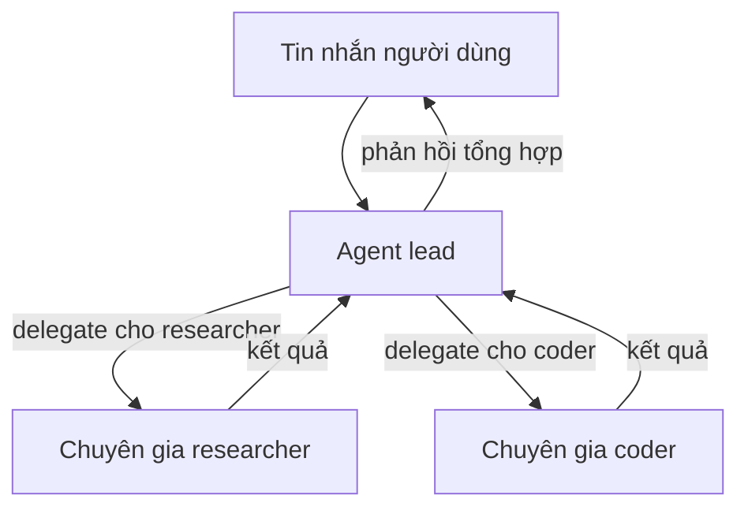

> Bản dịch từ [English version](../../recipes/team-chatbot.md)

# Team Chatbot

> Team đa agent với lead điều phối và các sub-agent chuyên biệt cho các task khác nhau.

## Tổng quan

Recipe này xây dựng một team gồm ba agent: một lead xử lý hội thoại và phân công, cộng thêm hai chuyên gia (researcher và coder). Người dùng chỉ nói chuyện với lead — lead quyết định khi nào cần gọi chuyên gia. Team dùng hệ thống delegation tích hợp của GoClaw, nên lead có thể chạy các chuyên gia song song và tổng hợp kết quả.

**Điều kiện tiên quyết:** Một gateway đang hoạt động (chạy `./goclaw onboard` trước), ít nhất một channel đã cấu hình.

## Bước 1: Tạo các agent chuyên gia

Các chuyên gia phải là agent **predefined** — chỉ agent predefined mới có thể nhận delegation.

**Agent researcher:**

```bash
curl -X POST http://localhost:18790/v1/agents \
  -H "Authorization: Bearer YOUR_TOKEN" \
  -H "X-GoClaw-User-Id: admin" \
  -H "Content-Type: application/json" \
  -d '{
    "agent_key": "researcher",
    "display_name": "Research Specialist",
    "agent_type": "predefined",
    "provider": "openrouter",
    "model": "anthropic/claude-sonnet-4-5-20250929",
    "other_config": {
      "description": "Deep research specialist. Searches the web, reads pages, synthesizes findings into concise reports with sources. Factual, thorough, cites everything."
    }
  }'
```

**Agent coder:**

```bash
curl -X POST http://localhost:18790/v1/agents \
  -H "Authorization: Bearer YOUR_TOKEN" \
  -H "X-GoClaw-User-Id: admin" \
  -H "Content-Type: application/json" \
  -d '{
    "agent_key": "coder",
    "display_name": "Code Specialist",
    "agent_type": "predefined",
    "provider": "openrouter",
    "model": "anthropic/claude-sonnet-4-5-20250929",
    "other_config": {
      "description": "Senior software engineer. Writes clean, production-ready code. Explains implementation decisions. Prefers simple solutions. Tests edge cases."
    }
  }'
```

Trường `description` kích hoạt **summoning** — gateway dùng LLM để tự động tạo SOUL.md và IDENTITY.md cho mỗi chuyên gia. Poll trạng thái agent cho đến khi chuyển từ `summoning` sang `active`.

## Bước 2: Tạo agent lead

Lead là agent **open** — mỗi người dùng có context riêng, tạo cảm giác như trợ lý cá nhân có cả một team phía sau.

```bash
curl -X POST http://localhost:18790/v1/agents \
  -H "Authorization: Bearer YOUR_TOKEN" \
  -H "X-GoClaw-User-Id: admin" \
  -H "Content-Type: application/json" \
  -d '{
    "agent_key": "lead",
    "display_name": "Assistant",
    "agent_type": "open",
    "provider": "openrouter",
    "model": "anthropic/claude-sonnet-4-5-20250929"
  }'
```

## Bước 3: Tạo team

Tạo team tự động thiết lập delegation link từ lead đến mỗi member.

```bash
curl -X POST http://localhost:18790/v1/teams \
  -H "Authorization: Bearer YOUR_TOKEN" \
  -H "X-GoClaw-User-Id: admin" \
  -H "Content-Type: application/json" \
  -d '{
    "name": "Assistant Team",
    "lead": "lead",
    "members": ["researcher", "coder"],
    "description": "Personal assistant team with research and coding capabilities"
  }'
```

Sau lệnh gọi này, context của lead agent tự động bao gồm file `TEAM.md` liệt kê các chuyên gia có sẵn và cách delegate cho họ.

## Bước 4: Cấu hình channel

Định tuyến tin nhắn channel đến agent lead. Thêm binding vào `config.json`:

```json
{
  "bindings": [
    {
      "agentId": "lead",
      "match": {
        "channel": "telegram"
      }
    }
  ]
}
```

Khởi động lại gateway để áp dụng:

```bash
./goclaw
```

## Bước 5: Kiểm tra delegation

Gửi cho bot tin nhắn cần nghiên cứu:

> "Những khác biệt chính giữa mô hình async của Rust và goroutine của Go là gì? Sau đó viết cho tôi một HTTP server đơn giản bằng mỗi ngôn ngữ."

Lead sẽ:
1. Delegate câu hỏi nghiên cứu cho `researcher`
2. Delegate yêu cầu code cho `coder`
3. Chạy cả hai song song (tối đa giới hạn `maxConcurrent`, mặc định 3 mỗi link)
4. Tổng hợp và trả lời với cả hai kết quả

Kiểm tra web dashboard → Sessions để xem trace delegation.

## Delegation hoạt động như thế nào



Lead delegate qua tool `delegate`. Các chuyên gia chạy dưới dạng sub-session và trả về kết quả. Lead thấy tất cả kết quả và soạn phản hồi cuối cùng.

## Sự cố Thường gặp

| Vấn đề | Giải pháp |
|---------|----------|
| "cannot delegate to open agents" | Các chuyên gia phải có `agent_type: "predefined"`. Tạo lại với type đúng. |
| Lead không delegate | Lead cần biết về team của mình. Kiểm tra `TEAM.md` xuất hiện trong context file của lead sau khi tạo team. Khởi động lại gateway nếu thiếu. |
| Summoning chuyên gia bị treo | Kiểm tra log gateway để tìm lỗi LLM. Summoning dùng provider mặc định — đảm bảo nó có API key hợp lệ. |
| Người dùng thấy phản hồi chuyên gia trực tiếp | Chỉ lead nên được gắn vào channel. Kiểm tra `bindings` trong config. Các chuyên gia không nên có binding channel. |

## Tiếp theo

- [Open vs. Predefined](../agents/open-vs-predefined.md) — tại sao chuyên gia phải là predefined
- [Customer Support](./customer-support.md) — agent predefined phục vụ nhiều người dùng
- [Agent Teams](../agent-teams/) — quản lý delegation link thủ công
