> Bản dịch từ [English version](../../reference/database-schema.md)

# Database Schema

> Tất cả bảng, cột, type, và constraint PostgreSQL qua tất cả migration.

## Tổng quan

GoClaw yêu cầu **PostgreSQL 15+** với hai extension:

```sql
CREATE EXTENSION IF NOT EXISTS "pgcrypto";  -- Tạo UUID v7
CREATE EXTENSION IF NOT EXISTS "vector";    -- pgvector cho embeddings
```

Hàm `uuid_generate_v7()` tùy chỉnh cung cấp UUID theo thứ tự thời gian. Tất cả primary key dùng hàm này mặc định.

Phiên bản schema được theo dõi bởi `golang-migrate`. Chạy `goclaw migrate up` hoặc `goclaw upgrade` để áp dụng tất cả migration.

---

## ER Diagram

```mermaid
erDiagram
    agents ||--o{ agent_shares : "shared with"
    agents ||--o{ agent_context_files : "has"
    agents ||--o{ user_context_files : "has"
    agents ||--o{ user_agent_profiles : "tracks"
    agents ||--o{ sessions : "owns"
    agents ||--o{ memory_documents : "stores"
    agents ||--o{ memory_chunks : "stores"
    agents ||--o{ skills : "owns"
    agents ||--o{ cron_jobs : "schedules"
    agents ||--o{ channel_instances : "bound to"
    agents ||--o{ agent_links : "links"
    agents ||--o{ agent_teams : "leads"
    agents ||--o{ agent_team_members : "member of"
    agent_teams ||--o{ team_tasks : "has"
    agent_teams ||--o{ team_messages : "has"
    memory_documents ||--o{ memory_chunks : "split into"
    cron_jobs ||--o{ cron_run_logs : "logs"
    traces ||--o{ spans : "contains"
    mcp_servers ||--o{ mcp_agent_grants : "granted to"
    mcp_servers ||--o{ mcp_user_grants : "granted to"
    skills ||--o{ skill_agent_grants : "granted to"
    skills ||--o{ skill_user_grants : "granted to"
```



---

## Các bảng

### `llm_providers`

LLM provider đã đăng ký. API key được mã hóa AES-256-GCM.

| Cột | Type | Constraint | Mô tả |
|-----|------|------------|-------|
| `id` | UUID | PK | UUID v7 |
| `name` | VARCHAR(50) | UNIQUE NOT NULL | Identifier (ví dụ `openrouter`) |
| `display_name` | VARCHAR(255) | | Tên hiển thị |
| `provider_type` | VARCHAR(30) | NOT NULL DEFAULT `openai_compat` | `openai_compat` hoặc `anthropic` |
| `api_base` | TEXT | | Custom endpoint URL |
| `api_key` | TEXT | | API key đã mã hóa |
| `enabled` | BOOLEAN | NOT NULL DEFAULT true | |
| `settings` | JSONB | NOT NULL DEFAULT `{}` | Config bổ sung theo provider |
| `created_at` | TIMESTAMPTZ | DEFAULT NOW() | |
| `updated_at` | TIMESTAMPTZ | DEFAULT NOW() | |

---

### `agents`

Bản ghi agent core. Mỗi agent có context, tools, và model configuration riêng.

| Cột | Type | Constraint | Mô tả |
|-----|------|------------|-------|
| `id` | UUID | PK | UUID v7 |
| `agent_key` | VARCHAR(100) | UNIQUE NOT NULL | Slug identifier (ví dụ `researcher`) |
| `display_name` | VARCHAR(255) | | Tên hiển thị trong UI |
| `owner_id` | VARCHAR(255) | NOT NULL | User ID của người tạo |
| `provider` | VARCHAR(50) | NOT NULL DEFAULT `openrouter` | LLM provider |
| `model` | VARCHAR(200) | NOT NULL | Model ID |
| `context_window` | INT | NOT NULL DEFAULT 200000 | Context window (tokens) |
| `max_tool_iterations` | INT | NOT NULL DEFAULT 20 | Số vòng tool tối đa mỗi run |
| `workspace` | TEXT | NOT NULL DEFAULT `.` | Đường dẫn thư mục workspace |
| `restrict_to_workspace` | BOOLEAN | NOT NULL DEFAULT true | Sandbox file access trong workspace |
| `tools_config` | JSONB | NOT NULL DEFAULT `{}` | Tool policy overrides |
| `sandbox_config` | JSONB | | Cấu hình Docker sandbox |
| `subagents_config` | JSONB | | Cấu hình concurrency subagent |
| `memory_config` | JSONB | | Cấu hình memory system |
| `compaction_config` | JSONB | | Cấu hình session compaction |
| `context_pruning` | JSONB | | Cấu hình context pruning |
| `other_config` | JSONB | NOT NULL DEFAULT `{}` | Config misc (ví dụ `description` để summoning) |
| `is_default` | BOOLEAN | NOT NULL DEFAULT false | Đánh dấu là default agent |
| `agent_type` | VARCHAR(20) | NOT NULL DEFAULT `open` | `open` hoặc `predefined` |
| `status` | VARCHAR(20) | DEFAULT `active` | `active`, `inactive`, `summoning` |
| `frontmatter` | TEXT | | Tóm tắt chuyên môn ngắn cho delegation và UI |
| `tsv` | tsvector | GENERATED ALWAYS | Full-text search vector (display_name + frontmatter) |
| `embedding` | vector(1536) | | Semantic search embedding |
| `created_at` | TIMESTAMPTZ | DEFAULT NOW() | |
| `updated_at` | TIMESTAMPTZ | DEFAULT NOW() | |
| `deleted_at` | TIMESTAMPTZ | | Soft delete timestamp |

**Indexes:** `owner_id`, `status` (partial, non-deleted), `tsv` (GIN), `embedding` (HNSW cosine)

---

### `agent_shares`

Cấp quyền cho user khác truy cập agent.

| Cột | Type | Mô tả |
|-----|------|-------|
| `id` | UUID PK | |
| `agent_id` | UUID FK → agents | |
| `user_id` | VARCHAR(255) | Người được cấp quyền |
| `role` | VARCHAR(20) DEFAULT `user` | `user`, `operator`, `admin` |
| `granted_by` | VARCHAR(255) | Người cấp quyền |
| `created_at` | TIMESTAMPTZ | |

---

### `agent_context_files`

Context file per-agent (SOUL.md, IDENTITY.md, v.v.). Chia sẻ cho tất cả user của agent.

| Cột | Type | Mô tả |
|-----|------|-------|
| `id` | UUID PK | |
| `agent_id` | UUID FK → agents | |
| `file_name` | VARCHAR(255) | Tên file (ví dụ `SOUL.md`) |
| `content` | TEXT | Nội dung file |
| `created_at` | TIMESTAMPTZ | |
| `updated_at` | TIMESTAMPTZ | |

**Unique:** `(agent_id, file_name)`

---

### `user_context_files`

Context file per-user, per-agent (USER.md, v.v.). Riêng tư cho từng user.

| Cột | Type | Mô tả |
|-----|------|-------|
| `id` | UUID PK | |
| `agent_id` | UUID FK → agents | |
| `user_id` | VARCHAR(255) | |
| `file_name` | VARCHAR(255) | |
| `content` | TEXT | |
| `created_at` / `updated_at` | TIMESTAMPTZ | |

**Unique:** `(agent_id, user_id, file_name)`

---

### `user_agent_profiles`

Theo dõi thời gian first/last seen mỗi user mỗi agent.

| Cột | Type | Mô tả |
|-----|------|-------|
| `agent_id` | UUID FK → agents | |
| `user_id` | VARCHAR(255) | |
| `workspace` | TEXT | Per-user workspace override |
| `first_seen_at` | TIMESTAMPTZ | |
| `last_seen_at` | TIMESTAMPTZ | |

**PK:** `(agent_id, user_id)`

---

### `user_agent_overrides`

Per-user model/provider overrides cho agent cụ thể.

| Cột | Type | Mô tả |
|-----|------|-------|
| `id` | UUID PK | |
| `agent_id` | UUID FK → agents | |
| `user_id` | VARCHAR(255) | |
| `provider` | VARCHAR(50) | Override provider |
| `model` | VARCHAR(200) | Override model |
| `settings` | JSONB | Extra settings |

---

### `sessions`

Chat session. Một session mỗi kết hợp channel/user/agent.

| Cột | Type | Mô tả |
|-----|------|-------|
| `id` | UUID PK | |
| `session_key` | VARCHAR(500) UNIQUE | Composite key (ví dụ `telegram:123456789`) |
| `agent_id` | UUID FK → agents | |
| `user_id` | VARCHAR(255) | |
| `messages` | JSONB DEFAULT `[]` | Lịch sử tin nhắn đầy đủ |
| `summary` | TEXT | Tóm tắt đã compaction |
| `model` | VARCHAR(200) | Model đang active cho session |
| `provider` | VARCHAR(50) | Provider đang active |
| `channel` | VARCHAR(50) | Channel gốc |
| `input_tokens` | BIGINT DEFAULT 0 | Tổng input token tích lũy |
| `output_tokens` | BIGINT DEFAULT 0 | Tổng output token tích lũy |
| `compaction_count` | INT DEFAULT 0 | Số lần compaction đã thực hiện |
| `memory_flush_compaction_count` | INT DEFAULT 0 | Compaction với memory flush |
| `label` | VARCHAR(500) | Session label dễ đọc |
| `spawned_by` | VARCHAR(200) | Session key của parent (cho subagent) |
| `spawn_depth` | INT DEFAULT 0 | Độ sâu lồng nhau |
| `created_at` / `updated_at` | TIMESTAMPTZ | |

**Indexes:** `agent_id`, `user_id`, `updated_at DESC`

---

### `memory_documents` và `memory_chunks`

Hệ thống memory hybrid BM25 + vector.

**`memory_documents`** — document được index ở cấp top-level:

| Cột | Type | Mô tả |
|-----|------|-------|
| `id` | UUID PK | |
| `agent_id` | UUID FK → agents | |
| `user_id` | VARCHAR(255) | Null = global (chia sẻ) |
| `path` | VARCHAR(500) | Đường dẫn/tiêu đề document logic |
| `content` | TEXT | Nội dung document đầy đủ |
| `hash` | VARCHAR(64) | SHA-256 của content để phát hiện thay đổi |

**`memory_chunks`** — đoạn có thể tìm kiếm của document:

| Cột | Type | Mô tả |
|-----|------|-------|
| `id` | UUID PK | |
| `agent_id` | UUID FK → agents | |
| `document_id` | UUID FK → memory_documents | |
| `user_id` | VARCHAR(255) | |
| `path` | TEXT | Đường dẫn nguồn |
| `start_line` / `end_line` | INT | Khoảng dòng nguồn |
| `hash` | VARCHAR(64) | Content hash của chunk |
| `text` | TEXT | Nội dung chunk |
| `embedding` | vector(1536) | Semantic embedding |
| `tsv` | tsvector GENERATED | Full-text search (cấu hình simple, đa ngôn ngữ) |

**Indexes:** agent+user (standard + partial cho global), document, GIN trên tsv, HNSW cosine trên embedding

**`embedding_cache`** — loại bỏ trùng lặp API call embedding:

| Cột | Type | Mô tả |
|-----|------|-------|
| `hash` | VARCHAR(64) | Content hash |
| `provider` | VARCHAR(50) | Embedding provider |
| `model` | VARCHAR(200) | Embedding model |
| `embedding` | vector(1536) | Vector đã cache |
| `dims` | INT | Kích thước embedding |

**PK:** `(hash, provider, model)`

---

### `skills`

Skill package được upload với BM25 + semantic search.

| Cột | Type | Mô tả |
|-----|------|-------|
| `id` | UUID PK | |
| `name` | VARCHAR(255) | Tên hiển thị |
| `slug` | VARCHAR(255) UNIQUE | Identifier URL-safe |
| `description` | TEXT | Mô tả ngắn |
| `owner_id` | VARCHAR(255) | User ID người tạo |
| `visibility` | VARCHAR(10) DEFAULT `private` | `private` hoặc `public` |
| `version` | INT DEFAULT 1 | Version counter |
| `status` | VARCHAR(20) DEFAULT `active` | `active` hoặc `archived` |
| `frontmatter` | JSONB | Skill metadata từ SKILL.md |
| `file_path` | TEXT | Đường dẫn filesystem đến nội dung skill |
| `file_size` | BIGINT | Kích thước file (bytes) |
| `file_hash` | VARCHAR(64) | Content hash |
| `embedding` | vector(1536) | Semantic search embedding |
| `tags` | TEXT[] | Danh sách tag |

**Indexes:** owner, visibility (partial active), slug, HNSW embedding, GIN tags

**`skill_agent_grants`** / **`skill_user_grants`** — access control cho skills, cùng pattern với MCP grants.

---

### `cron_jobs`

Scheduled agent task.

| Cột | Type | Mô tả |
|-----|------|-------|
| `id` | UUID PK | |
| `agent_id` | UUID FK → agents | |
| `user_id` | TEXT | User sở hữu |
| `name` | VARCHAR(255) | Tên job dễ đọc |
| `enabled` | BOOLEAN DEFAULT true | |
| `schedule_kind` | VARCHAR(10) | `at`, `every`, hoặc `cron` |
| `cron_expression` | VARCHAR(100) | Cron expression (khi kind=`cron`) |
| `interval_ms` | BIGINT | Interval (ms) (khi kind=`every`) |
| `run_at` | TIMESTAMPTZ | One-shot run time (khi kind=`at`) |
| `timezone` | VARCHAR(50) | Timezone cho cron expression |
| `payload` | JSONB | Message payload gửi đến agent |
| `delete_after_run` | BOOLEAN DEFAULT false | Tự xóa sau lần chạy thành công đầu tiên |
| `next_run_at` | TIMESTAMPTZ | Thời gian thực thi tiếp theo |
| `last_run_at` | TIMESTAMPTZ | Thời gian thực thi cuối |
| `last_status` | VARCHAR(20) | `ok`, `error`, `running` |
| `last_error` | TEXT | Thông báo lỗi cuối |

**`cron_run_logs`** — lịch sử mỗi lần chạy với token count và duration.

---

### `pairing_requests` và `paired_devices`

Device pairing flow (channel user yêu cầu truy cập).

**`pairing_requests`** — code 8 ký tự đang chờ:

| Cột | Type | Mô tả |
|-----|------|-------|
| `code` | VARCHAR(8) UNIQUE | Pairing code hiển thị cho user |
| `sender_id` | VARCHAR(200) | Channel user ID |
| `channel` | VARCHAR(255) | Tên channel |
| `chat_id` | VARCHAR(200) | Chat ID |
| `expires_at` | TIMESTAMPTZ | Thời hạn code |

**`paired_devices`** — pairing đã phê duyệt:

| Cột | Type | Mô tả |
|-----|------|-------|
| `sender_id` | VARCHAR(200) | |
| `channel` | VARCHAR(255) | |
| `chat_id` | VARCHAR(200) | |
| `paired_by` | VARCHAR(100) | Người phê duyệt |
| `paired_at` | TIMESTAMPTZ | |

**Unique:** `(sender_id, channel)`

---

### `traces` và `spans`

LLM call tracing.

**`traces`** — một record mỗi agent run:

| Cột | Type | Mô tả |
|-----|------|-------|
| `id` | UUID PK | |
| `agent_id` | UUID | |
| `user_id` | VARCHAR(255) | |
| `session_key` | TEXT | |
| `run_id` | TEXT | |
| `parent_trace_id` | UUID | Cho delegation — liên kết với trace của parent run |
| `status` | VARCHAR(20) | `running`, `ok`, `error` |
| `total_input_tokens` | INT | |
| `total_output_tokens` | INT | |
| `total_cost` | NUMERIC(12,6) | Chi phí ước tính |
| `span_count` / `llm_call_count` / `tool_call_count` | INT | Summary counter |
| `input_preview` / `output_preview` | TEXT | First/last message đã cắt |
| `tags` | TEXT[] | Tag có thể tìm kiếm |
| `metadata` | JSONB | |

**`spans`** — LLM call và tool invocation riêng lẻ trong trace:

Cột chính: `trace_id`, `parent_span_id`, `span_type` (`llm`, `tool`, `agent`), `model`, `provider`, `input_tokens`, `output_tokens`, `total_cost`, `tool_name`, `finish_reason`.

**Indexes:** Tối ưu cho agent+time, user+time, session, status=error. Partial index `idx_traces_quota` trên `(user_id, created_at DESC)` lọc `parent_trace_id IS NULL` để đếm quota.

---

### `mcp_servers`

MCP (Model Context Protocol) tool provider bên ngoài.

| Cột | Type | Mô tả |
|-----|------|-------|
| `id` | UUID PK | |
| `name` | VARCHAR(255) UNIQUE | Tên server |
| `transport` | VARCHAR(50) | `stdio`, `sse`, `streamable-http` |
| `command` | TEXT | Stdio: lệnh để spawn |
| `args` | JSONB | Stdio: tham số |
| `url` | TEXT | SSE/HTTP: server URL |
| `headers` | JSONB | SSE/HTTP: HTTP headers |
| `env` | JSONB | Stdio: biến môi trường |
| `api_key` | TEXT | API key đã mã hóa |
| `tool_prefix` | VARCHAR(50) | Prefix tên tool tùy chọn |
| `timeout_sec` | INT DEFAULT 60 | |
| `enabled` | BOOLEAN DEFAULT true | |

**`mcp_agent_grants`** / **`mcp_user_grants`** — access grant per-agent và per-user với tool allowlist/denylist tùy chọn.

**`mcp_access_requests`** — approval workflow cho agent yêu cầu MCP access.

---

### `custom_tools`

Dynamic shell-command-backed tool quản lý qua API.

| Cột | Type | Mô tả |
|-----|------|-------|
| `id` | UUID PK | |
| `name` | VARCHAR(100) | Tên tool |
| `description` | TEXT | Hiển thị cho LLM |
| `parameters` | JSONB | JSON Schema cho tham số tool |
| `command` | TEXT | Shell command để thực thi |
| `working_dir` | TEXT | Thư mục làm việc |
| `timeout_seconds` | INT DEFAULT 60 | |
| `env` | BYTEA | Biến môi trường đã mã hóa |
| `agent_id` | UUID FK → agents (nullable) | Null = global tool |
| `enabled` | BOOLEAN DEFAULT true | |

**Unique:** tên global (khi `agent_id IS NULL`), `(name, agent_id)` mỗi agent.

---

### `channel_instances`

Kết nối channel được quản lý bởi database (thay thế cài đặt channel tĩnh trong config file).

| Cột | Type | Mô tả |
|-----|------|-------|
| `id` | UUID PK | |
| `name` | VARCHAR(100) UNIQUE | Tên instance |
| `channel_type` | VARCHAR(50) | `telegram`, `discord`, `feishu`, `zalo_oa`, `zalo_personal`, `whatsapp` |
| `agent_id` | UUID FK → agents | Agent được gắn |
| `credentials` | BYTEA | Channel credentials đã mã hóa |
| `config` | JSONB | Cấu hình theo từng channel |
| `enabled` | BOOLEAN DEFAULT true | |

---

### `agent_links`

Quyền delegation inter-agent. Source agent có thể delegate task cho target agent.

| Cột | Type | Mô tả |
|-----|------|-------|
| `id` | UUID PK | |
| `source_agent_id` | UUID FK → agents | Agent đang delegate |
| `target_agent_id` | UUID FK → agents | Agent được delegate |
| `direction` | VARCHAR(20) DEFAULT `outbound` | |
| `description` | TEXT | Mô tả link hiển thị khi delegation |
| `max_concurrent` | INT DEFAULT 3 | Max delegation đồng thời |
| `team_id` | UUID FK → agent_teams (nullable) | Đặt khi link được tạo bởi team |
| `status` | VARCHAR(20) DEFAULT `active` | |

---

### `agent_teams`, `agent_team_members`, `team_tasks`, `team_messages`

Phối hợp multi-agent.

**`agent_teams`** — bản ghi team với lead agent.

**`agent_team_members`** — many-to-many `(team_id, agent_id)` với role (`lead`, `member`).

**`team_tasks`** — task list chia sẻ:

| Cột | Type | Mô tả |
|-----|------|-------|
| `subject` | VARCHAR(500) | Tiêu đề task |
| `description` | TEXT | Mô tả task đầy đủ |
| `status` | VARCHAR(20) DEFAULT `pending` | `pending`, `in_progress`, `completed`, `cancelled` |
| `owner_agent_id` | UUID | Agent đã claim task |
| `blocked_by` | UUID[] | Task ID mà task này đang bị block bởi |
| `priority` | INT DEFAULT 0 | Cao hơn = ưu tiên cao hơn |
| `result` | TEXT | Output của task |

**`team_messages`** — mailbox peer-to-peer giữa các agent trong team.

---

### `builtin_tools`

Registry của built-in gateway tool với control bật/tắt.

| Cột | Type | Mô tả |
|-----|------|-------|
| `name` | VARCHAR(100) PK | Tên tool (ví dụ `exec`, `read_file`) |
| `display_name` | VARCHAR(255) | |
| `description` | TEXT | |
| `category` | VARCHAR(50) DEFAULT `general` | Danh mục tool |
| `enabled` | BOOLEAN DEFAULT true | Global bật/tắt |
| `settings` | JSONB | Cài đặt theo tool |
| `requires` | TEXT[] | Dependency bên ngoài bắt buộc |

---

### `config_secrets`

Key-value store mã hóa cho secrets ghi đè giá trị `config.json` (quản lý qua web UI).

| Cột | Type | Mô tả |
|-----|------|-------|
| `key` | VARCHAR(100) PK | Tên secret key |
| `value` | BYTEA | Giá trị mã hóa AES-256-GCM |

---

### `group_file_writers`

Thành viên nhóm Telegram được phép dùng file-writing tool.

| Cột | Type | Mô tả |
|-----|------|-------|
| `agent_id` | UUID FK → agents | |
| `group_id` | VARCHAR(255) | Telegram group/chat ID |
| `user_id` | VARCHAR(255) | Telegram user ID |
| `display_name` | VARCHAR(255) | |
| `username` | VARCHAR(255) | |

**PK:** `(agent_id, group_id, user_id)`

---

## Lịch sử Migration

| Phiên bản | Mô tả |
|-----------|-------|
| 1 | Schema khởi tạo — providers, agents, sessions, memory, skills, cron, pairing, traces, MCP, custom tools, channels, config_secrets, group_file_writers |
| 2 | Agent links, agent frontmatter, FTS + embedding trên agents, parent_trace_id trên traces |
| 3 | Agent teams, team tasks, team messages, team_id trên agent_links |
| 4 | Cải tiến teams v2 |
| 5 | Bổ sung phase 4 |
| 6 | Registry builtin tools, cột metadata trên custom_tools |
| 7 | Team metadata |
| 8 | Team tasks user scope |
| 9 | Quota index — partial index trên traces để đếm quota per-user hiệu quả |
| 10 | Agents markdown v2 |

---

## Tiếp theo

- [Environment Variables](./environment-variables.md) — `GOCLAW_POSTGRES_DSN` và `GOCLAW_ENCRYPTION_KEY`
- [Config Reference](./config-reference.md) — cấu hình database map sang `config.json` như thế nào
- [Glossary](./glossary.md) — Session, Compaction, Lane, và các thuật ngữ quan trọng khác
