> Bản dịch từ [English version](/database-schema)

# Database Schema

> Tất cả bảng, cột, type, và constraint PostgreSQL qua tất cả migration.

## Tổng quan

GoClaw yêu cầu **PostgreSQL 15+** với hai extension:

```sql
CREATE EXTENSION IF NOT EXISTS "pgcrypto";  -- Tạo UUID v7
CREATE EXTENSION IF NOT EXISTS "vector";    -- pgvector cho embeddings
```

Hàm `uuid_generate_v7()` tùy chỉnh cung cấp UUID theo thứ tự thời gian. Tất cả primary key dùng hàm này mặc định.

Phiên bản schema được theo dõi bởi `golang-migrate`. Chạy `goclaw migrate up` hoặc `goclaw upgrade` để áp dụng tất cả migration.

---

## ER Diagram

```mermaid
erDiagram
    agents ||--o{ agent_shares : "shared with"
    agents ||--o{ agent_context_files : "has"
    agents ||--o{ user_context_files : "has"
    agents ||--o{ user_agent_profiles : "tracks"
    agents ||--o{ sessions : "owns"
    agents ||--o{ memory_documents : "stores"
    agents ||--o{ memory_chunks : "stores"
    agents ||--o{ skills : "owns"
    agents ||--o{ cron_jobs : "schedules"
    agents ||--o{ channel_instances : "bound to"
    agents ||--o{ agent_links : "links"
    agents ||--o{ agent_teams : "leads"
    agents ||--o{ agent_team_members : "member of"
    agents ||--o{ kg_entities : "has"
    agents ||--o{ kg_relations : "has"
    agents ||--o{ usage_snapshots : "measured in"
    agent_teams ||--o{ team_tasks : "has"
    agent_teams ||--o{ team_messages : "has"
    agent_teams ||--o{ team_workspace_files : "stores"
    memory_documents ||--o{ memory_chunks : "split into"
    cron_jobs ||--o{ cron_run_logs : "logs"
    traces ||--o{ spans : "contains"
    mcp_servers ||--o{ mcp_agent_grants : "granted to"
    mcp_servers ||--o{ mcp_user_grants : "granted to"
    skills ||--o{ skill_agent_grants : "granted to"
    skills ||--o{ skill_user_grants : "granted to"
    kg_entities ||--o{ kg_relations : "source of"
    team_tasks ||--o{ team_task_comments : "has"
    team_tasks ||--o{ team_task_events : "logs"
    team_workspace_files ||--o{ team_workspace_file_versions : "versioned by"
    team_workspace_files ||--o{ team_workspace_comments : "commented on"
    agents ||--o| agent_heartbeats : "has"
    agent_heartbeats ||--o{ heartbeat_run_logs : "logs"
    agents ||--o{ agent_config_permissions : "has"
    tenants ||--o{ system_configs : "has"
```



---

## Các bảng

### `llm_providers`

LLM provider đã đăng ký. API key được mã hóa AES-256-GCM.

| Cột | Type | Constraint | Mô tả |
|-----|------|------------|-------|
| `id` | UUID | PK | UUID v7 |
| `name` | VARCHAR(50) | UNIQUE NOT NULL | Identifier (ví dụ `openrouter`) |
| `display_name` | VARCHAR(255) | | Tên hiển thị |
| `provider_type` | VARCHAR(30) | NOT NULL DEFAULT `openai_compat` | `openai_compat` hoặc `anthropic` |
| `api_base` | TEXT | | Custom endpoint URL |
| `api_key` | TEXT | | API key đã mã hóa |
| `enabled` | BOOLEAN | NOT NULL DEFAULT true | |
| `settings` | JSONB | NOT NULL DEFAULT `{}` | Config bổ sung theo provider |
| `created_at` | TIMESTAMPTZ | DEFAULT NOW() | |
| `updated_at` | TIMESTAMPTZ | DEFAULT NOW() | |

---

### `agents`

Bản ghi agent core. Mỗi agent có context, tools, và model configuration riêng.

| Cột | Type | Constraint | Mô tả |
|-----|------|------------|-------|
| `id` | UUID | PK | UUID v7 |
| `agent_key` | VARCHAR(100) | UNIQUE NOT NULL | Slug identifier (ví dụ `researcher`) |
| `display_name` | VARCHAR(255) | | Tên hiển thị trong UI |
| `owner_id` | VARCHAR(255) | NOT NULL | User ID của người tạo |
| `provider` | VARCHAR(50) | NOT NULL DEFAULT `openrouter` | LLM provider |
| `model` | VARCHAR(200) | NOT NULL | Model ID |
| `context_window` | INT | NOT NULL DEFAULT 200000 | Context window (tokens) |
| `max_tool_iterations` | INT | NOT NULL DEFAULT 20 | Số vòng tool tối đa mỗi run |
| `workspace` | TEXT | NOT NULL DEFAULT `.` | Đường dẫn thư mục workspace |
| `restrict_to_workspace` | BOOLEAN | NOT NULL DEFAULT true | Sandbox file access trong workspace |
| `tools_config` | JSONB | NOT NULL DEFAULT `{}` | Tool policy overrides |
| `sandbox_config` | JSONB | | Cấu hình Docker sandbox |
| `subagents_config` | JSONB | | Cấu hình concurrency subagent |
| `memory_config` | JSONB | | Cấu hình memory system |
| `compaction_config` | JSONB | | Cấu hình session compaction |
| `context_pruning` | JSONB | | Cấu hình context pruning |
| `other_config` | JSONB | NOT NULL DEFAULT `{}` | Config misc (ví dụ `description` để summoning) |
| `is_default` | BOOLEAN | NOT NULL DEFAULT false | Đánh dấu là default agent |
| `agent_type` | VARCHAR(20) | NOT NULL DEFAULT `open` | `open` hoặc `predefined` |
| `status` | VARCHAR(20) | DEFAULT `active` | `active`, `inactive`, `summoning` |
| `frontmatter` | TEXT | | Tóm tắt chuyên môn ngắn cho delegation và UI |
| `tsv` | tsvector | GENERATED ALWAYS | Full-text search vector (display_name + frontmatter) |
| `embedding` | vector(1536) | | Semantic search embedding |
| `budget_monthly_cents` | INTEGER | | Ngưỡng chi tiêu hàng tháng tính bằng USD cents; NULL = không giới hạn (migration 015) |
| `created_at` | TIMESTAMPTZ | DEFAULT NOW() | |
| `updated_at` | TIMESTAMPTZ | DEFAULT NOW() | |
| `deleted_at` | TIMESTAMPTZ | | Soft delete timestamp |

**Indexes:** `owner_id`, `status` (partial, non-deleted), `tsv` (GIN), `embedding` (HNSW cosine)

---

### `agent_shares`

Cấp quyền cho user khác truy cập agent.

| Cột | Type | Mô tả |
|-----|------|-------|
| `id` | UUID PK | |
| `agent_id` | UUID FK → agents | |
| `user_id` | VARCHAR(255) | Người được cấp quyền |
| `role` | VARCHAR(20) DEFAULT `user` | `user`, `operator`, `admin` |
| `granted_by` | VARCHAR(255) | Người cấp quyền |
| `created_at` | TIMESTAMPTZ | |

---

### `agent_context_files`

Context file per-agent (SOUL.md, IDENTITY.md, v.v.). Chia sẻ cho tất cả user của agent.

| Cột | Type | Mô tả |
|-----|------|-------|
| `id` | UUID PK | |
| `agent_id` | UUID FK → agents | |
| `file_name` | VARCHAR(255) | Tên file (ví dụ `SOUL.md`) |
| `content` | TEXT | Nội dung file |
| `created_at` | TIMESTAMPTZ | |
| `updated_at` | TIMESTAMPTZ | |

**Unique:** `(agent_id, file_name)`

---

### `user_context_files`

Context file per-user, per-agent (USER.md, v.v.). Riêng tư cho từng user.

| Cột | Type | Mô tả |
|-----|------|-------|
| `id` | UUID PK | |
| `agent_id` | UUID FK → agents | |
| `user_id` | VARCHAR(255) | |
| `file_name` | VARCHAR(255) | |
| `content` | TEXT | |
| `created_at` / `updated_at` | TIMESTAMPTZ | |

**Unique:** `(agent_id, user_id, file_name)`

---

### `user_agent_profiles`

Theo dõi thời gian first/last seen mỗi user mỗi agent.

| Cột | Type | Mô tả |
|-----|------|-------|
| `agent_id` | UUID FK → agents | |
| `user_id` | VARCHAR(255) | |
| `workspace` | TEXT | Per-user workspace override |
| `first_seen_at` | TIMESTAMPTZ | |
| `last_seen_at` | TIMESTAMPTZ | |
| `metadata` | JSONB DEFAULT `{}` | Metadata profile tùy ý (migration 011) |

**PK:** `(agent_id, user_id)`

---

### `user_agent_overrides`

Per-user model/provider overrides cho agent cụ thể.

| Cột | Type | Mô tả |
|-----|------|-------|
| `id` | UUID PK | |
| `agent_id` | UUID FK → agents | |
| `user_id` | VARCHAR(255) | |
| `provider` | VARCHAR(50) | Override provider |
| `model` | VARCHAR(200) | Override model |
| `settings` | JSONB | Extra settings |

---

### `sessions`

Chat session. Một session mỗi kết hợp channel/user/agent.

| Cột | Type | Mô tả |
|-----|------|-------|
| `id` | UUID PK | |
| `session_key` | VARCHAR(500) UNIQUE | Composite key (ví dụ `telegram:123456789`) |
| `agent_id` | UUID FK → agents | |
| `user_id` | VARCHAR(255) | |
| `messages` | JSONB DEFAULT `[]` | Lịch sử tin nhắn đầy đủ |
| `summary` | TEXT | Tóm tắt đã compaction |
| `model` | VARCHAR(200) | Model đang active cho session |
| `provider` | VARCHAR(50) | Provider đang active |
| `channel` | VARCHAR(50) | Channel gốc |
| `input_tokens` | BIGINT DEFAULT 0 | Tổng input token tích lũy |
| `output_tokens` | BIGINT DEFAULT 0 | Tổng output token tích lũy |
| `compaction_count` | INT DEFAULT 0 | Số lần compaction đã thực hiện |
| `memory_flush_compaction_count` | INT DEFAULT 0 | Compaction với memory flush |
| `label` | VARCHAR(500) | Session label dễ đọc |
| `spawned_by` | VARCHAR(200) | Session key của parent (cho subagent) |
| `spawn_depth` | INT DEFAULT 0 | Độ sâu lồng nhau |
| `metadata` | JSONB DEFAULT `{}` | Metadata session tùy ý (migration 011) |
| `team_id` | UUID FK → agent_teams (nullable) | Đặt cho session phạm vi team (migration 019) |
| `created_at` / `updated_at` | TIMESTAMPTZ | |

**Indexes:** `agent_id`, `user_id`, `updated_at DESC`, `team_id` (partial)

---

### `memory_documents` và `memory_chunks`

Hệ thống memory hybrid BM25 + vector.

**`memory_documents`** — document được index ở cấp top-level:

| Cột | Type | Mô tả |
|-----|------|-------|
| `id` | UUID PK | |
| `agent_id` | UUID FK → agents | |
| `user_id` | VARCHAR(255) | Null = global (chia sẻ) |
| `path` | VARCHAR(500) | Đường dẫn/tiêu đề document logic |
| `content` | TEXT | Nội dung document đầy đủ |
| `hash` | VARCHAR(64) | SHA-256 của content để phát hiện thay đổi |
| `team_id` | UUID FK → agent_teams (nullable) | Phạm vi team; NULL = cá nhân (migration 019) |

**`memory_chunks`** — đoạn có thể tìm kiếm của document:

| Cột | Type | Mô tả |
|-----|------|-------|
| `id` | UUID PK | |
| `agent_id` | UUID FK → agents | |
| `document_id` | UUID FK → memory_documents | |
| `user_id` | VARCHAR(255) | |
| `path` | TEXT | Đường dẫn nguồn |
| `start_line` / `end_line` | INT | Khoảng dòng nguồn |
| `hash` | VARCHAR(64) | Content hash của chunk |
| `text` | TEXT | Nội dung chunk |
| `embedding` | vector(1536) | Semantic embedding |
| `tsv` | tsvector GENERATED | Full-text search (cấu hình simple, đa ngôn ngữ) |
| `team_id` | UUID FK → agent_teams (nullable) | Phạm vi team; NULL = cá nhân (migration 019) |

**Indexes:** agent+user (standard + partial cho global), document, GIN trên tsv, HNSW cosine trên embedding, `team_id` (partial)

**`embedding_cache`** — loại bỏ trùng lặp API call embedding:

| Cột | Type | Mô tả |
|-----|------|-------|
| `hash` | VARCHAR(64) | Content hash |
| `provider` | VARCHAR(50) | Embedding provider |
| `model` | VARCHAR(200) | Embedding model |
| `embedding` | vector(1536) | Vector đã cache |
| `dims` | INT | Kích thước embedding |

**PK:** `(hash, provider, model)`

---

### `skills`

Skill package được upload với BM25 + semantic search.

| Cột | Type | Mô tả |
|-----|------|-------|
| `id` | UUID PK | |
| `name` | VARCHAR(255) | Tên hiển thị |
| `slug` | VARCHAR(255) UNIQUE | Identifier URL-safe |
| `description` | TEXT | Mô tả ngắn |
| `owner_id` | VARCHAR(255) | User ID người tạo |
| `visibility` | VARCHAR(10) DEFAULT `private` | `private` hoặc `public` |
| `version` | INT DEFAULT 1 | Version counter |
| `status` | VARCHAR(20) DEFAULT `active` | `active` hoặc `archived` |
| `frontmatter` | JSONB | Skill metadata từ SKILL.md |
| `file_path` | TEXT | Đường dẫn filesystem đến nội dung skill |
| `file_size` | BIGINT | Kích thước file (bytes) |
| `file_hash` | VARCHAR(64) | Content hash |
| `embedding` | vector(1536) | Semantic search embedding |
| `tags` | TEXT[] | Danh sách tag |
| `is_system` | BOOLEAN DEFAULT false | Skill hệ thống tích hợp sẵn; không thể xóa bởi user (migration 017) |
| `deps` | JSONB DEFAULT `{}` | Khai báo dependency của skill (migration 017) |
| `enabled` | BOOLEAN DEFAULT true | Skill có đang hoạt động không (migration 017) |

**Indexes:** owner, visibility (partial active), slug, HNSW embedding, GIN tags, `is_system` (partial true), `enabled` (partial false)

**`skill_agent_grants`** / **`skill_user_grants`** — access control cho skills, cùng pattern với MCP grants.

---

### `cron_jobs`

Scheduled agent task.

| Cột | Type | Mô tả |
|-----|------|-------|
| `id` | UUID PK | |
| `agent_id` | UUID FK → agents | |
| `user_id` | TEXT | User sở hữu |
| `name` | VARCHAR(255) | Tên job dễ đọc |
| `enabled` | BOOLEAN DEFAULT true | |
| `schedule_kind` | VARCHAR(10) | `at`, `every`, hoặc `cron` |
| `cron_expression` | VARCHAR(100) | Cron expression (khi kind=`cron`) |
| `interval_ms` | BIGINT | Interval (ms) (khi kind=`every`) |
| `run_at` | TIMESTAMPTZ | One-shot run time (khi kind=`at`) |
| `timezone` | VARCHAR(50) | Timezone cho cron expression |
| `payload` | JSONB | Message payload gửi đến agent |
| `delete_after_run` | BOOLEAN DEFAULT false | Tự xóa sau lần chạy thành công đầu tiên |
| `next_run_at` | TIMESTAMPTZ | Thời gian thực thi tiếp theo |
| `last_run_at` | TIMESTAMPTZ | Thời gian thực thi cuối |
| `last_status` | VARCHAR(20) | `ok`, `error`, `running` |
| `last_error` | TEXT | Thông báo lỗi cuối |
| `team_id` | UUID FK → agent_teams (nullable) | Phạm vi team; NULL = cá nhân (migration 019) |

**`cron_run_logs`** — lịch sử mỗi lần chạy với token count và duration. Cột `team_id` cũng được thêm vào (migration 019).

---

### `pairing_requests` và `paired_devices`

Device pairing flow (channel user yêu cầu truy cập).

**`pairing_requests`** — code 8 ký tự đang chờ:

| Cột | Type | Mô tả |
|-----|------|-------|
| `code` | VARCHAR(8) UNIQUE | Pairing code hiển thị cho user |
| `sender_id` | VARCHAR(200) | Channel user ID |
| `channel` | VARCHAR(255) | Tên channel |
| `chat_id` | VARCHAR(200) | Chat ID |
| `expires_at` | TIMESTAMPTZ | Thời hạn code |

**`paired_devices`** — pairing đã phê duyệt:

| Cột | Type | Mô tả |
|-----|------|-------|
| `sender_id` | VARCHAR(200) | |
| `channel` | VARCHAR(255) | |
| `chat_id` | VARCHAR(200) | |
| `paired_by` | VARCHAR(100) | Người phê duyệt |
| `paired_at` | TIMESTAMPTZ | |
| `metadata` | JSONB DEFAULT `{}` | Metadata pairing tùy ý (migration 011) |
| `expires_at` | TIMESTAMPTZ | Thời hạn pairing; NULL = không hết hạn (migration 021) |

**Unique:** `(sender_id, channel)`

> `pairing_requests` cũng nhận `metadata JSONB DEFAULT '{}'` trong migration 011.

---

### `traces` và `spans`

LLM call tracing.

**`traces`** — một record mỗi agent run:

| Cột | Type | Mô tả |
|-----|------|-------|
| `id` | UUID PK | |
| `agent_id` | UUID | |
| `user_id` | VARCHAR(255) | |
| `session_key` | TEXT | |
| `run_id` | TEXT | |
| `parent_trace_id` | UUID | Cho delegation — liên kết với trace của parent run |
| `status` | VARCHAR(20) | `running`, `ok`, `error` |
| `total_input_tokens` | INT | |
| `total_output_tokens` | INT | |
| `total_cost` | NUMERIC(12,6) | Chi phí ước tính |
| `span_count` / `llm_call_count` / `tool_call_count` | INT | Summary counter |
| `input_preview` / `output_preview` | TEXT | First/last message đã cắt |
| `tags` | TEXT[] | Tag có thể tìm kiếm |
| `metadata` | JSONB | |

**`spans`** — LLM call và tool invocation riêng lẻ trong trace:

Cột chính: `trace_id`, `parent_span_id`, `span_type` (`llm`, `tool`, `agent`), `model`, `provider`, `input_tokens`, `output_tokens`, `total_cost`, `tool_name`, `finish_reason`.

**Indexes:** Tối ưu cho agent+time, user+time, session, status=error. Partial index `idx_traces_quota` trên `(user_id, created_at DESC)` lọc `parent_trace_id IS NULL` để đếm quota. Cả `traces` và `spans` đều có `team_id UUID FK → agent_teams` (nullable, migration 019) với partial index. `traces` cũng có `idx_traces_start_root` trên `(start_time DESC) WHERE parent_trace_id IS NULL` và `spans` có `idx_spans_trace_type` trên `(trace_id, span_type)` (migration 016).

---

### `mcp_servers`

MCP (Model Context Protocol) tool provider bên ngoài.

| Cột | Type | Mô tả |
|-----|------|-------|
| `id` | UUID PK | |
| `name` | VARCHAR(255) UNIQUE | Tên server |
| `transport` | VARCHAR(50) | `stdio`, `sse`, `streamable-http` |
| `command` | TEXT | Stdio: lệnh để spawn |
| `args` | JSONB | Stdio: tham số |
| `url` | TEXT | SSE/HTTP: server URL |
| `headers` | JSONB | SSE/HTTP: HTTP headers |
| `env` | JSONB | Stdio: biến môi trường |
| `api_key` | TEXT | API key đã mã hóa |
| `tool_prefix` | VARCHAR(50) | Prefix tên tool tùy chọn |
| `timeout_sec` | INT DEFAULT 60 | |
| `enabled` | BOOLEAN DEFAULT true | |

**`mcp_agent_grants`** / **`mcp_user_grants`** — access grant per-agent và per-user với tool allowlist/denylist tùy chọn.

**`mcp_access_requests`** — approval workflow cho agent yêu cầu MCP access.

---

### `custom_tools`

Dynamic shell-command-backed tool quản lý qua API.

| Cột | Type | Mô tả |
|-----|------|-------|
| `id` | UUID PK | |
| `name` | VARCHAR(100) | Tên tool |
| `description` | TEXT | Hiển thị cho LLM |
| `parameters` | JSONB | JSON Schema cho tham số tool |
| `command` | TEXT | Shell command để thực thi |
| `working_dir` | TEXT | Thư mục làm việc |
| `timeout_seconds` | INT DEFAULT 60 | |
| `env` | BYTEA | Biến môi trường đã mã hóa |
| `agent_id` | UUID FK → agents (nullable) | Null = global tool |
| `enabled` | BOOLEAN DEFAULT true | |

**Unique:** tên global (khi `agent_id IS NULL`), `(name, agent_id)` mỗi agent.

---

### `channel_instances`

Kết nối channel được quản lý bởi database (thay thế cài đặt channel tĩnh trong config file).

| Cột | Type | Mô tả |
|-----|------|-------|
| `id` | UUID PK | |
| `name` | VARCHAR(100) UNIQUE | Tên instance |
| `channel_type` | VARCHAR(50) | `telegram`, `discord`, `feishu`, `zalo_oa`, `zalo_personal`, `whatsapp` |
| `agent_id` | UUID FK → agents | Agent được gắn |
| `credentials` | BYTEA | Channel credentials đã mã hóa |
| `config` | JSONB | Cấu hình theo từng channel |
| `enabled` | BOOLEAN DEFAULT true | |

---

### `agent_links`

Quyền delegation inter-agent. Source agent có thể delegate task cho target agent.

| Cột | Type | Mô tả |
|-----|------|-------|
| `id` | UUID PK | |
| `source_agent_id` | UUID FK → agents | Agent đang delegate |
| `target_agent_id` | UUID FK → agents | Agent được delegate |
| `direction` | VARCHAR(20) DEFAULT `outbound` | |
| `description` | TEXT | Mô tả link hiển thị khi delegation |
| `max_concurrent` | INT DEFAULT 3 | Max delegation đồng thời |
| `team_id` | UUID FK → agent_teams (nullable) | Đặt khi link được tạo bởi team |
| `status` | VARCHAR(20) DEFAULT `active` | |

---

### `agent_teams`, `agent_team_members`, `team_tasks`, `team_messages`

Phối hợp multi-agent.

**`agent_teams`** — bản ghi team với lead agent.

**`agent_team_members`** — many-to-many `(team_id, agent_id)` với role (`lead`, `member`).

**`team_tasks`** — task list chia sẻ:

| Cột | Type | Mô tả |
|-----|------|-------|
| `subject` | VARCHAR(500) | Tiêu đề task |
| `description` | TEXT | Mô tả task đầy đủ |
| `status` | VARCHAR(20) DEFAULT `pending` | `pending`, `in_progress`, `completed`, `cancelled` |
| `owner_agent_id` | UUID | Agent đã claim task |
| `blocked_by` | UUID[] DEFAULT `{}` | Task ID mà task này đang bị block bởi |
| `priority` | INT DEFAULT 0 | Cao hơn = ưu tiên cao hơn |
| `result` | TEXT | Output của task |
| `task_type` | VARCHAR(30) DEFAULT `general` | Danh mục task (migration 018) |
| `task_number` | INT DEFAULT 0 | Số thứ tự mỗi team (migration 018) |
| `identifier` | VARCHAR(20) | ID dễ đọc ví dụ `TSK-1` (migration 018) |
| `created_by_agent_id` | UUID FK → agents | Agent tạo task (migration 018) |
| `assignee_user_id` | VARCHAR(255) | User được gán (migration 018) |
| `parent_id` | UUID FK → team_tasks | Task cha cho subtask (migration 018) |
| `chat_id` | VARCHAR(255) DEFAULT `''` | Chat gốc (migration 018) |
| `locked_at` | TIMESTAMPTZ | Thời điểm lock task được lấy (migration 018) |
| `lock_expires_at` | TIMESTAMPTZ | TTL của lock (migration 018) |
| `progress_percent` | INT DEFAULT 0 | Chỉ số hoàn thành 0–100 (migration 018) |
| `progress_step` | TEXT | Mô tả bước tiến hiện tại (migration 018) |
| `followup_at` | TIMESTAMPTZ | Thời gian nhắc followup tiếp theo (migration 018) |
| `followup_count` | INT DEFAULT 0 | Số lần followup đã gửi (migration 018) |
| `followup_max` | INT DEFAULT 0 | Số followup tối đa (migration 018) |
| `followup_message` | TEXT | Tin nhắn gửi khi followup (migration 018) |
| `followup_channel` | VARCHAR(60) | Channel giao followup (migration 018) |
| `followup_chat_id` | VARCHAR(255) | Chat ID giao followup (migration 018) |
| `confidence_score` | FLOAT | Điểm tự đánh giá của agent (migration 021) |

**Indexes:** `parent_id` (partial), `(team_id, channel, chat_id)`, `(team_id, task_type)`, `lock_expires_at` (partial in_progress), `(team_id, identifier)` (unique partial), `followup_at` (partial in_progress), `blocked_by` (GIN), `(team_id, owner_agent_id, status)`

**`team_messages`** — mailbox peer-to-peer giữa các agent trong team. Nhận `confidence_score FLOAT` trong migration 021.

---

### `builtin_tools`

Registry của built-in gateway tool với control bật/tắt.

| Cột | Type | Mô tả |
|-----|------|-------|
| `name` | VARCHAR(100) PK | Tên tool (ví dụ `exec`, `read_file`) |
| `display_name` | VARCHAR(255) | |
| `description` | TEXT | |
| `category` | VARCHAR(50) DEFAULT `general` | Danh mục tool |
| `enabled` | BOOLEAN DEFAULT true | Global bật/tắt |
| `settings` | JSONB | Cài đặt theo tool |
| `requires` | TEXT[] | Dependency bên ngoài bắt buộc |

---

### `config_secrets`

Key-value store mã hóa cho secrets ghi đè giá trị `config.json` (quản lý qua web UI).

| Cột | Type | Mô tả |
|-----|------|-------|
| `key` | VARCHAR(100) PK | Tên secret key |
| `value` | BYTEA | Giá trị mã hóa AES-256-GCM |

---

### `group_file_writers`

> **Đã xóa trong migration 023.** Dữ liệu đã được chuyển sang `agent_config_permissions` (`config_type = 'file_writer'`).

---

### `channel_pending_messages`

Buffer tin nhắn group chat. Lưu tin nhắn khi bot không được mention để có đủ context khi được mention. Hỗ trợ LLM-based compaction (row `is_summary`) và dọn dẹp TTL 7 ngày. (migration 012)

| Cột | Type | Constraint | Mô tả |
|-----|------|------------|-------|
| `id` | UUID | PK | UUID v7 |
| `channel_name` | VARCHAR(100) | NOT NULL | Tên channel instance |
| `history_key` | VARCHAR(200) | NOT NULL | Composite key xác định phạm vi buffer hội thoại |
| `sender` | VARCHAR(255) | NOT NULL | Tên hiển thị của người gửi |
| `sender_id` | VARCHAR(255) | NOT NULL DEFAULT `''` | Platform user ID |
| `body` | TEXT | NOT NULL | Nội dung tin nhắn thô |
| `platform_msg_id` | VARCHAR(100) | NOT NULL DEFAULT `''` | Message ID gốc của platform |
| `is_summary` | BOOLEAN | NOT NULL DEFAULT false | True nếu row này là summary đã compaction |
| `created_at` | TIMESTAMPTZ | NOT NULL DEFAULT NOW() | |
| `updated_at` | TIMESTAMPTZ | NOT NULL DEFAULT NOW() | |

**Indexes:** `(channel_name, history_key, created_at)`

---

### `kg_entities`

Node thực thể knowledge graph theo phạm vi agent và user. (migration 013)

| Cột | Type | Constraint | Mô tả |
|-----|------|------------|-------|
| `id` | UUID | PK | |
| `agent_id` | UUID FK → agents | NOT NULL | Agent sở hữu (cascade delete) |
| `user_id` | VARCHAR(255) | NOT NULL DEFAULT `''` | Phạm vi user; rỗng = global agent |
| `external_id` | VARCHAR(255) | NOT NULL | Identifier thực thể do caller cung cấp |
| `name` | TEXT | NOT NULL | Tên hiển thị của thực thể |
| `entity_type` | VARCHAR(100) | NOT NULL | ví dụ `person`, `company`, `concept` |
| `description` | TEXT | DEFAULT `''` | Mô tả tự do |
| `properties` | JSONB | DEFAULT `{}` | Thuộc tính thực thể có cấu trúc |
| `source_id` | VARCHAR(255) | DEFAULT `''` | Tham chiếu document/chunk nguồn |
| `confidence` | FLOAT | NOT NULL DEFAULT 1.0 | Điểm tin cậy trích xuất |
| `team_id` | UUID FK → agent_teams (nullable) | | Phạm vi team; NULL = cá nhân (migration 019) |
| `created_at` / `updated_at` | TIMESTAMPTZ | | |

**Unique:** `(agent_id, user_id, external_id)`

**Indexes:** `(agent_id, user_id)`, `(agent_id, user_id, entity_type)`, `team_id` (partial)

---

### `kg_relations`

Cạnh knowledge graph giữa các thực thể. (migration 013)

| Cột | Type | Constraint | Mô tả |
|-----|------|------------|-------|
| `id` | UUID | PK | |
| `agent_id` | UUID FK → agents | NOT NULL | Agent sở hữu (cascade delete) |
| `user_id` | VARCHAR(255) | NOT NULL DEFAULT `''` | Phạm vi user |
| `source_entity_id` | UUID FK → kg_entities | NOT NULL | Node nguồn (cascade delete) |
| `relation_type` | VARCHAR(200) | NOT NULL | Nhãn quan hệ ví dụ `works_at`, `knows` |
| `target_entity_id` | UUID FK → kg_entities | NOT NULL | Node đích (cascade delete) |
| `confidence` | FLOAT | NOT NULL DEFAULT 1.0 | Điểm tin cậy trích xuất |
| `properties` | JSONB | DEFAULT `{}` | Thuộc tính quan hệ |
| `team_id` | UUID FK → agent_teams (nullable) | | Phạm vi team; NULL = cá nhân (migration 019) |
| `created_at` | TIMESTAMPTZ | | |

**Unique:** `(agent_id, user_id, source_entity_id, relation_type, target_entity_id)`

**Indexes:** `(source_entity_id, relation_type)`, `target_entity_id`, `team_id` (partial)

---

### `channel_contacts`

Danh bạ liên lạc thống nhất toàn cục được thu thập tự động từ tất cả tương tác channel. Không theo agent. Dùng cho contact selector, analytics, và RBAC tương lai. (migration 014)

| Cột | Type | Constraint | Mô tả |
|-----|------|------------|-------|
| `id` | UUID | PK | |
| `channel_type` | VARCHAR(50) | NOT NULL | ví dụ `telegram`, `discord` |
| `channel_instance` | VARCHAR(255) | | Tên instance (nullable) |
| `sender_id` | VARCHAR(255) | NOT NULL | Platform user ID gốc |
| `user_id` | VARCHAR(255) | | GoClaw user ID đã khớp |
| `display_name` | VARCHAR(255) | | Tên hiển thị đã resolve |
| `username` | VARCHAR(255) | | Username/handle platform |
| `avatar_url` | TEXT | | URL ảnh đại diện |
| `peer_kind` | VARCHAR(20) | | ví dụ `user`, `bot`, `group` |
| `metadata` | JSONB | DEFAULT `{}` | Dữ liệu bổ sung theo platform |
| `merged_id` | UUID | | Contact chuẩn sau de-duplication |
| `first_seen_at` | TIMESTAMPTZ | NOT NULL DEFAULT NOW() | |
| `last_seen_at` | TIMESTAMPTZ | NOT NULL DEFAULT NOW() | |

**Unique:** `(channel_type, sender_id)`

**Indexes:** `channel_instance` (partial non-null), `merged_id` (partial non-null), `(display_name, username)`

---

### `activity_logs`

Audit trail bất biến cho hành động user và hệ thống. (migration 015)

| Cột | Type | Constraint | Mô tả |
|-----|------|------------|-------|
| `id` | UUID | PK | UUID v7 |
| `actor_type` | VARCHAR(20) | NOT NULL | `user`, `agent`, `system` |
| `actor_id` | VARCHAR(255) | NOT NULL | User hoặc agent ID |
| `action` | VARCHAR(100) | NOT NULL | ví dụ `agent.create`, `skill.delete` |
| `entity_type` | VARCHAR(50) | | Loại thực thể bị ảnh hưởng |
| `entity_id` | VARCHAR(255) | | ID thực thể bị ảnh hưởng |
| `details` | JSONB | | Context theo hành động |
| `ip_address` | VARCHAR(45) | | IP client (IPv4 hoặc IPv6) |
| `created_at` | TIMESTAMPTZ | NOT NULL DEFAULT NOW() | |

**Indexes:** `(actor_type, actor_id)`, `action`, `(entity_type, entity_id)`, `created_at DESC`

---

### `usage_snapshots`

Metrics tổng hợp theo giờ mỗi kết hợp agent/provider/model/channel. Được điền bởi background snapshot worker đọc `traces` và `spans`. (migration 016)

| Cột | Type | Mô tả |
|-----|------|-------|
| `id` | UUID PK | UUID v7 |
| `bucket_hour` | TIMESTAMPTZ | Bucket theo giờ (truncate theo giờ) |
| `agent_id` | UUID (nullable) | Phạm vi agent; NULL = toàn hệ thống |
| `provider` | VARCHAR(50) DEFAULT `''` | LLM provider |
| `model` | VARCHAR(200) DEFAULT `''` | Model ID |
| `channel` | VARCHAR(50) DEFAULT `''` | Tên channel |
| `input_tokens` | BIGINT DEFAULT 0 | |
| `output_tokens` | BIGINT DEFAULT 0 | |
| `cache_read_tokens` | BIGINT DEFAULT 0 | |
| `cache_create_tokens` | BIGINT DEFAULT 0 | |
| `thinking_tokens` | BIGINT DEFAULT 0 | |
| `total_cost` | NUMERIC(12,6) DEFAULT 0 | Chi phí USD ước tính |
| `request_count` | INT DEFAULT 0 | |
| `llm_call_count` | INT DEFAULT 0 | |
| `tool_call_count` | INT DEFAULT 0 | |
| `error_count` | INT DEFAULT 0 | |
| `unique_users` | INT DEFAULT 0 | User phân biệt trong bucket |
| `avg_duration_ms` | INT DEFAULT 0 | Thời gian request trung bình |
| `memory_docs` | INT DEFAULT 0 | Số memory document tại thời điểm |
| `memory_chunks` | INT DEFAULT 0 | Số memory chunk tại thời điểm |
| `kg_entities` | INT DEFAULT 0 | Số KG entity tại thời điểm |
| `kg_relations` | INT DEFAULT 0 | Số KG relation tại thời điểm |
| `created_at` | TIMESTAMPTZ | |

**Unique:** `(bucket_hour, COALESCE(agent_id, '00000000...'), provider, model, channel)` — cho phép upsert an toàn.

**Indexes:** `bucket_hour DESC`, `(agent_id, bucket_hour DESC)`, `(provider, bucket_hour DESC)` (partial non-empty), `(channel, bucket_hour DESC)` (partial non-empty)

---

### `team_workspace_files`

Lưu trữ file chia sẻ theo phạm vi `(team_id, chat_id)`. Hỗ trợ pinning, tagging, và soft-archiving. (migration 018)

| Cột | Type | Constraint | Mô tả |
|-----|------|------------|-------|
| `id` | UUID | PK | UUID v7 |
| `team_id` | UUID FK → agent_teams | NOT NULL | Team sở hữu |
| `channel` | VARCHAR(50) DEFAULT `''` | | Context channel |
| `chat_id` | VARCHAR(255) DEFAULT `''` | | User/chat ID do hệ thống tạo |
| `file_name` | VARCHAR(255) | NOT NULL | Tên file hiển thị |
| `mime_type` | VARCHAR(100) | | MIME type |
| `file_path` | TEXT | NOT NULL | Đường dẫn lưu trữ |
| `size_bytes` | BIGINT DEFAULT 0 | | Kích thước file |
| `uploaded_by` | UUID FK → agents | NOT NULL | Agent đã upload |
| `task_id` | UUID FK → team_tasks (nullable) | | Task liên kết |
| `pinned` | BOOLEAN DEFAULT false | | Ghim vào workspace |
| `tags` | TEXT[] DEFAULT `{}` | | Tag có thể tìm kiếm |
| `metadata` | JSONB | | Metadata bổ sung |
| `archived_at` | TIMESTAMPTZ | | Soft delete timestamp |
| `created_at` / `updated_at` | TIMESTAMPTZ | | |

**Unique:** `(team_id, chat_id, file_name)`

**Indexes:** `(team_id, chat_id)`, `uploaded_by`, `task_id` (partial), `archived_at` (partial), `(team_id, pinned)` (partial true), `tags` (GIN)

---

### `team_workspace_file_versions`

Lịch sử version cho workspace file. Mỗi lần upload version mới tạo một row. (migration 018)

| Cột | Type | Constraint | Mô tả |
|-----|------|------------|-------|
| `id` | UUID | PK | UUID v7 |
| `file_id` | UUID FK → team_workspace_files | NOT NULL | File cha |
| `version` | INT | NOT NULL | Số version |
| `file_path` | TEXT | NOT NULL | Đường dẫn lưu trữ cho version này |
| `size_bytes` | BIGINT DEFAULT 0 | | |
| `uploaded_by` | UUID FK → agents | NOT NULL | |
| `created_at` | TIMESTAMPTZ | NOT NULL | |

**Unique:** `(file_id, version)`

---

### `team_workspace_comments`

Annotation trên workspace file. (migration 018)

| Cột | Type | Constraint | Mô tả |
|-----|------|------------|-------|
| `id` | UUID | PK | UUID v7 |
| `file_id` | UUID FK → team_workspace_files | NOT NULL | File được comment |
| `agent_id` | UUID FK → agents | NOT NULL | Agent đang comment |
| `content` | TEXT | NOT NULL | Nội dung comment |
| `created_at` | TIMESTAMPTZ | NOT NULL | |

**Index:** `file_id`

---

### `team_task_comments`

Thread thảo luận trên task. (migration 018)

| Cột | Type | Constraint | Mô tả |
|-----|------|------------|-------|
| `id` | UUID | PK | UUID v7 |
| `task_id` | UUID FK → team_tasks | NOT NULL | Task cha |
| `agent_id` | UUID FK → agents (nullable) | | Agent đang comment |
| `user_id` | VARCHAR(255) | | User đang comment |
| `content` | TEXT | NOT NULL | Nội dung comment |
| `metadata` | JSONB DEFAULT `{}` | | |
| `confidence_score` | FLOAT | | Điểm tự đánh giá của agent (migration 021) |
| `created_at` | TIMESTAMPTZ | NOT NULL | |

**Index:** `task_id`

---

### `team_task_events`

Audit log bất biến cho thay đổi trạng thái task. (migration 018)

| Cột | Type | Constraint | Mô tả |
|-----|------|------------|-------|
| `id` | UUID | PK | UUID v7 |
| `task_id` | UUID FK → team_tasks | NOT NULL | Task cha |
| `event_type` | VARCHAR(30) | NOT NULL | ví dụ `status_change`, `assigned`, `locked` |
| `actor_type` | VARCHAR(10) | NOT NULL | `agent` hoặc `user` |
| `actor_id` | VARCHAR(255) | NOT NULL | ID thực thể đang hành động |
| `data` | JSONB | | Event payload |
| `created_at` | TIMESTAMPTZ | NOT NULL | |

**Index:** `task_id`

---

### `secure_cli_binaries`

Cấu hình credential injection cho Exec tool (Direct Exec Mode). Admin map tên binary với biến môi trường đã mã hóa; GoClaw tự inject vào child process. (migration 020)

| Cột | Type | Constraint | Mô tả |
|-----|------|------------|-------|
| `id` | UUID | PK | UUID v7 |
| `binary_name` | TEXT | NOT NULL | Tên hiển thị (ví dụ `gh`, `gcloud`) |
| `binary_path` | TEXT | | Đường dẫn tuyệt đối; NULL = tự resolve lúc runtime |
| `description` | TEXT | NOT NULL DEFAULT `''` | Mô tả dành cho admin |
| `encrypted_env` | BYTEA | NOT NULL | JSON env map mã hóa AES-256-GCM |
| `deny_args` | JSONB DEFAULT `[]` | | Regex pattern của argument prefix bị cấm |
| `deny_verbose` | JSONB DEFAULT `[]` | | Verbose flag pattern cần loại bỏ |
| `timeout_seconds` | INT DEFAULT 30 | | Timeout process |
| `tips` | TEXT DEFAULT `''` | | Gợi ý inject vào context TOOLS.md |
| `agent_id` | UUID FK → agents (nullable) | | NULL = global (tất cả agent) |
| `enabled` | BOOLEAN DEFAULT true | | |
| `created_by` | TEXT DEFAULT `''` | | Admin user đã tạo entry này |
| `created_at` / `updated_at` | TIMESTAMPTZ | | |

**Unique:** `(binary_name, COALESCE(agent_id, '00000000...'))` — một config mỗi binary mỗi phạm vi.

**Indexes:** `binary_name`, `agent_id` (partial non-null)

---

### `api_keys`

Quản lý API key fine-grained với kiểm soát truy cập dựa trên scope. (migration 020)

| Cột | Type | Constraint | Mô tả |
|-----|------|------------|-------|
| `id` | UUID | PK | |
| `name` | VARCHAR(100) | NOT NULL | Tên key dễ đọc |
| `prefix` | VARCHAR(8) | NOT NULL | 8 ký tự đầu để hiển thị/tìm kiếm |
| `key_hash` | VARCHAR(64) | NOT NULL UNIQUE | SHA-256 hex digest của full key |
| `scopes` | TEXT[] DEFAULT `{}` | | ví dụ `{'operator.admin','operator.read'}` |
| `expires_at` | TIMESTAMPTZ | | NULL = không hết hạn |
| `last_used_at` | TIMESTAMPTZ | | |
| `revoked` | BOOLEAN DEFAULT false | | |
| `created_by` | VARCHAR(255) | | User ID đã tạo key |
| `created_at` / `updated_at` | TIMESTAMPTZ | | |

**Indexes:** `key_hash` (partial `NOT revoked`), `prefix`

---

### `agent_heartbeats`

Cấu hình heartbeat per-agent cho các check-in chủ động định kỳ. (migration 022)

| Cột | Type | Constraint | Mô tả |
|-----|------|------------|-------|
| `id` | UUID | PK | UUID v7 |
| `agent_id` | UUID FK → agents | NOT NULL UNIQUE ON DELETE CASCADE | Một config mỗi agent |
| `enabled` | BOOLEAN | NOT NULL DEFAULT false | Heartbeat có đang hoạt động không |
| `interval_sec` | INT | NOT NULL DEFAULT 1800 | Chu kỳ chạy (giây) |
| `prompt` | TEXT | | Tin nhắn gửi đến agent mỗi heartbeat |
| `provider_id` | UUID FK → llm_providers (nullable) | | Override LLM provider |
| `model` | VARCHAR(200) | | Override model |
| `isolated_session` | BOOLEAN | NOT NULL DEFAULT true | Chạy trong session riêng biệt |
| `light_context` | BOOLEAN | NOT NULL DEFAULT false | Inject context tối thiểu |
| `ack_max_chars` | INT | NOT NULL DEFAULT 300 | Số ký tự tối đa trong phản hồi xác nhận |
| `max_retries` | INT | NOT NULL DEFAULT 2 | Số lần thử lại tối đa khi lỗi |
| `active_hours_start` | VARCHAR(5) | | Giờ bắt đầu khung hoạt động (HH:MM) |
| `active_hours_end` | VARCHAR(5) | | Giờ kết thúc khung hoạt động (HH:MM) |
| `timezone` | TEXT | | Múi giờ cho active hours |
| `channel` | VARCHAR(50) | | Channel giao nhận |
| `chat_id` | TEXT | | Chat ID giao nhận |
| `next_run_at` | TIMESTAMPTZ | | Lịch thực thi tiếp theo |
| `last_run_at` | TIMESTAMPTZ | | Thời gian thực thi cuối |
| `last_status` | VARCHAR(20) | | Trạng thái lần chạy cuối |
| `last_error` | TEXT | | Lỗi lần chạy cuối |
| `run_count` | INT | NOT NULL DEFAULT 0 | Tổng số lần chạy |
| `suppress_count` | INT | NOT NULL DEFAULT 0 | Tổng số lần bị bỏ qua |
| `metadata` | JSONB | DEFAULT `{}` | Metadata bổ sung |
| `created_at` / `updated_at` | TIMESTAMPTZ | DEFAULT NOW() | |

**Indexes:** `idx_heartbeats_due` trên `(next_run_at) WHERE enabled = true AND next_run_at IS NOT NULL` — partial index để scheduler polling hiệu quả.

---

### `heartbeat_run_logs`

Log thực thi mỗi lần chạy heartbeat. (migration 022)

| Cột | Type | Constraint | Mô tả |
|-----|------|------------|-------|
| `id` | UUID | PK | UUID v7 |
| `heartbeat_id` | UUID FK → agent_heartbeats | NOT NULL ON DELETE CASCADE | Heartbeat config cha |
| `agent_id` | UUID FK → agents | NOT NULL ON DELETE CASCADE | Agent sở hữu |
| `status` | VARCHAR(20) | NOT NULL | `ok`, `error`, `skipped` |
| `summary` | TEXT | | Tóm tắt ngắn lần chạy |
| `error` | TEXT | | Thông báo lỗi nếu thất bại |
| `duration_ms` | INT | | Thời gian chạy (millisecond) |
| `input_tokens` | INT | DEFAULT 0 | |
| `output_tokens` | INT | DEFAULT 0 | |
| `skip_reason` | VARCHAR(50) | | Lý do lần chạy bị bỏ qua |
| `metadata` | JSONB | DEFAULT `{}` | Metadata bổ sung |
| `ran_at` | TIMESTAMPTZ | DEFAULT NOW() | |
| `created_at` | TIMESTAMPTZ | DEFAULT NOW() | |

**Indexes:** `idx_hb_logs_heartbeat` trên `(heartbeat_id, ran_at DESC)`, `idx_hb_logs_agent` trên `(agent_id, ran_at DESC)`

---

### `agent_config_permissions`

Bảng permission tổng quát cho cấu hình agent (heartbeat, cron, file writer, v.v.). Thay thế `group_file_writers`. (migration 022)

| Cột | Type | Constraint | Mô tả |
|-----|------|------------|-------|
| `id` | UUID | PK | UUID v7 |
| `agent_id` | UUID FK → agents | NOT NULL ON DELETE CASCADE | Agent sở hữu |
| `scope` | VARCHAR(255) | NOT NULL | Group/chat ID phạm vi |
| `config_type` | VARCHAR(50) | NOT NULL | ví dụ `file_writer`, `heartbeat` |
| `user_id` | VARCHAR(255) | NOT NULL | User được cấp quyền |
| `permission` | VARCHAR(10) | NOT NULL | `allow` hoặc `deny` |
| `granted_by` | VARCHAR(255) | | Người cấp quyền |
| `metadata` | JSONB | DEFAULT `{}` | Metadata bổ sung (ví dụ displayName, username) |
| `created_at` / `updated_at` | TIMESTAMPTZ | DEFAULT NOW() | |

**Unique:** `(agent_id, scope, config_type, user_id)`

**Indexes:** `idx_acp_lookup` trên `(agent_id, scope, config_type)`

---

### `system_configs`

Kho key-value tập trung cho cấu hình hệ thống theo tenant. Fallback về master tenant ở tầng ứng dụng. (migration 029)

| Cột | Type | Constraint | Mô tả |
|-----|------|------------|-------|
| `key` | VARCHAR(100) | PK (composite) | Config key |
| `value` | TEXT | NOT NULL | Giá trị config (plain text, không mã hóa) |
| `tenant_id` | UUID FK → tenants | PK (composite), ON DELETE CASCADE | Tenant sở hữu |
| `updated_at` | TIMESTAMPTZ | DEFAULT NOW() | Thời gian cập nhật |

**Primary Key:** `(key, tenant_id)`

**Indexes:** `idx_system_configs_tenant` trên `(tenant_id)`

---

## Lịch sử Migration

| Phiên bản | Mô tả |
|-----------|-------|
| 1 | Schema khởi tạo — providers, agents, sessions, memory, skills, cron, pairing, traces, MCP, custom tools, channels, config_secrets, group_file_writers |
| 2 | Agent links, agent frontmatter, FTS + embedding trên agents, parent_trace_id trên traces |
| 3 | Agent teams, team tasks, team messages, team_id trên agent_links |
| 4 | Cải tiến teams v2 |
| 5 | Bổ sung phase 4 |
| 6 | Registry builtin tools, cột metadata trên custom_tools |
| 7 | Team metadata |
| 8 | Team tasks user scope |
| 9 | Quota index — partial index trên traces để đếm quota per-user hiệu quả |
| 10 | Agents markdown v2 |
| 11 | `metadata JSONB` trên sessions, user_agent_profiles, pairing_requests, paired_devices |
| 12 | `channel_pending_messages` — buffer tin nhắn group chat |
| 13 | `kg_entities` và `kg_relations` — bảng knowledge graph |
| 14 | `channel_contacts` — danh bạ liên lạc thống nhất toàn cục |
| 15 | `budget_monthly_cents` trên agents; bảng audit `activity_logs` |
| 16 | `usage_snapshots` cho metrics theo giờ; perf index trên traces và spans |
| 17 | `is_system`, `deps`, `enabled` trên skills |
| 18 | Team workspace files/versions/comments, task comments/events, cột task v2 (locking, progress, followup, identifier), `team_id` trên handoff_routes |
| 19 | `team_id` FK trên memory_documents, memory_chunks, kg_entities, kg_relations, traces, spans, cron_jobs, cron_run_logs, sessions |
| 20 | Bảng `secure_cli_binaries` và `api_keys` |
| 21 | `expires_at` trên paired_devices; `confidence_score` trên team_tasks, team_messages, team_task_comments |
| 22 | Bảng `agent_heartbeats` và `heartbeat_run_logs` cho heartbeat monitoring; bảng permission tổng quát `agent_config_permissions` |
| 23 | Hỗ trợ hard-delete agent (FK constraint cascade, unique index trên agent active); chuyển `group_file_writers` vào `agent_config_permissions` |
| 24 | Tái cấu trúc team attachments — xóa `team_workspace_files`, `team_workspace_file_versions`, `team_workspace_comments` và `team_messages`; thêm bảng `team_task_attachments` dựa trên path gắn với task; thêm cột `comment_count` và `attachment_count` denormalized trên `team_tasks`; thêm `embedding vector(1536)` trên `team_tasks` cho semantic task search |
| 25 | Thêm cột `embedding vector(1536)` và HNSW index vào `kg_entities` cho semantic entity search qua pgvector |
| 26 | Thêm `owner_id VARCHAR(255)` vào `api_keys` — khi đặt, xác thực qua key này ép `user_id = owner_id` (API key gắn với user); thêm bảng `team_user_grants` cho kiểm soát truy cập team; xóa bảng `handoff_routes` và `delegation_history` cũ |
| 27 | Tenant foundation — tạo bảng `tenants` và `tenant_users`; seed master tenant (`0193a5b0-7000-7000-8000-000000000001`); thêm cột `tenant_id` vào 40+ bảng cho multi-tenant isolation; thay unique constraint toàn cục bằng composite index theo tenant; thêm bảng `builtin_tool_tenant_configs`, `skill_tenant_configs` và `mcp_user_credentials`; xóa bảng `custom_tools` (dead code); chuyển UUID v4 default còn lại sang v7 |
| 28 | Thêm `comment_type VARCHAR(20) DEFAULT 'note'` vào `team_task_comments` — hỗ trợ loại `"blocker"` kích hoạt tự động fail task và escalation lên lead |
| 29 | `system_configs` — kho cấu hình key-value tập trung theo tenant; PK composite `(key, tenant_id)` với cascade delete |

---

## Tiếp theo

- [Environment Variables](/env-vars) — `GOCLAW_POSTGRES_DSN` và `GOCLAW_ENCRYPTION_KEY`
- [Config Reference](/config-reference) — cấu hình database map sang `config.json` như thế nào
- [Glossary](/glossary) — Session, Compaction, Lane, và các thuật ngữ quan trọng khác

<!-- goclaw-source: 19eef35 | cập nhật: 2026-03-25 -->
