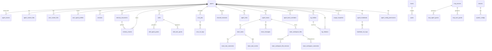

> Bản dịch từ [English version](/database-schema)

# Database Schema

> Tất cả bảng, cột, type, và constraint PostgreSQL qua tất cả migration.

## Tổng quan

GoClaw yêu cầu **PostgreSQL 15+** với hai extension:

```sql
CREATE EXTENSION IF NOT EXISTS "pgcrypto";  -- Tạo UUID v7
CREATE EXTENSION IF NOT EXISTS "vector";    -- pgvector cho embeddings
```

Hàm `uuid_generate_v7()` tùy chỉnh cung cấp UUID theo thứ tự thời gian. Tất cả primary key dùng hàm này mặc định.

Phiên bản schema được theo dõi bởi `golang-migrate`. Chạy `goclaw migrate up` hoặc `goclaw upgrade` để áp dụng tất cả migration. Phiên bản schema hiện tại: **73**.

### Thống nhất Store v3

Trong v3, GoClaw giới thiệu package `internal/store/base/` chia sẻ gồm interface `Dialect` và các helper chung. Cả `pg/` (PostgreSQL) và `sqlitestore/` (SQLite desktop) đều triển khai interface này qua type alias. Đây là tái cấu trúc nội bộ — không cần thay đổi schema hay thao tác người dùng.

SQLite (bản desktop) không hỗ trợ `pgvector`. Các tính năng **chỉ có trên PostgreSQL**:
- Tìm kiếm vector `episodic_summaries` (HNSW index trên `embedding`)
- Tự động liên kết `vault_documents` qua độ tương đồng vector
- Tìm kiếm ngữ nghĩa `kg_entities` (HNSW index trên `embedding`)

---

## ER Diagram


```mermaid
erDiagram
    agents ||--o{ agent_shares : "shared with"
    agents ||--o{ agent_context_files : "has"
    agents ||--o{ user_context_files : "has"
    agents ||--o{ user_agent_profiles : "tracks"
    agents ||--o{ sessions : "owns"
    agents ||--o{ memory_documents : "stores"
    agents ||--o{ memory_chunks : "stores"
    agents ||--o{ skills : "owns"
    agents ||--o{ cron_jobs : "schedules"
    agents ||--o{ channel_instances : "bound to"
    agents ||--o{ agent_links : "links"
    agents ||--o{ agent_teams : "leads"
    agents ||--o{ agent_team_members : "member of"
    agents ||--o{ kg_entities : "has"
    agents ||--o{ kg_relations : "has"
    agents ||--o{ usage_snapshots : "measured in"
    agent_teams ||--o{ team_tasks : "has"
    agent_teams ||--o{ team_messages : "has"
    agent_teams ||--o{ team_workspace_files : "stores"
    memory_documents ||--o{ memory_chunks : "split into"
    cron_jobs ||--o{ cron_run_logs : "logs"
    traces ||--o{ spans : "contains"
    mcp_servers ||--o{ mcp_agent_grants : "granted to"
    mcp_servers ||--o{ mcp_user_grants : "granted to"
    skills ||--o{ skill_agent_grants : "granted to"
    skills ||--o{ skill_user_grants : "granted to"
    kg_entities ||--o{ kg_relations : "source of"
    team_tasks ||--o{ team_task_comments : "has"
    team_tasks ||--o{ team_task_events : "logs"
    team_workspace_files ||--o{ team_workspace_file_versions : "versioned by"
    team_workspace_files ||--o{ team_workspace_comments : "commented on"
    agents ||--o| agent_heartbeats : "has"
    agent_heartbeats ||--o{ heartbeat_run_logs : "logs"
    agents ||--o{ agent_config_permissions : "has"
    tenants ||--o{ system_configs : "has"
```

---

## Các bảng

### `llm_providers`

LLM provider đã đăng ký. API key được mã hóa AES-256-GCM.

| Cột | Type | Constraint | Mô tả |
|-----|------|------------|-------|
| `id` | UUID | PK | UUID v7 |
| `name` | VARCHAR(50) | UNIQUE NOT NULL | Identifier (ví dụ `openrouter`) |
| `display_name` | VARCHAR(255) | | Tên hiển thị |
| `provider_type` | VARCHAR(30) | NOT NULL DEFAULT `openai_compat` | `openai_compat` hoặc `anthropic` |
| `api_base` | TEXT | | Custom endpoint URL |
| `api_key` | TEXT | | API key đã mã hóa |
| `enabled` | BOOLEAN | NOT NULL DEFAULT true | |
| `settings` | JSONB | NOT NULL DEFAULT `{}` | Config bổ sung theo provider |
| `created_at` | TIMESTAMPTZ | DEFAULT NOW() | |
| `updated_at` | TIMESTAMPTZ | DEFAULT NOW() | |

---

### `agents`

Bản ghi agent core. Mỗi agent có context, tools, và model configuration riêng.

| Cột | Type | Constraint | Mô tả |
|-----|------|------------|-------|
| `id` | UUID | PK | UUID v7 |
| `agent_key` | VARCHAR(100) | UNIQUE NOT NULL | Slug identifier (ví dụ `researcher`) |
| `display_name` | VARCHAR(255) | | Tên hiển thị trong UI |
| `owner_id` | VARCHAR(255) | NOT NULL | User ID của người tạo |
| `provider` | VARCHAR(50) | NOT NULL DEFAULT `openrouter` | LLM provider |
| `model` | VARCHAR(200) | NOT NULL | Model ID |
| `context_window` | INT | NOT NULL DEFAULT 200000 | Context window (tokens) |
| `max_tool_iterations` | INT | NOT NULL DEFAULT 20 | Số vòng tool tối đa mỗi run |
| `workspace` | TEXT | NOT NULL DEFAULT `.` | Đường dẫn thư mục workspace |
| `restrict_to_workspace` | BOOLEAN | NOT NULL DEFAULT true | Sandbox file access trong workspace |
| `tools_config` | JSONB | NOT NULL DEFAULT `{}` | Tool policy overrides |
| `sandbox_config` | JSONB | | Cấu hình Docker sandbox |
| `subagents_config` | JSONB | | Cấu hình concurrency subagent |
| `memory_config` | JSONB | | Cấu hình memory system |
| `compaction_config` | JSONB | | Cấu hình session compaction |
| `context_pruning` | JSONB | | Cấu hình context pruning |
| `other_config` | JSONB | NOT NULL DEFAULT `{}` | Config misc (ví dụ `description` để summoning) |
| `is_default` | BOOLEAN | NOT NULL DEFAULT false | Đánh dấu là default agent |
| `agent_type` | VARCHAR(20) | NOT NULL DEFAULT `open` | `open` hoặc `predefined` |
| `status` | VARCHAR(20) | DEFAULT `active` | `active`, `inactive`, `summoning` |
| `frontmatter` | TEXT | | Tóm tắt chuyên môn ngắn cho delegation và UI |
| `tsv` | tsvector | GENERATED ALWAYS | Full-text search vector (display_name + frontmatter) |
| `embedding` | vector(1536) | | Semantic search embedding |
| `budget_monthly_cents` | INTEGER | | Ngưỡng chi tiêu hàng tháng tính bằng USD cents; NULL = không giới hạn (migration 015). Migration 072 bridge mọi giá trị non-NULL thành một row `usage_cap_policies` với window `month` và `source = 'agent_budget_monthly_cents'` (1 cent = 10.000 micros). |
| `model_fallback` | JSONB | NOT NULL DEFAULT `{}` | Mảng thứ tự các model fallback được thử khi primary model thất bại (migration 065) |
| `created_at` | TIMESTAMPTZ | DEFAULT NOW() | |
| `updated_at` | TIMESTAMPTZ | DEFAULT NOW() | |
| `deleted_at` | TIMESTAMPTZ | | Soft delete timestamp |

**Indexes:** `owner_id`, `status` (partial, non-deleted), `tsv` (GIN), `embedding` (HNSW cosine)

---

### `agent_shares`

Cấp quyền cho user khác truy cập agent.

| Cột | Type | Mô tả |
|-----|------|-------|
| `id` | UUID PK | |
| `agent_id` | UUID FK → agents | |
| `user_id` | VARCHAR(255) | Người được cấp quyền |
| `role` | VARCHAR(20) DEFAULT `user` | `user`, `operator`, `admin` |
| `granted_by` | VARCHAR(255) | Người cấp quyền |
| `created_at` | TIMESTAMPTZ | |

---

### `agent_context_files`

Context file per-agent (SOUL.md, IDENTITY.md, v.v.). Chia sẻ cho tất cả user của agent.

| Cột | Type | Mô tả |
|-----|------|-------|
| `id` | UUID PK | |
| `agent_id` | UUID FK → agents | |
| `file_name` | VARCHAR(255) | Tên file (ví dụ `SOUL.md`) |
| `content` | TEXT | Nội dung file |
| `created_at` | TIMESTAMPTZ | |
| `updated_at` | TIMESTAMPTZ | |

**Unique:** `(agent_id, file_name)`

---

### `user_context_files`

Context file per-user, per-agent (USER.md, v.v.). Riêng tư cho từng user.

| Cột | Type | Mô tả |
|-----|------|-------|
| `id` | UUID PK | |
| `agent_id` | UUID FK → agents | |
| `user_id` | VARCHAR(255) | |
| `file_name` | VARCHAR(255) | |
| `content` | TEXT | |
| `created_at` / `updated_at` | TIMESTAMPTZ | |

**Unique:** `(agent_id, user_id, file_name)`

---

### `user_agent_profiles`

Theo dõi thời gian first/last seen mỗi user mỗi agent.

| Cột | Type | Mô tả |
|-----|------|-------|
| `agent_id` | UUID FK → agents | |
| `user_id` | VARCHAR(255) | |
| `workspace` | TEXT | Per-user workspace override |
| `first_seen_at` | TIMESTAMPTZ | |
| `last_seen_at` | TIMESTAMPTZ | |
| `metadata` | JSONB DEFAULT `{}` | Metadata profile tùy ý (migration 011) |

**PK:** `(agent_id, user_id)`

---

### `user_agent_overrides`

Per-user model/provider overrides cho agent cụ thể.

| Cột | Type | Mô tả |
|-----|------|-------|
| `id` | UUID PK | |
| `agent_id` | UUID FK → agents | |
| `user_id` | VARCHAR(255) | |
| `provider` | VARCHAR(50) | Override provider |
| `model` | VARCHAR(200) | Override model |
| `settings` | JSONB | Extra settings |

---

### `sessions`

Chat session. Một session mỗi kết hợp channel/user/agent.

| Cột | Type | Mô tả |
|-----|------|-------|
| `id` | UUID PK | |
| `session_key` | VARCHAR(500) UNIQUE | Composite key (ví dụ `telegram:123456789`) |
| `agent_id` | UUID FK → agents | |
| `user_id` | VARCHAR(255) | |
| `messages` | JSONB DEFAULT `[]` | Lịch sử tin nhắn đầy đủ |
| `summary` | TEXT | Tóm tắt đã compaction |
| `model` | VARCHAR(200) | Model đang active cho session |
| `provider` | VARCHAR(50) | Provider đang active |
| `channel` | VARCHAR(50) | Channel gốc |
| `input_tokens` | BIGINT DEFAULT 0 | Tổng input token tích lũy |
| `output_tokens` | BIGINT DEFAULT 0 | Tổng output token tích lũy |
| `compaction_count` | INT DEFAULT 0 | Số lần compaction đã thực hiện |
| `memory_flush_compaction_count` | INT DEFAULT 0 | Compaction với memory flush |
| `label` | VARCHAR(500) | Session label dễ đọc |
| `spawned_by` | VARCHAR(200) | Session key của parent (cho subagent) |
| `spawn_depth` | INT DEFAULT 0 | Độ sâu lồng nhau |
| `metadata` | JSONB DEFAULT `{}` | Metadata session tùy ý (migration 011) |
| `team_id` | UUID FK → agent_teams (nullable) | Đặt cho session phạm vi team (migration 019) |
| `created_at` / `updated_at` | TIMESTAMPTZ | |

**Indexes:** `agent_id`, `user_id`, `updated_at DESC`, `team_id` (partial)

---

### `memory_documents` và `memory_chunks`

Hệ thống memory hybrid BM25 + vector.

**`memory_documents`** — document được index ở cấp top-level:

| Cột | Type | Mô tả |
|-----|------|-------|
| `id` | UUID PK | |
| `agent_id` | UUID FK → agents | |
| `user_id` | VARCHAR(255) | Null = global (chia sẻ) |
| `path` | VARCHAR(500) | Đường dẫn/tiêu đề document logic |
| `content` | TEXT | Nội dung document đầy đủ |
| `hash` | VARCHAR(64) | SHA-256 của content để phát hiện thay đổi |
| `team_id` | UUID FK → agent_teams (nullable) | Phạm vi team; NULL = cá nhân (migration 019) |

**`memory_chunks`** — đoạn có thể tìm kiếm của document:

| Cột | Type | Mô tả |
|-----|------|-------|
| `id` | UUID PK | |
| `agent_id` | UUID FK → agents | |
| `document_id` | UUID FK → memory_documents | |
| `user_id` | VARCHAR(255) | |
| `path` | TEXT | Đường dẫn nguồn |
| `start_line` / `end_line` | INT | Khoảng dòng nguồn |
| `hash` | VARCHAR(64) | Content hash của chunk |
| `text` | TEXT | Nội dung chunk |
| `embedding` | vector(1536) | Semantic embedding |
| `tsv` | tsvector GENERATED | Full-text search (cấu hình simple, đa ngôn ngữ) |
| `team_id` | UUID FK → agent_teams (nullable) | Phạm vi team; NULL = cá nhân (migration 019) |

**Indexes:** agent+user (standard + partial cho global), document, GIN trên tsv, HNSW cosine trên embedding, `team_id` (partial)

**`embedding_cache`** — loại bỏ trùng lặp API call embedding:

| Cột | Type | Mô tả |
|-----|------|-------|
| `hash` | VARCHAR(64) | Content hash |
| `provider` | VARCHAR(50) | Embedding provider |
| `model` | VARCHAR(200) | Embedding model |
| `embedding` | vector(1536) | Vector đã cache |
| `dims` | INT | Kích thước embedding |

**PK:** `(hash, provider, model)`

---

### `skills`

Skill package được upload với BM25 + semantic search.

| Cột | Type | Mô tả |
|-----|------|-------|
| `id` | UUID PK | |
| `name` | VARCHAR(255) | Tên hiển thị |
| `slug` | VARCHAR(255) UNIQUE | Identifier URL-safe |
| `description` | TEXT | Mô tả ngắn |
| `owner_id` | VARCHAR(255) | User ID người tạo |
| `visibility` | VARCHAR(10) DEFAULT `private` | `private` hoặc `public` |
| `version` | INT DEFAULT 1 | Version counter |
| `status` | VARCHAR(20) DEFAULT `active` | `active` hoặc `archived` |
| `frontmatter` | JSONB | Skill metadata từ SKILL.md |
| `file_path` | TEXT | Đường dẫn filesystem đến nội dung skill |
| `file_size` | BIGINT | Kích thước file (bytes) |
| `file_hash` | VARCHAR(64) | Content hash |
| `embedding` | vector(1536) | Semantic search embedding |
| `tags` | TEXT[] | Danh sách tag |
| `is_system` | BOOLEAN DEFAULT false | Skill hệ thống tích hợp sẵn; không thể xóa bởi user (migration 017) |
| `deps` | JSONB DEFAULT `{}` | Khai báo dependency của skill (migration 017) |
| `enabled` | BOOLEAN DEFAULT true | Skill có đang hoạt động không (migration 017) |

**Indexes:** owner, visibility (partial active), slug, HNSW embedding, GIN tags, `is_system` (partial true), `enabled` (partial false)

**`skill_agent_grants`** / **`skill_user_grants`** — access control cho skills, cùng pattern với MCP grants. `skill_agent_grants` còn có cột `can_manage BOOLEAN NOT NULL DEFAULT FALSE` (migration 066) — cấp quyền cho agent quản lý (publish, update, delete) skill trong phạm vi tenant.

---

### `cron_jobs`

Scheduled agent task.

| Cột | Type | Mô tả |
|-----|------|-------|
| `id` | UUID PK | |
| `agent_id` | UUID FK → agents | |
| `user_id` | TEXT | User sở hữu |
| `name` | VARCHAR(255) | Tên job dễ đọc |
| `enabled` | BOOLEAN DEFAULT true | |
| `schedule_kind` | VARCHAR(10) | `at`, `every`, hoặc `cron` |
| `cron_expression` | VARCHAR(100) | Cron expression (khi kind=`cron`) |
| `interval_ms` | BIGINT | Interval (ms) (khi kind=`every`) |
| `run_at` | TIMESTAMPTZ | One-shot run time (khi kind=`at`) |
| `timezone` | VARCHAR(50) | Timezone cho cron expression |
| `payload` | JSONB | Message payload gửi đến agent |
| `delete_after_run` | BOOLEAN DEFAULT false | Tự xóa sau lần chạy thành công đầu tiên |
| `stateless` | BOOLEAN DEFAULT false | Stateless mode — chạy không cần session history |
| `deliver` | BOOLEAN DEFAULT false | Gửi kết quả đến channel |
| `deliver_channel` | TEXT | Loại channel đích (`telegram`, `discord`, v.v.) |
| `deliver_to` | TEXT | Chat/recipient ID |
| `wake_heartbeat` | BOOLEAN DEFAULT false | Kích hoạt heartbeat sau khi job hoàn thành |
| `next_run_at` | TIMESTAMPTZ | Thời gian thực thi tiếp theo |
| `last_run_at` | TIMESTAMPTZ | Thời gian thực thi cuối |
| `last_status` | VARCHAR(20) | `ok`, `error`, `running` |
| `last_error` | TEXT | Thông báo lỗi cuối |
| `team_id` | UUID FK → agent_teams (nullable) | Phạm vi team; NULL = cá nhân (migration 019) |

**`cron_run_logs`** — lịch sử mỗi lần chạy với token count và duration. Cột `team_id` cũng được thêm vào (migration 019).

---

### `pairing_requests` và `paired_devices`

Device pairing flow (channel user yêu cầu truy cập).

**`pairing_requests`** — code 8 ký tự đang chờ:

| Cột | Type | Mô tả |
|-----|------|-------|
| `code` | VARCHAR(8) UNIQUE | Pairing code hiển thị cho user |
| `sender_id` | VARCHAR(200) | Channel user ID |
| `channel` | VARCHAR(255) | Tên channel |
| `chat_id` | VARCHAR(200) | Chat ID |
| `expires_at` | TIMESTAMPTZ | Thời hạn code |

**`paired_devices`** — pairing đã phê duyệt:

| Cột | Type | Mô tả |
|-----|------|-------|
| `sender_id` | VARCHAR(200) | |
| `channel` | VARCHAR(255) | |
| `chat_id` | VARCHAR(200) | |
| `paired_by` | VARCHAR(100) | Người phê duyệt |
| `paired_at` | TIMESTAMPTZ | |
| `metadata` | JSONB DEFAULT `{}` | Metadata pairing tùy ý (migration 011) |
| `expires_at` | TIMESTAMPTZ | Thời hạn pairing; NULL = không hết hạn (migration 021) |

**Unique:** `(sender_id, channel)`

> `pairing_requests` cũng nhận `metadata JSONB DEFAULT '{}'` trong migration 011.

---

### `traces` và `spans`

LLM call tracing.

**`traces`** — một record mỗi agent run:

| Cột | Type | Mô tả |
|-----|------|-------|
| `id` | UUID PK | |
| `agent_id` | UUID | |
| `user_id` | VARCHAR(255) | |
| `session_key` | TEXT | |
| `run_id` | TEXT | |
| `parent_trace_id` | UUID | Cho delegation — liên kết với trace của parent run |
| `status` | VARCHAR(20) | `running`, `ok`, `error` |
| `total_input_tokens` | INT | |
| `total_output_tokens` | INT | |
| `total_cost` | NUMERIC(12,6) | Chi phí ước tính |
| `span_count` / `llm_call_count` / `tool_call_count` | INT | Summary counter |
| `input_preview` / `output_preview` | TEXT | First/last message đã cắt |
| `tags` | TEXT[] | Tag có thể tìm kiếm |
| `metadata` | JSONB | |

**`spans`** — LLM call và tool invocation riêng lẻ trong trace:

Cột chính: `trace_id`, `parent_span_id`, `span_type` (`llm`, `tool`, `agent`), `model`, `provider`, `input_tokens`, `output_tokens`, `total_cost`, `tool_name`, `finish_reason`.

**Indexes:** Tối ưu cho agent+time, user+time, session, status=error. Partial index `idx_traces_quota` trên `(user_id, created_at DESC)` lọc `parent_trace_id IS NULL` để đếm quota. Cả `traces` và `spans` đều có `team_id UUID FK → agent_teams` (nullable, migration 019) với partial index. `traces` cũng có `idx_traces_start_root` trên `(start_time DESC) WHERE parent_trace_id IS NULL` và `spans` có `idx_spans_trace_type` trên `(trace_id, span_type)` (migration 016).

---

### `mcp_servers`

MCP (Model Context Protocol) tool provider bên ngoài.

| Cột | Type | Mô tả |
|-----|------|-------|
| `id` | UUID PK | |
| `name` | VARCHAR(255) UNIQUE | Tên server |
| `transport` | VARCHAR(50) | `stdio`, `sse`, `streamable-http` |
| `command` | TEXT | Stdio: lệnh để spawn |
| `args` | JSONB | Stdio: tham số |
| `url` | TEXT | SSE/HTTP: server URL |
| `headers` | JSONB | SSE/HTTP: HTTP headers |
| `env` | JSONB | Stdio: biến môi trường |
| `api_key` | TEXT | API key đã mã hóa |
| `tool_prefix` | VARCHAR(50) | Prefix tên tool tùy chọn |
| `timeout_sec` | INT DEFAULT 60 | |
| `enabled` | BOOLEAN DEFAULT true | |

**`mcp_agent_grants`** / **`mcp_user_grants`** — access grant per-agent và per-user với tool allowlist/denylist tùy chọn.

**`mcp_access_requests`** — approval workflow cho agent yêu cầu MCP access.

---

### `custom_tools`

Dynamic shell-command-backed tool quản lý qua API.

| Cột | Type | Mô tả |
|-----|------|-------|
| `id` | UUID PK | |
| `name` | VARCHAR(100) | Tên tool |
| `description` | TEXT | Hiển thị cho LLM |
| `parameters` | JSONB | JSON Schema cho tham số tool |
| `command` | TEXT | Shell command để thực thi |
| `working_dir` | TEXT | Thư mục làm việc |
| `timeout_seconds` | INT DEFAULT 60 | |
| `env` | BYTEA | Biến môi trường đã mã hóa |
| `agent_id` | UUID FK → agents (nullable) | Null = global tool |
| `enabled` | BOOLEAN DEFAULT true | |

**Unique:** tên global (khi `agent_id IS NULL`), `(name, agent_id)` mỗi agent.

---

### `channel_instances`

Kết nối channel được quản lý bởi database (thay thế cài đặt channel tĩnh trong config file).

| Cột | Type | Mô tả |
|-----|------|-------|
| `id` | UUID PK | |
| `name` | VARCHAR(100) UNIQUE | Tên instance |
| `channel_type` | VARCHAR(50) | `telegram`, `discord`, `feishu`, `zalo_oa`, `zalo_personal`, `whatsapp` |
| `agent_id` | UUID FK → agents | Agent được gắn |
| `credentials` | BYTEA | Channel credentials đã mã hóa |
| `config` | JSONB | Cấu hình theo từng channel |
| `enabled` | BOOLEAN DEFAULT true | |

---

### `agent_links`

Quyền delegation inter-agent. Source agent có thể delegate task cho target agent.

| Cột | Type | Mô tả |
|-----|------|-------|
| `id` | UUID PK | |
| `source_agent_id` | UUID FK → agents | Agent đang delegate |
| `target_agent_id` | UUID FK → agents | Agent được delegate |
| `direction` | VARCHAR(20) DEFAULT `outbound` | |
| `description` | TEXT | Mô tả link hiển thị khi delegation |
| `max_concurrent` | INT DEFAULT 3 | Max delegation đồng thời |
| `team_id` | UUID FK → agent_teams (nullable) | Đặt khi link được tạo bởi team |
| `status` | VARCHAR(20) DEFAULT `active` | |

---

### `agent_teams`, `agent_team_members`, `team_tasks`, `team_messages`

Phối hợp multi-agent.

**`agent_teams`** — bản ghi team với lead agent.

**`agent_team_members`** — many-to-many `(team_id, agent_id)` với role (`lead`, `member`).

**`team_tasks`** — task list chia sẻ:

| Cột | Type | Mô tả |
|-----|------|-------|
| `subject` | VARCHAR(500) | Tiêu đề task |
| `description` | TEXT | Mô tả task đầy đủ |
| `status` | VARCHAR(20) DEFAULT `pending` | `pending`, `in_progress`, `completed`, `cancelled` |
| `owner_agent_id` | UUID | Agent đã claim task |
| `blocked_by` | UUID[] DEFAULT `{}` | Task ID mà task này đang bị block bởi |
| `priority` | INT DEFAULT 0 | Cao hơn = ưu tiên cao hơn |
| `result` | TEXT | Output của task |
| `task_type` | VARCHAR(30) DEFAULT `general` | Danh mục task (migration 018) |
| `task_number` | INT DEFAULT 0 | Số thứ tự mỗi team (migration 018) |
| `identifier` | VARCHAR(20) | ID dễ đọc ví dụ `TSK-1` (migration 018) |
| `created_by_agent_id` | UUID FK → agents | Agent tạo task (migration 018) |
| `assignee_user_id` | VARCHAR(255) | User được gán (migration 018) |
| `parent_id` | UUID FK → team_tasks | Task cha cho subtask (migration 018) |
| `chat_id` | VARCHAR(255) DEFAULT `''` | Chat gốc (migration 018) |
| `locked_at` | TIMESTAMPTZ | Thời điểm lock task được lấy (migration 018) |
| `lock_expires_at` | TIMESTAMPTZ | TTL của lock (migration 018) |
| `progress_percent` | INT DEFAULT 0 | Chỉ số hoàn thành 0–100 (migration 018) |
| `progress_step` | TEXT | Mô tả bước tiến hiện tại (migration 018) |
| `followup_at` | TIMESTAMPTZ | Thời gian nhắc followup tiếp theo (migration 018) |
| `followup_count` | INT DEFAULT 0 | Số lần followup đã gửi (migration 018) |
| `followup_max` | INT DEFAULT 0 | Số followup tối đa (migration 018) |
| `followup_message` | TEXT | Tin nhắn gửi khi followup (migration 018) |
| `followup_channel` | VARCHAR(60) | Channel giao followup (migration 018) |
| `followup_chat_id` | VARCHAR(255) | Chat ID giao followup (migration 018) |
| `confidence_score` | FLOAT | Điểm tự đánh giá của agent (migration 021) |

**Indexes:** `parent_id` (partial), `(team_id, channel, chat_id)`, `(team_id, task_type)`, `lock_expires_at` (partial in_progress), `(team_id, identifier)` (unique partial), `followup_at` (partial in_progress), `blocked_by` (GIN), `(team_id, owner_agent_id, status)`

**`team_messages`** — mailbox peer-to-peer giữa các agent trong team. Nhận `confidence_score FLOAT` trong migration 021.

---

### `builtin_tools`

Registry của built-in gateway tool với control bật/tắt.

| Cột | Type | Mô tả |
|-----|------|-------|
| `name` | VARCHAR(100) PK | Tên tool (ví dụ `exec`, `read_file`) |
| `display_name` | VARCHAR(255) | |
| `description` | TEXT | |
| `category` | VARCHAR(50) DEFAULT `general` | Danh mục tool |
| `enabled` | BOOLEAN DEFAULT true | Global bật/tắt |
| `settings` | JSONB | Cài đặt theo tool |
| `requires` | TEXT[] | Dependency bên ngoài bắt buộc |

---

### `config_secrets`

Key-value store mã hóa cho secrets ghi đè giá trị `config.json` (quản lý qua web UI).

| Cột | Type | Mô tả |
|-----|------|-------|
| `key` | VARCHAR(100) PK | Tên secret key |
| `value` | BYTEA | Giá trị mã hóa AES-256-GCM |

---

### `group_file_writers`

> **Đã xóa trong migration 023.** Dữ liệu đã được chuyển sang `agent_config_permissions` (`config_type = 'file_writer'`).

---

### `channel_pending_messages`

Buffer tin nhắn group chat. Lưu tin nhắn khi bot không được mention để có đủ context khi được mention. Hỗ trợ LLM-based compaction (row `is_summary`) và dọn dẹp TTL 7 ngày. (migration 012)

| Cột | Type | Constraint | Mô tả |
|-----|------|------------|-------|
| `id` | UUID | PK | UUID v7 |
| `channel_name` | VARCHAR(100) | NOT NULL | Tên channel instance |
| `history_key` | VARCHAR(200) | NOT NULL | Composite key xác định phạm vi buffer hội thoại |
| `sender` | VARCHAR(255) | NOT NULL | Tên hiển thị của người gửi |
| `sender_id` | VARCHAR(255) | NOT NULL DEFAULT `''` | Platform user ID |
| `body` | TEXT | NOT NULL | Nội dung tin nhắn thô |
| `platform_msg_id` | VARCHAR(100) | NOT NULL DEFAULT `''` | Message ID gốc của platform |
| `is_summary` | BOOLEAN | NOT NULL DEFAULT false | True nếu row này là summary đã compaction |
| `created_at` | TIMESTAMPTZ | NOT NULL DEFAULT NOW() | |
| `updated_at` | TIMESTAMPTZ | NOT NULL DEFAULT NOW() | |

**Indexes:** `(channel_name, history_key, created_at)`

---

### `kg_entities`

Node thực thể knowledge graph theo phạm vi agent và user. (migration 013)

| Cột | Type | Constraint | Mô tả |
|-----|------|------------|-------|
| `id` | UUID | PK | |
| `agent_id` | UUID FK → agents | NOT NULL | Agent sở hữu (cascade delete) |
| `user_id` | VARCHAR(255) | NOT NULL DEFAULT `''` | Phạm vi user; rỗng = global agent |
| `external_id` | VARCHAR(255) | NOT NULL | Identifier thực thể do caller cung cấp |
| `name` | TEXT | NOT NULL | Tên hiển thị của thực thể |
| `entity_type` | VARCHAR(100) | NOT NULL | ví dụ `person`, `company`, `concept` |
| `description` | TEXT | DEFAULT `''` | Mô tả tự do |
| `properties` | JSONB | DEFAULT `{}` | Thuộc tính thực thể có cấu trúc |
| `source_id` | VARCHAR(255) | DEFAULT `''` | Tham chiếu document/chunk nguồn |
| `confidence` | FLOAT | NOT NULL DEFAULT 1.0 | Điểm tin cậy trích xuất |
| `team_id` | UUID FK → agent_teams (nullable) | | Phạm vi team; NULL = cá nhân (migration 019) |
| `created_at` / `updated_at` | TIMESTAMPTZ | | |

**Unique:** `(agent_id, user_id, external_id)`

**Indexes:** `(agent_id, user_id)`, `(agent_id, user_id, entity_type)`, `team_id` (partial)

---

### `kg_relations`

Cạnh knowledge graph giữa các thực thể. (migration 013)

| Cột | Type | Constraint | Mô tả |
|-----|------|------------|-------|
| `id` | UUID | PK | |
| `agent_id` | UUID FK → agents | NOT NULL | Agent sở hữu (cascade delete) |
| `user_id` | VARCHAR(255) | NOT NULL DEFAULT `''` | Phạm vi user |
| `source_entity_id` | UUID FK → kg_entities | NOT NULL | Node nguồn (cascade delete) |
| `relation_type` | VARCHAR(200) | NOT NULL | Nhãn quan hệ ví dụ `works_at`, `knows` |
| `target_entity_id` | UUID FK → kg_entities | NOT NULL | Node đích (cascade delete) |
| `confidence` | FLOAT | NOT NULL DEFAULT 1.0 | Điểm tin cậy trích xuất |
| `properties` | JSONB | DEFAULT `{}` | Thuộc tính quan hệ |
| `team_id` | UUID FK → agent_teams (nullable) | | Phạm vi team; NULL = cá nhân (migration 019) |
| `created_at` | TIMESTAMPTZ | | |

**Unique:** `(agent_id, user_id, source_entity_id, relation_type, target_entity_id)`

**Indexes:** `(source_entity_id, relation_type)`, `target_entity_id`, `team_id` (partial)

---

### `channel_contacts`

Danh bạ liên lạc thống nhất toàn cục được thu thập tự động từ tất cả tương tác channel. Không theo agent. Dùng cho contact selector, analytics, và RBAC tương lai. (migration 014)

| Cột | Type | Constraint | Mô tả |
|-----|------|------------|-------|
| `id` | UUID | PK | |
| `channel_type` | VARCHAR(50) | NOT NULL | ví dụ `telegram`, `discord` |
| `channel_instance` | VARCHAR(255) | | Tên instance (nullable) |
| `sender_id` | VARCHAR(255) | NOT NULL | Platform user ID gốc |
| `user_id` | VARCHAR(255) | | GoClaw user ID đã khớp |
| `display_name` | VARCHAR(255) | | Tên hiển thị đã resolve |
| `username` | VARCHAR(255) | | Username/handle platform |
| `avatar_url` | TEXT | | URL ảnh đại diện |
| `peer_kind` | VARCHAR(20) | | ví dụ `user`, `bot`, `group` |
| `metadata` | JSONB | DEFAULT `{}` | Dữ liệu bổ sung theo platform |
| `thread_id` | VARCHAR(100) | | Định danh thread/topic trong chat (migration 035) |
| `thread_type` | VARCHAR(20) | | Phân loại loại thread (migration 035) |
| `merged_id` | UUID | | Contact chuẩn sau de-duplication |
| `first_seen_at` | TIMESTAMPTZ | NOT NULL DEFAULT NOW() | |
| `last_seen_at` | TIMESTAMPTZ | NOT NULL DEFAULT NOW() | |

**Unique:** `(tenant_id, channel_type, sender_id, COALESCE(thread_id, ''))`

**Indexes:** `channel_instance` (partial non-null), `merged_id` (partial non-null), `(display_name, username)`

---

### `activity_logs`

Audit trail bất biến cho hành động user và hệ thống. (migration 015)

| Cột | Type | Constraint | Mô tả |
|-----|------|------------|-------|
| `id` | UUID | PK | UUID v7 |
| `actor_type` | VARCHAR(20) | NOT NULL | `user`, `agent`, `system` |
| `actor_id` | VARCHAR(255) | NOT NULL | User hoặc agent ID |
| `action` | VARCHAR(100) | NOT NULL | ví dụ `agent.create`, `skill.delete` |
| `entity_type` | VARCHAR(50) | | Loại thực thể bị ảnh hưởng |
| `entity_id` | VARCHAR(255) | | ID thực thể bị ảnh hưởng |
| `details` | JSONB | | Context theo hành động |
| `ip_address` | VARCHAR(45) | | IP client (IPv4 hoặc IPv6) |
| `created_at` | TIMESTAMPTZ | NOT NULL DEFAULT NOW() | |

**Indexes:** `(actor_type, actor_id)`, `action`, `(entity_type, entity_id)`, `created_at DESC`

---

### `usage_snapshots`

Metrics tổng hợp theo giờ mỗi kết hợp agent/provider/model/channel. Được điền bởi background snapshot worker đọc `traces` và `spans`. (migration 016)

| Cột | Type | Mô tả |
|-----|------|-------|
| `id` | UUID PK | UUID v7 |
| `bucket_hour` | TIMESTAMPTZ | Bucket theo giờ (truncate theo giờ) |
| `agent_id` | UUID (nullable) | Phạm vi agent; NULL = toàn hệ thống |
| `provider` | VARCHAR(50) DEFAULT `''` | LLM provider |
| `model` | VARCHAR(200) DEFAULT `''` | Model ID |
| `channel` | VARCHAR(50) DEFAULT `''` | Tên channel |
| `input_tokens` | BIGINT DEFAULT 0 | |
| `output_tokens` | BIGINT DEFAULT 0 | |
| `cache_read_tokens` | BIGINT DEFAULT 0 | |
| `cache_create_tokens` | BIGINT DEFAULT 0 | |
| `thinking_tokens` | BIGINT DEFAULT 0 | |
| `total_cost` | NUMERIC(12,6) DEFAULT 0 | Chi phí USD ước tính |
| `request_count` | INT DEFAULT 0 | |
| `llm_call_count` | INT DEFAULT 0 | |
| `tool_call_count` | INT DEFAULT 0 | |
| `error_count` | INT DEFAULT 0 | |
| `unique_users` | INT DEFAULT 0 | User phân biệt trong bucket |
| `avg_duration_ms` | INT DEFAULT 0 | Thời gian request trung bình |
| `memory_docs` | INT DEFAULT 0 | Số memory document tại thời điểm |
| `memory_chunks` | INT DEFAULT 0 | Số memory chunk tại thời điểm |
| `kg_entities` | INT DEFAULT 0 | Số KG entity tại thời điểm |
| `kg_relations` | INT DEFAULT 0 | Số KG relation tại thời điểm |
| `created_at` | TIMESTAMPTZ | |

**Unique:** `(bucket_hour, COALESCE(agent_id, '00000000...'), provider, model, channel)` — cho phép upsert an toàn.

**Indexes:** `bucket_hour DESC`, `(agent_id, bucket_hour DESC)`, `(provider, bucket_hour DESC)` (partial non-empty), `(channel, bucket_hour DESC)` (partial non-empty)

---

### `team_workspace_files`

Lưu trữ file chia sẻ theo phạm vi `(team_id, chat_id)`. Hỗ trợ pinning, tagging, và soft-archiving. (migration 018)

| Cột | Type | Constraint | Mô tả |
|-----|------|------------|-------|
| `id` | UUID | PK | UUID v7 |
| `team_id` | UUID FK → agent_teams | NOT NULL | Team sở hữu |
| `channel` | VARCHAR(50) DEFAULT `''` | | Context channel |
| `chat_id` | VARCHAR(255) DEFAULT `''` | | User/chat ID do hệ thống tạo |
| `file_name` | VARCHAR(255) | NOT NULL | Tên file hiển thị |
| `mime_type` | VARCHAR(100) | | MIME type |
| `file_path` | TEXT | NOT NULL | Đường dẫn lưu trữ |
| `size_bytes` | BIGINT DEFAULT 0 | | Kích thước file |
| `uploaded_by` | UUID FK → agents | NOT NULL | Agent đã upload |
| `task_id` | UUID FK → team_tasks (nullable) | | Task liên kết |
| `pinned` | BOOLEAN DEFAULT false | | Ghim vào workspace |
| `tags` | TEXT[] DEFAULT `{}` | | Tag có thể tìm kiếm |
| `metadata` | JSONB | | Metadata bổ sung |
| `archived_at` | TIMESTAMPTZ | | Soft delete timestamp |
| `created_at` / `updated_at` | TIMESTAMPTZ | | |

**Unique:** `(team_id, chat_id, file_name)`

**Indexes:** `(team_id, chat_id)`, `uploaded_by`, `task_id` (partial), `archived_at` (partial), `(team_id, pinned)` (partial true), `tags` (GIN)

---

### `team_workspace_file_versions`

Lịch sử version cho workspace file. Mỗi lần upload version mới tạo một row. (migration 018)

| Cột | Type | Constraint | Mô tả |
|-----|------|------------|-------|
| `id` | UUID | PK | UUID v7 |
| `file_id` | UUID FK → team_workspace_files | NOT NULL | File cha |
| `version` | INT | NOT NULL | Số version |
| `file_path` | TEXT | NOT NULL | Đường dẫn lưu trữ cho version này |
| `size_bytes` | BIGINT DEFAULT 0 | | |
| `uploaded_by` | UUID FK → agents | NOT NULL | |
| `created_at` | TIMESTAMPTZ | NOT NULL | |

**Unique:** `(file_id, version)`

---

### `team_workspace_comments`

Annotation trên workspace file. (migration 018)

| Cột | Type | Constraint | Mô tả |
|-----|------|------------|-------|
| `id` | UUID | PK | UUID v7 |
| `file_id` | UUID FK → team_workspace_files | NOT NULL | File được comment |
| `agent_id` | UUID FK → agents | NOT NULL | Agent đang comment |
| `content` | TEXT | NOT NULL | Nội dung comment |
| `created_at` | TIMESTAMPTZ | NOT NULL | |

**Index:** `file_id`

---

### `team_task_comments`

Thread thảo luận trên task. (migration 018)

| Cột | Type | Constraint | Mô tả |
|-----|------|------------|-------|
| `id` | UUID | PK | UUID v7 |
| `task_id` | UUID FK → team_tasks | NOT NULL | Task cha |
| `agent_id` | UUID FK → agents (nullable) | | Agent đang comment |
| `user_id` | VARCHAR(255) | | User đang comment |
| `content` | TEXT | NOT NULL | Nội dung comment |
| `metadata` | JSONB DEFAULT `{}` | | |
| `confidence_score` | FLOAT | | Điểm tự đánh giá của agent (migration 021) |
| `created_at` | TIMESTAMPTZ | NOT NULL | |

**Index:** `task_id`

---

### `team_task_events`

Audit log bất biến cho thay đổi trạng thái task. (migration 018)

| Cột | Type | Constraint | Mô tả |
|-----|------|------------|-------|
| `id` | UUID | PK | UUID v7 |
| `task_id` | UUID FK → team_tasks | NOT NULL | Task cha |
| `event_type` | VARCHAR(30) | NOT NULL | ví dụ `status_change`, `assigned`, `locked` |
| `actor_type` | VARCHAR(10) | NOT NULL | `agent` hoặc `user` |
| `actor_id` | VARCHAR(255) | NOT NULL | ID thực thể đang hành động |
| `data` | JSONB | | Event payload |
| `created_at` | TIMESTAMPTZ | NOT NULL | |

**Index:** `task_id`

---

### `secure_cli_binaries`

Cấu hình credential injection cho Exec tool (Direct Exec Mode). Admin map tên binary với biến môi trường đã mã hóa; GoClaw tự inject vào child process. (migration 020; cập nhật migration 036)

| Cột | Type | Constraint | Mô tả |
|-----|------|------------|-------|
| `id` | UUID | PK | UUID v7 |
| `binary_name` | TEXT | NOT NULL | Tên hiển thị (ví dụ `gh`, `gcloud`) |
| `binary_path` | TEXT | | Đường dẫn tuyệt đối; NULL = tự resolve lúc runtime |
| `description` | TEXT | NOT NULL DEFAULT `''` | Mô tả dành cho admin |
| `encrypted_env` | BYTEA | NOT NULL | JSON env map mã hóa AES-256-GCM |
| `deny_args` | JSONB DEFAULT `[]` | | Regex pattern của argument prefix bị cấm |
| `deny_verbose` | JSONB DEFAULT `[]` | | Verbose flag pattern cần loại bỏ |
| `timeout_seconds` | INT DEFAULT 30 | | Timeout process |
| `tips` | TEXT DEFAULT `''` | | Gợi ý inject vào context TOOLS.md |
| `is_global` | BOOLEAN | NOT NULL DEFAULT true | Nếu true, tất cả agent đều dùng được; nếu false, chỉ agent có grant mới truy cập được |
| `enabled` | BOOLEAN DEFAULT true | | |
| `created_by` | TEXT DEFAULT `''` | | Admin user đã tạo entry này |
| `adapter_name` | TEXT | NULL | Route binary tới một `CredentialAdapter` có kiểu tại thời điểm exec; NULL = passthrough legacy (migration 073) |
| `created_at` / `updated_at` | TIMESTAMPTZ | | |

> **Lưu ý migration 036:** Cột `agent_id` đã bị xóa khỏi bảng này. Quyền truy cập per-agent giờ được quản lý qua bảng `secure_cli_agent_grants`. Binary có `is_global = true` thì tất cả agent đều dùng được; binary có `is_global = false` yêu cầu grant tường minh.

**Unique:** `(binary_name, tenant_id)` — một định nghĩa binary mỗi tên mỗi tenant.

**Indexes:** `binary_name`

---

### `api_keys`

Quản lý API key fine-grained với kiểm soát truy cập dựa trên scope. (migration 020)

| Cột | Type | Constraint | Mô tả |
|-----|------|------------|-------|
| `id` | UUID | PK | |
| `name` | VARCHAR(100) | NOT NULL | Tên key dễ đọc |
| `prefix` | VARCHAR(8) | NOT NULL | 8 ký tự đầu để hiển thị/tìm kiếm |
| `key_hash` | VARCHAR(64) | NOT NULL UNIQUE | SHA-256 hex digest của full key |
| `scopes` | TEXT[] DEFAULT `{}` | | ví dụ `{'operator.admin','operator.read'}` |
| `expires_at` | TIMESTAMPTZ | | NULL = không hết hạn |
| `last_used_at` | TIMESTAMPTZ | | |
| `revoked` | BOOLEAN DEFAULT false | | |
| `created_by` | VARCHAR(255) | | User ID đã tạo key |
| `created_at` / `updated_at` | TIMESTAMPTZ | | |

**Indexes:** `key_hash` (partial `NOT revoked`), `prefix`

---

### `agent_heartbeats`

Cấu hình heartbeat per-agent cho các check-in chủ động định kỳ. (migration 022)

| Cột | Type | Constraint | Mô tả |
|-----|------|------------|-------|
| `id` | UUID | PK | UUID v7 |
| `agent_id` | UUID FK → agents | NOT NULL UNIQUE ON DELETE CASCADE | Một config mỗi agent |
| `enabled` | BOOLEAN | NOT NULL DEFAULT false | Heartbeat có đang hoạt động không |
| `interval_sec` | INT | NOT NULL DEFAULT 1800 | Chu kỳ chạy (giây) |
| `prompt` | TEXT | | Tin nhắn gửi đến agent mỗi heartbeat |
| `provider_id` | UUID FK → llm_providers (nullable) | ON DELETE SET NULL (migration 057) | Override LLM provider; đặt về NULL nếu provider bị xóa |
| `model` | VARCHAR(200) | | Override model |
| `isolated_session` | BOOLEAN | NOT NULL DEFAULT true | Chạy trong session riêng biệt |
| `light_context` | BOOLEAN | NOT NULL DEFAULT false | Inject context tối thiểu |
| `ack_max_chars` | INT | NOT NULL DEFAULT 300 | Số ký tự tối đa trong phản hồi xác nhận |
| `max_retries` | INT | NOT NULL DEFAULT 2 | Số lần thử lại tối đa khi lỗi |
| `active_hours_start` | VARCHAR(5) | | Giờ bắt đầu khung hoạt động (HH:MM) |
| `active_hours_end` | VARCHAR(5) | | Giờ kết thúc khung hoạt động (HH:MM) |
| `timezone` | TEXT | | Múi giờ cho active hours |
| `channel` | VARCHAR(50) | | Channel giao nhận |
| `chat_id` | TEXT | | Chat ID giao nhận |
| `next_run_at` | TIMESTAMPTZ | | Lịch thực thi tiếp theo |
| `last_run_at` | TIMESTAMPTZ | | Thời gian thực thi cuối |
| `last_status` | VARCHAR(20) | | Trạng thái lần chạy cuối |
| `last_error` | TEXT | | Lỗi lần chạy cuối |
| `run_count` | INT | NOT NULL DEFAULT 0 | Tổng số lần chạy |
| `suppress_count` | INT | NOT NULL DEFAULT 0 | Tổng số lần bị bỏ qua |
| `metadata` | JSONB | DEFAULT `{}` | Metadata bổ sung |
| `created_at` / `updated_at` | TIMESTAMPTZ | DEFAULT NOW() | |

**Indexes:** `idx_heartbeats_due` trên `(next_run_at) WHERE enabled = true AND next_run_at IS NOT NULL` — partial index để scheduler polling hiệu quả.

---

### `heartbeat_run_logs`

Log thực thi mỗi lần chạy heartbeat. (migration 022)

| Cột | Type | Constraint | Mô tả |
|-----|------|------------|-------|
| `id` | UUID | PK | UUID v7 |
| `heartbeat_id` | UUID FK → agent_heartbeats | NOT NULL ON DELETE CASCADE | Heartbeat config cha |
| `agent_id` | UUID FK → agents | NOT NULL ON DELETE CASCADE | Agent sở hữu |
| `status` | VARCHAR(20) | NOT NULL | `ok`, `error`, `skipped` |
| `summary` | TEXT | | Tóm tắt ngắn lần chạy |
| `error` | TEXT | | Thông báo lỗi nếu thất bại |
| `duration_ms` | INT | | Thời gian chạy (millisecond) |
| `input_tokens` | INT | DEFAULT 0 | |
| `output_tokens` | INT | DEFAULT 0 | |
| `skip_reason` | VARCHAR(50) | | Lý do lần chạy bị bỏ qua |
| `metadata` | JSONB | DEFAULT `{}` | Metadata bổ sung |
| `ran_at` | TIMESTAMPTZ | DEFAULT NOW() | |
| `created_at` | TIMESTAMPTZ | DEFAULT NOW() | |

**Indexes:** `idx_hb_logs_heartbeat` trên `(heartbeat_id, ran_at DESC)`, `idx_hb_logs_agent` trên `(agent_id, ran_at DESC)`

---

### `agent_config_permissions`

Bảng permission tổng quát cho cấu hình agent (heartbeat, cron, file writer, v.v.). Thay thế `group_file_writers`. (migration 022)

| Cột | Type | Constraint | Mô tả |
|-----|------|------------|-------|
| `id` | UUID | PK | UUID v7 |
| `agent_id` | UUID FK → agents | NOT NULL ON DELETE CASCADE | Agent sở hữu |
| `scope` | VARCHAR(255) | NOT NULL | Group/chat ID phạm vi |
| `config_type` | VARCHAR(50) | NOT NULL | ví dụ `file_writer`, `heartbeat` |
| `user_id` | VARCHAR(255) | NOT NULL | User được cấp quyền |
| `permission` | VARCHAR(10) | NOT NULL | `allow` hoặc `deny` |
| `granted_by` | VARCHAR(255) | | Người cấp quyền |
| `metadata` | JSONB | DEFAULT `{}` | Metadata bổ sung (ví dụ displayName, username) |
| `created_at` / `updated_at` | TIMESTAMPTZ | DEFAULT NOW() | |

**Unique:** `(agent_id, scope, config_type, user_id)`

**Indexes:** `idx_acp_lookup` trên `(agent_id, scope, config_type)`

---

### `system_configs`

Kho key-value tập trung cho cấu hình hệ thống theo tenant. Fallback về master tenant ở tầng ứng dụng. (migration 029)

| Cột | Type | Constraint | Mô tả |
|-----|------|------------|-------|
| `key` | VARCHAR(100) | PK (composite) | Config key |
| `value` | TEXT | NOT NULL | Giá trị config (plain text, không mã hóa) |
| `tenant_id` | UUID FK → tenants | PK (composite), ON DELETE CASCADE | Tenant sở hữu |
| `updated_at` | TIMESTAMPTZ | DEFAULT NOW() | Thời gian cập nhật |

**Primary Key:** `(key, tenant_id)`

**Indexes:** `idx_system_configs_tenant` trên `(tenant_id)`

---

## Lịch sử Migration

| Phiên bản | Mô tả |
|-----------|-------|
| 1 | Schema khởi tạo — providers, agents, sessions, memory, skills, cron, pairing, traces, MCP, custom tools, channels, config_secrets, group_file_writers |
| 2 | Agent links, agent frontmatter, FTS + embedding trên agents, parent_trace_id trên traces |
| 3 | Agent teams, team tasks, team messages, team_id trên agent_links |
| 4 | Cải tiến teams v2 |
| 5 | Bổ sung phase 4 |
| 6 | Registry builtin tools, cột metadata trên custom_tools |
| 7 | Team metadata |
| 8 | Team tasks user scope |
| 9 | Quota index — partial index trên traces để đếm quota per-user hiệu quả |
| 10 | Agents markdown v2 |
| 11 | `metadata JSONB` trên sessions, user_agent_profiles, pairing_requests, paired_devices |
| 12 | `channel_pending_messages` — buffer tin nhắn group chat |
| 13 | `kg_entities` và `kg_relations` — bảng knowledge graph |
| 14 | `channel_contacts` — danh bạ liên lạc thống nhất toàn cục |
| 15 | `budget_monthly_cents` trên agents; bảng audit `activity_logs` |
| 16 | `usage_snapshots` cho metrics theo giờ; perf index trên traces và spans |
| 17 | `is_system`, `deps`, `enabled` trên skills |
| 18 | Team workspace files/versions/comments, task comments/events, cột task v2 (locking, progress, followup, identifier), `team_id` trên handoff_routes |
| 19 | `team_id` FK trên memory_documents, memory_chunks, kg_entities, kg_relations, traces, spans, cron_jobs, cron_run_logs, sessions |
| 20 | Bảng `secure_cli_binaries` và `api_keys` |
| 21 | `expires_at` trên paired_devices; `confidence_score` trên team_tasks, team_messages, team_task_comments |
| 22 | Bảng `agent_heartbeats` và `heartbeat_run_logs` cho heartbeat monitoring; bảng permission tổng quát `agent_config_permissions` |
| 23 | Hỗ trợ hard-delete agent (FK constraint cascade, unique index trên agent active); chuyển `group_file_writers` vào `agent_config_permissions` |
| 24 | Tái cấu trúc team attachments — xóa `team_workspace_files`, `team_workspace_file_versions`, `team_workspace_comments` và `team_messages`; thêm bảng `team_task_attachments` dựa trên path gắn với task; thêm cột `comment_count` và `attachment_count` denormalized trên `team_tasks`; thêm `embedding vector(1536)` trên `team_tasks` cho semantic task search |
| 25 | Thêm cột `embedding vector(1536)` và HNSW index vào `kg_entities` cho semantic entity search qua pgvector |
| 26 | Thêm `owner_id VARCHAR(255)` vào `api_keys` — khi đặt, xác thực qua key này ép `user_id = owner_id` (API key gắn với user); thêm bảng `team_user_grants` cho kiểm soát truy cập team; xóa bảng `handoff_routes` và `delegation_history` cũ |
| 27 | Tenant foundation — tạo bảng `tenants` và `tenant_users`; seed master tenant (`0193a5b0-7000-7000-8000-000000000001`); thêm cột `tenant_id` vào 40+ bảng cho multi-tenant isolation; thay unique constraint toàn cục bằng composite index theo tenant; thêm bảng `builtin_tool_tenant_configs`, `skill_tenant_configs` và `mcp_user_credentials`; xóa bảng `custom_tools` (dead code); chuyển UUID v4 default còn lại sang v7 |
| 28 | Thêm `comment_type VARCHAR(20) DEFAULT 'note'` vào `team_task_comments` — hỗ trợ loại `"blocker"` kích hoạt tự động fail task và escalation lên lead |
| 29 | `system_configs` — kho cấu hình key-value tập trung theo tenant; PK composite `(key, tenant_id)` với cascade delete |
| 30 | Thêm GIN index trên `spans.metadata` (partial, `span_type = 'llm_call'`) và cột JSONB `sessions.metadata` để tăng hiệu năng truy vấn |
| 31 | Thêm cột `tsv tsvector` generated + GIN index vào `kg_entities` cho full-text search; tạo bảng `kg_dedup_candidates` cho việc review entity trùng lặp |
| 32 | Tạo bảng `secure_cli_user_credentials` cho credential CLI theo user (theo pattern `mcp_user_credentials`); thêm cột `contact_type VARCHAR(20) DEFAULT 'user'` vào `channel_contacts` |
| 33 | Chuyển `stateless`, `deliver`, `deliver_channel`, `deliver_to`, `wake_heartbeat` từ `payload` JSONB sang cột riêng trên `cron_jobs` |
| 34 | `subagent_tasks` — lưu trữ vòng đời subagent task vào DB để theo dõi trạng thái, phân bổ chi phí và khôi phục khi khởi động lại |
| 35 | `contact_thread_id` — thêm `thread_id` và `thread_type` vào `channel_contacts`; dọn định dạng `sender_id`; tạo lại unique index bao gồm thread scope |
| 36 | `secure_cli_agent_grants` — tái cấu trúc CLI credentials từ per-binary agent assignment sang grants model; tạo bảng `secure_cli_agent_grants` cho truy cập per-agent với override cài đặt tùy chọn; thêm `is_global BOOLEAN` vào `secure_cli_binaries`; xóa cột `agent_id` khỏi `secure_cli_binaries` |
| 37 | V3 memory evolution — tạo `episodic_summaries`, `agent_evolution_metrics`, `agent_evolution_suggestions`; thêm cột temporal `valid_from`/`valid_until` vào KG; promote 12 trường config agent từ `other_config` JSONB sang cột riêng |
| 38 | Knowledge Vault — tạo `vault_documents`, `vault_links`, `vault_versions` |
| 39 | Xóa dữ liệu `agent_links` cũ (`TRUNCATE agent_links`) |
| 40 | Thêm cột generated `search_vector tsvector` + GIN index và HNSW index tối ưu vào `episodic_summaries` |
| 41 | Thêm cột `promoted_at TIMESTAMPTZ` vào `episodic_summaries` cho dreaming pipeline |
| 42 | Thêm cột `summary TEXT` vào `vault_documents`; tái tạo cột `tsv` để bao gồm summary |
| 43 | Thêm `team_id` và `custom_scope` vào `vault_documents`; thay unique constraint cũ bằng constraint hỗ trợ team; thêm trigger `trg_vault_docs_team_null_scope`; thêm `custom_scope` vào 9 bảng khác |
| 44 | Seed file context `AGENTS_CORE.md` và `AGENTS_TASK.md` cho tất cả agent hiện có; xóa `AGENTS_MINIMAL.md` |
| 45 | Thêm `recall_count`, `recall_score`, `last_recalled_at` vào `episodic_summaries`; partial index `idx_episodic_recall_unpromoted` cho dreaming worker |
| 46 | Cho phép `vault_documents.agent_id` là NULL cho file team-scoped và tenant-shared; FK chuyển từ CASCADE sang SET NULL; thay unique index; thêm trigger và partial index |
| 47 | Thêm unique constraint `uq_cron_jobs_agent_tenant_name` trên `cron_jobs(agent_id, tenant_id, name)` sau khi xóa trùng lặp; thêm cột generated `path_basename` và index `idx_vault_docs_basename` vào `vault_documents` |
| 48 | `vault_media_linking` — thêm cột generated `base_name` vào `team_task_attachments`; thêm `metadata JSONB NOT NULL DEFAULT '{}'` vào `vault_links`; sửa CASCADE FK constraints |
| 49 | `vault_path_prefix_index` — thêm concurrent index `idx_vault_docs_path_prefix` trên `vault_documents(path text_pattern_ops)` cho truy vấn `LIKE 'prefix%'` nhanh |
| 50 | Seed row `stt` vào `builtin_tools` (Speech-to-Text qua ElevenLabs Scribe hoặc proxy); `ON CONFLICT DO NOTHING` giữ nguyên cài đặt do người dùng tùy chỉnh |
| 51 | Backfill `mode: "cache-ttl"` vào `agents.context_pruning` cho các agent đã có config context_pruning tùy chỉnh nhưng thiếu trường `mode`; **không thay đổi mặc định toàn cục** — pruning vẫn là opt-in |
| 52 | Hệ thống agent hooks — tạo ba bảng `agent_hooks`, `hook_executions` và `tenant_hook_budget` |
| 53 | Mở rộng `agent_hooks`: nới lỏng CHECK `handler_type` để thêm `'script'`; mở rộng CHECK `source` để thêm `'builtin'`; xóa unique index theo scope (script thường cần nhiều hook trên cùng một event) |
| 54 | Thêm cột `name VARCHAR(255)` vào `agent_hooks`; tạo bảng junction N:M `agent_hook_agents`; chuyển FK `agent_id` hiện có sang bảng junction; đổi tên `agent_hooks` → `hooks` và `agent_hook_agents` → `hook_agents`; xóa cột `agent_id` cũ khỏi `hooks` |
| 55 | Thêm CHECK constraint `vault_documents_scope_consistency` (NOT VALID) trên `vault_documents` để đảm bảo tính nhất quán scope/agent_id/team_id: `personal` yêu cầu `agent_id NOT NULL`, `team` yêu cầu `team_id NOT NULL`, `shared` yêu cầu cả hai NULL, `custom` không ràng buộc |
| 56 | `vault_chat_id` — thêm cột `chat_id TEXT NULL` vào `vault_documents` và index `(tenant_id, chat_id, agent_id)` cho chat-scoped vault isolation. Migration #56 follow-up (v3.11.2): drop scope-consistency check trước backfill UPDATEs để tránh lỗi constraint trên data cũ |
| 57 | `heartbeat_provider_fk_set_null` (PG) — dọn sạch orphan phòng thủ, drop FK hiện có bằng tra tên constraint, thêm lại dưới tên `agent_heartbeats_provider_id_fkey` với `ON DELETE SET NULL`. Khóa `ACCESS EXCLUSIVE` ngắn trên `agent_heartbeats` trong ALTER (dưới một giây với bảng nhỏ). SQLite: schema v25 → v26, rebuild toàn bộ bảng `agent_heartbeats` với FK clause mới; `INSERT … SELECT` tường minh 25 cột giữ nguyên dữ liệu hiện có; `idx_heartbeats_due` được tạo lại. |
| 58 | `agent_grants_env_override` — thêm cột `encrypted_env BYTEA` vào `secure_cli_agent_grants`; NULL nghĩa là kế thừa env cấp binary. Theo pattern AES-256-GCM của `secure_cli_user_credentials.encrypted_env`. |
| 59 | `webhooks` — tạo bảng `webhooks` (registry webhook HTTP outbound) và `webhook_calls` (log audit delivery với retry state). Scoped theo tenant. `webhooks.secret_hash` unique toàn cục khi chưa bị revoke. `webhook_calls.status` CHECK: `queued`, `running`, `done`, `failed`, `dead`. |
| 60 | `webhook_calls_lease_token` — thêm cột `lease_token TEXT` vào `webhook_calls` cho CAS optimistic-concurrency khi worker claim/update; `ReclaimStale` đặt về NULL để CAS in-flight thất bại ở lần thử tiếp theo. |
| 61 | `webhooks_encrypted_secret` — thêm cột `encrypted_secret TEXT NOT NULL DEFAULT ''` vào `webhooks`; lưu raw secret được mã hóa AES-256-GCM qua `GOCLAW_ENCRYPTION_KEY`. HMAC signing dùng secret đã giải mã, không phải `secret_hash`. Webhook hiện có nhận chuỗi rỗng và cần rotation. |
| 62 | `workstations` — tạo bảng `workstations` (SSH/Docker remote exec target với `metadata` và `default_env` được mã hóa) và `agent_workstation_links` (junction N:M agent↔workstation có cờ `is_default`). |
| 63 | `workstation_permissions` — tạo bảng allowlist `workstation_permissions`; mặc định từ chối theo argv[0] binary name; được seed trong transaction `WorkstationStore.Create`. Partial index trên entry đã bật. |
| 64 | `workstation_activity` — tạo log audit `workstation_activity` cho exec event (`exec`/`deny`); lưu preview lệnh rút gọn + SHA-256 hash; append-only, được dọn hàng đêm qua `Prune(before)`. |
| 65 | `agent_model_fallback` — thêm cột `model_fallback JSONB NOT NULL DEFAULT '{}'` vào `agents`; mảng thứ tự model fallback được thử khi primary model thất bại. |
| 66 | `skill_agent_manage_grants` — thêm cột `can_manage BOOLEAN NOT NULL DEFAULT FALSE` vào `skill_agent_grants`; cấp quyền cho agent quản lý (publish, update, delete) skill trong phạm vi tenant. |
| 67 | `skill_agent_grants_scope_cleanup` — migration chỉ thao tác data; xóa các row `skill_agent_grants` có `tenant_id` không khớp với tenant của agent hoặc skill, đảm bảo tenant-scope isolation trên skill grants. Không thay đổi schema. |

---

### `kg_dedup_candidates`

Lưu các cặp entity knowledge graph có thể là bản sao để review. (migration 031)

| Cột | Kiểu | Ràng buộc | Mô tả |
|-----|------|-----------|-------|
| `id` | UUID | PK DEFAULT gen_random_uuid() | |
| `tenant_id` | UUID FK → tenants | ON DELETE CASCADE | Tenant sở hữu |
| `agent_id` | UUID FK → agents | NOT NULL ON DELETE CASCADE | Agent sở hữu |
| `user_id` | VARCHAR(255) | NOT NULL DEFAULT `''` | Phạm vi user |
| `entity_a_id` | UUID FK → kg_entities | NOT NULL ON DELETE CASCADE | Entity thứ nhất |
| `entity_b_id` | UUID FK → kg_entities | NOT NULL ON DELETE CASCADE | Entity thứ hai |
| `similarity` | FLOAT | NOT NULL | Điểm tương đồng (0–1) |
| `status` | VARCHAR(20) | NOT NULL DEFAULT `pending` | `pending`, `merged`, `dismissed` |
| `created_at` | TIMESTAMPTZ | NOT NULL DEFAULT NOW() | |

**Unique:** `(entity_a_id, entity_b_id)`

**Index:** `idx_kg_dedup_agent` trên `(agent_id, status)`

---

### `secure_cli_user_credentials`

Credential CLI theo từng user, ghi đè credential mặc định của binary. (migration 032)

| Cột | Kiểu | Ràng buộc | Mô tả |
|-----|------|-----------|-------|
| `id` | UUID | PK DEFAULT gen_random_uuid() | |
| `binary_id` | UUID FK → secure_cli_binaries | NOT NULL ON DELETE CASCADE | Config binary cha |
| `user_id` | VARCHAR(255) | NOT NULL | User sở hữu credential |
| `encrypted_env` | BYTEA | NOT NULL | JSON env map mã hoá AES-256-GCM |
| `metadata` | JSONB | NOT NULL DEFAULT `{}` | Metadata bổ sung |
| `tenant_id` | UUID FK → tenants | NOT NULL | Tenant sở hữu |
| `credential_type` | TEXT | NULL | Kiểu credential — `env`, `pat`, `ssh_key`, …; NULL = passthrough legacy (migration 073) |
| `host_scope` | TEXT | NULL | Ràng buộc credential với một hostname cụ thể (vd `github.com`); NULL = không scope (migration 073) |
| `created_at` / `updated_at` | TIMESTAMPTZ | NOT NULL DEFAULT NOW() | |

**Unique:** `(binary_id, user_id, tenant_id)`

**Index:** `idx_scuc_tenant` trên `(tenant_id)`, `idx_scuc_binary` trên `(binary_id)`

> Migration 032 cũng thêm `contact_type VARCHAR(20) NOT NULL DEFAULT 'user'` vào `channel_contacts` để phân biệt contact user vs group.

---

### `secure_cli_agent_grants`

Grant truy cập per-agent cho secure CLI binary. Tách biệt "agent nào được dùng binary" khỏi định nghĩa credential của binary. Mỗi grant có thể override các cài đặt riêng lẻ — trường `NULL` sẽ kế thừa giá trị mặc định của binary. (migration 036)

| Cột | Type | Ràng buộc | Mô tả |
|-----|------|-----------|-------|
| `id` | UUID | PK DEFAULT uuid_generate_v7() | UUID v7 |
| `binary_id` | UUID FK → secure_cli_binaries | NOT NULL ON DELETE CASCADE | Binary config cha |
| `agent_id` | UUID FK → agents | NOT NULL ON DELETE CASCADE | Agent được cấp quyền truy cập |
| `deny_args` | JSONB | NULL = dùng mặc định của binary | Override pattern argument bị cấm cho agent này |
| `deny_verbose` | JSONB | NULL = dùng mặc định của binary | Override loại bỏ verbose flag cho agent này |
| `timeout_seconds` | INTEGER | NULL = dùng mặc định của binary | Override timeout process cho agent này |
| `tips` | TEXT | NULL = dùng mặc định của binary | Override gợi ý inject vào TOOLS.md cho agent này |
| `enabled` | BOOLEAN | NOT NULL DEFAULT true | Grant có đang hoạt động không |
| `encrypted_env` | BYTEA | | AES-256-GCM encrypted JSON env map override cho grant này; NULL = dùng env của binary (migration 058) |
| `tenant_id` | UUID FK → tenants | NOT NULL | Tenant sở hữu |
| `created_at` / `updated_at` | TIMESTAMPTZ | NOT NULL DEFAULT now() | |

**Unique:** `(binary_id, agent_id, tenant_id)` — một grant mỗi agent mỗi binary mỗi tenant.

**Index:** `idx_scag_binary` trên `(binary_id)`, `idx_scag_agent` trên `(agent_id)`, `idx_scag_tenant` trên `(tenant_id)`

---

### `episodic_summaries`

Bộ nhớ Tầng 2: tóm tắt session nén theo agent/user, tìm kiếm được qua FTS và vector similarity. (migration 037; cột `search_vector`, `promoted_at` thêm ở migration 040–041)

| Cột | Kiểu | Ràng buộc | Mô tả |
|-----|------|-----------|-------|
| `id` | UUID | PK DEFAULT gen_random_uuid() | |
| `tenant_id` | UUID FK → tenants | NOT NULL | Tenant sở hữu |
| `agent_id` | UUID FK → agents | NOT NULL ON DELETE CASCADE | Agent sở hữu |
| `user_id` | VARCHAR(255) | NOT NULL DEFAULT `''` | Phạm vi user |
| `session_key` | TEXT | NOT NULL | Session nguồn |
| `summary` | TEXT | NOT NULL | Tóm tắt session nén |
| `l0_abstract` | TEXT | NOT NULL DEFAULT `''` | Tóm tắt một dòng |
| `key_topics` | TEXT[] | DEFAULT `{}` | Nhãn chủ đề trích xuất |
| `embedding` | vector(1536) | | Embedding ngữ nghĩa của tóm tắt |
| `source_type` | TEXT | NOT NULL DEFAULT `session` | Loại nguồn (`session`, v.v.) |
| `source_id` | TEXT | | ID nguồn (để dedup) |
| `turn_count` | INT | NOT NULL DEFAULT 0 | Số lượt trong session đã tóm tắt |
| `token_count` | INT | NOT NULL DEFAULT 0 | Số token trong session đã tóm tắt |
| `search_vector` | tsvector GENERATED | STORED | FTS trên `summary + key_topics` (migration 040) |
| `promoted_at` | TIMESTAMPTZ | | NULL = chưa được promote lên long-term memory (migration 041) |
| `created_at` | TIMESTAMPTZ | NOT NULL DEFAULT NOW() | |
| `expires_at` | TIMESTAMPTZ | | TTL tùy chọn |

**Index:** `(agent_id, user_id)`, `tenant_id`, unique `(agent_id, user_id, source_id) WHERE source_id IS NOT NULL`, GIN trên `search_vector`, HNSW cosine trên `embedding WHERE embedding IS NOT NULL`, `expires_at` (partial), `(agent_id, user_id, created_at) WHERE promoted_at IS NULL`

---

### `agent_evolution_metrics`

Self-evolution Giai đoạn 1: quan sát metric thô theo session. (migration 037)

| Cột | Kiểu | Ràng buộc | Mô tả |
|-----|------|-----------|-------|
| `id` | UUID | PK DEFAULT gen_random_uuid() | |
| `tenant_id` | UUID FK → tenants | NOT NULL | |
| `agent_id` | UUID FK → agents | NOT NULL ON DELETE CASCADE | |
| `session_key` | TEXT | NOT NULL | Session nguồn |
| `metric_type` | TEXT | NOT NULL | Danh mục metric |
| `metric_key` | TEXT | NOT NULL | Tên metric cụ thể |
| `value` | JSONB | NOT NULL | Giá trị metric |
| `created_at` | TIMESTAMPTZ | NOT NULL DEFAULT NOW() | |

**Index:** `(agent_id, metric_type)`, `created_at`, `tenant_id`

---

### `agent_evolution_suggestions`

Self-evolution Giai đoạn 2: đề xuất thay đổi hành vi từ metric, chờ review. (migration 037)

| Cột | Kiểu | Ràng buộc | Mô tả |
|-----|------|-----------|-------|
| `id` | UUID | PK DEFAULT gen_random_uuid() | |
| `tenant_id` | UUID FK → tenants | NOT NULL | |
| `agent_id` | UUID FK → agents | NOT NULL ON DELETE CASCADE | |
| `suggestion_type` | TEXT | NOT NULL | Loại đề xuất |
| `suggestion` | TEXT | NOT NULL | Thay đổi được đề xuất |
| `rationale` | TEXT | NOT NULL | Lý do đề xuất |
| `parameters` | JSONB | | Tham số có cấu trúc |
| `status` | TEXT | NOT NULL DEFAULT `pending` | `pending`, `approved`, `rejected` |
| `reviewed_by` | TEXT | | ID người review |
| `reviewed_at` | TIMESTAMPTZ | | Thời điểm review |
| `created_at` | TIMESTAMPTZ | NOT NULL DEFAULT NOW() | |

**Index:** `(agent_id, status)`, `tenant_id`

> **Migration 037 cũng thay đổi:** `kg_entities` và `kg_relations` thêm cột `valid_from` và `valid_until` TIMESTAMPTZ cho temporal validity.
>
> **Migration 037 cũng promote** 12 trường config agent từ `other_config` JSONB thành cột riêng: `emoji`, `agent_description`, `thinking_level`, `max_tokens`, `self_evolve`, `skill_evolve`, `skill_nudge_interval`, `reasoning_config`, `workspace_sharing`, `chatgpt_oauth_routing`, `shell_deny_groups`, `kg_dedup_config`.

---

### `vault_documents`

Registry tài liệu Knowledge Vault. Filesystem chứa nội dung; DB chứa path, hash, embedding và link. (migration 038; cột `summary` thêm ở migration 042; `team_id`, `custom_scope` thêm ở migration 043; `chat_id` thêm ở migration 056)

| Cột | Kiểu | Ràng buộc | Mô tả |
|-----|------|-----------|-------|
| `id` | UUID | PK DEFAULT gen_random_uuid() | |
| `tenant_id` | UUID FK → tenants | NOT NULL ON DELETE CASCADE | |
| `agent_id` | UUID FK → agents | NULL ON DELETE SET NULL | Agent sở hữu; NULL cho file team-scoped hoặc tenant-shared (migration 046) |
| `scope` | TEXT | NOT NULL DEFAULT `personal` | `personal`, `team`, hoặc tùy chỉnh |
| `path` | TEXT | NOT NULL | Đường dẫn logic trong vault |
| `title` | TEXT | NOT NULL DEFAULT `''` | Tiêu đề tài liệu |
| `doc_type` | TEXT | NOT NULL DEFAULT `note` | Loại tài liệu |
| `content_hash` | TEXT | NOT NULL DEFAULT `''` | SHA-256 nội dung file |
| `embedding` | vector(1536) | | Embedding ngữ nghĩa |
| `summary` | TEXT | NOT NULL DEFAULT `''` | Tóm tắt do LLM tạo (migration 042) |
| `metadata` | JSONB | DEFAULT `{}` | Metadata bổ sung |
| `team_id` | UUID FK → agent_teams (nullable) | ON DELETE SET NULL | Phạm vi team; NULL = cá nhân (migration 043) |
| `custom_scope` | VARCHAR(255) | | Tùy chỉnh mở rộng (migration 043) |
| `chat_id` | TEXT | NULL | Isolated-team chat scoping — scope vault document theo chat cụ thể; NULL = không scope theo chat (migration 056) |
| `tsv` | tsvector GENERATED | STORED | FTS trên `title + path + summary` (tái tạo migration 042) |
| `created_at` / `updated_at` | TIMESTAMPTZ | DEFAULT NOW() | |

**Unique:** `(agent_id, COALESCE(team_id, '00000000-0000-0000-0000-000000000000'), scope, path)` (migration 043 thay unique cũ)

**Index:** `tenant_id`, `(agent_id, scope)`, `(agent_id, doc_type)`, `content_hash`, HNSW cosine trên `embedding`, GIN trên `tsv`, `team_id` (partial non-null), `idx_vault_docs_path_prefix` trên `(path text_pattern_ops)` (migration 049), `(tenant_id, chat_id, agent_id)` (migration 056)

> **Trigger:** `trg_vault_docs_team_null_scope` — khi `team_id` bị set NULL (team bị xóa), `scope` tự động reset về `'personal'`.

> **Constraint (migration 055):** `vault_documents_scope_consistency` CHECK (NOT VALID) đảm bảo tính nhất quán scope/ownership:
> ```sql
> CHECK (
>     (scope = 'personal' AND agent_id IS NOT NULL AND team_id IS NULL) OR
>     (scope = 'team'     AND team_id  IS NOT NULL AND agent_id IS NULL) OR
>     (scope = 'shared'   AND agent_id IS NULL     AND team_id  IS NULL) OR
>     scope = 'custom'
> ) NOT VALID
> ```
> Thêm dưới dạng `NOT VALID` để tránh lock table khi upgrade. Chạy `ALTER TABLE vault_documents VALIDATE CONSTRAINT vault_documents_scope_consistency;` sau khi kiểm tra các row cũ.

---

### `vault_links`

Liên kết hai chiều kiểu wikilink giữa các tài liệu vault. (migration 038; `custom_scope` thêm ở migration 043; `metadata` thêm ở migration 048)

| Cột | Kiểu | Ràng buộc | Mô tả |
|-----|------|-----------|-------|
| `id` | UUID | PK DEFAULT gen_random_uuid() | |
| `from_doc_id` | UUID FK → vault_documents | NOT NULL ON DELETE CASCADE | Tài liệu nguồn |
| `to_doc_id` | UUID FK → vault_documents | NOT NULL ON DELETE CASCADE | Tài liệu đích |
| `link_type` | TEXT | NOT NULL DEFAULT `wikilink` | `wikilink`, `reference`, `depends_on`, `extends`, `related`, `supersedes`, `contradicts`, `task_attachment`, `delegation_attachment` |
| `context` | TEXT | NOT NULL DEFAULT `''` | Ngữ cảnh xung quanh link |
| `custom_scope` | VARCHAR(255) | | Mở rộng tương lai (migration 043) |
| `metadata` | JSONB | NOT NULL DEFAULT `{}` | Metadata từ enrichment pipeline (migration 048) |
| `created_at` | TIMESTAMPTZ | DEFAULT NOW() | |

**Unique:** `(from_doc_id, to_doc_id, link_type)`

---

### `vault_versions`

Lịch sử phiên bản tài liệu — schema tạo ở migration 038 cho v3.1 (placeholder). (migration 038; `custom_scope` thêm ở migration 043)

| Cột | Kiểu | Mô tả |
|-----|------|-------|
| `id` | UUID PK | |
| `doc_id` | UUID FK → vault_documents ON DELETE CASCADE | |
| `version` | INT DEFAULT 1 | Số phiên bản |
| `content` | TEXT DEFAULT `''` | Nội dung snapshot |
| `changed_by` | TEXT DEFAULT `''` | Người thực hiện thay đổi |
| `custom_scope` | VARCHAR(255) | Mở rộng tương lai (migration 043) |
| `created_at` | TIMESTAMPTZ | |

**Unique:** `(doc_id, version)`

---

### `subagent_tasks`

Lưu vòng đời subagent task để theo dõi audit trail, phân bổ chi phí và khôi phục khi khởi động lại. (migration 034; `custom_scope` thêm ở migration 043)

| Cột | Kiểu | Ràng buộc | Mô tả |
|-----|------|-----------|-------|
| `id` | UUID | PK | UUID v7 |
| `tenant_id` | UUID FK → tenants | NOT NULL ON DELETE CASCADE | Tenant sở hữu |
| `parent_agent_key` | VARCHAR(255) | NOT NULL | Agent key đã tạo ra task này |
| `session_key` | VARCHAR(500) | | Session mà task thuộc về |
| `subject` | VARCHAR(255) | NOT NULL | Tiêu đề ngắn của task |
| `description` | TEXT | NOT NULL | Mô tả đầy đủ của task |
| `status` | VARCHAR(20) | NOT NULL DEFAULT `running` | `running`, `completed`, `failed`, `cancelled` |
| `result` | TEXT | | Kết quả task |
| `depth` | INT | NOT NULL DEFAULT 1 | Độ sâu lồng nhau từ root agent |
| `model` | VARCHAR(255) | | LLM model đã dùng |
| `provider` | VARCHAR(255) | | LLM provider đã dùng |
| `iterations` | INT | NOT NULL DEFAULT 0 | Số vòng lặp tool loop đã dùng |
| `input_tokens` | BIGINT | NOT NULL DEFAULT 0 | Số input token |
| `output_tokens` | BIGINT | NOT NULL DEFAULT 0 | Số output token |
| `origin_channel` | VARCHAR(50) | | Channel kích hoạt root task |
| `origin_chat_id` | VARCHAR(255) | | Chat ID của tin nhắn gốc |
| `origin_peer_kind` | VARCHAR(20) | | Loại peer (`user`, `group`, v.v.) |
| `origin_user_id` | VARCHAR(255) | | User đã kích hoạt root task |
| `spawned_by` | UUID | | ID của row `subagent_tasks` cha (tự tham chiếu) |
| `completed_at` | TIMESTAMPTZ | | Thời điểm task kết thúc |
| `archived_at` | TIMESTAMPTZ | | Thời điểm task được archive |
| `metadata` | JSONB | NOT NULL DEFAULT `{}` | Metadata bổ sung |
| `created_at` / `updated_at` | TIMESTAMPTZ | NOT NULL DEFAULT NOW() | |

**Index:**
- `idx_subagent_tasks_parent_status` trên `(tenant_id, parent_agent_key, status)` — tra cứu danh sách task chính
- `idx_subagent_tasks_session` trên `(session_key)` WHERE `session_key IS NOT NULL` — tra cứu theo session
- `idx_subagent_tasks_created` trên `(tenant_id, created_at DESC)` — audit và cleanup theo thời gian
- `idx_subagent_tasks_metadata_gin` GIN trên `(metadata)` — truy vấn metadata linh hoạt
- `idx_subagent_tasks_archive` trên `(status, completed_at)` WHERE `status IN ('completed', 'failed', 'cancelled') AND archived_at IS NULL` — ứng viên cần archive

---

---

### `hooks` (trước đây là `agent_hooks`)

Định nghĩa hook theo event. Hook scope global dùng `MasterTenantID` làm `tenant_id`. Đổi tên từ `agent_hooks` ở migration 054. (migrations 052–054)

| Cột | Kiểu | Ràng buộc | Mô tả |
|-----|------|-----------|-------|
| `id` | UUID | PK DEFAULT gen_random_uuid() | |
| `tenant_id` | UUID | NOT NULL DEFAULT MasterTenantID | Tenant sở hữu; master UUID cho hook scope global |
| `scope` | VARCHAR(8) | NOT NULL CHECK (`global`, `tenant`, `agent`) | Phạm vi hook |
| `event` | VARCHAR(32) | NOT NULL | Tên event (ví dụ `before_tool`, `after_tool`) |
| `handler_type` | VARCHAR(16) | NOT NULL CHECK (`command`, `http`, `prompt`, `script`) | Loại handler (migration 053 thêm `script`) |
| `config` | JSONB | NOT NULL DEFAULT `{}` | Tùy chọn theo handler (command path, HTTP URL, prompt template) |
| `script` | TEXT | | Nguồn script inline cho handler type `script` (migration 053) |
| `builtin` | TEXT | | Định danh handler builtin cho hook có `source = 'builtin'` (migration 053) |
| `name` | VARCHAR(255) | | Nhãn hiển thị cho người dùng (migration 054) |
| `matcher` | VARCHAR(256) | | Regex tùy chọn áp dụng lên `tool_name` trước khi hook kích hoạt |
| `if_expr` | TEXT | | Biểu thức CEL tùy chọn đánh giá trên `tool_input` |
| `timeout_ms` | INT | NOT NULL DEFAULT 5000 | Timeout thực thi hook |
| `on_timeout` | VARCHAR(8) | NOT NULL DEFAULT `block` CHECK (`block`, `allow`) | Hành vi khi timeout |
| `priority` | INT | NOT NULL DEFAULT 0 | Giá trị cao hơn = ưu tiên đánh giá trước |
| `enabled` | BOOL | NOT NULL DEFAULT true | |
| `version` | INT | NOT NULL DEFAULT 1 | Optimistic-lock version counter |
| `source` | VARCHAR(16) | NOT NULL DEFAULT `ui` CHECK (`ui`, `api`, `seed`, `builtin`) | Nguồn gốc hook (migration 053 thêm `builtin`) |
| `metadata` | JSONB | NOT NULL DEFAULT `{}` | Trường chỉ dùng cho UI (tags, notes, lastTestedAt, createdByUsername) |
| `created_by` | UUID | | ID user tạo |
| `created_at` / `updated_at` | TIMESTAMPTZ | NOT NULL DEFAULT NOW() | |

**Index:** `idx_hooks_lookup` trên `(tenant_id, event) WHERE enabled = TRUE` (hot-path cho ResolveForEvent)

> **Ghi chú migration 054:** Cột `agent_id` đã bị xóa. Việc gán agent cho hook giờ được quản lý qua bảng junction `hook_agents`. Bảng cũng được đổi tên từ `agent_hooks` sang `hooks`. Unique index theo scope (`uq_hooks_global`, `uq_hooks_tenant`, `uq_hooks_agent`) đã bị xóa ở migration 053.

---

### `hook_agents`

Bảng junction N:M liên kết hook với agent. Thay thế FK `agent_id` 1:N cũ trên `hooks`. Tạo và điền dữ liệu ở migration 054.

| Cột | Kiểu | Ràng buộc | Mô tả |
|-----|------|-----------|-------|
| `hook_id` | UUID FK → hooks | NOT NULL ON DELETE CASCADE | |
| `agent_id` | UUID FK → agents | NOT NULL ON DELETE CASCADE | |

**Primary Key:** `(hook_id, agent_id)`

**Index:** `idx_hook_agents_agent` trên `(agent_id)`

---

### `hook_executions`

Audit log append-only cho các lần thực thi hook. `hook_id` được set NULL khi hook cha bị xóa để bảo toàn audit trail. (migration 052)

| Cột | Kiểu | Ràng buộc | Mô tả |
|-----|------|-----------|-------|
| `id` | UUID | PK DEFAULT gen_random_uuid() | |
| `hook_id` | UUID FK → hooks | ON DELETE SET NULL | Hook cha; NULL nếu hook đã bị xóa |
| `session_id` | VARCHAR(500) | | Session khởi tạo |
| `event` | VARCHAR(32) | NOT NULL | Event kích hoạt hook |
| `input_hash` | CHAR(64) | | SHA-256 của canonical (tool_name + sorted args) |
| `decision` | VARCHAR(16) | NOT NULL CHECK (`allow`, `block`, `error`, `timeout`) | Kết quả hook |
| `duration_ms` | INT | NOT NULL DEFAULT 0 | Thời gian thực thi |
| `retry` | INT | NOT NULL DEFAULT 0 | Số lần retry |
| `dedup_key` | VARCHAR(128) | | Ngăn tạo row trùng cho (hook_id, event_id) |
| `error` | VARCHAR(256) | | Thông báo lỗi (cắt ngắn 256 ký tự) |
| `error_detail` | BYTEA | | Lỗi đầy đủ mã hóa AES-256-GCM (có thể xóa theo GDPR) |
| `metadata` | JSONB | NOT NULL DEFAULT `{}` | Ngữ cảnh thực thi mở rộng (matcher_matched, cel_eval_result, stdout_len, http_status, prompt_model, prompt_tokens, trace_id) |
| `created_at` | TIMESTAMPTZ | NOT NULL DEFAULT NOW() | |

**Index:** `idx_hook_executions_session` trên `(session_id, created_at)`, unique `uq_hook_executions_dedup` trên `(dedup_key) WHERE dedup_key IS NOT NULL`

---

### `tenant_hook_budget`

Ngân sách token/chi phí prompt-handler theo tenant mỗi tháng. Mỗi tenant có một row theo dõi chi tiêu tháng so với cap. (migration 052)

| Cột | Kiểu | Ràng buộc | Mô tả |
|-----|------|-----------|-------|
| `tenant_id` | UUID | PK | Tenant sở hữu |
| `month_start` | DATE | NOT NULL | Ngày đầu tiên của tháng được theo dõi |
| `budget_total` | BIGINT | NOT NULL DEFAULT 0 | Cap hàng tháng (đơn vị do provider định nghĩa) |
| `remaining` | BIGINT | NOT NULL DEFAULT 0 | Đơn vị còn lại; giảm nguyên tử |
| `last_warned_at` | TIMESTAMPTZ | | Thời điểm cảnh báo ngưỡng gần nhất |
| `metadata` | JSONB | NOT NULL DEFAULT `{}` | Ngưỡng cảnh báo, override flag, ghi chú |
| `updated_at` | TIMESTAMPTZ | NOT NULL DEFAULT NOW() | |

---

---

### `webhooks`

Registry webhook HTTP outbound. Mỗi webhook định nghĩa một endpoint mà GoClaw gọi khi agent tạo ra LLM response hoặc channel message. Secret được mã hóa AES-256-GCM qua `GOCLAW_ENCRYPTION_KEY`. (migration 059, 061)

| Cột | Type | Ràng buộc | Mô tả |
|-----|------|-----------|-------|
| `id` | UUID | PK DEFAULT gen_random_uuid() | |
| `tenant_id` | UUID | NOT NULL | Tenant sở hữu; mọi truy vấn đều lọc theo tenant |
| `agent_id` | UUID FK → agents | ON DELETE SET NULL | Agent gắn kết; NULL = webhook cho toàn tenant |
| `name` | TEXT | NOT NULL | Nhãn dễ đọc |
| `kind` | TEXT | NOT NULL CHECK (`llm`, `message`) | Loại trigger |
| `secret_prefix` | TEXT | | Vài ký tự đầu của raw secret để hiển thị |
| `secret_hash` | TEXT | NOT NULL | SHA-256 hex của raw secret; dùng để tra cứu bearer token |
| `encrypted_secret` | TEXT | NOT NULL DEFAULT `''` | Raw secret được mã hóa AES-256-GCM qua `GOCLAW_ENCRYPTION_KEY`; dùng cho HMAC signing (migration 061) |
| `scopes` | TEXT[] | NOT NULL DEFAULT `{}` | Phạm vi thao tác được phép |
| `channel_id` | UUID | | Channel instance gắn kết cho loại `message` |
| `rate_limit_per_min` | INT | NOT NULL DEFAULT 60 | Giới hạn rate inbound mỗi webhook |
| `ip_allowlist` | TEXT[] | NOT NULL DEFAULT `{}` | IP caller được phép; rỗng = cho phép tất cả |
| `require_hmac` | BOOLEAN | NOT NULL DEFAULT false | Từ chối request không có HMAC hợp lệ |
| `localhost_only` | BOOLEAN | NOT NULL DEFAULT false | Giới hạn caller từ loopback |
| `revoked` | BOOLEAN | NOT NULL DEFAULT false | Vô hiệu hóa mềm không xóa |
| `created_by` | TEXT | | User ID tạo webhook |
| `created_at` | TIMESTAMPTZ | NOT NULL DEFAULT NOW() | |
| `updated_at` | TIMESTAMPTZ | NOT NULL DEFAULT NOW() | |
| `last_used_at` | TIMESTAMPTZ | | Lần cuối được gọi thành công |

**Index:** `idx_webhooks_tenant` trên `(tenant_id)`, `idx_webhooks_tenant_agent` trên `(tenant_id, agent_id)`, unique `uq_webhooks_secret` trên `(secret_hash) WHERE revoked = false`

---

### `webhook_calls`

Log delivery cho các lần gọi webhook với retry state và optimistic-concurrency locking. Về cơ bản là append-only. (migration 059, 060)

| Cột | Type | Ràng buộc | Mô tả |
|-----|------|-----------|-------|
| `id` | UUID | PK DEFAULT gen_random_uuid() | |
| `tenant_id` | UUID | NOT NULL | Tenant sở hữu |
| `webhook_id` | UUID FK → webhooks | NOT NULL ON DELETE CASCADE | Webhook cha |
| `agent_id` | UUID | | Agent xử lý lần gọi |
| `idempotency_key` | TEXT | | Khóa dedup do caller cung cấp |
| `mode` | TEXT | NOT NULL CHECK (`sync`, `async`) | Chế độ delivery |
| `callback_url` | TEXT | | URL nhận kết quả async |
| `status` | TEXT | NOT NULL DEFAULT `queued` CHECK (`queued`, `running`, `done`, `failed`, `dead`) | Trạng thái delivery |
| `attempts` | INT | NOT NULL DEFAULT 0 | Số lần thử lại |
| `delivery_id` | UUID | NOT NULL DEFAULT gen_random_uuid() | ID delivery duy nhất |
| `lease_token` | TEXT | | CAS token optimistic-concurrency; set bởi ClaimNext, xóa khi reclaim stale (migration 060) |
| `next_attempt_at` | TIMESTAMPTZ | | Thời điểm thử lại tiếp theo |
| `started_at` | TIMESTAMPTZ | | Khi bắt đầu xử lý |
| `request_payload` | JSONB | | Body request inbound |
| `response` | JSONB | | Body response của agent |
| `last_error` | TEXT | | Lỗi delivery gần nhất |
| `created_at` | TIMESTAMPTZ | NOT NULL DEFAULT NOW() | |
| `completed_at` | TIMESTAMPTZ | | Khi delivery hoàn tất |

**Index:** `idx_webhook_calls_tenant_created` trên `(tenant_id, created_at DESC)`, `idx_webhook_calls_status_attempt` trên `(status, next_attempt_at)`, unique `uq_webhook_calls_idempotency` trên `(webhook_id, idempotency_key) WHERE idempotency_key IS NOT NULL`

---

### `workstations`

SSH hoặc Docker remote execution target. Mỗi workstation định nghĩa một kết nối backend; agent dùng qua tool `workstation_exec`. Credential được lưu mã hóa. (migration 062)

| Cột | Type | Ràng buộc | Mô tả |
|-----|------|-----------|-------|
| `id` | UUID | PK | |
| `workstation_key` | VARCHAR(100) | NOT NULL | Slug identifier |
| `tenant_id` | UUID FK → tenants | NOT NULL ON DELETE CASCADE | Tenant sở hữu |
| `name` | VARCHAR(255) | NOT NULL | Tên hiển thị |
| `backend_type` | VARCHAR(20) | NOT NULL CHECK (`ssh`, `docker`) | Loại backend |
| `metadata` | BYTEA | NOT NULL | Metadata kết nối được mã hóa AES-256-GCM (host, port, credentials) |
| `default_cwd` | VARCHAR(500) | NOT NULL DEFAULT `''` | Thư mục làm việc mặc định |
| `default_env` | BYTEA | NOT NULL | Biến môi trường mặc định được mã hóa AES-256-GCM |
| `active` | BOOLEAN | NOT NULL DEFAULT TRUE | Workstation có sẵn sàng không |
| `created_at` | TIMESTAMPTZ | NOT NULL DEFAULT NOW() | |
| `updated_at` | TIMESTAMPTZ | NOT NULL DEFAULT NOW() | |
| `created_by` | VARCHAR(255) | NOT NULL DEFAULT `''` | User ID tạo workstation |

**Unique:** `(tenant_id, workstation_key)`

**Index:** `idx_workstations_tenant_active` trên `(tenant_id, active) WHERE active = TRUE`

> Migration 062 cũng tạo bảng **`agent_workstation_links`** — junction N:M liên kết agent với workstation trong tenant. PK: `(agent_id, workstation_id)`. `is_default BOOLEAN` đánh dấu workstation ưu tiên của agent. Unique partial index: `(agent_id) WHERE is_default = TRUE`.

---

### `workstation_permissions`

Allowlist binary name được phép theo từng workstation (argv[0]). Mặc định từ chối: nếu không có pattern enabled nào khớp, exec bị từ chối. Pattern hỗ trợ glob prefix (ví dụ `python*`). (migration 063)

| Cột | Type | Ràng buộc | Mô tả |
|-----|------|-----------|-------|
| `id` | UUID | PK | |
| `workstation_id` | UUID FK → workstations | NOT NULL ON DELETE CASCADE | Workstation cha |
| `tenant_id` | UUID FK → tenants | NOT NULL ON DELETE CASCADE | Tenant sở hữu |
| `pattern` | VARCHAR(500) | NOT NULL | Tên binary hoặc glob pattern khớp với argv[0] |
| `enabled` | BOOLEAN | NOT NULL DEFAULT TRUE | Entry allowlist có đang hoạt động không |
| `created_by` | VARCHAR(255) | NOT NULL DEFAULT `''` | User ID tạo entry |
| `created_at` | TIMESTAMPTZ | NOT NULL DEFAULT NOW() | |

**Unique:** `(workstation_id, pattern)`

**Index:** `idx_workstation_perms_ws` trên `(workstation_id) WHERE enabled = TRUE`, `idx_workstation_perms_tenant` trên `(tenant_id)`

---

### `workstation_activity`

Log audit rolling cho exec event trên workstation (`exec` và `deny`). Append-only; được dọn hàng đêm. Lưu preview lệnh rút gọn (200 ký tự đầu) và SHA-256 hash để forensics. (migration 064)

| Cột | Type | Ràng buộc | Mô tả |
|-----|------|-----------|-------|
| `id` | UUID | PK | |
| `tenant_id` | UUID FK → tenants | NOT NULL ON DELETE CASCADE | Tenant sở hữu |
| `workstation_id` | UUID FK → workstations | NOT NULL ON DELETE CASCADE | Workstation đích |
| `agent_id` | VARCHAR(255) | NOT NULL DEFAULT `''` | Agent kích hoạt exec |
| `action` | VARCHAR(20) | NOT NULL | `exec` (cho phép) hoặc `deny` (bị chặn) |
| `cmd_hash` | VARCHAR(64) | NOT NULL DEFAULT `''` | SHA-256 của lệnh đầy đủ để forensics |
| `cmd_preview` | VARCHAR(200) | NOT NULL DEFAULT `''` | 200 ký tự đầu của lệnh (secret đã được redact) |
| `exit_code` | INTEGER | | Exit code của tiến trình; NULL cho exec bị từ chối |
| `duration_ms` | INTEGER | | Thời gian thực thi (millisecond) |
| `deny_reason` | VARCHAR(200) | NOT NULL DEFAULT `''` | Lý do exec bị chặn (rỗng nếu được phép) |
| `created_at` | TIMESTAMPTZ | NOT NULL DEFAULT NOW() | |

**Index:** `idx_ws_activity_ws_time` trên `(workstation_id, created_at DESC)`, `idx_ws_activity_tenant_time` trên `(tenant_id, created_at DESC)`, `idx_ws_activity_retention` trên `(created_at)` (dùng bởi pruner hàng đêm)

---

### `bitrix_portals`

OAuth state của portal Bitrix24 theo tenant. Nhiều channel instance Bitrix24 (chatbot) có thể dùng chung một row portal qua tham chiếu portal trong config channel. (migration 068)

| Cột | Kiểu | Ràng buộc | Mô tả |
|--------|------|-------------|-------------|
| `id` | UUID | PK DEFAULT gen_random_uuid() | |
| `tenant_id` | UUID FK → tenants | NOT NULL ON DELETE CASCADE | Tenant sở hữu |
| `name` | VARCHAR(100) | NOT NULL | Tên hiển thị portal (một tên mỗi tenant) |
| `domain` | VARCHAR(255) | NOT NULL | Domain portal Bitrix24 |
| `credentials` | BYTEA | | Ciphertext AES-256-GCM của `{client_id, client_secret}` |
| `state` | BYTEA | | Ciphertext AES-256-GCM của state portal (access/refresh token, `member_id`, `app_token`, bot đã đăng ký, media folder) |
| `created_at` / `updated_at` | TIMESTAMPTZ | NOT NULL DEFAULT NOW() | |

**Index:** unique `(tenant_id, name)`; unique `LOWER(TRIM(domain))` (callback install/event đến được resolve theo domain trước khi biết tenant scope)

---

### `browser_cookies`

Cookie do user chọn cho browser context phía server. Giá trị là ciphertext AES-256-GCM; cookie được scope theo tenant, user và agent để tránh tái dùng cross-principal. (migration 069)

| Cột | Kiểu | Ràng buộc | Mô tả |
|--------|------|-------------|-------------|
| `id` | UUID | PK DEFAULT gen_random_uuid() | |
| `tenant_id` | UUID FK → tenants | NOT NULL ON DELETE CASCADE | Tenant sở hữu |
| `user_id` | VARCHAR(255) | NOT NULL | User sở hữu |
| `agent_id` | VARCHAR(255) | NOT NULL | Agent sở hữu |
| `domain` | TEXT | NOT NULL (không rỗng) | Domain cookie |
| `name` | TEXT | NOT NULL (không rỗng) | Tên cookie |
| `path` | TEXT | NOT NULL DEFAULT `/` (không rỗng) | Path cookie |
| `encrypted_value` | TEXT | NOT NULL | Giá trị cookie mã hóa AES-256-GCM |
| `secure` | BOOLEAN | NOT NULL DEFAULT FALSE | Cờ `Secure` |
| `http_only` | BOOLEAN | NOT NULL DEFAULT FALSE | Cờ `HttpOnly` |
| `same_site` | VARCHAR(32) | NOT NULL DEFAULT `''` | Thuộc tính `SameSite` |
| `expires_at` | TIMESTAMPTZ | | Thời điểm hết hạn cookie; NULL = session cookie |
| `source` | VARCHAR(64) | NOT NULL DEFAULT `''` | Nơi cookie được thu thập |
| `created_at` / `updated_at` | TIMESTAMPTZ | NOT NULL DEFAULT NOW() | |

**Index:** unique `(tenant_id, user_id, agent_id, domain, path, name)`; `(tenant_id, user_id, agent_id, domain)`; `expires_at`

---

### `usage_pricing_catalog`

Tham chiếu giá theo model được sync, dùng để tính chi phí token usage. Một row mỗi `model_id`. (migration 070)

| Cột | Kiểu | Ràng buộc | Mô tả |
|--------|------|-------------|-------------|
| `id` | UUID | PK DEFAULT gen_random_uuid() | |
| `model_id` | TEXT | NOT NULL UNIQUE | Định danh model |
| `canonical_model_id` | TEXT | | Alias model chuẩn |
| `raw_pricing` / `raw_model` | JSONB | NOT NULL DEFAULT `{}` | Payload pricing/model thô từ upstream |
| `input_price`, `output_price`, `cache_read_price`, `cache_write_price`, `reasoning_price`, `request_price`, `image_price`, `web_search_price` | NUMERIC(30,18) | `>= 0` hoặc NULL | Giá theo đơn vị |
| `synced_at` | TIMESTAMPTZ | NOT NULL DEFAULT now() | Thời điểm sync gần nhất |
| `created_at` / `updated_at` | TIMESTAMPTZ | NOT NULL DEFAULT now() | |

**Index:** `synced_at DESC`

---

### `usage_pricing_overrides`

Override giá theo tenant, theo provider, áp lên trên catalog. (migration 070)

| Cột | Kiểu | Ràng buộc | Mô tả |
|--------|------|-------------|-------------|
| `id` | UUID | PK DEFAULT gen_random_uuid() | |
| `tenant_id` | UUID FK → tenants | NOT NULL ON DELETE CASCADE | Tenant sở hữu |
| `provider_id` | UUID FK → llm_providers | NOT NULL ON DELETE CASCADE | Provider mục tiêu |
| `provider_type` | TEXT | NOT NULL | Kiểu provider |
| `model_id` | TEXT | NOT NULL | Model mục tiêu |
| `input_price` … `web_search_price` | NUMERIC(30,18) | `>= 0` hoặc NULL | Giá override (cùng tập với catalog) |
| `enabled` | BOOLEAN | NOT NULL DEFAULT true | |
| `created_at` / `updated_at` | TIMESTAMPTZ | NOT NULL DEFAULT now() | |

**Unique:** `(tenant_id, provider_id, model_id)`

**Index:** `(tenant_id, provider_id, model_id)` (partial, `WHERE enabled`)

---

### `usage_cap_policies`

Quy tắc cap token/chi phí được đánh giá theo tenant, tùy chọn scope theo agent, provider, kiểu provider hoặc model, trên một window thời gian cuộn. (migration 071; cột `source` thêm ở migration 072)

| Cột | Kiểu | Ràng buộc | Mô tả |
|--------|------|-------------|-------------|
| `id` | UUID | PK DEFAULT gen_random_uuid() | |
| `tenant_id` | UUID FK → tenants | NOT NULL ON DELETE CASCADE | Tenant sở hữu |
| `agent_id` | UUID FK → agents | NULL ON DELETE CASCADE | Scope agent; NULL = mọi agent |
| `provider_id` | UUID FK → llm_providers | NULL ON DELETE CASCADE | Scope provider |
| `provider_type` | TEXT | | Scope kiểu provider |
| `model_id` | TEXT | | Scope model |
| `window_key` | TEXT | NOT NULL CHECK trong (`hour`, `day`, `week`, `month`) | Window cap |
| `max_tokens` | BIGINT | `>= 0` hoặc NULL | Cap token |
| `max_cost_micros` | BIGINT | `>= 0` hoặc NULL | Cap chi phí tính bằng micro-USD |
| `enabled` | BOOLEAN | NOT NULL DEFAULT true | |
| `priority` | INTEGER | NOT NULL DEFAULT 100 | Policy priority thấp hơn được đánh giá trước |
| `source` | TEXT | NOT NULL DEFAULT `manual` | `manual` hoặc `agent_budget_monthly_cents` (migration 072) |
| `created_at` / `updated_at` | TIMESTAMPTZ | NOT NULL DEFAULT now() | |

**Ràng buộc:** phải set ít nhất một trong `max_tokens` / `max_cost_micros`.

**Index:** `(tenant_id, enabled, agent_id, provider_id, provider_type, model_id)`; unique `(tenant_id, agent_id)` partial `WHERE source = 'agent_budget_monthly_cents'` (một policy dẫn xuất từ budget mỗi agent, migration 072)

---

### `usage_cap_counters`

Accumulator theo window (đã dùng + đã reserve) cho mỗi policy. (migration 071)

| Cột | Kiểu | Ràng buộc | Mô tả |
|--------|------|-------------|-------------|
| `policy_id` | UUID FK → usage_cap_policies | NOT NULL ON DELETE CASCADE | Policy cha |
| `window_start` / `window_end` | TIMESTAMPTZ | NOT NULL | Biên window |
| `used_tokens` / `reserved_tokens` | BIGINT | NOT NULL DEFAULT 0 | Token usage |
| `used_cost_micros` / `reserved_cost_micros` | BIGINT | NOT NULL DEFAULT 0 | Chi phí tính bằng micro-USD |
| `updated_at` | TIMESTAMPTZ | NOT NULL DEFAULT now() | |

**PK:** `(policy_id, window_start)`

---

### `usage_cap_reservations`

Reservation in-flight giữ capacity trước khi request hoàn tất, sau đó reconcile về actual. (migration 071)

| Cột | Kiểu | Ràng buộc | Mô tả |
|--------|------|-------------|-------------|
| `id` | UUID | PK DEFAULT gen_random_uuid() | |
| `reservation_key` | TEXT | NOT NULL | Key idempotency do caller cung cấp |
| `policy_id` | UUID FK → usage_cap_policies | NOT NULL ON DELETE CASCADE | Policy cha |
| `window_start` | TIMESTAMPTZ | NOT NULL | Window reservation |
| `reserved_tokens` / `reserved_cost_micros` | BIGINT | NOT NULL DEFAULT 0 | Lượng đã reserve |
| `actual_tokens` / `actual_cost_micros` | BIGINT | NOT NULL DEFAULT 0 | Actual đã reconcile |
| `status` | TEXT | NOT NULL DEFAULT `reserved` | Trạng thái reservation |
| `metadata` | JSONB | NOT NULL DEFAULT `{}` | |
| `created_at` / `updated_at` | TIMESTAMPTZ | NOT NULL DEFAULT now() | |

**Unique:** `(reservation_key, policy_id)`

**Index:** `reservation_key`

---

### `usage_cap_events`

Audit log các quyết định cap (allow/deny) và lý do. (migration 071)

| Cột | Kiểu | Ràng buộc | Mô tả |
|--------|------|-------------|-------------|
| `id` | UUID | PK DEFAULT gen_random_uuid() | |
| `tenant_id` | UUID FK → tenants | NOT NULL ON DELETE CASCADE | Tenant sở hữu |
| `policy_id` | UUID FK → usage_cap_policies | NULL ON DELETE SET NULL | Policy tạo ra quyết định |
| `reservation_key` | TEXT | | Reservation liên quan, nếu có |
| `decision` | TEXT | NOT NULL | Kết quả quyết định |
| `reason` | TEXT | | Lý do dạng người đọc được |
| `estimated_tokens` / `estimated_cost_micros` | BIGINT | NOT NULL DEFAULT 0 | Ước tính trước khi chạy |
| `actual_tokens` / `actual_cost_micros` | BIGINT | NOT NULL DEFAULT 0 | Actual cuối cùng |
| `metadata` | JSONB | NOT NULL DEFAULT `{}` | |
| `created_at` | TIMESTAMPTZ | NOT NULL DEFAULT now() | |

**Index:** `(tenant_id, created_at DESC)`

---

## Tiếp theo

- [Environment Variables](/env-vars) — `GOCLAW_POSTGRES_DSN` và `GOCLAW_ENCRYPTION_KEY`
- [Config Reference](/config-reference) — cấu hình database map sang `config.json` như thế nào
- [Glossary](/glossary) — Session, Compaction, Lane, và các thuật ngữ quan trọng khác

<!-- goclaw-source: d85bf171 | cập nhật: 2026-06-07 -->
