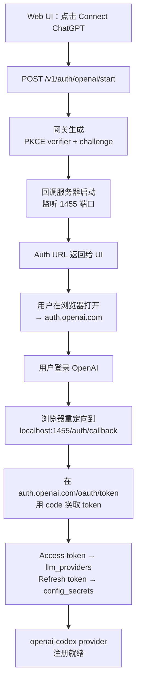

> 翻译自 [English version](/authentication)

# 身份认证

> 通过 OAuth 将 GoClaw 连接到 ChatGPT — 无需 API key，使用你现有的 OpenAI 账号。

## 概述

GoClaw 为 OpenAI/Codex provider 支持 OAuth 2.0 PKCE 认证。这让你可以无需付费 API key，通过浏览器中的 OpenAI 账号认证来使用 ChatGPT（`openai-codex` provider）。Token 安全存储在数据库中，并在过期前自动刷新。

此流程与标准 API key provider 不同 — 仅在你想使用 `openai-codex` provider 类型时才需要。

---

## OAuth Provider 路由（v3）

GoClaw 支持将 OAuth token 路由到 OpenAI/Codex 之外的多种 provider 类型。在 v3 中，`media` provider 类型涵盖使用 OAuth 或 session token（而非普通 API key）的服务，如 **Suno**（AI 音乐）和 **DashScope**（阿里媒体生成）。

### Media Provider 类型

| Provider 类型 | 服务 | 认证方式 |
|---------------|----------|-------------|
| `openai-codex` | 通过 Responses API 的 ChatGPT | OAuth 2.0 PKCE |
| `suno` | Suno AI 音乐生成 | Session token |
| `dashscope` | 阿里 DashScope（OAuth 方式时） | OAuth 或 API key |

Media provider 类型以适当的 `provider_type` 值注册在 `llm_providers` 表中。网关在请求时根据 `provider_type` 解析正确的 token 来源和刷新逻辑。

---

## 工作原理



网关在 **1455** 端口启动一个临时 HTTP 服务器以接收 OAuth 回调。此端口必须从浏览器可访问（即本地使用 Web UI 时可通过 localhost 访问，远程服务器则需端口转发）。

---

## 启动 OAuth 流程

### 通过 Web UI

1. 打开 GoClaw Web 控制台
2. 导航到 **Providers** → **ChatGPT OAuth**
3. 点击 **Connect** — 网关调用 `POST /v1/auth/openai/start` 并返回 auth URL
4. 浏览器打开 `auth.openai.com` — 登录并授权访问
5. 回调落在 `localhost:1455/auth/callback` — token 自动保存

### 远程 / VPS 环境

如果浏览器无法访问服务器的 1455 端口，使用**手动重定向 URL** 备用方案：

1. 通过 Web UI 启动流程 — 复制 auth URL
2. 在本地浏览器中打开 auth URL
3. 授权后，浏览器尝试重定向到 `localhost:1455/auth/callback` 但失败（服务器是远程的）
4. 从浏览器地址栏复制完整的重定向 URL（以 `http://localhost:1455/auth/callback?code=...` 开头）
5. 将其粘贴到 Web UI 的手动回调字段 — UI 调用 `POST /v1/auth/openai/callback` 并传入 URL
6. 网关提取 code，完成交换，保存 token

---

## CLI 命令

`./goclaw auth` 子命令与运行中的网关通信，用于检查和管理 OAuth 状态。

### 检查状态

```bash
./goclaw auth status
```

已认证时的输出：

```
OpenAI OAuth: active (provider: openai-codex)
Use model prefix 'openai-codex/' in agent config (e.g. openai-codex/gpt-4o).
```

未认证时的输出：

```
No OAuth tokens found.
Use the web UI to authenticate with ChatGPT OAuth.
```

此命令访问运行中网关的 `GET /v1/auth/openai/status`。网关 URL 从环境变量解析：

| 变量 | 默认值 |
|----------|---------|
| `GOCLAW_GATEWAY_URL` | —（覆盖 host+port） |
| `GOCLAW_HOST` | `127.0.0.1` |
| `GOCLAW_PORT` | `3577` |

如果网关要求 token，设置 `GOCLAW_TOKEN` 以认证 CLI 请求。

### 登出

```bash
./goclaw auth logout
# 或明确指定：
./goclaw auth logout openai
```

这会调用 `POST /v1/auth/openai/logout`，执行：

1. 从 `llm_providers` 中删除 `openai-codex` provider 行
2. 从 `config_secrets` 中删除 refresh token
3. 从内存注册表中注销 `openai-codex` provider

---

## 网关 OAuth 端点

所有端点需要 `Authorization: Bearer <GOCLAW_TOKEN>`。

| 方法 | 路径 | 描述 |
|--------|------|-------------|
| `GET` | `/v1/auth/openai/status` | 检查 OAuth 是否激活且 token 有效 — 返回 `{ authenticated, provider_name? }` |
| `POST` | `/v1/auth/openai/start` | 启动 OAuth 流程 — 返回 `{ auth_url }` 或 `{ status: "already_authenticated" }` |
| `POST` | `/v1/auth/openai/callback` | 提交重定向 URL 进行手动交换 — body: `{ redirect_url }` — 返回 `{ authenticated, provider_name, provider_id }` |
| `POST` | `/v1/auth/openai/logout` | 删除存储的 token 并注销 provider — 返回 `{ status: "logged out" }` |

---

## Token 存储与刷新

GoClaw 将 OAuth token 存储在两张表中：

| 存储位置 | 存储内容 |
|---------|---------------|
| `llm_providers` | Access token（作为 `api_key`）、`settings` JSONB 中的过期时间戳 |
| `config_secrets` | Refresh token，键为 `oauth.openai-codex.refresh_token` |

`DBTokenSource` 处理完整生命周期：

- **缓存**：access token 缓存在内存中，在过期前 5 分钟内复用
- **自动刷新**：token 即将过期时，从 `config_secrets` 取出 refresh token，并从 `auth.openai.com/oauth/token` 获取新 token
- **持久化**：刷新后，新的 access token（写入 `llm_providers`）和新的 refresh token（写入 `config_secrets`）都写回数据库
- **优雅降级**：如果刷新失败但 token 仍存在，返回现有 token 并记录警告 — provider 在 token 实际过期前保持可用

登录时请求的 OAuth scope：

```
openid profile email offline_access api.connectors.read api.connectors.invoke
```

`offline_access` 是获取 refresh token 以支持长期会话的关键。

---

## 在 Agent 配置中使用 Provider

认证后，使用 `openai-codex/` 前缀引用 provider：

```json
{
  "agent": {
    "key": "my-agent",
    "provider": "openai-codex/gpt-4o"
  }
}
```

`openai-codex` provider 名称是固定的 — 对应 oauth 包中的 `DefaultProviderName` 常量。

---

## 示例

**入驻后检查状态：**

```bash
source .env.local
./goclaw auth status
```

**强制重新认证（登出后通过 UI 重新连接）：**

```bash
./goclaw auth logout
# 然后打开 Web UI → Providers → Connect ChatGPT
```

---

## 常见问题

| 问题 | 原因 | 解决方法 |
|-------|-------|-----|
| `cannot reach gateway at http://127.0.0.1:3577` | 网关未运行 | 先启动网关：`./goclaw` |
| `failed to start OAuth flow (is port 1455 available?)` | 1455 端口被占用 | 停止占用 1455 端口的进程 |
| 远程服务器上回调失败 | 浏览器无法访问服务器 1455 端口 | 使用手动重定向 URL 流程（将 URL 粘贴到 Web UI） |
| status 端点返回 `token invalid or expired` | 刷新失败 | 运行 `./goclaw auth logout` 后重新认证 |
| 登出时 `unknown provider: xyz` | 不支持的 provider 名称 | 仅支持 `openai`：`./goclaw auth logout openai` |
| Agent 从 ChatGPT 收到 401 | Token 已过期且刷新失败 | 通过 Web UI 重新认证 |

---

## 下一步

- [Provider 概览](/providers-overview) — 所有支持的 LLM provider 及配置方式
- [Hooks 与质量门控](/hooks-quality-gates) — 为 agent 输出添加验证

<!-- goclaw-source: 050aafc9 | 更新: 2026-04-09 -->
