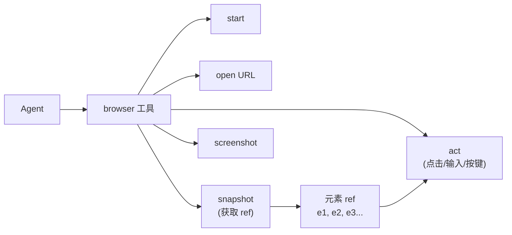

> 翻译自 [English version](/browser-automation)

# 浏览器自动化

> 为 agent 提供真实浏览器 — 导航页面、截图、抓取内容、填写表单。

## 概述

GoClaw 内置了由 [Rod](https://github.com/go-rod/rod) 和 Chrome DevTools Protocol（CDP）驱动的浏览器自动化工具。Agent 可以打开 URL、与元素交互、捕获截图、读取页面内容 — 一切通过结构化工具接口完成。

支持两种运行模式：

- **本地 Chrome**：Rod 自动启动本地 Chrome 进程
- **远程 Chrome sidecar**：通过 CDP 连接到无头 Chrome 容器（推荐用于服务器和 Docker）

---

## Docker 配置（推荐）

生产或服务器部署推荐使用 `docker-compose.browser.yml` 将 Chrome 作为 sidecar 容器运行：

```bash
docker compose \
  -f docker-compose.yml \
  -f docker-compose.postgres.yml \
  -f docker-compose.browser.yml \
  up -d --build
```

这会启动一个 `zenika/alpine-chrome:124` 容器，在 9222 端口暴露 CDP。GoClaw 通过 `GOCLAW_BROWSER_REMOTE_URL` 环境变量自动连接，compose 文件将其设为 `ws://chrome:9222`。

```yaml
# docker-compose.browser.yml（节选）
services:
  chrome:
    image: zenika/alpine-chrome:124
    command:
      - --no-sandbox
      - --remote-debugging-address=0.0.0.0
      - --remote-debugging-port=9222
      - --remote-allow-origins=*
      - --disable-gpu
      - --disable-dev-shm-usage
    ports:
      - "${CHROME_CDP_PORT:-9222}:9222"
    shm_size: 2gb
    healthcheck:
      test: ["CMD-SHELL", "wget -qO- http://127.0.0.1:9222/json/version >/dev/null 2>&1"]
      interval: 5s
      timeout: 3s
      retries: 5
    deploy:
      resources:
        limits:
          memory: 2G
          cpus: '2.0'
    restart: unless-stopped

  goclaw:
    environment:
      - GOCLAW_BROWSER_REMOTE_URL=ws://chrome:9222
    depends_on:
      chrome:
        condition: service_healthy
```

Chrome 容器有健康检查，确认 CDP 就绪后 GoClaw 才启动。

---

## 本地 Chrome（仅限开发）

未设置 `GOCLAW_BROWSER_REMOTE_URL` 时，Rod 启动本地 Chrome 进程。宿主机必须已安装 Chrome。适合本地开发，不推荐用于服务器。

---

## 浏览器工具工作原理

Agent 通过带 `action` 参数的单个 `browser` 工具与浏览器交互：



标准工作流：

1. `start` — 启动或连接浏览器（大多数操作自动触发）
2. `open` — 在新标签页打开 URL，获取 `targetId`
3. `snapshot` — 获取页面无障碍树及元素 ref（`e1`、`e2`...）
4. `act` — 使用 ref 与元素交互
5. 再次 `snapshot` 验证变更

---

## 可用操作

| 操作 | 描述 | 必填参数 |
|--------|-------------|----------------|
| `status` | 浏览器运行状态和标签页数量 | — |
| `start` | 启动或连接浏览器 | — |
| `stop` | 关闭本地浏览器或断开远程 sidecar 连接（sidecar 容器继续运行） | — |
| `tabs` | 列出带 URL 的已打开标签页 | — |
| `open` | 在新标签页打开 URL | `targetUrl` |
| `close` | 关闭标签页 | `targetId` |
| `snapshot` | 获取带元素 ref 的无障碍树 | `targetId`（可选） |
| `screenshot` | 捕获 PNG 截图 | `targetId`、`fullPage` |
| `navigate` | 将现有标签页导航到 URL | `targetId`、`targetUrl` |
| `console` | 获取浏览器控制台消息（每次调用后清空缓冲区） | `targetId` |
| `act` | 与元素交互 | `request` 对象 |

### Act 请求类型

| 类型 | 作用 | 必填字段 | 可选字段 |
|------|-------------|----------------|----------------|
| `click` | 点击元素 | `ref` | `doubleClick`（bool）、`button`（`"left"`、`"right"`、`"middle"`） |
| `type` | 在元素中输入文本 | `ref`、`text` | `submit`（bool — 输入后按 Enter）、`slowly`（bool — 逐字符输入） |
| `press` | 按下键盘键 | `key`（如 `"Enter"`、`"Tab"`、`"Escape"`） | — |
| `hover` | 悬停在元素上 | `ref` | — |
| `wait` | 等待条件 | 以下之一：`timeMs`、`text`、`textGone`、`url` 或 `fn` | — |
| `evaluate` | 运行 JavaScript 并返回结果 | `fn` | — |

---

## 使用场景

### 截取页面截图

```json
{ "action": "open", "targetUrl": "https://example.com" }
```
```json
{ "action": "screenshot", "targetId": "<open 返回的 id>", "fullPage": true }
```

截图保存到临时文件，以 `MEDIA:/tmp/goclaw_screenshot_*.png` 形式返回 — 媒体管道将其作为图片投递（如 Telegram 照片）。

### 抓取页面内容

```json
{ "action": "open", "targetUrl": "https://example.com" }
```
```json
{ "action": "snapshot", "targetId": "<id>", "compact": true, "maxChars": 8000 }
```

snapshot 返回无障碍树。使用 `interactive: true` 仅显示可点击/可输入元素，使用 `depth` 限制树的深度。

### 填写并提交表单

```json
{ "action": "open", "targetUrl": "https://example.com/login" }
```
```json
{ "action": "snapshot", "targetId": "<id>" }
```
```json
{
  "action": "act",
  "targetId": "<id>",
  "request": { "kind": "type", "ref": "e3", "text": "user@example.com" }
}
```
```json
{
  "action": "act",
  "targetId": "<id>",
  "request": { "kind": "type", "ref": "e4", "text": "mypassword", "submit": true }
}
```

`submit: true` 输入后按 Enter。

### 执行 JavaScript

```json
{
  "action": "act",
  "targetId": "<id>",
  "request": { "kind": "evaluate", "fn": "document.title" }
}
```

---

## Snapshot 选项

| 参数 | 类型 | 默认值 | 描述 |
|-----------|------|---------|-------------|
| `maxChars` | number | 8000 | snapshot 输出的最大字符数 |
| `interactive` | boolean | false | 仅显示交互元素 |
| `compact` | boolean | false | 移除空的结构节点 |
| `depth` | number | 无限制 | 最大树深度 |

---

## 安全注意事项

- **SSRF 防护**：GoClaw 对工具输入应用 SSRF 过滤 — agent 不能轻易被引导到内网地址。
- **no-sandbox 标志**：Docker compose 配置传入 `--no-sandbox`，这在容器内是必需的。不要在没有容器隔离的宿主机上使用此标志。
- **共享内存**：Chrome 非常消耗内存。sidecar 配置了 `shm_size: 2gb` 和 2GB 内存限制，请根据你的工作负载调整。
- **暴露的 CDP 端口**：默认情况下，9222 端口只在 Docker 网络内可访问。不要公开暴露它 — CDP 允许无需认证的完全浏览器控制。

---

## 示例

**触发 agent 使用浏览器的提示词：**

```
Take a screenshot of https://news.ycombinator.com and show me the top 5 stories.
```

Agent 将依次调用 `browser`（`open`），然后根据任务调用 `screenshot` 或 `snapshot`。

**在 agent 对话中检查浏览器状态：**

```
Are you connected to a browser?
```

Agent 调用：

```json
{ "action": "status" }
```

返回：

```json
{ "running": true, "tabs": 1, "url": "https://example.com" }
```

---

## 常见问题

| 问题 | 原因 | 解决方法 |
|-------|-------|-----|
| `failed to start browser: launch Chrome` | 本地未安装 Chrome | 改用 Docker sidecar |
| `resolve remote Chrome at ws://chrome:9222` | Sidecar 尚未就绪 | 等待 `service_healthy` 或增大启动超时 |
| `snapshot failed` | 页面未加载完成 | 在 `open` 后添加 `wait` 操作 |
| 截图为空白 | GPU 渲染问题 | 确保已设置 `--disable-gpu` 标志（compose 中已包含） |
| 内存占用高 | 打开了过多标签页 | 完成后调用 `close` 关闭标签页 |
| CDP 端口被公开暴露 | 端口映射配置错误 | 生产环境中从宿主机端口映射中移除 `9222` |

---

## 下一步

- [Exec 审批](/exec-approval) — 运行命令前要求人工确认
- [Hooks 与质量门控](/hooks-quality-gates) — 为 agent 操作添加前/后检查

<!-- goclaw-source: 050aafc9 | 更新: 2026-04-09 -->
