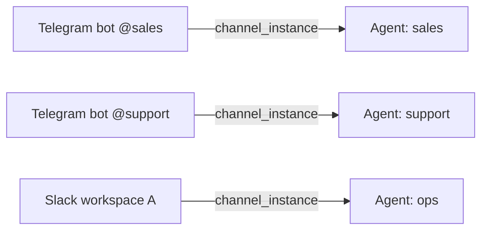

> 翻译自 [English version](/channel-instances)

# Channel 实例

> 每种 channel 类型运行多个账号 — 各自拥有独立的凭据、agent 绑定和写入权限。

## 概述

**Channel 实例**是一个消息账号与一个 agent 之间的命名连接。它存储账号凭据（加密存储）、可选的 channel 专属配置，以及拥有它的 agent ID。

由于实例存储在数据库中并以 UUID 标识，你可以：

- 将多个 Telegram bot 连接到同一服务器上的不同 agent
- 添加第二个 Slack 工作区而不影响第一个
- 在不删除实例或凭据的情况下禁用 channel
- 通过单次 `PUT` 调用轮换凭据

每个实例恰好属于一个 agent。当消息到达该 channel 账号时，GoClaw 将其路由到绑定的 agent。



### 默认实例

`name` 等于裸 channel 类型（`telegram`、`discord`、`feishu`、`zalo_oa`、`whatsapp`）或以 `/default` 结尾的实例是**默认**（种子）实例。默认实例**不能通过 API 删除** — 它们由 GoClaw 在启动时管理。

---

## 支持的 channel 类型

| `channel_type` | 描述 |
|---|---|
| `telegram` | Telegram bot（Bot API token） |
| `discord` | Discord bot（bot token + application ID） |
| `slack` | Slack 工作区（OAuth bot token + app token） |
| `whatsapp` | WhatsApp Business（通过 Meta Cloud API） |
| `zalo_oa` | Zalo 官方账号 |
| `zalo_personal` | Zalo 个人账号 |
| `feishu` | 飞书 / Lark bot |

---

## 实例对象

所有 API 响应返回凭据已脱敏的实例对象：

```json
{
  "id": "3f2a1b4c-0000-0000-0000-000000000001",
  "name": "telegram/sales-bot",
  "display_name": "Sales Bot",
  "channel_type": "telegram",
  "agent_id": "a1b2c3d4-...",
  "credentials": { "token": "***" },
  "has_credentials": true,
  "config": {},
  "enabled": true,
  "is_default": false,
  "created_by": "admin",
  "created_at": "2025-01-01T00:00:00Z",
  "updated_at": "2025-01-01T00:00:00Z"
}
```

| 字段 | 类型 | 说明 |
|---|---|---|
| `id` | UUID | 自动生成 |
| `name` | string | 唯一标识符 slug（如 `telegram/sales-bot`） |
| `display_name` | string | 人类可读标签（可选） |
| `channel_type` | string | 上述支持类型之一 |
| `agent_id` | UUID | 拥有此实例的 agent |
| `credentials` | object | 凭据键可见；值始终为 `"***"` |
| `has_credentials` | bool | 已存储凭据时为 `true` |
| `config` | object | Channel 专属配置（可选） |
| `enabled` | bool | `false` 表示禁用实例而不删除 |
| `is_default` | bool | 种子实例为 `true` — 不能删除 |

---

## REST API

所有端点需要 `Authorization: Bearer <token>`。

### 列出实例

```bash
GET /v1/channels/instances
```

查询参数：`search`、`limit`（最大 200，默认 50）、`offset`。

```bash
curl http://localhost:8080/v1/channels/instances \
  -H "Authorization: Bearer $GOCLAW_TOKEN"
```

响应：

```json
{
  "instances": [...],
  "total": 4,
  "limit": 50,
  "offset": 0
}
```

---

### 获取实例

```bash
GET /v1/channels/instances/{id}
```

```bash
curl http://localhost:8080/v1/channels/instances/3f2a1b4c-... \
  -H "Authorization: Bearer $GOCLAW_TOKEN"
```

---

### 创建实例

```bash
POST /v1/channels/instances
```

必填字段：`name`、`channel_type`、`agent_id`。

```bash
curl -X POST http://localhost:8080/v1/channels/instances \
  -H "Authorization: Bearer $GOCLAW_TOKEN" \
  -H "Content-Type: application/json" \
  -d '{
    "name": "telegram/sales-bot",
    "display_name": "Sales Bot",
    "channel_type": "telegram",
    "agent_id": "a1b2c3d4-...",
    "credentials": {
      "token": "7123456789:AAF..."
    },
    "enabled": true
  }'
```

返回 `201 Created`，带新实例对象（凭据已脱敏）。

---

### 更新实例

```bash
PUT /v1/channels/instances/{id}
```

仅发送你要更改的字段。凭据更新会**合并**到现有凭据 — 部分更新不会清除其他凭据键。

```bash
# 仅轮换 bot token，保留其他凭据
curl -X PUT http://localhost:8080/v1/channels/instances/3f2a1b4c-... \
  -H "Authorization: Bearer $GOCLAW_TOKEN" \
  -H "Content-Type: application/json" \
  -d '{
    "credentials": { "token": "7999999999:BBG..." }
  }'
```

```bash
# 禁用实例而不删除
curl -X PUT http://localhost:8080/v1/channels/instances/3f2a1b4c-... \
  -H "Authorization: Bearer $GOCLAW_TOKEN" \
  -H "Content-Type: application/json" \
  -d '{ "enabled": false }'
```

返回 `{ "status": "updated" }`。

---

### 删除实例

```bash
DELETE /v1/channels/instances/{id}
```

如果实例是默认（种子）实例，返回 `403 Forbidden`。

```bash
curl -X DELETE http://localhost:8080/v1/channels/instances/3f2a1b4c-... \
  -H "Authorization: Bearer $GOCLAW_TOKEN"
```

---

## 群组文件写入者

每个 channel 实例暴露写入者管理端点，委托给其绑定的 agent。写入者控制谁可以通过群组文件功能上传文件。

```bash
# 列出 channel 实例的写入者群组
GET /v1/channels/instances/{id}/writers/groups

# 列出群组中的写入者
GET /v1/channels/instances/{id}/writers?group_id=<group_id>

# 添加写入者
POST /v1/channels/instances/{id}/writers
{
  "group_id": "...",
  "user_id": "123456789",
  "display_name": "Alice",
  "username": "alice"
}

# 移除写入者
DELETE /v1/channels/instances/{id}/writers/{userId}?group_id=<group_id>
```

---

## 凭据安全

- 凭据在存储到 PostgreSQL 前经过 **AES 加密**。
- API 响应**永不返回明文凭据** — 所有值替换为 `"***"`。
- 响应中的 `has_credentials: true` 确认凭据已存储。
- 部分凭据更新是安全的：GoClaw 在重新加密前将新键合并到现有（已解密）对象中。

---

## 常见问题

| 问题 | 原因 | 解决方法 |
|---|---|---|
| 删除时 `403` | 实例是默认/种子实例 | 默认实例不能删除；改用 `enabled: false` 禁用 |
| `400 invalid channel_type` | 拼写错误或不支持的类型 | 使用：`telegram`、`discord`、`slack`、`whatsapp`、`zalo_oa`、`zalo_personal`、`feishu` 之一 |
| 消息未路由到 agent | 实例已禁用或 `agent_id` 错误 | 验证 `enabled: true` 和正确的 `agent_id` |
| 凭据未持久化 | 未设置 `GOCLAW_ENCRYPTION_KEY` | 设置加密密钥环境变量；凭据需要它 |
| 更新后缓存陈旧 | 内存缓存尚未刷新 | GoClaw 在每次写入时广播缓存失效事件；缓存在数秒内刷新 |

---

## 下一步

- [Channel 概览](/channels-overview)
- [多 Channel 设置](/recipe-multi-channel)
- [多租户](/multi-tenancy)

<!-- goclaw-source: 57754a5 | 更新: 2026-03-18 -->
